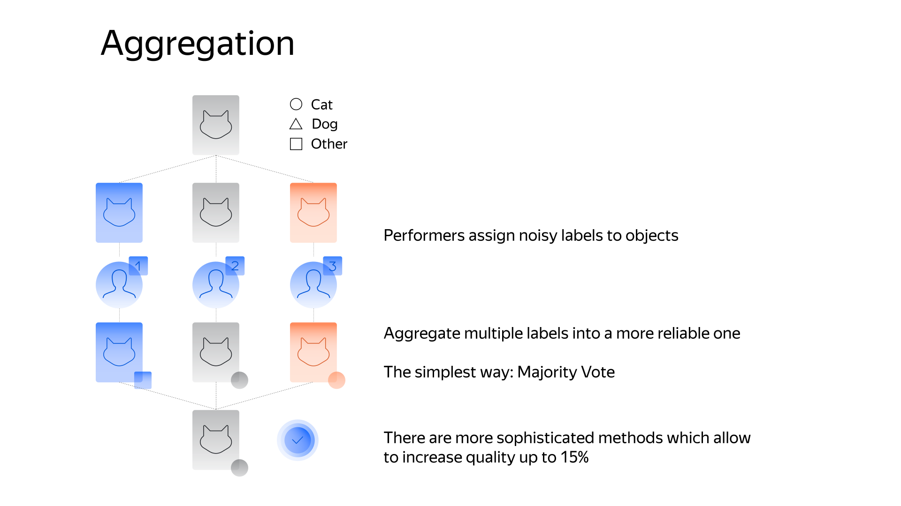

# Aggregation of results

If tasks were issued with an [overlap](../../glossary.md#overlap-ru) of 2 or higher, run aggregation of results. Toloka will process all Tolokers' responses for the task and issue the resulting response and its confidence level.


If you run the [pool](../../glossary.md#pool-ru) with the assignment review, make sure that all responses are [accepted](accept.md).



1. Open the [pool](pool-main.md).
1. Click  next to the **Download results** button.
1. Choose the aggregation method:
    - [Dawid-Skene aggregation model](#dawid-skene)
    - [Aggregation by skill](#aggr-by-skill)


Aggregation takes from several minutes to several hours. Track the progress on the [Operations]({{ operations }}) page. When aggregation is complete, download the file with the results.

To receive notifications and emails when results aggregation is completed, set up notifications:

1. Log in to your account.
1. Go to
1. Choose the notification method:
    - Email: Messages will be sent to your email address.
    - Messages: Notifications will be displayed under **Messages** in your account. Apart from you, those who set up [shared access](multiple-access.md) to your account can see them.
    - Browser: Notifications will be sent to the devices that you logged in to your account from.


## Dawid-Skene aggregation model {#dawid-skene}

The Dawid-Skene aggregation model takes into account the heterogeneity of Tolokers when aggregating responses. [Statistical significance]({{ statistical-significance }}) of the resulting response is determined based on the analysis of all Tolokers' responses.

#### How it works:

The model evaluates `|L|²` parameters for each Toloker, where `L` is the number of all unique aggregation values.

The parameters used by the model are determined automatically for each pool and are only used only in calculations. You won't see these parameters in the aggregated results.



Because the Dawid-Skene model evaluates `|L|²` parameters for each Toloker, we don't recommend using it when the Toloker labels `< |L|²` tasks. Otherwise, the quality of aggregation may be poor.




The result of aggregation is a TSV file with responses. `CONFIDENCE: <field name [output](incoming.md)>` indicates the response significance as a percentage.

#### Benefits

Data for aggregation can be uploaded any way you want.

#### Features

The Dawid-Skene model is a non-trivial aggregation algorithm. Check out its features and learn more [about the model](https://www.jstor.org/stable/2346806).

- The method doesn't guarantee that original Toloker responses will be used for aggregation. The algorithm takes into account Tolokers' quality parameters and response patterns. Consequently, it can produce a result that's different from the Tolokers' responses to this task.

    #### Example

    In an image classification task, all three Tolokers selected the first response option. In another similar task, the same three Tolokers selected the first option, and the fourth Toloker selected the second option. If in the next task, the only response is given by the fourth Toloker, the David-Skene aggregation model might consider it incorrect and return a different result.

- The Dawid-Skene aggregation model works with [control](../../glossary.md#control-task-ru) and [training](../../glossary.md#training-task-ru) tasks as well as with general tasks. There is a possibility that the `OUTPUT:result` field for the control task in the TSV file won't match the actual response to this task (`GOLDEN:result`).

- If your project has output data marked as `"required": false` and Tolokers don't fill in this field, it won't be included in aggregation.

    For example, you have 1000 tasks. In 999 of them, Tolokers didn't label the `label` field, and one Toloker labeled it as `label=x`. As a result of aggregation, this data field will have `CONFIDENCE = 100%`, since only one task out of a thousand falls under the aggregation conditions.


#### How it's calculated

The Dawid-Skene method puts together a [confusion matrix]({{ error-matrix }}) and response popularity for each Toloker. It uses the [EM algorithm]({{ em-algorithm }}).

The idea is that it collects the most accurate aggregated responses for each task, recording the error matrices and response popularity. It aims to determine the best popularities and error matrices among all responses. The process has several stages. Initially, the majority opinion is used to confirm that the response is correct.

[Description of the Dawid-Skene method](https://www.jstor.org/stable/2346806).

If you want to learn how the Dawid-Skene method is implemented in Toloka, check out the [Crowd Kit documentation](https://toloka.ai/en/docs/crowd-kit/reference/crowdkit.aggregation.classification.dawid_skene.DawidSkene).



Aggregation only includes accepted tasks.




#### Requirements

The main requirement for this aggregation is the output data fields:

#### Fields that can be aggregated

- Strings and numbers with allowed values.

    The allowed value must match the `value` parameter in the corresponding interface element.

- Boolean.
- Integers with minimum and maximum values. The maximum difference between them is 32.

    If there are too many possible responses in the output field, the dynamic overlap mechanism won't be able to aggregate the data.


The allowed value must match the `value` parameter in the corresponding interface element.

#### Fields that can't be aggregated

- Array.
- File.
- Coordinates.
- JSON object.

#### How do I check it?

If you have doubts that the David-Skene aggregation model works correctly, you can:

- Reassign tasks and compare the results.
- Check the task manually.

## Aggregation by skill {#aggr-by-skill}

Analyzes responses based on the level of confidence in the Toloker. The confidence level is determined by the skill you choose. Skills measure the probability of the Toloker completing the task correctly.

#### Benefits

- If your project processes a large amount of data, the aggregation results will be more accurate compared to the Dawid-Skene method.
- You can choose the output data fields you want to aggregate.

#### Features

Each user skill has “weight”. The higher the skill, the more we trust the Toloker and believe that their responses are correct.

The result of aggregation is a TSV file with responses. `CONFIDENCE: <field name [output](incoming.md)>` indicates the confidence in the aggregated response. In this case, it shows the probability that the response is correct.

#### Example

Tasks were labeled by three Tolokers with different “My skill” values: the first Toloker has a skill of 70, the second has 80, and the third has 90.

All three Tolokers responded to the first task with **OK**. In this case, we are 100% sure that **OK** is the correct response.

On the second task, the first and third Tolokers responded with **OK**, and the second Toloker responded with **BAD**. In this case, we'll compare the Tolokers' skills and determine the confidence based on the result.

#### How it's calculated

Terms:

- $q[i]$is a Toloker's accuracy.
- $K$— smoothing constant
- $z[j]$is the most popular response.
- $z[x] estimate,$— the probability that the estimate is correct

A Toloker's accuracy$q[i]$is calculated as follows:

$q[i] = \frac{K+correct.golden.sets[i]}{2×K+total.golden.sets[i]}$,

where:

$K$is a smoothing constant (starting from 0.5) if there are not enough responses to control tasks.

If there are several estimates, the most popular response is determined by adding together$q[i]$of the Tolokers who selected each response option. The response with the largest total is considered more correct. Let's call this estimate$z[j]$.

[Using Bayes' theorem]({{ baies }}), we calculate the posterior probability that the estimate$z[j]$is correct.

A uniform distribution of estimates is assumed a priori. For the$z[x] estimate,$the a priori probability is calculated as

$P(z[x]) = \frac{1}{Y}$,

where:

$Y$is the number of response options.

Next, we calculate the probability that the estimate$z[j]$is correct.

If the Toloker responded$z[j]$, then the probability of this is equal to the Toloker's accuracy$q[i]$. If they responded differently, then the probability of this is:

$\frac{1-q[i]}{Y-1}$,

where:

$(1 - q[i])$is the remaining probability.

$(Y - 1)$is the number of remaining responses.

It ensures that the probability of an error is distributed evenly among the remaining estimates.

We take all Tolokers' responses and, for example, option$z[x] estimate,$and calculate the probability that Tolokers will select this response, provided that the correct response is$z[x] estimate,$:

```
func z_prob(x int) : float {
    d = 1.0
    for w[i]: workers
         if answers[w[i]] == z[x]
            d *= q[i]
         else
            d *= (1 - q[i]) / (Y - 1)
    return d
}
```

Next, using Bayes' theorem, we calculate the probability that the response$z[j]$is correct:

```
r = 0
for z[i]: answer_options
    r += z_prob(i) * (1 / Y)

eps = z_prob(j) * (1 / Y) / r

```



Aggregation only includes accepted tasks.




#### Requirements

#### Pool with dynamic overlap

To run aggregation, you must correctly set up dynamic overlap. To do this:

1. Select a skill. We recommend to select a skill calculated as the percentage of [correct responses in control tasks](goldenset.md). This will give you the most accurate aggregation results.
1. Select the output data fields.
    #### Output data fields that can be aggregated:

    - Strings and numbers with allowed values.

    The allowed value must match the `value` parameter in the corresponding interface element.

    - Boolean.
    - Integers with minimum and maximum values. The maximum difference between them is 32.

    If there are too many possible responses in the output field, the dynamic overlap mechanism won't be able to aggregate the data.

    The allowed value must match the `value` parameter in the corresponding interface element.


#### Pools without dynamic overlap

You can run aggregation by skill if the pool meets the following requirements:

1. You set a skill that defines the level of confidence in the Toloker's responses. We recommend to use a skill calculated as the percentage of [correct responses in control tasks](goldenset.md).
1. The [output data fields](incoming.md) have allowed values.
    #### Output data fields that can be aggregated:

    - Strings and numbers with allowed values.

    The allowed value must match the `value` parameter in the corresponding interface element.

    - Boolean.
    - Integers with minimum and maximum values. The maximum difference between them is 32.

    If there are too many possible responses in the output field, the dynamic overlap mechanism won't be able to aggregate the data.

    The allowed value must match the `value` parameter in the corresponding interface element.

1. The tasks were uploaded in the pool with [“smart mixing”](distribute-tasks-by-pages.md#smart-mixing).


## Troubleshooting {#troubleshooting}

#### What is the difference between the confidence in the aggregated response in the Dawid-Skene aggregation model and the confidence in aggregation by skill?

In the way it's calculated. In both aggregations, confidence means the same thing.

#### How does the Dawid-Skene aggregation model work?
The Dawid-Skene aggregation model analyzes the Toloker responses and creates a confusion matrix for each Toloker. This lets us evaluate the statistical significance of the Toloker in the context of each assignment. [Learn more about the model](https://www.jstor.org/stable/2346806).
#### Why does the Dawid-Skene aggregation model return a result that the Tolokers didn't select?

The method doesn't guarantee that original Toloker responses will be used for aggregation. The algorithm takes into account Tolokers' quality parameters and response patterns. Consequently, it can return a result that's different from the Tolokers' responses to this task.

#### Where do I see the aggregation progress?

The pool page contains the **List of Operations** button.

#### Why might aggregation by Toloker skill be unavailable?

You cannot aggregate by project fields that have no valid values. Specify the possible values for all the fields of all types.

#### You can't aggregate by skill. When running via the API, I get the error code `ONLY_FOR_POOL_WITH_MIXER`. Why?

You need to use [smart mixing](distribute-tasks-by-pages.md#smart-mixing).



