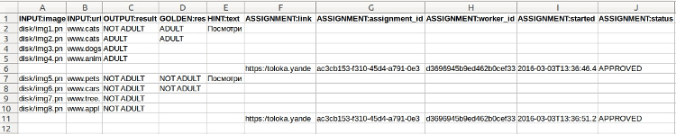

# Receiving responses

You can download Tolokers' responses in a file as tasks are completed.

If tasks were distributed with an [overlap](../../glossary.md#overlap) of more than 2, run [aggregation](result-aggregation.md). Toloka will process all Tolokers' responses for the task and form the resulting response.

## Getting the file with responses {#tsv}

#### In the interface

To get a file with Tolokers' responses, click the **Download results** button on the [pool](../../glossary.md#pool) page.



The responses submitted by the banned Toloker before the ban will be taken into account and paid for. To exclude their responses from the results and aggregations, select the option **Exclude assignments from banned users**. It will delete the responses from users who were banned at the moment of downloading the results, not when the pool was labeled.



The fields in the file with responses:

- `INPUT:<name of the input data field>` — Input data for tasks.

- `OUTPUT:<name of the output data field>` — The Tolokers' responses. For [training tasks](../../glossary.md#training-task), the field includes first attempted answers.

- `GOLDEN:<name of the output data field>` — Responses for [control tasks](../../glossary.md#control-task).

- `HINT:text` — Hints for training tasks.

- Information about the task completion (the same for all tasks on the page):

    - `ASSIGNMENT:link` — Link for viewing the [task suite](../../glossary.md#task-suite).

    - `ASSIGNMENT:assignment_id` — ID of the assigned task suite.

    - `ASSIGNMENT:worker_id` — ID of the Toloker who completed the task.

    - `ASSIGNMENT:started` — Date and time the task suite was assigned.

    - `ASSIGNMENT:status` — Task status: `SUBMITTED` — completed, `APPROVED` — accepted, `REJECTED` — declined.

A sample file:





To get the list of the responses using Toloka API, send a `GET` request with either `pool_id`, `task_suite_id`, or `task_id` specified:

```bash
curl -X GET 'https://toloka.dev/api/v1/assignments?pool_id=1085757' \
     -H 'Authorization: OAuth AQC2AGAJgyNSA8CtpdO9MWy_QEB6s6kDjHUoElE'
```

Refer to the [Get list of responses](https://toloka.ai/docs/api/api-reference/#get-/assignments) section of the Toloka API documentation for more details about the request, its parameters, and possible responses. You will find examples of the requests for [Toloka-Kit](../../toloka-kit/index.md) and other code samples there.



## Getting files {#file-download}

If the Tolokers were asked to upload files, the file with responses will contain IDs of the files received from Tolokers. To download files on your computer, click the  button on the pool page.

You can download all files in the pool in one archive up to 4 GB in size. If the archive is too large (more than 4 GB), use the following tips:

- Select a single status or pick a smaller time range.

    For example, if you need to review assignments, only download the submitted assignments rather than the accepted or rejected ones.

    If the file still exceeds the permitted size, pick a smaller time range and download the archives in several batches. The time range can be reduced to 1 day.

- On the pool page, click **Review assignments** (or **View assignments** if they have already been accepted) to go to the page with the Tolokers' responses. Each string contains the Toloker's response to one task suite.

    Select the responses you need and click . Download the archives in several batches. You can select and download no more than 100 responses at a time.

- Use the [Toloka API](https://toloka.ai/docs/api/api-reference/#tag--attachment) to download files with responses.

## See also {#see-also}

- [Crowdsourcing concepts: Results](https://toloka.ai/knowledgebase/results/)

## For developers {#for-developers}

- [Toloka API: Getting responses](https://toloka.ai/docs/api/api-reference/#get-/assignments)
- [Toloka API: Files in responses](https://toloka.ai/docs/api/api-reference/#get-/attachments)
- [Toloka-Kit recipe: Get list of responses](../../toloka-kit/recipes/get-responses.md)
- [Toloka-Kit recipe: Get list of files in responses](../../toloka-kit/recipes/get-attachments.md)
- [Toloka-Kit recipe: Download attachments](../../toloka-kit/recipes/download-attachment.md)

## Troubleshooting {#troubleshooting}



































