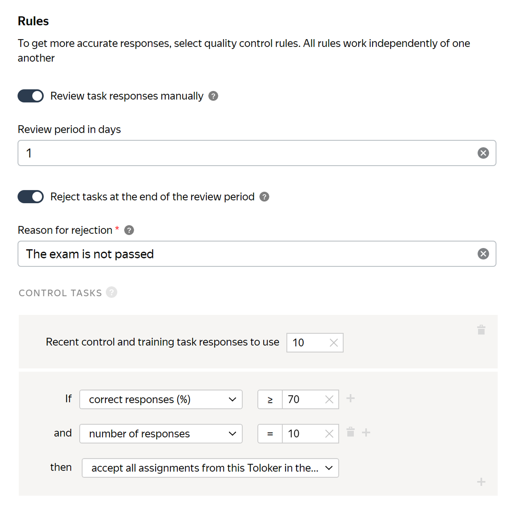

# How to save your budget

Every requester wants to optimize expenses. This section describes the main ways to save money without reducing the labeling quality.

## Decompose tasks {#decomposition}

Use [decomposition](solution-architecture.md) to simplify the tasks:

- Simpler [tasks](../../glossary.md#task) cost less.
- If a task is complex, you won't get good results immediately. Instead, you'll have to resend tasks to the [pool](../../glossary.md#pool) so that other Tolokers can redo them.

## Use dynamic overlap {#dynamic-overlap}

[Dynamic overlap](dynamic-overlap.md) lets you change [overlap](../../glossary.md#overlap) depending on:

- How well the Tolokers do on the task.
- How well Tolokers' [task responses](../../glossary.md#task-response) match each other.

With this overlap setting, you can save on the number of Tolokers who complete your tasks, which means the total cost of pool labeling will be lower.

## Use manual review {#post}

[Manual review](offline-accept.md) allows you to check responses so you don't have to pay for poorly completed tasks.

Use manual review if:

- The task requires that users send free-format responses or data files.

- You are sure that you have enough time to review the Tolokers' responses. Otherwise, when the period ends, responses that haven't been reviewed are accepted and paid for automatically.

## Set up a selective majority vote check {#mvote}

You can set up a [selective majority vote check](selective-mvote.md) for the [general tasks](../../glossary.md#general-task). This helps you save money and speed up pool completion. You can set the period during which tasks with increased overlap will be displayed to the Toloker, depending on the number of completed tasks.



Let's say your pool's overlap is set to 3. You don't trust the responses of new Tolokers and want to check them further. In this case, you set up a selective majority vote check. If the Toloker completed 10 tasks in the last 14 days, set overlap to 5 for every third task, and if the Toloker completed 20 tasks, set overlap to 5 for every fifth task.

Without this setting, you would be forced to set overlap to 5 for each task in the pool. And it would be more expensive to label all tasks with overlap = 5, as opposed to just some of the tasks.



## Set up dynamic pricing {#price-set}

[Dynamic pricing](dynamic-pricing.md#section_ucl_3hl_vlb) lets you increase the price per task suite for Tolokers with a higher [skill](../../glossary.md#skill) level. This way you can encourage Tolokers to do a better job.

In some cases, this setting makes labeling more expensive, like for tasks that don't require Tolokers to have high skills. In this case, there is no need to use dynamic pricing.

## Use fractional payment on incomplete task suites {#mixer}

Use the [Smart mixing](distribute-tasks-by-pages.md#smart-mixing) method and the **Allow partial task suites** option. This way you can save money on paying for incomplete task suites.

## Use conditionally free exams {#exams}

In Toloka, requesters pay for [exams](../../glossary.md#exam), including those that Tolokers didn't pass. This is a fee that a requester doesn't get any benefit from, because a Toloker failed the exam and won't be able to complete any of the general tasks.

In this case, you can set up automatic acceptance of tasks and automatic rejection of tasks at the end of the review period. To do this, you'll need to:

1. Select **Exam** as the pool type.

1. Turn on the **Review task responses manually** option.

1. Turn on the **Reject tasks at the end of the review period** option and specify the reason for rejection. It will be shown to Tolokers whose responses are rejected.

1. Set the manual review period to one day.

1. Add the **Control tasks** quality control block and set the **If** conditions:

    - `correct responses (%) ≥ X`;
    - `number of responses = Y`.

1. Select the **accept all assignments from this Toloker in the pool** value in the **then** field.

1. Add a description of the new rule to the [instructions](../../glossary.md#instructions).



In this case, if the percentage of correct responses is greater than or equal to 70, all the Toloker's responses are automatically accepted. All unverified responses are rejected.



## Compress images {#pictures}

Compress images so that a task opens and displays correctly. Tolokers will spend less time and traffic uploading images.

## Configure keyboard shortcuts {#hotkeys}

Create keyboard shortcuts. This will make it easier for Tolokers to complete your tasks. Remember: the less time it takes to complete a task, the less you pay for it.

## Save money using the Toloka API {#api}

#### Merge tasks

You can merge tasks that have identical [input data](incoming.md). This allows you to save money if the same task was uploaded to different pools.

[Learn more](../../api/concepts/tasks.md)

#### Set the frequency of assigning control tasks

Using the Toloka API, you can set the frequency of assigning control tasks. For example, make every fifth task a control task in the first task suite and every 10th task in the following task suites. This setting lets you maintain the quality of the pool and speed up the completion of tasks.

To do this, use the `golden_task_distribution_function` key.

[Learn more](https://toloka.ai/docs/api/api-reference/#post-/pools)

#### Set up preliminary responses

In addition to dynamic overlap, use `baseline_solutions` to speed up the overlap. In `baseline_solutions`, preliminary responses are used, that is, data that simulates Toloker responses. For example, you need to determine what an image shows: a cat or a dog. Suppose your neural network determined that the image may show a dog with a probability of 80% and a cat with a probability of 40%. You can use the neural network's responses. Depending on the responses of Tolokers, the overlap will increase or remain unchanged.

[Learn more](https://toloka.ai/docs/api/api-reference/#post-/tasks)

## See also {#see-also}

- [{#T}](dynamic-overlap.md)
- [{#T}](offline-accept.md)
- [{#T}](selective-mvote.md)
- [{#T}](dynamic-pricing.md)
- [Crowdsourcing concepts: Decomposition](https://toloka.ai/knowledgebase/decomposition/)
- [Template Builder: Configure keyboard shortcuts](../../template-builder/best-practices/hotkeys.md)

## Troubleshooting {#troubleshooting}










