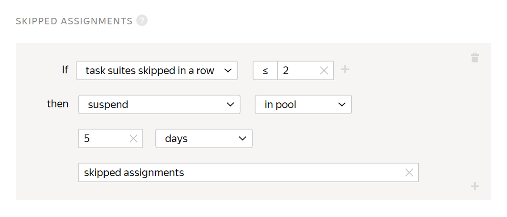

# Skipped assignments

Restrict access to [pool](../../glossary.md#pool) tasks for Tolokers who skip multiple [task suites](../../glossary.md#task-suite) in a row.

Tolokers can [skip task suites](pool_statistic-pool.md#skipped-tasks) that seem too large or complex and choose easier tasks. They get paid in the same way. For example, the Toloker is evaluating medical articles for whether they contain prescriptions, dosage, and mentions of specific medications. They might decide to skip long texts and label only short ones that take 10–20 seconds to read.

You can set up this rule to restrict Toloker access to a pool.

Before you enable skipping tasks, we recommend that you read the section [Tips for designing tasks](faq.md).

## When to use {#when-use}

Restrict access to [pool](../../glossary.md#pool) tasks for Tolokers who skip multiple task suites in a row if:

- Tasks are different in volume and Tolokers might skip large tasks in order to only perform short ones;

- Tasks must be performed in order and skipping tasks may affect the quality.

#### Don't use it if:

- There aren't very many tasks in the pools. For example, if a task is a survey on a single page and the Toloker skips this page, they will no longer be able to perform tasks in the pool, which means there is no need to ban them.

- Tasks are the same in volume.

- The task complexity can't be estimated, which means the Tolokers won't be willing to skip tasks in search of easier ones.

## How to configure {#rule}



All fields in this rule are required. If you don't fill in at least one of them, you won't be able to save the rule.



#|
|| Field  | Overview||
||**If** | A condition for performing the action in the **then** field:

- **task suites skipped in a row** — The number of task suites skipped in a row.||
||**then** | Action to perform for the condition:

- **ban** — Block access to the project or all of the requester's projects for the specified number of days. Only the requester can view the reason.

    If access to tasks is blocked temporarily (for example, for 7 days), the history of the Toloker's responses is not saved after the ban is lifted. The skill value is based on new responses.

- **accept user's answers** — Requires the [manual review](offline-accept.md) option to be set.

    Useful if the Toloker completes most tasks well. Example: The Toloker completed more than 80% of the tasks correctly and you are satisfied with this result. The rule will work automatically and accept all responses in the pool.

- **suspend** — Suspend the Toloker's access to the pool for the specified number of days. Only the requester can view the reason.

- **assign skill value** — Assign a fixed value to the [skill](nav.md).||
|#

## Rule example {#examples}

**Task**: you're conducting an opinion poll. For the results to be accurate, the Toloker must answer most of the questions.



- Correct settings

  

  A Toloker who skips 2 task suites in a row is restricted from accessing the pool and can't complete your tasks for 5 days.

- Incorrect settings

  

  If a Toloker skips 2 task suites in a row, all their responses will be accepted automatically.

  

  With this setting, a Toloker who skips less than 2 task suites in a row is restricted from accessing the pool and can't complete your tasks for 5 days.





The assignments submitted by banned Tolokers will be taken into account if they are not rejected manually using assignment review They can be reassigned by setting up the [Recompletion of assignments from banned users](restore-task-overlap.md) rule.



## Troubleshooting {#troubleshooting}



It is better to use one [skill](../../glossary.md#skill) in a project. You can choose the way to calculate the skill:

- Calculate the skill for each pool separately. The current skill value is the value of the skill in the pool the Toloker completed last. This option is convenient if:

    - The pools are intended for different groups of Tolokers (for example, there are filters by city or country).

    - Pools are started one by one and you don't want to take into account the responses in the previous pools to calculate the skill in the current pool.

    This calculation method is used by default when adding a quality control rule to a pool. For the control tasks block, leave the **Recent control task responses to use** field empty.

- Calculate skill based on all tasks in a project This option is good if the pools are small and you don't need to have skill calculated for each pool.

    This option is available only for skills on control tasks. To use it, fill in the **Recent control task responses to use** field in pool quality control rules.





Yes, of course — you can use the same skill for different projects. But most often, a skill is intended for a specific project. If the Toloker completes a certain task well, this doesn't mean that they will complete other ones successfully. Another disadvantage is that if you filter by skills that were set long ago, you will artificially limit the number of available Tolokers.





Yes, unfortunately, this can happen. This is why we recommend that you offer a training task or exam before the general task. In this case, only those people who showed good performance at the previous stage are selected for the main pool.





If the Toloker already got paid for the tasks, the money can't be refunded to you.



