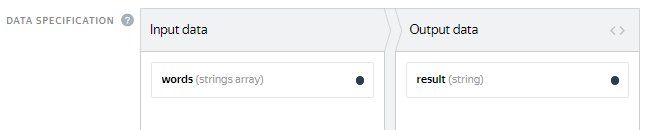

# Task interface



The task interface configuration guide describes the features of the HTML/JS/CSS editor. You can also try creating a task interface in the [Template Builder]({{ tb-quickstart }}).




The **task interface** defines the visual appearance of the task for the Toloker and the logic for processing responses.

A user-friendly interface improves the quality of results, helps Tolokers complete tasks faster, and lets you set a lower price per task.
 
To learn how to create a user-friendly interface, read the article in our [knowledge base]({{ toloka-knowledge-base }}).


## Interface configuration block {#interface-section}

Hover over an item in the image to see a hint:



To open the **HTML**, **CSS**, and **JS** blocks in the interface, click the block name on the right.




## HTML block {#html}

Add elements for the [input and output data](incoming.md) to display in the task interface in this block. You can use special components or HTML tags inside the `<body>` tag.

[Handlebars](t-components/handlebars.md) is used as a template engine for HTML.

#### How do I add a component?

1. Open the task interface editor. To do this, find the **Task interface** section, click , and select the component.

    Click **More** to see an example and a full list of parameters.

1. Copy the expression using the  button and paste it into the HTML block.
1. Enter the field name from the input or output data.

#### Examples of using input data

- **Display the text in the task.** Add the `text` field with the **string** type in the input data. Then in the task interface (in the HTML block), you can add this text as a variable, for example:
    ```html
    <p>Read the text: not_var{{text}}</p>
    ```
    
- ** Upload a file to the task, for example, an image.** Add the `url` field with the **link** type in the input data. Then add the [Picture](t-components/img.md) component in the task interface (in the HTML block) and specify the field name in the `src` attribute:
    ```
    {{img src=url width="400px" height="300px"}}
    ```

#### Examples of using output data

- **Ask Tolokers to enter the text.** Add the `input` field with the **string** type in the output data. Make the field mandatory. Then add the [Text input field](t-components/text.md) field in the task interface (in the HTML block) and specify the field name in the `name` attribute:
    ```
    {{field type="textarea" name="input" width="270px" rows=5}}
    ```

- **Ask Tolokers to select one of the values.** Add the `result` field with the **string** type in the output data. Make this field mandatory and specify `Yes` and `No` as acceptable values. Then add a component [Radio button](t-components/radiobuttons.md) component in the task interface (in the HTML block) and specify the field name in the `name` attribute:
    ```
    {{field type="radio" name="result" label="Yes" value="Yes" hotkey="1"}}
    {{field type="radio" name="result" label="No" value="No" hotkey="2"}}
    ```
    


## JavaScript block {#js}

In the **JS** block, you can add rules for response processing in JavaScript. [Special extensions for task classes](spec-advanced.md) are available for this purpose.

You can also connect JavaScript libraries to create the interface. For example, if you have several [projects](../../glossary.md#project-ru) with similar tasks, save the method descriptions in a separate file and add it as a library.

To connect the JavaScript library, click the  button in the **Task interface** block and add links to libraries in the **JS** field.


## CSS block {#css}

In the **CSS** block, you can declare the design for tags and classes. For example, the indent at the bottom after a text field with the `task-text` class:

```
.task-text{
  margin-bottom: 15px;
};
```

In addition, you can connect a CSS library. To do this, click the  button in the **Task interface** block and add links to libraries in the **CSS** filed.


## Preview features {#preview}



Changes to the input and output data, as well as the number of tasks per suite aren't saved after you exit **Preview**.




To view the resulting task, click **Preview**. The preview shows a page with a task that contains standard data. Change the input data and make sure that images, links, or text are displayed correctly on the [task suite](../../glossary.md#task-page-ru). You can also complete one or more tasks and get responses.

#### How do I change the number of standard tasks?
You can change the number of tasks with standard data on the Preview page:
1. Click **Change input data**.
1. To add a task, click **Add task**.

    To delete a task, click its number, then click .

1. Click **Apply**.

#### How to check the input data display

Add input data to check if files or text hints are displayed on the task suite. To do this, click **Change input data** and choose one of the methods:

#### Filling in the table

1. Change the input data fields.
    To change the task type to [control](../../glossary.md#control-task-ru) or [training](../../glossary.md#training-task-ru), add correct responses and a hint (the **Add correct answers** button).

    To go to the next task, click the task number at the bottom of the table. To delete a task, click .

1. Click **Apply**.

#### File upload

1. Get the sample upload file here: **Download example file**.
1. [Add the task data](pool_csv.md) to the file.
1. Save the file in UTF-8 encoding with the [tsv](pool_csv.md) extension.
1. Click the **Upload file** button and choose the file.
1. Check whether the fields are filled in correctly in the **Table**.
    If the column headers are invalid, you will get the message "Error loading the file".

    If the value of the required input field is not specified, or the number of fields in the header and row do not match, the task won't load. Refresh the page to return to viewing, correct the errors in the file, and load it again.

1. Click **Apply**.

#### Data in JSON format

1. Choose **JSON**.
1. Fill in the data for verification in [JSON format]({{ json-format }}).
    If the box is bordered in red, the JSON is not valid and the data won't be saved.

1. Click **Apply**.

Complete the task and click **Submit**.

#### How do I check if output data is received correctly?

You can check some of the received data on the task suite.

To check if the data from text comments or checkboxes is received correctly, fill in these task fields and click **Submit**. Then click **View responses**.



Use the [Sandbox](../../glossary.md#sandbox-ru) to check if files, images, audio, or videos submitted from the task suite are received correctly. To do this, complete the project creation, create the same project in the Sandbox, and [complete](sandbox.md) it from a trusted user account.




## Controls in a task {#controls}

To change the set of controls, click **Show common interface elements** at the bottom of the **Task Interface** section.

By default, the task suite displays:

- **Time remaining** (counts down the time for completing the task).

- **Price per task suite**.
- **Task name** (project name).

- The following buttons: **Message to requester**, **Guidelines**, **Fullscreen**, **Submit**, **Skip**, **Exit**.





Read the [article]({{ toloka-knowledge-base }}) on how to make the task interface intuitive and user-friendly.





## What's next {#what-next}

- [Adapt the task interface for mobile devices](mobile.md).
- [Create a task pool in the project](pool-main.md).
- Learn more about how to set up a project:
    - [Writing instructions](instruction.md).
    - [Input and output data](incoming.md).
    - [Setting up quality control](project-qa.md).


## Troubleshooting {#troubleshooting}

#### Setting up tasks, preview

#### My Tolokers can't upload a file with the assignment

If none of the Tolokers can submit the assignment, the most likely reason is JS validation. Run JS validation again.

Export your project to the sandbox and try to complete the task in the sandbox yourself.

#### How do I check the task display in the mobile Toloka app?

To check the task's look-and-feel on the mobile phone screen, enable the emulation mode in Chrome or Safari and edit the CSS block.

You can also use the mobile version of the sandbox. Write to support to get access to it.

#### How do I hide expandable text?

You can hide text in an expandable section by using CSS styles, both in the task itself and in the instructions. You can see the sample code [here]({{ text-under-the-cut }}).

#### How do I insert a calendar?

You can see an example in the comments for this [project]({{ how-to-insert-a-calendar }}). The example includes the output data format and libraries to be added.

To add libraries:
1. Click the “gear button” in project editing mode.
1. In the field that opens on the left, enter the links and press **Enter**.

#### How do I enable loading audio files in preview mode?

You can't check loading of audio files in the preview mode, but you can do it in the sandbox if you do your task. To do this, register in the sandbox as a Toloker and add the Toloker username to your trusted list on the **Tolokers** page. For more information, see [this post](sandbox.md).

#### Setting up controls

#### How do I add the text from an input variable to a checkbox label?

To pass a `label` in the input data, enter the input field name into the label.

For example, if you have the `asd` input field with the string type, the component would look like: `{{field type="checkbox" name="like" label=asd hotkey="q"}}`.

If you want to pass different label values in different tasks or the number of checkboxes may differ, use [concatenation](t-components/helpers.md#concat).

#### I selected one checkbox, but all the checkboxes are selected.

The names of the output fields must differ: each checkbox must have its own unique name. For more information about this component, see [here](t-components/checkboxes.md).

#### How can I do it in JS so that if the checkbox is selected, the link is not required, but if the link is inserted, the checkbox is cleared?

1. See how this is implemented in the  template.
1. To solve the second problem, you can add another validation like this:
    ```
    if (solution.output_values.url && solution.output_values.check) {return {task_id:
    this.getTask().id,errors: {'url': {code: ''Insert a link or check the box if the site doesn't exist'}}}}
    ```
    

#### How do I make tasks that have a varying number of response options and different options available?
You can do this using [concatenation](t-components/helpers.md#concat).
See the sample projects that can help you build an interface:
- [with checkboxes]({{ project-with-checkboxes }})
- [with a dropdown list]({{ project-with-drop-down-list }})
- [with radio buttons]({{ project-with-radiobutton }})
If you pass an array of values to the input field, use commas to separate the array elements. A response option will be generated for each of them in the interface. Input/output data for the sample projects are provided in the comments at codepen.io.

#### Why doesn't the “Submit” button work in the task?

The issue is probably in the JS block. Try deleting its content, then test the **Submit** button in the preview mode.

#### How do I add assignment validation depending on a checkbox, so that if an object is in the image, it must be selected, otherwise, a checkbox must be selected?

You can use JavaScript to add assignment validation depending on the checkbox. An example is provided in the “Search for information online” template.

#### How do I use different numbers of response options for different questions?

Use [concatenation](t-components/helpers.md#concat), for example:
```
{{field type="checkbox" name=(concat "result." @index ) label=(concat "checkbox –
                " @index) size="L"}}
```

#### How do I deselect a radio button?

You can't deselect a radio button. You can only select another radio button as a different response option.

#### How do I add assignment validation depending on a checkbox?

You can use JavaScript to add assignment validation depending on a checkbox. An example is provided in the “Search for information online” template.

#### How do I change the task background from the standard white color to a different color?

Use CSS to specify the color for the `.task` or `.task-suite` element. For example, to use a black background:
```
.task-suite {
    background-color: #000000;
    }
    .task {
    background-color: #000000;
    }
```
You can also assign a class to the interface block with the image and set the background for this block only.

#### How do I use sliders as interface elements for selecting parameter values?
In the HTML code of the template, enter the following:
```
<input type=""range"" list=""rng"" class=""res""> and include the following in onRender in your JS:
onRender: function() {
// Generated DOM element for the task (available via #getDOMElement())
//Adding auxiliary variables
var $root = $(this.getDOMElement());
var _this = this;
var solution = TolokaHandlebarsTask.prototype.getSolution.apply(this, arguments);

$root.on('change', '.res', function(){
var range_result = $(this).val()
_this.setSolutionOutputValue('result', range_result);

return solution;
})

}
```

#### How can I expand the window with HTML/CSS/JS code in the online task editor?

You can't expand the HTML window. To expand the JS and CSS fields, click any area within the field.

#### Can I use my own JS to build an interface in Toloka?

You don't have to use our components for task interfaces. Feel free to create a custom design for your tasks. To do this, delete the library from the project template:
- Click the “gear button” to open the settings.
- Delete `$TOLOKA_ASSETS/js/toloka-handlebars-templates.js`.
See the [Requester's guide](spec-advanced.md) for descriptions of the structure of classes and how they work.

#### What do I do if the radio button attributes are displayed correctly in the preview, but disappear after saving?

If the tags or attributes disappear after you save the instructions (for example, `checked="true"`), it means that they are not supported. For the full list of tags that can be used in the instructions, see the [Guide](instruction.md#html-yes).

#### Are you going to implement an HTML/JS prettifier in the project design?

We didn't intend this window for any sophisticated development. Usually, the content is prepared in a third-party prettified editor, and the resulting code is pasted to the window prior to the update.

However, in the context of TolokaHandlebars editability, there are no differences between our window and a third-party editor.

#### Input and output data

#### Why is the iframe content not displayed when I add the input and output data to the HTML interface in the preview mode?

Try to disable extensions in your browser. They might block iframe loading.

#### How do I pass the value of the input variable to the “Button with click validation”?

Specify the name of the input field where you pass the link, without the brackets:
```
{{field type="button-clicked" name="ads" label="Click me" href=name_escape
          action=true}}
```


#### How do I enter a list of words line-by-line, display an element for each of them, and save the result to the output array?

Pass an array of strings as the input field. For example, as shown in the screenshot: 
In HTML, use a special handlebar to iterate over this field. The code structure will look like this:
```
{{#each words}}
{{field type="radio" name="result" value=this label=this}}
{{/each}}
```

#### How do I use the input data as a variable in the HTML block?

Enclose the input field in double curly brackets `not_var{{text}}`.

#### How do I display formatted text from input data in the task?

Enclose the input field in triple curly brackets `{not_var{{input_field}}}`.

For more information about using the component, see the [Requester's guide](t-components/html.md).

#### How do I use a variable number of inputs in HTML to be determined by the Toloker?

To change the number of output fields dynamically, use the recommendations from [this page](t-components/helpers.md).

#### How do I display the text in the input field as in the source (with the HTML tags)?

To display the text in the input field with HTML tags, use the `<pre>` tag. For example:`<pre>not_var{{text}}</pre>`.

In this case, the text is rendered as is, in one scrollable line. To remove the scroll and avoid stretching the task card, add the following CSS to the block:
```
.task {
  max-width: 800px;
}

pre {
  white-space: pre-wrap;
}
```

#### Validation

#### How do I use the Vue markup without the basic TolokaHadlebarsTask object?

Learn more about the template's JS extension [here](spec-advanced.md).

To avoid conflict between the Vue markup and the Handlebars syntax, disable the "toloka-handlebars-templates" library and inherit from the Task/TaskSuite classes.

#### How do I run setSolution validation in "OnRender"?

Try to add a condition to check for the second progress bar:
```
setSolution: function(solution) {
var secondScale = this.getDOMElement().querySelector('.second-scale');

if(secondScale) {
secondScale.style.display = solution.output_values.grammar === 'no' ? 'block' : 'none';
}

TolokaHandlebarsTask.prototype.setSolution.call(this, solution);
},
```

#### How do I validate the data entered by the Toloker in the Toloka interface?

You can check the link format using regular expressions. To do this, add the link validation JavaScript code with `regexp` to the task template.

For example: `var regexp = /^(https://www.myurl.com/).{4,200}$/`.

You can also add a regular expression to the `input` field with the **string** type in the output data. Make the field mandatory. Then add the **Text input field** field in the task interface (in the HTML block) and specify the field name in the `name` attribute:
```
{{field type="textarea" name="input" width="270px" rows=5}}
```

#### Tasks with images

#### How do I make an image expand to its maximum size on click?

To the component that inserts the image, add the parameters: `real-size=true` and `screenshot=true`.

#### How do I create a shortcut for adding a polygon in "image-annotation"?
To create a shortcut, add the following action to the "onKey" method:
```
onKey: function(key) {
          var el = this.getDOMElement().querySelector(".image-annotation-editor__shape-polygon");

          if (key === 'D') {
          el.click();
          el.classList.add('image-annotation-editor__shape_active')
          }
```

If you need to further modify the area-selection editor, use [this library](https://github.com/vmit/image-annotation).

#### How do I, depending on the option selected, show a photo and make it mandatory or hide it and make it optional?

In this case, you need to leave the field optional in the output data and set up validation depending on the Toloker response. You can see how this is implemented in the “Text classification” template.

#### How do I prevent adding photos from the gallery so that when the Toloker clicks the add photo button the camera opens, rather than the gallery/camera choice?

Add `sources="CAMERA"` to the attributes of the image loading component. This disables adding photos from the gallery.

#### How do I implement selection of 3 different areas in an image?

You can create a selection and drop-down list with category selection. See how it is implemented on [this page](t-components/image-annotation.md) (**Dropdown list** tab).

#### In the “Side-by-side image comparison” template, where do I specify a proxy for the task interface to create a task with three image options?

The “Side-by-side image comparison” template uses a component rather than an HTML tag. This means that you should enclose your proxy in curly brackets like this [example](t-components/img.md): `{{img src=(proxy image)}}`.

#### What should the Toloker do if there is no selectable object in the image in an area selection task?

There are four options:
- [ Decompose the task](solution-architecture.md): First select images with the items you need, then select areas in them.
- Select an arbitrary area in the image. For example, put a square in the upper-right corner.
    Mention this in your instructions for reviewers.

- Ask the Toloker to skip the task and report it in a personal message. Messages are reviewed by the requester. If the selectable object is missing, the task is deleted from the pool (by resetting the overlap).
- Add the “No object” checkbox to the interface and make sure that your JS checks that either the object is selected or the checkbox is selected.
    For control purposes, add information about the value of this checkbox to the task interface.



