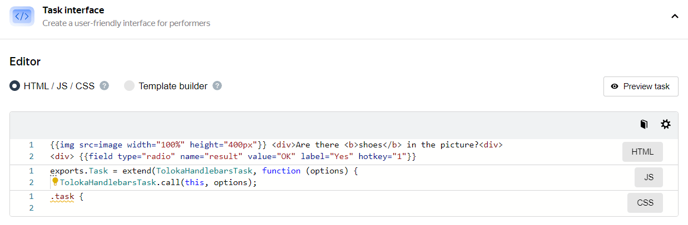

# Task interface



The task interface configuration guide describes the features of the HTML/JS/CSS editor. You can also try creating a task interface in the [Template Builder](../../template-builder/index.md).



The task interface defines the visual appearance of the [task](../../glossary.md#task) for the Toloker and the logic for processing responses.

A user-friendly interface improves the quality of results, helps Tolokers complete tasks faster, and lets you set a lower price per task.

To learn how to create a user-friendly interface, read the article in our [knowledge base]({{ toloka-knowledge-base }}).

## Interface configuration block {#interface-section}



To open the **HTML**, **CSS**, and **JS** blocks in the interface, click the block name on the right.



### HTML block {#html}

Add elements for the [input and output data](incoming.md) to display in the task interface in this block. You can use special [components](t-components.md) or HTML tags inside the `<body>` tag.

[Handlebars](t-components/handlebars.md) is used as a template engine for HTML.



1. Open the task interface editor. To do this, find the **Task interface** section, click , and select the component.

    Click **Learn more** to see an example and a full list of parameters.

1. Copy the expression using the  button and paste it into the HTML block.

1. Enter the field name from the input or output data.







Add the `text` field with the `string` type in the input data. Then in the task interface (in the HTML block), you can add this text as a variable, for example:

    ```html
    <p>Read the text: not_var{{text}}</p>
    ```





Add the `url` field with the `URL` type in the input data. Then add the [Picture](t-components/img.md) component in the task interface (in the HTML block) and specify the field name in the `src` attribute:

    ```html
    {{img src=url width="400px" height="300px"}}
    ```









Add the `input` field with the `string` type in the output data. Make the field required. Then add the [Text input field](t-components/text.md) field in the task interface (in the HTML block) and specify the field name in the `name` attribute:

    ```html
    {{field type="textarea" name="input" width="270px" rows=5}}
    ```





Add the `result` field with the `string` type in the output data. Make this field required and specify `Yes` and `No` as acceptable values. Then add a component [Radio button](t-components/radiobuttons.md) component in the task interface (in the HTML block) and specify the field name in the `name` attribute:

    ```html
    {{field type="radio" name="result" label="Yes" value="Yes" hotkey="1"}}
    {{field type="radio" name="result" label="No" value="No" hotkey="2"}}
    ```







### JavaScript block {#js}

In the **JS** block, you can add rules for response processing in JavaScript. [Special extensions for task classes](spec-advanced.md) are available for this purpose.

You can also connect JavaScript libraries to create the interface. For example, if you have several [projects](../../glossary.md#project) with similar tasks, save the method descriptions in a separate file and add it as a library.

To connect the JavaScript library, click the  button in the **Task interface** block and add links to libraries in the **JS** field.

### CSS block {#css}

In the **CSS** block, you can declare the design for tags and classes. For example, the indent at the bottom after a text field with the `task-text` class:

```css
.task-text{
  margin-bottom: 15px;
};
```

In addition, you can connect a CSS library. To do this, click the  button in the **Task interface** block and add links to libraries in the **CSS** filed.

## Preview features {#preview}



Changes to the input and output data, as well as the number of tasks per suite aren't saved after you exit **Preview**.



To view the resulting task, click **Preview task**. The preview shows a page with a task that contains standard data. Change the input data and make sure that images, links, or text are displayed correctly on the [task suite](../../glossary.md#task-suite). You can also complete one or more tasks and get responses.



You can change the number of tasks with standard data on the preview page:

1. Click **Change input data**.

1. To add a task, click **Add task**.

    To delete a task, click its number, then click .

1. Click **Apply**.





Add input data to check if files or text hints are displayed on the task suite. To do this, click **Change input data** and choose one of the methods:



- Filling in the table

  1. Change the input data fields.

      To change the task type to [control](../../glossary.md#control-task) or [training](../../glossary.md#training-task), add correct responses and a hint (the **Add correct answers** button).

      To go to the next task, click the task number at the bottom of the table. To delete a task, click .

  1. Click **Apply**.

- File upload

  1. Get the sample upload file here: **Download sample file**.

  1. [Add the task data](pool_csv.md) to the file.

  1. Save the file in UTF-8 encoding with the [tsv](pool_csv.md) extension.

  1. Click the **Upload file** button and choose the file.

  1. Check whether the fields are filled in correctly in the **Table**.

      If the column headers are invalid, you will get the message "Error loading the file".

      If the value of the required input field is not specified, or the number of fields in the header and row do not match, the task won't load. Refresh the page to return to viewing, correct the errors in the file, and load it again.

  1. Click **Apply**.

- Data in JSON format

  1. Choose **JSON**.

  1. Fill in the data for verification in the [JSON]({{ json-format }}) format.

      If the box is bordered in red, the JSON is not valid and the data won't be saved.

  1. Click **Apply**.

  Complete the task and click **Submit**.







You can check some of the received data on the task suite.

To check if the data from text comments or checkboxes is received correctly, fill in these task fields and click **Submit**. Then click **View responses**.



Use the [Sandbox](../../glossary.md#sandbox) to check if files, images, audio, or videos submitted from the task suite are received correctly. To do this, complete the project creation, create the same project in the Sandbox, and [complete](sandbox.md) it from a trusted user account.





## Controls in a task {#controls}

To change the set of controls, click **Show common interface elements** at the bottom of the **Task Interface** section.

By default, the task suite displays:

- **Remaining time**: Counts down the time for completing the task.

- **Price per task suite**.

- **Task name**: Corresponds to the project name.

- The following buttons:

  - **Contact requester button**.

  - **Instructions**.

  - **Fullscreen**.

  - **Submit**.

  - **Skip**.

  - **Exit**.



Read the [article]({{ toloka-knowledge-base }}) on how to make the task interface intuitive and user-friendly.



## What's next {#what-next}

- [Adapt the task interface for mobile devices](mobile.md).
- [Create a task pool in the project](pool-main.md).
- Learn more about how to set up a project:

    - [Writing instructions](instruction.md).
    - [Input and output data](incoming.md).
    - [Setting up quality control](project-qa.md).

## See also {#see-also}

- [Crowdsourcing concepts: Instructions](https://toloka.ai/knowledgebase/instruction/)
- [Crowdsourcing concepts: Interfaces](https://toloka.ai/knowledgebase/interface/)
- [{#T}](edit-project.md)

## Troubleshooting {#troubleshooting}

































































































