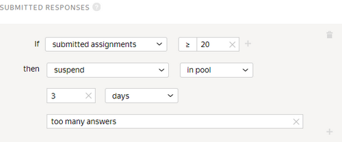

# Submitted responses

To involve as many Tolokers as possible, limit the number of tasks in the [pool](../../glossary.md#pool) per Toloker or [set a limit](income.md) on daily earnings in your [project](../../glossary.md#project).

## When to use {#when-use}

Use this rule if you want to:

- Get responses from as many Tolokers as possible. For this purpose, set a low threshold, such as one [task suite](../../glossary.md#task-suite).

- Protect yourself from robots. For this purpose, the threshold should be higher, such as 10% of the pool's tasks.



Don't set large values in pools where Tolokers won't have time to complete the required number of tasks.



## How to configure {#rule}



All fields in this rule are required. If you don't fill in at least one of them, you won't be able to save the rule.



#|
||**Field**  | **Overview** ||
||**If** | A condition for performing the action in the **then** field:

- **submitted task suites** — The number of task suites in the pool completed by the Toloker.||
||**then** | Action to perform for the condition **If**:

- **suspend** — Suspend the Toloker's access to the pool for the specified number of days. Only the requester can view the reason.

- **assign skill value** — Assign a fixed value to the [skill](nav.md).

- **ban** — Block access to the project or all of the requester's projects for the specified number of days. Only the requester can view the reason.

    If access to tasks is blocked temporarily (for example, for 7 days), the history of the Toloker's responses is not saved after the ban is lifted. The skill value is based on new responses.

- **accept all assignments from this Toloker in the pool** — Requires the [non-automatic acceptance](offline-accept.md) option to be set.

    Useful if the Toloker completes most tasks well. Example: The Toloker completed more than 80% of the tasks correctly and you are satisfied with this result. The rule will work automatically and accept all responses in the pool.||
|#

## Rule example {#examples}

**Task**: you're conducting an opinion poll. To collect responses from as many Tolokers as possible, set up the **Submitted responses** rule.

#### Correct settings

If the Toloker submits more than 20 assignments, they can no longer access the pool and can't complete your tasks.



The assignments submitted by banned Tolokers will be taken into account if they are not rejected manually using assignment review They can be reassigned by setting up the [Recompletion of assignments from banned users](restore-task-overlap.md) rule.



## For developers {#for-developers}

- [Toloka API: Number of tasks completed](../../api/concepts/completed.md)
- [Toloka-Kit: AnswerCount collector class](../../toloka-kit/reference/toloka.client.collectors.AnswerCount.md)

## Troubleshooting {#troubleshooting}









