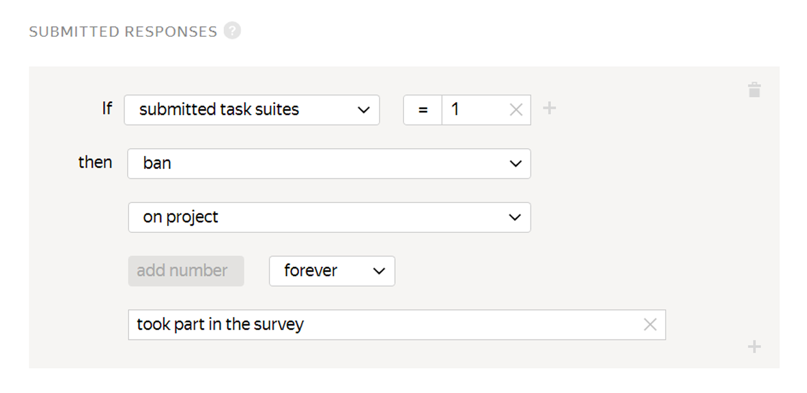

# Submitted responses

To involve as many Tolokers as possible, limit the number of tasks in the [pool](../../glossary.md#pool) per Toloker or [set a limit](income.md) on daily earnings in your [project](../../glossary.md#project).

## When to use {#when-use}

Use this rule if you want to:

- Get responses from as many Tolokers as possible. For this purpose, set a low threshold, such as one [task suite](../../glossary.md#task-suite).

- Protect yourself from robots. For this purpose, the threshold should be higher, such as 10% of the pool's tasks.



Don't set large values in pools where Tolokers won't have time to complete the required number of tasks.



## How to configure {#rule}



All fields in this rule are required. If you don't fill in at least one of them, you won't be able to save the rule.



#|
||**Field**  | **Overview** ||
||**If** | A condition for performing the action in the **then** field:

- **submitted task suites** — The number of task suites in the pool completed by the Toloker.||
||**then** | Action to perform for the condition **If**:

- **suspend** — Suspend the Toloker's access to the pool for the specified number of days. Only the requester can view the reason.

- **assign skill value** — Assign a fixed value to the [skill](nav.md).

- **ban** — Block access to the project or all of the requester's projects for the specified number of days. Only the requester can view the reason.

    If access to tasks is blocked temporarily (for example, for 7 days), the history of the Toloker's responses is not saved after the ban is lifted. The skill value is based on new responses.

- **accept all assignments from this Toloker in the pool** — Requires the [non-automatic acceptance](offline-accept.md) option to be set.

    Useful if the Toloker completes most tasks well. Example: The Toloker completed more than 80% of the tasks correctly and you are satisfied with this result. The rule will work automatically and accept all responses in the pool.||
|#

## Rule example {#examples}

**Task**: you're conducting an opinion poll. To collect responses from as many Tolokers as possible, set up the **Submitted responses** rule.

#### Correct settings

If the Toloker submits more than 20 assignments, they can no longer access the pool and can't complete your tasks.



The assignments submitted by banned Tolokers will be taken into account if they are not rejected manually using assignment review They can be reassigned by setting up the [Recompletion of assignments from banned users](restore-task-overlap.md) rule.



## Troubleshooting {#troubleshooting}



It is better to use one [skill](../../glossary.md#skill) in a project. You can choose the way to calculate the skill:

- Calculate the skill for each pool separately. The current skill value is the value of the skill in the pool the Toloker completed last. This option is convenient if:

    - The pools are intended for different groups of Tolokers (for example, there are filters by city or country).

    - Pools are started one by one and you don't want to take into account the responses in the previous pools to calculate the skill in the current pool.

    This calculation method is used by default when adding a quality control rule to a pool. For the control tasks block, leave the **Recent control task responses to use** field empty.

- Calculate skill based on all tasks in a project This option is good if the pools are small and you don't need to have skill calculated for each pool.

    This option is available only for skills on control tasks. To use it, fill in the **Recent control task responses to use** field in pool quality control rules.





Yes, of course — you can use the same skill for different projects. But most often, a skill is intended for a specific project. If the Toloker completes a certain task well, this doesn't mean that they will complete other ones successfully. Another disadvantage is that if you filter by skills that were set long ago, you will artificially limit the number of available Tolokers.





Yes, if they can access both pools, they can do both of them. To restrict access to subsequent tasks for a Toloker, use the [Completed tasks](submitted-answers.md) rule and select a ban at the project level.





If you pass texts to the input data, you can load 2 different tasks in the pool. In one task, pass Text 1 in the `INPUT: <input field name>` field, and in the other task, use this field to pass Text 2. But if the text is in the HTML block of the task template, you need to clone the project. To let a Toloker do only one task in your project, use the [Submitted responses](submitted-answers.md) rule. You can assign a skill or ban the Toloker after they submit one response.



