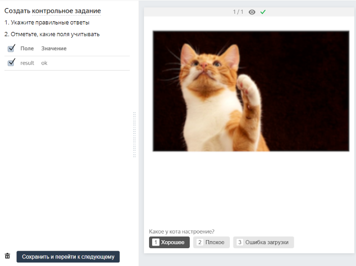
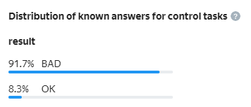

# How to edit tasks by yourself

You can turn a general task into a [control task](../../glossary.md#control-task-ru) by adding the correct answer, or into a [training task](../../glossary.md#training-task-ru) by adding the correct answer and a hint.



Avoid wordings like: “You answered incorrectly, please provide the correct response”. The Toloker learns when the hint explains the essence of their mistake.

Make the hints clear. Explain which response should be chosen and why.





Task markup is available only for [training pools](train.md) and pools uploaded with [“smart mixing”](distribute-tasks-by-pages.md#smart-mixing).



## How do I mark up tasks? {#section_czh_fj2_ghb}

1. Make sure the pool isn't running.
1. Click **Edit** in the **Pool tasks** block.
1. Open the **General**, **Control**, or **Training** tab. Create a control or a training task from another type of task.
1. Select the responses that should be checked. (The list of the [output data fields](incoming.md) is on the right.)
1. Click **Save and go to next**.



In this example, the correct response is added for the control task. Only the choice in the `result` field (Good/Bad/Loading error) is checked.





## Improve the reliability of control tasks {#answer_distribution}

After you have created the control tasks, make sure that different variations of correct responses occur with the same frequency. This will help avoid random guessing in responses.

1. Go to the task markup page.
1. Open the  tab.
    The distribution of responses is shown as a percentage.




When creating control tasks, enter only correct responses that answer the question. So for an image classification task, **Image loading error** is not a correct response that answers the task question.




#### Example of response distribution



- Correct

  

- Incorrect

  



## How to edit tasks {#task-edit}

1. Make sure the pool isn't running.
1. Click **Edit** in the **Pool tasks** block.
1. Click the tab with the type of the task.
1. Find the task in the list and click  . Editing mode opens.

## How to delete a task from the pool {#delete-task}

1. Make sure the pool isn't running.
1. Click **Edit** in the **Pool tasks** block.
1. Click the tab with the type of the task.
1. Find the task in the list and click . You can also delete a task from the pool in [editing mode](#task-edit).



If you set the overlap to 0 [via the API]({{ toloka-api-stop-assigning-tasks }}), the task won't be visible to Tolokers, and you won't have to delete it.




## What's next {#what_next}

- [Add a training pool](train.md).
- 
  [Top up your account](refill.md)
  
- [Start the pool](pool-run-and-stop.md).


## Troubleshooting {#troubleshooting}







To view the processing log, click **More on uploading errors**. The processing log is written in JSON format. Objects inside `result` match the line number of the uploaded file. Lines that were processed with an error have the status `"success": false`.


To work with a large log conveniently, copy it to the text editor.





#### Errors in column headers

If the [column headings](pool_csv.md) are incorrect, the whole file is rejected. Otherwise, Toloka specifies the number of tasks with processing errors.

#### Processing errors table

<table>
<tr>
<th>Overview</th><th>How to fix</th>
</tr>
<tr>
<td colspan="2">

``` 
"parsing_error_of": "https://tlk.s3.yandex.net/wsdm2020/photos/2d5f63a3184919ce7e3e7068cf93da4b.jpg\t\t", 
"exception_msg": "the nameMapping array and the sourceList should be the same size (nameMapping length = 1, sourceList size = 3)" 
```
</td>
</tr>
<tr>
<td>

**Extra tabs.**

If the file contains more `\t` column separators after the data or the link than the number of columns set in the [input data](../../glossary.md#input-output-data-ru), you will get en error message.

For example, if 1 column is defined in the input, and two more `\t\t` tabs are added in the file after the link, you get 3 columns, 2 of which are extra. </td>
<td> Remove extra column separators in the above example — both `\t\t` characters.
</td>
</tr>
<tr>
<td colspan="2">

``` 
"exception_msg": "the nameMapping array and the sourceList should be the same size (nameMapping length = 4, sourceList size = 6)" 
```
</td>
</tr>
<tr>
<td>

**The number of fields in the header and in the row doesn't match.** 

</td>
<td> 
Make sure that:

- The number of tabs in the file structure is correct.
- String values with tab characters are enclosed in [quotation marks](pool_csv.md#string)`" "`.

</td>
</tr>
<tr>
<td colspan="2">

``` "code": "VALUE_REQUIRED", "message": "Value must be present and not equal to null" ```

</td>
</tr>
<tr>
<td>

**The value is missing for a required input field.** </td>
<td> Make sure that columns with required input data fields are filled.
</td>
</tr>
<tr>
<td colspan="2">

``` "code": "INVALID_URL_SYNTAX", "message": "Value must be in valid url format" ```
</td>
</tr>
<tr>
<td>

**Invalid data in a “link” (“url”) field.** 

</td>
<td> 

Make sure that:
- Links start with the `http://`, `https://` or `www` prefix.

</td>
</tr>
<tr>
<td colspan="2">

``` "exception_msg": "unexpected end of file while reading quoted column beginning on line 2 and ending on line 4" ```

</td>
</tr>
<tr>
<td>

**Unpaired quotation mark in a string.** 
</td>
<td> 

Check that all quotation marks are [escaped](pool_csv.md#string).
</td>
</tr>
</table>





You can specify the number of tasks on the page when you upload your tasks to the pool. For more information about distributing tasks across pages, see [this article](distribute-tasks-by-pages.md).





Use the button **Upload review results** to upload your file. You can see the format [here](accept.md).

Assignments are reviewed in a file.





Check the `hint` field. For the general tasks, this field must be empty.





In the file with the general tasks, the columns with the `INPUT` headers must be filled out. You can see those headers if you download a sample file from the pool.

If you are creating control tasks, fill out the `GOLDEN` columns with the correct responses.

If you are creating a training task, you also need to fill in the `HINT:text` column. For the general tasks you don't need any columns other than `INPUT`, so feel free to delete them.

The file format must be TSV, XLSX or JSON, and the encoding must be UTF-8.

For more information about creating the file, see the [Guide](pool_csv.md). If there are errors during the upload, look up the error description on this [page](task_upload.md).





The error might occur if the expected input type is URL, but a string is received.

There may be two reasons:
- The input field has the "link" type.
- The pool was created for an outdated project version. It means that the pool was created before you changed the input field type.





It depends on the task. Technically, you can use as many tasks you want.

But users are reluctant to take lengthy tasks. They'd rather do 10 tasks that take one minute each than one task that takes 10 minutes.

In addition, if you use a large number of tasks on the page, there might be issues with uploading the files to be labeled. This problem might occur with images.

The third thing to consider is quality control and assignment review. If you use recompletion of assignments from banned users, you should split the task into smaller parts so that fewer assignments are recompleted. You are more likely to meet your budget this way.





Smart mixing settings are specified for the file rather than for the pool.

The settings specified during the first file upload are applied to all the files that are uploaded to this pool later on.




Try completing the tasks yourself. Ask your colleagues and friends to complete them. Find out average completion time and add 50% to it.




A task means a separate task. A task suite means a page with tasks. The Toloker gets paid for a task suite.





The same task may appear on different pages if:

- Dynamic overlap is used (incremental relabeling, IRL). As an example, let's say there were 5 tasks on a page. For 4 of them, responses coincided and the common response was counted as correct. The fifth task was mixed into another set because it didn't get into the final response and it needs to be “reassessed”.
- Different tasks have different overlap. Tasks with higher overlap will be additionally shown in sets with the other remaining tasks in the pool.
- If a [quality control rule](../../glossary.md#quality-control-rules-ru) changes a task's overlap, it will appear in a different set.









The number of tasks depends on how difficult and time-consuming the tasks are. Keep the size reasonably small. Large task suites are unpopular, partly because they are inconvenient for Tolokers (for example, if the internet connection is unstable).





We recommend adding at least 1% of control tasks in the pool. And for small pools — 5-10%.



Each control task is shown to the Toloker only once. If you use smart mixing, you determine how many control tasks should be in a suite. If each suite contains one control task, then the maximum number of suites the Toloker can complete is equal to the number of control tasks in the pool. If you increase the number of control tasks in a suite, the number of suites available to the Toloker decreases by the same number.

There shouldn't be too few pages available. Otherwise:

- You won't be able to correctly evaluate the quality of the Toloker's responses.
- The Toloker won't be interested in completing such tasks because they'll spend a lot of time studying instructions but won't earn much.



#### A large pool with 1% of control tasks (good)

There are 10,000 tasks in the pool, and 100 of them are control tasks (1%). Each suite contains 10 tasks, and 1 of them is a control task. Hence, a user can complete up to 100 suites.

#### A small pool with 1% control tasks (bad)

There are 100 tasks in the pool, and 1 of them is a control task (1%). Each suite contains 10 tasks, and 1 of them is a control task. Hence, each user can only complete 1 suite.

#### A small pool with 10% control tasks (good)

There are 100 tasks in the pool, and 10 of them are control tasks (10%). Each suite contains 10 tasks, and 1 of them is a control task. Hence, each user can complete up to 100 suites





If there are few control tasks in the open pool, [add new control tasks](../troubleshooting/pool-setup.md#add-gs).



In a large pool with few control tasks, a situation might occur when users who have completed a lot of tasks in the project stop getting new task suites. This happens when the Toloker completes all control tasks in the pool.





To filter out Tolokers, use the [Control tasks](control.md) quality control rule. To rank Tolokers by the quality of responses in control tasks, use a [skill](nav.md).







The Control tasks rule starts working after the Toloker completes the number of control tasks you specified. If your pool contains both [training](../../glossary.md#training-task-ru) and control tasks, you can take into account the responses in both of them (the **Number of responses** parameter) or only in control tasks (the **Number of control responses** parameter).

As soon as the needed number of responses is collected, Toloka calculates the percentage of correct and incorrect responses and performs an action (assigns a skill, or blocks the Toloker in the pool or in the project). Then this percentage is updated as the tasks are completed by the Toloker. The number of the Toloker's recent responses that's used in the calculation is set in the **Recent control task responses to use** field. If you leave it empty, all the responses from the Toloker in the pool are counted.






