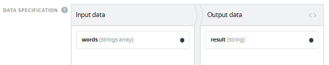

# All questions on one page



If you are looking for the answer to a specific question, use **Ctrl+F** to search the page (**Cmd+F** on MacOS).



## Registration and getting started {#register-and-start}





To change your phone number, go to [Yandex ID]({{ phones }}) and change your main number.



If you don't have access to the old number, it takes a month to replace it. For more information about changing the phone number, see [Yandex ID Help]({{ change-phone }}).





## Sandbox {#sandbox}



[Register]({{ sandbox }}) as a requester in the sandbox.

[Register]({{ sandbox-for-performers }}) as a Toloker using another account.

In your requester account, add your Toloker account to your trusted list.

Create and run a task. It will appear in the list of tasks for your trusted users. For more information, see [Help](../concepts/sandbox.md).





To test your task, add yourself as a trusted Toloker in the Sandbox. To do this, on the **Tolokers** page, click **Add trusted users**. Enter the username for the Toloker's account (case-sensitive).





To do this, you will need a Sandbox version of the Toloka app. [Write to support](../troubleshooting/support.md) to get it.





You won't be able to update a previously exported project. If you clone a project from the sandbox again, its current copy is added. The old project doesn't change.





The tasks themselves are not exported, only the project configuration and the settings of the selected pool. You can download the completed tasks from the pool in the Sandbox and import them to the exported pool.

To download only the control tasks (if you completed them in the interface), go to **Mark up**, then click **Control tasks** and **Download**.





No, you need a separate account for each version of Toloka. To create a task in the [Sandbox](../../glossary.md#sandbox), [register](../concepts/access.md) in it as a requester. To complete your own task, register another account for yourself as a Toloker.



## Setting up a project {#project}

### Instructions {#instruction}



There are three options:

- Put your instructions inside the task, but make sure that it doesn't clutter the interface.

- Use [a side window]({{ instr-in-form-of-side-window }}) for your instructions so that the Toloker can quickly expand or collapse them.

- [Hide the instructions in an expandable section]({{ hints-questions }}) or add hints for the individual interface elements.

For best results, we recommend that you pre-select the Tolokers that meet your requirements and set up the quality control rules.





No, but you can add links to them.





By default, the project instructions are displayed in the training pool. To use separate instructions for the training pool, deselect **Use project instructions**. Don't forget to update the training instructions if you change something in the general task instructions.



### Configuring the task interface {#concept_gss_fkp_smb}



To the component that inserts the image, add the parameters: `real-size=true` and `screenshot=true`.





To create a shortcut, add the following action to the "onKey" method:

```javascript
onKey: function(key) {
          var el = this.getDOMElement().querySelector(".image-annotation-editor__shape-polygon");

          if (key === 'D') {
          el.click();
          el.classList.add('image-annotation-editor__shape_active')
          }
```

If you need to further modify the area-selection editor, use [this library](https://github.com/vmit/image-annotation).





You can't check loading of audio files in the preview mode, but you can do it in the sandbox if you do your task. To do this, register in the sandbox as a Toloker and add the Toloker username to your trusted list on the **Tolokers** page. For more information, see [this post](../concepts/sandbox.md).





To check the task's look-and-feel on the mobile phone screen, enable the emulation mode in Chrome or Safari and edit the CSS block.

You can also use the mobile version of the sandbox. Write to support to get access to it.





Use [concatenation](../concepts/t-components/helpers.md#concat), for example:

```html
{{field type="checkbox" name=(concat "result." @index ) label=(concat "checkbox –
          " @index) size="L"}}
```





To pass a `label` in the input data, enter the input field name into the label.

For example, if you have the `asd` input field with the string type, the component would look like: `{{field type="checkbox" name="like" label=asd hotkey="q"}}`.

If you want to pass different label values in different tasks or the number of checkboxes may differ, use [concatenation](../concepts/t-components/helpers.md#concat).





You can hide text in an expandable section by using CSS styles, both in the task itself and in the instructions. You can see the sample code [here]({{ text-under-the-cut }}).





Specify the name of the input field where you pass the link, without the brackets:



```html
{{field type="button-clicked" name="ads" label="Click me" href=name_escape
          action=true}}
```







1. See how this is implemented in the “[Mining business contacts](../tutorials/internet-search.md)” template.

1. To solve the second problem, you can add another validation like this:

    

    ```javascript
    if (solution.output_values.url && solution.output_values.check) {return {task_id:
    this.getTask().id,errors: {'url': {code: ''Insert a link or check the box if the site doesn't exist'}}}}
    ```

    





You can use JavaScript to add assignment validation depending on the checkbox. An example is provided in the “Search for information online” template.





You can see an example in the comments for this [project]({{ how-to-insert-a-calendar }}). The example includes the output data format and libraries to be added.

To add libraries:

1. Click the “gear button” in project editing mode.

1. In the field that opens on the left, enter the links and press **Enter**.





You can do this using [concatenation](../concepts/t-components/helpers.md#concat).

See the sample projects that can help you build an interface:

- [with checkboxes]({{ project-with-checkboxes }})

- [with a dropdown list]({{ project-with-drop-down-list }})

- [with radio buttons]({{ project-with-radiobutton }})

If you pass an array of values to the input field, use commas to separate the array elements. A response option will be generated for each of them in the interface. Input/output data for the sample projects are provided in the comments at codepen.io.





You can't deselect a radio button. You can only select another radio button as a different response option.





In this case, you need to leave the field optional in the output data and set up validation depending on the Toloker response. You can see how this is implemented in the “Text classification” template.





Add `sources="CAMERA"` to the attributes of the image loading component. This disables adding photos from the gallery.





Try to add a condition to check for the second progress bar:

```javascript
setSolution: function(solution) {
var secondScale = this.getDOMElement().querySelector('.second-scale');

if(secondScale) {
secondScale.style.display = solution.output_values.grammar === 'no' ? 'block' : 'none';
}

TolokaHandlebarsTask.prototype.setSolution.call(this, solution);
},
```





You can create a selection and drop-down list with category selection. See how it is implemented on [this page](../concepts/t-components/image-annotation.md) (**Dropdown list** tab).





Learn more about the template's JS extension [here](../concepts/spec-advanced.md).

To avoid conflict between the Vue markup and the Handlebars syntax, disable the "toloka-handlebars-templates" library and inherit from the Task/TaskSuite classes.





The “Side-by-side image comparison” template uses a component rather than an HTML tag. This means that you should enclose your proxy in curly brackets like this [example](../concepts/t-components/img.md): `{{img src=(proxy image)}}`.





Use CSS to specify the color for the `.task` or `.task-suite` element. For example, to use a black background:

```css
.task-suite {
background-color: #000000;
}
.task {
background-color: #000000;
}
```

You can also assign a class to the interface block with the image and set the background for this block only.





You can check the link format using regular expressions. To do this, add the link validation JavaScript code with `regexp` to the task template.

For example: `var regexp = /^(https://www.myurl.com/).{4,200}$/`.

You can also add a regular expression to the `input` field with the **string** type in the output data. Make the field mandatory. Then add the **Text input field** field in the task interface (in the HTML block) and specify the field name in the `name` attribute:

```html
{{field type="textarea" name="input" width="270px" rows=5}}
```





You can use JavaScript to add assignment validation depending on a checkbox. An example is provided in the “Search for information online” template.





Pass an array of strings as the input field. For example, as shown in the screenshot: 

In HTML, use a special handlebar to iterate over this field. The code structure will look like this:

```html
{{#each words}}
{{field type="radio" name="result" value=this label=this}}
{{/each}}
```





In the HTML code of the template, enter the following:

```html
<input type=""range"" list=""rng"" class=""res"">
```

and include the following in onRender in your JS:

```javascript
onRender: function() {
// Generated DOM element for the task (available via #getDOMElement())
//Adding auxiliary variables
var $root = $(this.getDOMElement());
var _this = this;
var solution = TolokaHandlebarsTask.prototype.getSolution.apply(this, arguments);

$root.on('change', '.res', function(){
var range_result = $(this).val()
_this.setSolutionOutputValue('result', range_result);

return solution;
})

}
```







You can't expand the HTML window. To expand the JS and CSS fields, click any area within the field.





Enclose the input field in double curly brackets `not_var{{text}}`.





Enclose the input field in triple curly brackets `{not_var{{input_field}}}`.

For more information about using the component, see the [Requester's guide](../concepts/t-components/html.md).





You don't have to use our components for task interfaces. Feel free to create a custom design for your tasks. To do this, delete the library from the project template:

- Click the “gear button” to open the settings.

- Delete `$TOLOKA_ASSETS/js/toloka-handlebars-templates.js`.

See the [Requester's guide](../concepts/spec-advanced.md) for descriptions of the structure of classes and how they work.





To change the number of output fields dynamically, use the recommendations from [this page](../concepts/t-components/helpers.md).





We didn't intend this window for any sophisticated development. Usually, the content is prepared in a third-party prettified editor, and the resulting code is pasted to the window prior to the update.

However, in the context of TolokaHandlebars editability, there are no differences between our window and a third-party editor.





To display the text in the input field with HTML tags, use the `<pre>` tag. For example:`<pre>not_var{{text}}</pre>`.

In this case, the text is rendered as is, in one scrollable line. To remove the scroll and avoid stretching the task card, add the following CSS to the block:

```css
.task {
  max-width: 800px;
}

pre {
  white-space: pre-wrap;
}
```





There are four options:

- [ Decompose the task](../concepts/solution-architecture.md): First select images with the items you need, then select areas in them.

- Select an arbitrary area in the image. For example, put a square in the upper-right corner.

    Mention this in your instructions for reviewers.

- Ask the Toloker to skip the task and report it in a personal message. Messages are reviewed by the requester. If the selectable object is missing, the task is deleted from the pool (by resetting the overlap).

- Add the “No object” checkbox to the interface and make sure that your JS checks that either the object is selected or the checkbox is selected.

    For control purposes, add information about the value of this checkbox to the task interface.



### Input and output data {#concept_cjj_gkp_smb}



You can find an example of the task template for selecting image groups at this [link]({{ selection-of-images-groups }}). The input and output data, as well as a fragment of the instructions, are in the comments to the project.





To validate the input data format, you can use the output field type, specifying the acceptable or minimum/maximum values. For example, create an output field for the taxpayer number with the "string" type and enter its minimum and maximum length (like 10 and 12). To use a more sophisticated validation in the template, use RegExp.

To enter a date, you can add a calendar to the task interface. See an [example of a calendar]({{ how-to-insert-a-calendar }}).





You can use different image sizes.





You can't use a range as a fixed value.



## Setting up a pool {#pool-settings}

### Filters {#filters}



Yes, you can do that. In the [filters](../concepts/filters.md), select **Profile → City**. Please note that the profile data is entered by the Toloker when they register in Toloka. We recommended that you use the filters **Region by phone number** and **Region by IP**.





Yes, of course — you can use the same skill for different projects. But most often, a skill is intended for a specific project. If the Toloker completes a certain task well, this doesn't mean that they will complete other ones successfully. Another disadvantage is that if you filter by skills that were set long ago, you will artificially limit the number of available Tolokers.





If you mean multiple different projects, you can't do that.

You can merge all the projects into one and use **History size** in the quality control rules. See examples in the [Control tasks](../concepts/goldenset.md) post.

You can use **Aggregation by skill**, but you'll need to list all the possible values, which is probably not the best choice. Perhaps you'll find [another method of aggregation](../concepts/result-aggregation.md) helpful.





In the main Toloka version, you can only assign a skill to users who have completed at least one of your tasks. There is no option to assign a skill to an arbitrary user. To limit the audience of users who will see your project, use [filters](../concepts/filters.md). For example, specify the city, date of birth, gender, or some other parameters of your target Tolokers.





Tasks from an open pool are available to every user that matches your pool [filters](../concepts/filters.md). You can restrict access, like by using a skill.





The validity period of the training skills is controlled by the **Retry after** parameter. The skill is deleted after a period specified in days in the **Retry after** field, if the Toloker:

- Has a skill value lower than the one specified in the **Level required** field.

- Didn't complete any tasks linked to training during this period.

Your users will need to be trained again.





If the Toloker mismatches your preset filter, they can't see the task. You can only remove the restricting filter from the pool. You can test the task in the [Sandbox](../concepts/sandbox.md) by adding the desired user to your trusted list.





You can do that. To select Tolokers for the pool, use [filters](../concepts/filters.md).





Tasks in pools are automatically available in the web version of Toloka and the mobile app. Check the pool settings. You might have the `Client = Mobile Toloka`[filter](../concepts/filters.md) on.





You can assign a skill to these people based on their performance in the previous pools. Use this skill as a [filter](../concepts/filters.md) in the new pool.





Specify this skill as a [filter](../concepts/filters.md), but leave the value field empty (this is equivalent to absence of the skill).





If the Toloker already has a given skill, you can't add the same skill to them from the task review interface. You can open the Toloker's profile and edit the skill value.





If it's a public or training skill, they see it and they get a message about it.





There is no such option. If the skill is public, the Toloker sees it in their profile.





Requesters can't see the full details about specific Tolokers. So you can't see information like the date of birth, gender, last name, or first name. However, you can use filters by date of birth and gender (in the pool settings). This way you can select a group of Tolokers without accessing the personal information of individual Tolokers. This decreases the risk of user de-anonymization.





You can do that using the [Control tasks](../concepts/goldenset.md) rule.

1. Upload the task file using **Smart mixing**.

1. Specify `student` as the correct answer to the question. Don't take other questions into account (leave the fields empty or unselected).

1. Add the [Control tasks](../concepts/goldenset.md) rule to the pool: `if the percentage of correct control answers = 100, then set the skill value Student = 1`.








### Quality control {#quality-control}



The settings for [quality control](../../glossary.md#quality-control) rules depend on the type of tasks. General recommendations:

- Always use one or more ways to control quality of answers.

- Counting [fast responses](../concepts/quick-answers.md) makes sense for most tasks.

- If the Toloker has to choose between options (for example, by selecting checkboxes), check the answers using [majority vote](../concepts/mvote.md) or [control tasks](../concepts/goldenset.md).

- If the Toloker has to provide a response as a text or link or upload a photo, the best way to control quality is by [reviewing assignments](../concepts/accept.md). You can outsource task acceptance to Tolokers. Create a task with a question (for example, “Is this phrase translated correctly?”) and possible responses (for example, “yes”/“no”). Set up [overlap](../concepts/dynamic-overlap.md) and [majority vote](../concepts/mvote.md) check.

- If a task is more like an opinion poll (for example, choosing nice pictures from a set), [majority vote](../../glossary.md#majority-vote) is not a good way to control quality. Make [control tasks](../../glossary.md#control-task) with artificial examples where the choice is evident.





We recommend adding at least 1% of control tasks in the pool. And for small pools — 5–10%.



Each control task is shown to the Toloker only once. If you use smart mixing, you determine how many control tasks should be in a suite. If each suite contains one control task, then the maximum number of suites the Toloker can complete is equal to the number of control tasks in the pool. If you increase the number of control tasks in a suite, the number of suites available to the Toloker decreases by the same number.

There shouldn't be too few pages available. Otherwise:

- You won't be able to correctly evaluate the quality of the Toloker's responses.

- The Toloker won't be interested in completing such tasks because they'll spend a lot of time studying instructions but won't earn much.



#### A large pool with 1% of control tasks (good)

There are 10,000 tasks in the pool, and 100 of them are control tasks (1%). Each suite contains 10 tasks, and 1 of them is a control task. Hence, a user can complete up to 100 suites.

#### A small pool with 1% control tasks (bad)

There are 100 tasks in the pool, and 1 of them is a control task (1%). Each suite contains 10 tasks, and 1 of them is a control task. Hence, each user can only complete 1 suite.

#### A small pool with 10% control tasks (good)

There are 100 tasks in the pool, and 10 of them are control tasks (10%). Each suite contains 10 tasks, and 1 of them is a control task. Hence, each user can complete up to 100 suites





If there are few control tasks in the open pool, [add new control tasks](pool-setup.md#add-gs).



In a large pool with few control tasks, a situation might occur when users who have completed a lot of tasks in the project stop getting new task suites. This happens when the Toloker completes all control tasks in the pool.





To filter out Tolokers, use the [Control tasks](../concepts/control.md) quality control rule. To rank Tolokers by the quality of responses in control tasks, use a [skill](../concepts/nav.md).







To make new task suites available to all users, including those who have already completed tasks in this pool:

1. Stop the pool.

1. [Upload the file](../concepts/task_upload.md) with new control tasks.

1. Start the pool.

For open pools, we don't recommend creating control tasks from other types of tasks that have already been completed. This is because users who have already given their responses to them won't be able to re-complete such tasks as control tasks. In order for these users to continue completing task suites, the control tasks in the pool must be new.





The Control tasks rule starts working after the Toloker completes the number of control tasks you specified. If your pool contains both [training](../../glossary.md#training-task) and control tasks, you can take into account the responses in both of them (the **Number of responses** parameter) or only in control tasks (the **Number of control responses** parameter).

As soon as the needed number of responses is collected, Toloka calculates the percentage of correct and incorrect responses and performs an action (assigns a skill, or blocks the Toloker in the pool or in the project). Then this percentage is updated as the tasks are completed by the Toloker. The number of the Toloker's recent responses that's used in the calculation is set in the **Recent control task responses to use** field. If you leave it empty, all the responses from the Toloker in the pool are counted.





It is better to use one [skill](../../glossary.md#skill) in a project. You can choose the way to calculate the skill:

- Calculate the skill for each pool separately. The current skill value is the value of the skill in the pool the Toloker completed last. This option is convenient if:

    - The pools are intended for different groups of Tolokers (for example, there are filters by city or country).

    - Pools are started one by one and you don't want to take into account the responses in the previous pools to calculate the skill in the current pool.

    This calculation method is used by default when adding a quality control rule to a pool. For the control tasks block, leave the **Recent control task responses to use** field empty.

- Calculate skill based on all tasks in a project This option is good if the pools are small and you don't need to have skill calculated for each pool.

    This option is available only for skills on control tasks. To use it, fill in the **Recent control task responses to use** field in pool quality control rules.





Your [training](../concepts/train.md) and control tasks have the same project specification. However, you can create a separate project with the tasks and assign a skill based on user responses. Then you can admit Tolokers to the main project based on their skill.





An exam pool contains only control tasks. It's usually small and used for checking how well users learned to do your tasks after they read the instructions and completed the [training](../concepts/additionals-q.md#selection). Unlike your main pool, you already know the correct responses for every task in this pool. You can set the price to zero.

Based on the results of responses to control tasks, you can assign a skill to the Tolokers and then specify it in the main pool as a filter. For example, `MySkill = 80 or = Is missing`. You don't have to create an exam. For simple tasks, the training pool provides enough practice, but many requesters also use exams.





Yes, the [fast response](../concepts/quick-answers.md) settings specify the time per task suite.





Indeed, this rule is probably too strict. Even the most careful user can make a mistake, so you probably want to relax the rule. Besides the requester-specific bans, we have system processes that ban users who regularly fail captcha checks in Toloka.





Yes, unfortunately, this can happen. This is why we recommend that you offer a training task or exam before the general task. In this case, only those people who showed good performance at the previous stage are selected for the main pool.





When you load tasks, use smart mixing. In this case, you'll have infinite overlap in your exam.

However, this poses the risk that you might spend a lot of money on the exam. You might want to open this pool only when the main pool opens, and close it when labeling of the main pool ends.





You can add a [training pool](../concepts/train.md) to test your Tolokers. Based on the test results, assign skills to the Tolokers for the tasks they do best.

Then open your pools only to the Tolokers that have a certain skill: use [filters](../concepts/filters.md) for this.







If the Toloker already got paid for the tasks, the money can't be refunded to you.





The frequency of issuing [captchas](../concepts/captcha.md) is set up in the pool.

No

: Don't show captchas.

Low

: Show a captcha after every 20 assignments.

Average/High

: Show a captcha after every 10 assignments.





Yes, if they can access both pools, they can do both of them. To restrict access to subsequent tasks for a Toloker, use the [Completed tasks](../concepts/submitted-answers.md) rule and select a ban at the project level.





No. The responses of these Tolokers aren't automatically excluded from the final results file.

But you can do it yourself if you want. When downloading the results, select the option **Exclude assignments by banned users** to delete the responses of Tolokers who were banned at the moment of downloading. You can also forward all the assignments from banned users to other Tolokers using the [Re-completion of assignments from banned users](../concepts/restore-task-overlap.md) rule.





Yes, you can do that. In this case, create the first pool based on the [training pool](../../glossary.md#training-pool) and the exam pool based on your main pool. If a pool contains only control and/or training tasks, the price can be set to zero.

In the exam pool, you can create a skill reflecting the exam result and granting admission to the main pool. For example, `if the number of responses is ≥ 10, set the skill value in the <exam skill> as % of correct responses`. In your exam pool user requirements, specify: `<exam skill> < 80 or = Is missing>`. In the main pool, set up a filter: `<exam skill> >= 80 and (<main skill> >= 70 or = Is missing)`. You can choose the skill values depending on how well the Tolokers handle your task.





[Captcha](../concepts/captcha.md) is usually used in simple projects with automatic acceptance, like classification, categorization, or information search. These are cases where there are few response options and users don't need to upload files or write texts. It helps you filter out bots and sloppy Tolokers.

The frequency of issuing captchas is configured in the pool.

No

: Don't show captchas.

Low

: Show a captcha after every 20 assignments.

Average/High

: Show a captcha after every 10 assignments.





The percentage of correct responses is based on the total number of captchas processed by the Toloker within the “range” specified in the **Recent control task responses to use** field. If the value is empty, the percentage is calculated using all the captchas that are shown for the tasks in the pool which uses the captcha rule.





All responses to the task are taken into account. If one response differs from the majority vote, the whole task is counted as mismatching the responses of other Tolokers.





No, this is incorrect. With these settings, each time a rule condition is met, the Toloker gets `skill = 1`. To change the skill value in the process of task review, you need a “multi-step” rule, which has multiple identical rules with different values of **Total reviewed responses**.





No. But you can create a pool of the **Training** type based on your main pool and enable non-automatic acceptance there.





No, they can't.





If you pass texts to the input data, you can load 2 different tasks in the pool. In one task, pass Text 1 in the `INPUT: <input field name>` field, and in the other task, use this field to pass Text 2. But if the text is in the HTML block of the task template, you need to clone the project. To let a Toloker do only one task in your project, use the [Submitted responses](../concepts/submitted-answers.md) rule. You can assign a skill or ban the Toloker after they submit one response.





No, the Tolokers are unaware of the ban.





To perform actions with users (assign a skill or ban them) based on the majority vote, add a relevant [rule](../concepts/mvote.md) to the pool.

Don't forget to enable **Keep task order** in the pool parameters. Majority vote is used in the projects with preset options (radio buttons or checkboxes). This rule won't apply to the text entry or file upload fields.





This is the total number of responses to the control questions.





You can create a task pool for all your Tolokers and create Toloker skills in it. In this case, you can open your tasks only to the Tolokers with the necessary skills.





- To motivate Tolokers, assign a [public skill](../concepts/nav-create.md#public) and use [dynamic pricing](../concepts/dynamic-pricing.md).

- Try to [increase the project rating](../concepts/project_rating_stat.md), so that your task is higher in the list of tasks for Tolokers.

- Adjust the [quality-speed ratio](../concepts/adjust.md).

- Set a higher [priority](../concepts/pool_poolparams.md#priority) for the pool among other project pools.



### Overlap {#overlap}



Overlap defines how many Tolokers complete the same pool task.

The best overlap is an overlap that provides satisfying quality of results. For most tasks that are not [reviewed](../../glossary.md#assignment-review), overlap from “3” to “5” is enough. If the tasks are simple, overlap of “3” is likely to be enough. For tasks that are reviewed, set overlap to “1”.





Yes. [Open edit mode for the pool](../concepts/pool-edit.md) and set a new overlap value. You don't need to restart the pool. Updating the settings is usually fast, but if there are many tasks, it may take several minutes.





Yes, this might happen. You must set an adequate pool closing interval.





In this case, if you don't have 3 identical responses for your task (response threshold), no user would be considered a good or poor Toloker, because the system can't see which of the Tolokers made an error.

But if you set `response threshold = 2` with `overlap = 3`, then two users with the same responses are considered good Tolokers, but the third user, who gives a different response, is a poor Toloker.





Yes, you can do that. Set up [dynamic overlap](../concepts/dynamic-overlap.md) (incremental relabeling, IRL).





You can use overlap to let multiple Tolokers do the same task. The overlap value is set up in the [pool settings](../concepts/pool-edit.md).





The progress bar shows the number of task suites including the overlap. If the overlap is greater than one, the number of task suites is different from the total number of tasks.



## Adding tasks to a pool {#add-task-to-pool}

### Uploading tasks {#concept_iy1_3kh_5mb}



























All the values are written to the same column. Make sure to escape quotes. For more information about escaping quotes in JSON format, see the [Guide](../concepts/pool_csv.md#json).













To view the processing log, click **More on uploading errors**. The processing log is written in JSON format. Objects inside `result` match the line number of the uploaded file. Lines that were processed with an error have the status `"success": false`.



To work with a large log conveniently, copy it to the text editor.







### Training-exam-retry {#concept_i2g_kkh_5mb}













Text in the GOLDEN field must match the control text exactly.

Usually, if you copy site links from the browser, the copied links have the same format. But this is not the case when the link is trimmed or typed manually.

Check the links that you use. There are several ways to unify links:

- Add requirements for the link format in your instructions and hints in your training pool.

- Use RegExp in your JS to trim the received links and write the result to the new output field, and then match the received value against the control value.





























### Changing a running pool {#concept_olz_kkh_5mb}







## Working with results {#result-questions}

### Aggregation {#results}



In the way it's calculated. In both aggregations, confidence means the same thing.





The Dawid-Skene aggregation model analyzes the Toloker responses and creates a confusion matrix for each Toloker. This lets us evaluate the statistical significance of the Toloker in the context of each assignment. [Learn more about the model](http://citeseerx.ist.psu.edu/viewdoc/download?doi=10.1.1.469.1377&rep=rep1&type=pdf).





The pool page contains the **List of Operations** button.





Yes. To set up notifications in your account, go to **Profile → Notifications → Pool or aggregation completed**. [Learn more about setting up notifications.](../concepts/result-aggregation.md#notification)



### Processing the results file {#results_1}



If a Toloker typed some text and then deleted it, the result is `null`, otherwise, it's `undefined`.



### Assignment review {#results_2}



You can only accept or reject an assignment.





You can deny access to the pool if the Toloker's responses are [too fast](../concepts/quick-answers.md), if they don't match the [majority vote](../concepts/mvote.md), or if the Toloker makes too many mistakes in [control tasks](../concepts/goldenset.md). Tasks completed by such Tolokers can be [given to other Tolokers](../concepts/restore-task-overlap.md).





No, you can't fix anything in the task itself. However, you can do this manually in the results file.





Simply [give the Toloker a separate reward](../concepts/bonus.md) without changing the task status. You can't change the task status in the pool in this case.





Accept the task and update the instructions. Otherwise, you violate the [**Requester Agreement**]({{ customeragreement }}) that requires to clearly state the task requirements and the results expected from the Toloker.





No. For example, there are 10 tasks in a suite that costs $0.10, and the Toloker did 2 of them incorrectly.

You can't accept the correct answers and pay for this part ($0.08). Response pages are accepted or rejected in their entirety.





Add the notification to the project description (for example: “Attention! The instructions changed”) and send a message to all the people who completed your tasks. To do this:

- Assign them a hidden skill, or use an existing [skill](../concepts/nav-assign.md) linked to the pool.

- Go to **Messages** and click **Write** → **Group** → **Add filter** → **Choose your skill** → **&lt;skill name&gt;**.

- If you created a new skill, specify the value you assigned to the chosen group, (for example, 1). If you use an existing skill, specify the minimum value.





The project rating is the average rating across all categories. Pay particular attention to the categories for which you got the least points.



### Statistics {#results_3}



The percentage is calculated based on the total number of pages, including the overlap. If the pool uses smart mixing with control tasks, the maximum progress bar value and the currently completed percentage are calculated approximately.





They return to the pool until the full overlap is reached.





“Quality: training tasks” includes only the training pools linked to the main pools, but the control and training tasks uploaded to the main pools are counted in “Quality: control tasks”.





When you download the results file, select the **Start time** and **Submit time** checkboxes. The downloaded file will include the exact UTC date and time when the Toloker accepted the assignment and submitted it.



## Archiving pools and projects {#pool-n-project-archive}











## Payments {#finance}

### Adding funds to your account {#concept-1}







[Get closing documents and invoices](../troubleshooting/support.md)

[Refund money transferred to the Toloka account](../troubleshooting/support.md)

### Payment for tasks {#concept-2}











## Tolokers {#annotators}

### Data about Tolokers {#user-info}



You can view information about Tolokers of your tasks on the [Tolokers]({{ users }}) page. To view information about a Toloker, select their ID. The requester can access the following data in the Toloker profile: country and city, age, education, language skills. On the **Metainformation** tab, you can find the versions of the browser and operating system, the User-agent type, region detected by IP, and other Toloker parameters. To select the Tolokers for your [pool](../../glossary.md#pool) based on their profile, device, geo location, and other parameters, use [filters](../concepts/filters.md).





It's the Toloker's responsibility to provide the information in the profile during registration. We don't request identity documents for registering in Toloka. If a profile seems suspicious to us, we ask the owner to confirm the information.





No, only the requester can see the Toloker ID.





The requester can't see the full details about specific Tolokers. For example, the requester can't see their date of birth, gender, last name, or first name. However, filters by date of birth and gender are available to the requester in the pool settings. You can use them to select a group of Tolokers without accessing the details about specific Tolokers. This decreases the risk of Toloker de-anonymization.



### Rewards {#bonuses}



You can increase the basic task price for Tolokers that have a higher skill. To do this, set up [Dynamic pricing](../concepts/dynamic-pricing.md). If you want to motivate high-quality Tolokers regardless of their skill, use [rewards](users.md). In your task instructions, specify the amount and conditions for the Toloker rewards.





To view your expenses that involve rewards, go to your [profile]({{ profile }}) and open the **Expenses** tab.



### Cheaters {#cheaters}



You can deny access to the pool if the Toloker's responses are [too fast](../concepts/quick-answers.md), if they don't match the [majority vote](../concepts/mvote.md), or if the Toloker makes too many mistakes in [control tasks](../concepts/goldenset.md). Tasks completed by such Tolokers can be [given to other Tolokers](../concepts/restore-task-overlap.md).





No. After sending a task, the Toloker can't make any changes to it. You can add tasks that were [completed](../../glossary.md#completed-tasks) incorrectly to a new pool.





No, you can't fix anything in the task itself. However, you can do this manually in the results file.





Fraudulent Tolokers aren't banned before the [majority vote](../concepts/mvote.md) is known. That's why we recommend that you have new Tolokers complete [training](../concepts/train.md) or a test. Then you can select the Tolokers that successfully completed the training to do your tasks.





If the Toloker was already paid for the tasks, you can't cancel the payment.





The results show the responses of all users, including those who are banned. To exclude their responses from the results, select the option **Exclude assignments by banned users**. It will delete the responses from users who were banned at the moment the results were downloaded, not when the pool was labeled.





You can't automatically reject the responses of a banned Toloker.

But you can do it yourself if you want. When downloading the results, select the option **Exclude assignments by banned users** to delete the responses of Tolokers who were banned at the moment of downloading. You can also forward all the assignments from banned users to other Tolokers using the [Re-completion of assignments from banned users](../concepts/restore-task-overlap.md) rule.



## Questions about presets {#question-about-templates}

### Selecting a preset {#concept_tfh_pgd_rmb}













### Area selection {#concept_bdk_qgd_rmb}















### Field task {#concept_k1m_rgd_rmb}



### Side-by-side image comparison {#side-by-side}



## Survey {#interview}





### Field task {#concept_k1m_rgd_rmb}



