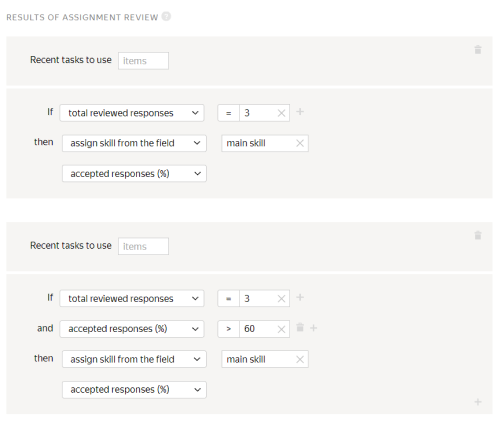

# Adding tasks to a pool



If you are looking for the answer to a specific question, use **Ctrl+F** to search the page (**Cmd+F** on MacOS).




## Uploading tasks {#concept_iy1_3kh_5mb}

#### How many tasks should be in a suite?

The number of tasks depends on how difficult and time-consuming the tasks are. Keep the size reasonably small. Large task suites are unpopular, partly because they are inconvenient for Tolokers (for example, if the internet connection is unstable).

#### What is the right time limit for the task completion?
Try completing the tasks yourself. Ask your colleagues and friends to complete them. Find out average completion time and add 50% to it.
#### How do I know how many tasks a Toloker will see on the page?

You can specify the number of tasks on the page when you upload your tasks to the pool. For more information about distributing tasks across pages, see [this article](../concepts/distribute-tasks-by-pages.md).

#### Why does the preview display all the photos from the tasks file at once?

You must use a separate row for each task in your tasks file. For more information, see [here](../concepts/pool_csv.md).

When you create a pool, the pool will have settings for the number of tasks per suite.

#### The system interprets commas inside my array elements as separators between the array elements. How do I avoid this?

Escape commas with a backslash (`\`).

#### How do I upload the file with the accepted assignments back to Toloka for projects with non-automatic acceptance? Where do I find the format of the upload data?

Use the button **Upload review results** to upload your file. You can see the format [here](../concepts/accept.md).

Assignments are reviewed in the tasks file.

#### How is the data from the "hint" column displayed?

The text from the `hint`field will be shown to the Toloker in a red box at the top of the page if they give a response to the control task that differs from the correct one.

If you need to display the text from the `hint` field in several lines, add hyphens to the file and enclose the text in quotation marks.

#### What do the lines "Add your text here" mean?

"Add your text here" is a hint for you. It means that you can replace the text in the field with your task data. The file structure and how to fill it out is described [here](../concepts/pool_csv.md).

#### Why do double quotes disappear from the output if I try to escape them using quotation marks?

If you have one word enclosed in quotes, format the uploaded assignment like this: `"How many letters are there in the word ""Liechtenstein"""`. If you are escaping quotes inside your text, then the entire text must be enclosed in quotes. For more information, see the [Guide](../concepts/pool_csv.md#string).

#### Why haven't I received assignments since I launched my first project, and all the uploaded assignments are marked as "Training"?

Check the `hint` field. For the general tasks, this field must be empty.

#### How do I create the task file properly so that there are no errors?

In the file with the general tasks, the columns with the `INPUT` headers must be filled out. You can see those headers if you download a sample file from the pool.

If you are creating control tasks, fill out the `GOLDEN` columns with the correct responses.

If you are creating a training task, you also need to fill in the `HINT:text` column. For the general tasks you don't need any columns other than `INPUT`, so feel free to delete them.

You have to use the TSV, XLSX or JSON file format and UTF-8 encoding.

For more information about creating the file, see the [Guide](../concepts/pool_csv.md). If there are errors during the upload, look up the error description on this [page](../concepts/task_upload.md).

#### Why do I see a syntax error when I upload a task where a Toloker has to view an image and write feedback?

The error might occur if the expected input type is URL, but a string is received.

There may be two reasons:
- The input field has the "link" type.
- The pool was created for an outdated project version. It means that the pool was created before you changed the input field type.

#### What is the maximum number of tasks per suite?

It depends on the task. Technically, you can use as many tasks you want.

But Tolokers don't like to take lengthy tasks. They'd rather do 10 tasks that take one minute each than one task that takes 10 minutes.

In addition, if you use a large number of tasks on the page, there might be issues with uploading the files to be labeled. This problem might occur with images.

The third thing to consider is quality control and assignment review. If you allow recompletion of assignments by banned Tolokers, you should split the task into smaller parts so that fewer assignments are recompleted. You are more likely to meet your budget this way.

#### I have a task for photo classification. When there are more than 5 photos on the page, why does Toloka split them across 2 pages?

Toloka will group the uploaded image links in the file into suites depending on the task distribution method you use. For more information, see [Ways to group tasks in suites](../concepts/distribute-tasks-by-pages.md).

#### Does the order of the INPUT field and GOLDEN fields in the file matter?

The order of the fields in the file does not matter. Use your preferred order of fields.

#### How do I add multiple "known_solutions" to a training task file?

You can't use the interface to upload the tasks with multiple correct responses to the pool. You can only use the [API]({{ toloka-api-tasks }}) for that.

#### Where is my file added if I upload it to the running pool?

If the **Keep task order** option enabled in the settings of the pool, labeling will start after the previously uploaded tasks. If this option is disabled, we can't guarantee that the tasks are assigned in their sequence order.

#### How do I write an array to the input file?

The array of strings in the input data must be comma-separated. For example: `INPUT:typestext1, text2, text3, text4`

#### How do I properly structure the file used for data upload if the input includes JSON data?

All the values are written to the same column. Make sure to escape quotes. For more information about escaping quotes in JSON format, see the [Guide](../concepts/pool_csv.md#json).

#### If there are no headers for some input columns in the tasks file, are they skipped during import? Will they be skipped if they have headers without the "INPUT:.." prefix?

No. If you try to upload a file with missing headers to the pool, the system issues an upload error. All the INPUT fields required in the specification must be present in the tasks file. There must be no extra fields or columns.

If you don't want to show some data to Tolokers, but you still need this data in the file, create the optional hidden input fields for such data in the project.

#### How do I use a link in the GOLDEN field?

Text in the GOLDEN field must match the control text exactly.

Usually, if you copy site links from the browser, the copied links have the same format. But this is not the case when the link is trimmed or typed manually.

Check the links that you use. There are several ways to unify links:
- Add requirements for the link format in your instructions and hints in your training pool.
- Use RegExp in your JS to trim the received links and write the result to the new output field, and then match the received value against the control value.

#### How do I specify smart mixing settings in the interface when uploading a file?

Smart mixing settings are specified for the file rather than for the pool.

The settings specified during the first file upload are applied to all the files that are uploaded to this pool later on.

#### How do I properly structure the file used for data upload if the input includes JSON data?

All the values are written to the same column. Make sure to escape quotes.

For more information about escaping quotes in JSON format, see the [Guide](../concepts/pool_csv.md).

#### What is the difference between "task" and "task_suite"?

A task means a separate task. A task suite means a page with tasks. The Toloker gets paid for a task suite.

#### Errors when uploading tasks in the pool

#### How do I view the processing log?

To view the processing log, click **More on uploading errors**. The processing log is written in JSON format. Objects inside `result` match the line number of the uploaded file. Lines that were processed with an error have the status `"success": false`.


To work with a large log conveniently, copy it to the text editor.



#### Errors in column headers

If the [column headings](../concepts/pool_csv.md) are incorrect, the whole file is rejected. Otherwise, Toloka specifies the number of tasks with processing errors.

#### Processing errors table

Overview | How to fix
----- | -----
``` "parsing_error_of": "https://tlk.s3.yandex.net/wsdm2020/photos/2d5f63a3184919ce7e3e7068cf93da4b.jpg\t\t", "exception_msg": "the nameMapping array and the sourceList should be the same size (nameMapping length = 1, sourceList size = 3)" ```
**Extra tabs.**<br/><br/>If the uploaded file contains more `\t` column separators after the data or the link than the number of columns set in the [input data](../../glossary.md#input-output-data-ru), you get an error message.<br/><br/>For example, if 1 column is set in the input data, and two more `\t\t` tabs are added in the file after the link, you get 3 columns, 2 of which are excessive. | Remove extra column separators in the above example — both `\t\t` characters.
``` "exception_msg": "the nameMapping array and the sourceList should be the same size (nameMapping length = 4, sourceList size = 6)" ```
**The number of fields in the header and in the row doesn't match.** | Make sure that:<br/><br/>- The number of tabs in the file structure is correct.<br/>- String values with tab characters are enclosed in [quotation marks](../concepts/pool_csv.md#string)`" "`.
``` "code": "VALUE_REQUIRED", "message": "Value must be present and not equal to null" ```
**The value is missing for a required input field.** | Make sure that columns with required input data fields are filled.
``` "code": "INVALID_URL_SYNTAX", "message": "Value must be in valid url format" ```
**Invalid data in a "link" ("url") field.** | Make sure that:<br/>- Links start with the `http://`, `https://` or `www` prefix.
``` "exception_msg": "unexpected end of file while reading quoted column beginning on line 2 and ending on line 4" ```
**Unpaired quotation mark in a string.** | Check that all quotation marks are [escaped](../concepts/pool_csv.md#string).

#### The same task appeared on different pages

The same task may appear on different pages if:

- Dynamic overlap is used (incremental relabeling, IRL). As an example, let's say there were 5 tasks on a page. For 4 of them, responses coincided and the common response was counted as correct. The fifth task was mixed into another set because it didn't get into the final response and it needs to be "reassessed".
- Different tasks have different overlap. Tasks with higher overlap will be additionally shown in sets with the other remaining tasks in the pool.
- If a [quality control rule](../../glossary.md#quality-control-rules-ru) changes a task's overlap, it will appear in a different set.

#### How do I show two different versions of the text to Tolokers?

If you pass texts to the input data, you can upload 2 different tasks to the pool: pass Text 1 in the `INPUT: <input field name>` field of Task 1. In Task 2, use this field to pass Text 2.

If the text is in the HTML block of the task template, then clone the project. To limit a Toloker to doing only one task in your project, use the [Submitted responses](../concepts/submitted-answers.md) rule. You can assign a skill or ban the Toloker after they submit one response.

[Other questions](support.md#help)


## Training-exam-retry {#concept_i2g_kkh_5mb}

#### How do I precede my task with mandatory control questions to check that the Toloker understood my instructions? Would such training or control tasks be similar to the general tasks?

The training and control questions must meet your project specification. However, you can create a separate project with your instructions, survey, and sample videos. Then you can assign a skill to Tolokers based on their responses. You can use this skill to admit Tolokers to the main project.

#### More Tolokers were trained than the training skill shows

The pool shows the total number of Tolokers that completed at least one assignment. A training skill can be lost over time if you set [repeated training](../concepts/train.md) in the pool settings. This setting allows a Toloker to pass the training again after a certain period if the Toloker didn't complete any tasks in associated pools or if there was a large time gap between completing tasks (for example, because of a [ban](../../glossary.md#banned-worker-ru)). The training skill displays the Tolokers who either recently completed training, or regularly complete your tasks so that the skill doesn't expire.

#### What's the difference between the exam pool that I pay for and the main pool?

An exam pool contains only control tasks. Usually it's small, and intended to check how Tolokers have learned to do your tasks after they read the instructions and have completed the training.

Unlike your main pool, you already know the correct responses for every task in this pool. You can set the price to zero. Based on the results of the control tasks, you can assign a skill to Tolokers and then use it in the main pool as a filter. For example, `≥ 80` or `≠ Is missing`. You don't have to create an exam, because the training pool provides enough practice for simple tasks. But many requesters also use exams.

#### Which parameter affects the skill expiration?

Validity period of the training skills is governed by the **Retry after** parameter.

The skill is deleted in the specified number of days if the Toloker:
- Has a skill value lower than in the **Level required** field.
- Didn't complete any tasks linked to the training during this period.
If their skill expires, your Tolokers need to complete the training again.

#### How do I make one parameter mandatory and the other parameters optional in my training task?

In the task file, leave empty control values for the optional output data.

#### How do I know when a particular Toloker got the skill?

1. Go to the Toloker's card.
1. Click the **Profile** tab.
1. Find the required skill in the list and download the history of its changes.

#### Why do I have an infinite number of pages in the training pool?

Tasks have infinite overlap in the training pool. As long as the training pool is open and the training is running, Tolokers can access the tasks. Learn more about [training pools](../concepts/train.md).

#### How do I insert a link in the GOLDEN field?

Text in the GOLDEN field must match the control text exactly.

Usually, if you copy site links from the browser, the copied links have the same format. But this is not the case when the link is trimmed or typed manually.

Check the links that you use. There are several ways to unify links:
- Add requirements for the link format in your instructions and hints in your training pool.
- Use RegExp in your JS to trim the received links and write the result to the new output field, and then match the received value against the control value.

#### If I upload tasks using smart mixing, does it mean that the same file should contain both the control tasks and general tasks, or can I upload them separately?

Smart mixing is set up when you upload tasks to the pool. After creating a pool, click **Upload** and select the method for generating task suites. You can upload them using separate files or one file, arranging them in any order.

#### Can I automatically pause accepting applications for the training pool if the necessary number of Tolokers have been trained and are already doing the tasks?

You can close the pool manually at any time using the interface. However, you can't set the number of Tolokers that should complete the training pool for it to close automatically.

#### How do I check that the Tolokers don't cheat during training?

Training helps Tolokers learn how to complete your task and figure out the instructions.

Based on the training results, you can select Tolokers who did well enough to be added to the main pool.

However, the mere fact that a Toloker completes your training pool successfully doesn't guarantee that they will afterwards demonstrate high quality on your general tasks. Tolokers who show a high level of accuracy during the training could have obtained correct responses from others.

Besides the training, be sure to add quality control rules and [control tasks](../concepts/control.md) to your main pools. This way you can ensure the quality throughout the task performance process.

If the task requires that the Tolokers send free-format responses or data files, use **non-automatic acceptance** to pay for tasks after they are reviewed.

#### Why is only Smart Mixing available in Training?

This is a technical limitation of [training pools](../../glossary.md#training-pool-ru). You can only upload tasks to your training pools this way. If you want to use the **Set manually** option in the training, create the main pool, set the pool type as **Training**, and set the cost to zero.

#### How do I create two active training pools: the first one for practice and the second one to admit the Tolokers to the main pool?

Create the first pool based on the [training pool](../../glossary.md#training-pool-ru) and the second pool based on the main pool with the pool type set to **Exam**. If a pool contains only control and/or training tasks, the price can be set to zero.

In the exam pool, you can create a skill reflecting the exam result and granting admission to the main pool. For example, `If the number of responses is ≥ 10, set the skill value in the <exam skill> as % of correct responses.`

In your exam pool requirements, specify: `<exam skill> <80 or = is missing>`.

In the main pool, set up a filter: `<exam skill> >= 80 and <main skill> >= 70 or = Is missing>`. You can choose the skill values depending on how well the Tolokers perform your task.

#### How do I create a training pool so that the Toloker might fail it but still be admitted to the general task pool?

Create a main pool of the **Training** type. Add only [training tasks](../../glossary.md#training-task-ru_1). To assign a skill, use the **Control tasks** rule. To allow access to the general tasks to Tolokers with any skill level, set up the following filter in the main pool: `<skill> >= 0` or `<skill> ≠ 0`.

However, we don't advise giving access to general tasks to Tolokers who failed training.

#### Do Tolokers have to complete all the tasks in the training pool?

If you enabled incomplete training and specified the number of training pages required, Tolokers don't have to fully complete the training in order to pass. If you didn't make these settings, the Tolokers have to complete all the tasks in the training pool to get a training skill.

#### How do I set up a retry pool for my project?

You can create a retry pool similarly to an exam pool. In the pool settings, select the type **Retry**. In the retry pool filters, specify the upper and lower values of the <main skill> that the Tolokers must get in order to be admitted to the pool.

For example, if the main pool admits Tolokers with a skill of 70 or higher, then you can route the people with a skill between 40 and 69 to the retry pool.

To get a valid "range", enter the skill twice: with an upper and lower value. For example: `<basic skill > <70 and main skill >=40`.
We recommend that you don't make your exam and retry pools too lengthy, because Tolokers don't like to do zero-price tasks. 10-20 tasks is enough, depending on complexity.
#### Is the training considered an active pool when the main pool is closed?

Yes, it is.

#### How do I make the training optional so that Tolokers can decide themselves whether to take it or not?

Training is designed to select Tolokers for the general task. That's why training must be linked to the main pool and become inactive as soon as the main pool closes.

Tolokers take the training to get access to your paid tasks. If the training is optional, there probably won't be very many people who choose to complete it. Technically, "optional" training can be based on a main pool that includes some training tasks.

To show the training separately from other pools, disable **Use project description** and use this field to specify that this is an optional set of training tasks. In the pool settings, select the **Training** type.

#### Can I implement non-automatic acceptance in the training pool?

You can't use non-automatic acceptance in your training pool.

However, you can create a training pool with the **Training** type based on your main pool and enable non-automatic acceptance there.

#### Can I create training for projects where it is not possible to formulate the correct response exactly or review it automatically?

You can't create a training like this, because for the response to be counted as correct it must exactly match the control text.

For projects using free text input or attached files, you can make a pre-selection task with non-automatic acceptance. You can admit good Tolokers to your main pool based on their skill.

#### How do I create an exam with a preset number of correct responses?

To do this, under **Test result**, go to **Recent tasks to use** and specify the number of recent responses from the Toloker.

Let's say you need to create an exam with three tasks, one task per suite. If the Toloker succeeds in two out of three tasks, they get the skill.

If your task uses assignment review (non-automatic acceptance), to set up such a rule you need to specify 3 for "Total reviewed responses". As you can see in the screenshot, in the first case, all the Tolokers who completed 3 assignments and whose answers are reviewed will get the skill. In the second case, only those who have 2 or 3 assignments accepted will get the skill.



#### How do I create a training and honey pots with an exam to get an output response other than the control value?

For a control or training assignment to be counted as correct, it must exactly match the control assignment. To do this, you need to normalize the response text using JavaScript: remove spaces, punctuation marks, special characters, and capital letters, and write the result in a separate output field. Now you can match the processed assignment text against your control text.

Another option for selecting Tolokers for a project of this type is assignment review (non-automatic acceptance).

#### How do I create a file with training tasks?

For training tasks, you need to:
- Select the correct responses in the `GOLDEN:result` column.
- Fill in the `HINT:text` column. It stores a hint to be shown if the Toloker selects an incorrect response option.

[Other questions](support.md#help)


## Changing a running pool {#concept_olz_kkh_5mb}

#### If I change the time allocated for one task, will this apply to tasks assigned earlier?

If you change the time allocated for a task, the time value will apply to the tasks that have not yet been taken by the Tolokers. The same applies to the case when you close the pool. A Toloker who has an assignment in the active status can complete the assignment.

#### How do I edit or delete tasks uploaded to the pool?

If you uploaded tasks to the pool using "smart mixing", you can stop the pool and mark up your tasks: edit answers, hints, or delete tasks.

If you uploaded them using a different method, clone your pool and upload the new file with the corrected list of data to be labeled.

#### I uploaded two files to the training pool. How do I delete one of them?

After uploading, all tasks are put into one list and can't be deleted separately.

- **If the pool hasn't started yet**, delete all tasks. To do this, click **Delete** in the **Pool tasks** block. Then upload one file to the pool.
- **If the pool already started**, delete tasks [one-by-one in markup mode](../concepts/task-markup-by-yourself.md#delete-task).

[Other questions](support.md#help)


