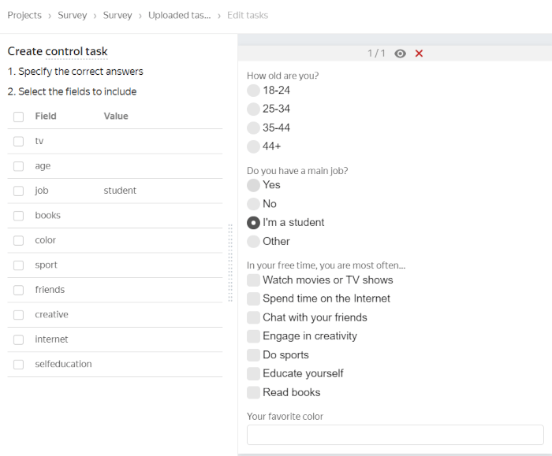

# Setting up a pool



If you are looking for the answer to a specific question, use **Ctrl+F** to search the page (**Cmd+F** on MacOS).



## Filters {#filters}



Yes, you can do that. In the [filters](../concepts/filters.md), select **Profile → City**. Please note that the profile data is entered by the Toloker when they register in Toloka. We recommended that you use the filters **Region by phone number** and **Region by IP**.





Yes, of course — you can use the same skill for different projects. But most often, a skill is intended for a specific project. If the Toloker completes a certain task well, this doesn't mean that they will complete other ones successfully. Another disadvantage is that if you filter by skills that were set long ago, you will artificially limit the number of available Tolokers.





If you mean multiple different projects, you can't do that.

You can merge all the projects into one and use **History size** in the quality control rules. See examples in the [Control tasks](../concepts/goldenset.md) post.

You can use **Aggregation by skill**, but you'll need to list all the possible values, which is probably not the best choice. Perhaps you'll find [another method of aggregation](../concepts/result-aggregation.md) helpful.





Toloka lets you know that something is wrong with the project. The blank screen often appears when there are errors in the [task interface](../../glossary.md#task-interface), including the JavaScript code. The **Next** button may be disabled if the output specification lacks some field or contains invalid values, or if, for example, you configured validation for a nonexistent field in JavaScript.





In the main Toloka version, you can only assign a skill to Tolokers who have completed at least one of your tasks. There is no option to assign a skill to an arbitrary user. To limit the audience of users who will see your project, use [filters](../concepts/filters.md). For example, specify the city, date of birth, gender, or some other parameters of your target Tolokers.





Tasks from an open pool are available to every Toloker that matches your pool [filters](../concepts/filters.md). You can restrict access, like by using a skill.





The validity period of the training skills is controlled by the **Retry after** parameter. The skill is deleted after a period specified in days in the **Retry after** field, if the Toloker:

- Has a skill value lower than the one specified in the **Level required** field.

- Didn't complete any tasks linked to training during this period.

Your Tolokers will need to be trained again.





Tasks in pools are automatically available in the web version of Toloka and the mobile app. Check the pool settings. You might have the `Client = Toloka web version`[filter](../concepts/filters.md) on.





If the user mismatches your preset filter, they can't see the task. You can only remove the restricting filter from the pool. You can test the task in the [Sandbox](../concepts/sandbox.md) by adding the desired user to your trusted list.





You can do that. To select Tolokers for the pool, use [filters](../concepts/filters.md).





Tasks in pools are automatically available in the web version of Toloka and the mobile app. Check the pool settings. You might have the `Client = Mobile Toloka`[filter](../concepts/filters.md) on.





You can assign a skill to these Tolokers based on their performance in the previous pools. Use this skill as a [filter](../concepts/filters.md) in the new pool.





Specify this skill as a [filter](../concepts/filters.md), but leave the value field empty (this is equivalent to absence of the skill).





If the Toloker already has a given skill, you can't add the same skill to them from the task review interface. You can open the Toloker's profile and edit the skill value.





If it's a public or training skill, they see it and they get a message about it.





There is no such option. If the skill is public, the Toloker sees it in their profile.





Requesters can't see the full details about specific Tolokers. So you can't see information like the date of birth, gender, last name, or first name. However, you can use filters by date of birth and gender (in the pool settings). This way you can select a group of Tolokers without accessing the personal information of individual Tolokers. This decreases the risk of user de-anonymization.





You can do that using the [Control tasks](../concepts/goldenset.md) rule.

1. Upload the task file using **Smart mixing**.

1. Specify `student` as the correct answer to the question. Don't take other questions into account (leave the fields empty or unselected).

1. Add the [Control tasks](../concepts/goldenset.md) rule to the pool: `if the percentage of correct control answers = 100, then set the skill value Student = 1`.







[Other questions](support.md#help)

## Quality control {#quality-control}



The settings for [quality control](../../glossary.md#quality-control) rules depend on the type of tasks. General recommendations:

- Always use one or more ways to control quality of answers.

- Counting [fast responses](../concepts/quick-answers.md) makes sense for most tasks.

- If the Toloker has to choose between options (for example, by selecting checkboxes), check the answers using [majority vote](../concepts/mvote.md) or [control tasks](../concepts/goldenset.md).

- If the Toloker has to provide a response as a text or link or upload a photo, the best way to control quality is by [reviewing assignments](../concepts/accept.md). You can outsource task acceptance to Tolokers. Create a task with a question (for example, “Is this phrase translated correctly?”) and possible responses (for example, “yes”/“no”). Set up [overlap](../concepts/dynamic-overlap.md) and [majority vote](../concepts/mvote.md) check.

- If a task is more like an opinion poll (for example, choosing nice pictures from a set), [majority vote](../../glossary.md#majority-vote) is not a good way to control quality. Make [control tasks](../../glossary.md#control-task) with artificial examples where the choice is evident.





We recommend adding at least 1% of control tasks in the pool. And for small pools — 5–10%.



Each control task is shown to the Toloker only once. If you use smart mixing, you determine how many control tasks should be in a suite. If each suite contains one control task, then the maximum number of suites the Toloker can complete is equal to the number of control tasks in the pool. If you increase the number of control tasks in a suite, the number of suites available to the Toloker decreases by the same number.

There shouldn't be too few pages available. Otherwise:

- You won't be able to correctly evaluate the quality of the Toloker's responses.

- The Toloker won't be interested in completing such tasks because they'll spend a lot of time studying instructions but won't earn much.



#### A large pool with 1% of control tasks (good)

There are 10,000 tasks in the pool, and 100 of them are control tasks (1%). Each suite contains 10 tasks, and 1 of them is a control task. Hence, a user can complete up to 100 suites.

#### A small pool with 1% control tasks (bad)

There are 100 tasks in the pool, and 1 of them is a control task (1%). Each suite contains 10 tasks, and 1 of them is a control task. Hence, each user can only complete 1 suite.

#### A small pool with 10% control tasks (good)

There are 100 tasks in the pool, and 10 of them are control tasks (10%). Each suite contains 10 tasks, and 1 of them is a control task. Hence, each user can complete up to 100 suites





If there are few control tasks in the open pool, [add new control tasks](pool-setup.md#add-gs).



In a large pool with few control tasks, a situation might occur when users who have completed a lot of tasks in the project stop getting new task suites. This happens when the Toloker completes all control tasks in the pool.





To filter out Tolokers, use the [Control tasks](../concepts/control.md) quality control rule. To rank Tolokers by the quality of responses in control tasks, use a [skill](../concepts/nav.md).







To make new task suites available to all users, including those who have already completed tasks in this pool:

1. Stop the pool.

1. [Upload the file](../concepts/task_upload.md) with new control tasks.

1. Start the pool.

For open pools, we don't recommend creating control tasks from other types of tasks that have already been completed. This is because users who have already given their responses to them won't be able to re-complete such tasks as control tasks. In order for these users to continue completing task suites, the control tasks in the pool must be new.





The Control tasks rule starts working after the Toloker completes the number of control tasks you specified. If your pool contains both [training](../../glossary.md#training-task) and control tasks, you can take into account the responses in both of them (the **Number of responses** parameter) or only in control tasks (the **Number of control responses** parameter).

As soon as the needed number of responses is collected, Toloka calculates the percentage of correct and incorrect responses and performs an action (assigns a skill, or blocks the Toloker in the pool or in the project). Then this percentage is updated as the tasks are completed by the Toloker. The number of the Toloker's recent responses that's used in the calculation is set in the **Recent control task responses to use** field. If you leave it empty, all the responses from the Toloker in the pool are counted.





It is better to use one [skill](../../glossary.md#skill) in a project. You can choose the way to calculate the skill:

- Calculate the skill for each pool separately. The current skill value is the value of the skill in the pool the Toloker completed last. This option is convenient if:

    - The pools are intended for different groups of Tolokers (for example, there are filters by city or country).

    - Pools are started one by one and you don't want to take into account the responses in the previous pools to calculate the skill in the current pool.

    This calculation method is used by default when adding a quality control rule to a pool. For the control tasks block, leave the **Recent control task responses to use** field empty.

- Calculate skill based on all tasks in a project This option is good if the pools are small and you don't need to have skill calculated for each pool.

    This option is available only for skills on control tasks. To use it, fill in the **Recent control task responses to use** field in pool quality control rules.





Your [training](../concepts/train.md) and control tasks have the same project specification. However, you can create a separate project with the tasks and assign a skill based on user responses. Then you can admit Tolokers to the main project based on their skill.





An exam pool contains only control tasks. It's usually small and used for checking how well users learned to do your tasks after they read the instructions and completed the [training](../concepts/additionals-q.md#selection). Unlike your main pool, you already know the correct responses for every task in this pool. You can set the price to zero.

Based on the results of responses to control tasks, you can assign a skill to the Tolokers and then specify it in the main pool as a filter. For example, `MySkill = 80 or = Is missing`. You don't have to create an exam. For simple tasks, the training pool provides enough practice, but many requesters also use exams.





Yes, the [fast response](../concepts/quick-answers.md) settings specify the time per task suite.





Yes. When you copy the filter and quality control settings, the settings you previously added manually are overwritten. You should see a warning about this in the copy settings window.





Yes, unfortunately, this can happen. This is why we recommend that you offer a training task or exam before the general task. In this case, only those people who showed good performance at the previous stage are selected for the main pool.





When you load tasks, use smart mixing. In this case, you'll have infinite overlap in your exam.

However, this poses the risk that you might spend a lot of money on the exam. You might want to open this pool only when the main pool opens, and close it when labeling of the main pool ends.





You can add a [training pool](../concepts/train.md) to test your Tolokers. Based on the test results, assign skills to the Tolokers for the tasks they do best.

Then open your pools only to the Tolokers that have a certain skill: use [filters](../concepts/filters.md) for this.





Smart mixing is set up when you upload tasks to the pool. After creating a pool, click **Upload** and select the method for generating task suites. You can upload them using separate files or one file, arranging them in any order.





If the Toloker already got paid for the tasks, the money can't be refunded to you.





Yes, if they can access both pools, they can do both of them. To restrict access to subsequent tasks for a Toloker, use the [Completed tasks](../concepts/submitted-answers.md) rule and select a ban at the project level.





No. The responses of these Tolokers aren't automatically excluded from the final results file.

But you can do it yourself if you want. When downloading the results, select the option **Exclude assignments by banned users** to delete the responses of Tolokers who were banned at the moment of downloading. You can also forward all the assignments from banned users to other Tolokers using the [Re-completion of assignments from banned users](../concepts/restore-task-overlap.md) rule.





Yes, you can do that. In this case, create the first pool based on the [training pool](../../glossary.md#training-pool) and the exam pool based on your main pool. If a pool contains only control and/or training tasks, the price can be set to zero.

In the exam pool, you can create a skill reflecting the exam result and granting admission to the main pool. For example, `if the number of responses is ≥ 10, set the skill value in the <exam skill> as % of correct responses`. In your exam pool user requirements, specify: `<exam skill> < 80 or = Is missing>`. In the main pool, set up a filter: `<exam skill> >= 80 and (<main skill> >= 70 or = Is missing)`. You can choose the skill values depending on how well the Tolokers handle your task.





All responses to the task are taken into account. If one response differs from the majority vote, the whole task is counted as mismatching the responses of other Tolokers.





No, this is incorrect. With these settings, each time a rule condition is met, the Toloker gets `skill = 1`. To change the skill value in the process of task review, you need a “multi-step” rule, which has multiple identical rules with different values of **Total reviewed responses**.





Technically, if you have only one task in your training pool, you don't have this option. The skill will be either `0` or `100`. We recommend that you add several tasks, or at least 2 so that the Toloker will practice on the first task and will be able to do the second task correctly. In this case, you can admit users to your main pool starting from the skill value of `50`.

You can also create a training pool based on the main pool. Assign a skill using the [Control tasks](../concepts/goldenset.md) rule: in this case, you can admit users with any skill level to your main pool, even if the value is zero. But we don't advise giving tasks to people who failed training.





No. But you can create a pool of the **Training** type based on your main pool and enable manual review there.





No, they can't.





If you pass texts to the input data, you can load 2 different tasks in the pool. In one task, pass Text 1 in the `INPUT: <input field name>` field, and in the other task, use this field to pass Text 2. But if the text is in the HTML block of the task template, you need to clone the project. To let a Toloker do only one task in your project, use the [Submitted responses](../concepts/submitted-answers.md) rule. You can assign a skill or ban the Toloker after they submit one response.





No, the Tolokers are unaware of the ban.





The tasks themselves are not exported, only the project configuration and the settings of the selected pool. However, you can download your marked up tasks from the **Sandbox** pool and import them to the pool you created. To download the control tasks only (if you marked them up in the interface), go to **Mark up**, then click **Control tasks** and **Download**.





The **Recent control task responses to use** field is for the number of recent responses from the Toloker. If you use manual review for your task, then to set up your intended rule you need to specify `3` in **Total reviewed responses**.





To perform actions with users (assign a skill or ban them) based on the majority vote, add a relevant [rule](../concepts/mvote.md) to the pool.

Don't forget to enable **Keep task order** in the pool parameters. Majority vote is used in the projects with preset options (radio buttons or checkboxes). This rule won't apply to the text entry or file upload fields.





For a control or training assignment to be counted as correct, it must exactly match the control assignment. To do this, you need to normalize the response text using JavaScript: remove spaces, punctuation marks, special characters, and capital letters, and write the result in a separate output field. Now you can match the processed assignment text against your control text.

Another option for selecting Tolokers for a project of this type is manual review.





This is the total number of responses to the control questions.





You can create a task pool for all your Tolokers and create Toloker skills in it. In this case, you can open your tasks only to the Tolokers with the necessary skills.





Possible reasons:

- You've stopped the [main pool](../../glossary.md#training-pool). This could limit the number of Tolokers with access to the pool. Start the training pool again. There will be more Tolokers who can access the tasks.

- The filters you set are too strict. For example, a strong restriction on a certain skill that most users don't have.

- Too many users are banned. Ease the quality control rules.





- To motivate Tolokers, assign a [public skill](../concepts/nav-create.md#public) and use [dynamic pricing](../concepts/dynamic-pricing.md).

- Try to [increase the project rating](../concepts/project_rating_stat.md), so that your task is higher in the list of tasks for Tolokers.

- Adjust the [quality-speed ratio](../concepts/adjust.md).

- Set a higher [priority](../concepts/pool_poolparams.md#priority) for the pool among other project pools.



[Other questions](support.md#help)

## Overlap {#overlap}



Overlap defines how many Tolokers complete the same pool task.

The best overlap is an overlap that provides satisfying quality of results. For most tasks that are not [reviewed](../../glossary.md#assignment-review), overlap from “3” to “5” is enough. If the tasks are simple, overlap of “3” is likely to be enough. For tasks that are reviewed, set overlap to “1”.





Yes. [Open edit mode for the pool](../concepts/pool-edit.md) and set a new overlap value. You don't need to restart the pool. Updating the settings is usually fast, but if there are many tasks, it may take several minutes.





Yes, this might happen. You must set an adequate pool closing interval.





In this case, if you don't have 3 identical responses for your task (response threshold), no user would be considered a good or poor Toloker, because the system can't see which of the Tolokers made an error.

But if you set `response threshold = 2` with `overlap = 3`, then two users with the same responses are considered good Tolokers, but the third user, who gives a different response, is a poor Toloker.





Yes, you can do that. Set up [dynamic overlap](../concepts/dynamic-overlap.md) (incremental relabeling, IRL).





You can use overlap to let multiple Tolokers do the same task. The overlap value is set up in the [pool settings](../concepts/pool-edit.md).





The progress bar shows the number of task suites including the overlap. If the overlap is greater than one, the number of task suites is different from the total number of tasks.



[Other questions](support.md#help)

