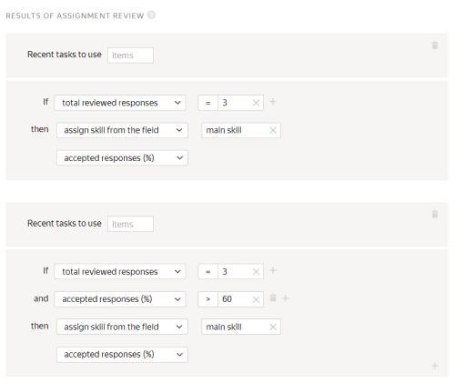

# All questions on one page



If you are looking for the answer to a specific question, use **Ctrl+F** to search the page (**Cmd+F** on MacOS).



#### If you aren't using Toloka yet and need advice

[Ask a question](support.md#new)

#### If you have a problem working with Toloka

In the section contents, select the stage where you encountered the problem and find the appropriate solution in the list. If not found, select the last item **Other questions**, fill out the form and wait for a response from the support team.

## Registration and getting started {#register-and-start}



1. Check the number you entered. You might have mistyped it.

1. Check the number in Yandex ID. It must be set as your main number. If a different number is specified in Yandex ID, an SMS code will be sent to that number.

You can also use the recommendations in [Yandex ID Help]({{ phone-problems_no-code }}). If this doesn't help, contact [support]({{ passport-support }}).





You can't change the account type from “Requester” to “Toloker”.

If you want to complete tasks, you need to register in Toloka once again, with a different username, but as a Toloker.

To create a Toloker account:

1. Log out of your requester account.

1. Go to the [Toloka]({{ toloka-index }}) home page.

1. Click **Join**.

1. Follow the system instructions.



You can use the same phone number to create a new account. For a step-by-step description of the registration process, see [Registration and login]({{ user-documentation }}).







If you see this warning, make sure you entered the phone number correctly.

Please note that you can only have one requester account per phone number (see the [User Agreement]({{ useragreement }})).

If your [Yandex ID]({{ phones }}) is linked to the wrong number, change it. For more information about linking a phone number, see [Yandex ID Help]({{ authorization-phone }}).

If you don't remember your credentials in Toloka, use [Restoring access]({{ restore }}).

If you deleted your Toloka account, create a new Yandex ID and register in Toloka.





To change your phone number, go to [Yandex ID]({{ phones }}) and change your main number.



If you don't have access to the old number, it takes a month to replace it. For more information about changing the phone number, see [Yandex ID Help]({{ change-phone }}).





[Other questions](support.md#help)

## Sandbox {#sandbox}



[Register]({{ sandbox }}) as a requester in the sandbox.

[Register]({{ sandbox-for-performers }}) as a Toloker using another account.

In your requester account, add your Toloker account to your trusted list.

Create and run a task. It will appear in the list of tasks for your trusted users. For more information, see [Help](../concepts/sandbox.md).





Make sure that:

1. The [pool](../../glossary.md#pool) is started.

1. The Toloker is added as a trusted user.

1. The trusted user is registered in the sandbox as a Toloker.

1. The trusted user didn't use social networks when registering.

1. Your trusted Toloker matches the [filters](../../glossary.md#filters) you set.





To test your task, add yourself as a trusted Toloker in the Sandbox. To do this, on the **Tolokers** page, click **Add trusted users**. Enter the username for the Toloker's account (case-sensitive).





#### Try exporting the project without pools.

Select an exported project and don't select pools in the window that opens.Click **Export**.

#### If the error persists, refresh the token.

Go to [ Yandex ID]({{ passport-profile }}).Under **Sign in and device history**, click **Log out from all devices**.Request new tokens in the Sandbox and main environment.Update the token in the [Sandbox]({{ sandbox-profile-integration }})**Profile **.





To do this, you will need a Sandbox version of the Toloka app. [Write to support](support.md#support-work-toloka) to get it.





You won't be able to update a previously exported project. If you clone a project from the sandbox again, its current copy is added. The old project doesn't change.





Use your requester account to preview the pool and check whether it's possible to submit a task. If this fails, most likely there is an error in your project.





The tasks themselves are not exported, only the project configuration and the settings of the selected pool. You can download the completed tasks from the pool in the Sandbox and import them to the exported pool.

To download only the control tasks (if you completed them in the interface), go to **Mark up**, then click **Control tasks** and **Download**.





No, you need a separate account for each version of Toloka. To create a task in the [Sandbox](../../glossary.md#sandbox), [register](../concepts/access.md) in it as a requester. To complete your own task, register another account for yourself as a Toloker.





Possible reasons:

- The Toloker isn't registered in the sandbox. The account you registered in the Toloka production version won't work. Make sure you have specified the correct _Toloker's_ account as a trusted one.

- The Toloker's account is authorized via social networks.[Register]({{ register }}) a new user in Yandex.



[Other questions](support.md#feedback_oyr_m5s_hlb)

## Setting up a project {#project}

### Instructions {#instruction}



There are three options:

- Put your instructions inside the task, but make sure that it doesn't clutter the interface.

- Use [a side window]({{ instr-in-form-of-side-window }}) for your instructions so that the Toloker can quickly expand or collapse them.

- [Hide the instructions in an expandable section]({{ hints-questions }}) or add hints for the individual interface elements.

For best results, we recommend that you pre-select the Tolokers that meet your requirements and set up the quality control rules.





No, but you can add links to them.





You can't use unsupported tags because they are deleted when you save the project. [List of supported tags](../concepts/instruction.md#html).





By default, the project instructions are displayed in the training pool. To use separate instructions for the training pool, deselect **Use project instructions**. Don't forget to update the training instructions if you change something in the general task instructions.





If the tags or attributes disappear after you save the instructions (for example, `checked="true"`), it means that they are not supported. For the full list of tags that can be used in the instructions, see the [Guide](../concepts/instruction.md#html-yes).



[Other questions](support.md#help)

### Configuring the task interface {#concept_gss_fkp_smb}



To the component that inserts the image, add the parameters: `real-size=true` and `screenshot=true`.





To create a shortcut, add the following action to the "onKey" method:

```javascript
onKey: function(key) {
          var el = this.getDOMElement().querySelector(".image-annotation-editor__shape-polygon");

          if (key === 'D') {
          el.click();
          el.classList.add('image-annotation-editor__shape_active')
          }
```

If you need to further modify the area-selection editor, use [this library](https://github.com/vmit/image-annotation).





You can't check loading of audio files in the preview mode, but you can do it in the sandbox if you do your task. To do this, register in the sandbox as a Toloker and add the Toloker username to your trusted list on the **Tolokers** page. For more information, see [this post](../concepts/sandbox.md).





If none of the Tolokers can submit the assignment, the most likely reason is JS validation. Run JS validation again.

Export your project to the sandbox and try to complete the task in the sandbox yourself.





To check the task's look-and-feel on the mobile phone screen, enable the emulation mode in Chrome or Safari and edit the CSS block.

You can also use the mobile version of the sandbox. Write to support to get access to it.





Use [concatenation](../concepts/t-components/helpers.md#concat), for example:

```html
{{field type="checkbox" name=(concat "result." @index ) label=(concat "checkbox –
          " @index) size="L"}}
```





Try to disable extensions in your browser. They might block iframe loading.





To pass a `label` in the input data, enter the input field name into the label.

For example, if you have the `asd` input field with the string type, the component would look like: `{{field type="checkbox" name="like" label=asd hotkey="q"}}`.

If you want to pass different label values in different tasks or the number of checkboxes may differ, use [concatenation](../concepts/t-components/helpers.md#concat).





You can hide text in an expandable section by using CSS styles, both in the task itself and in the instructions. You can see the sample code [here]({{ text-under-the-cut }}).





Specify the name of the input field where you pass the link, without the brackets:



```html
{{field type="button-clicked" name="ads" label="Click me" href=name_escape
          action=true}}
```







1. See how this is implemented in the “[Mining business contacts](../tutorials/internet-search.md)” template.

1. To solve the second problem, you can add another validation like this:

    

    ```javascript
    if (solution.output_values.url && solution.output_values.check) {return {task_id:
    this.getTask().id,errors: {'url': {code: ''Insert a link or check the box if the site doesn't exist'}}}}
    ```

    





The names of the output fields must differ: each checkbox must have its own unique name. For more information about this component, see [here](../concepts/t-components/checkboxes.md).





You can use JavaScript to add assignment validation depending on the checkbox. An example is provided in the “Search for information online” template.





You can see an example in the comments for this [project]({{ how-to-insert-a-calendar }}). The example includes the output data format and libraries to be added.

To add libraries:

1. Click the “gear button” in project editing mode.

1. In the field that opens on the left, enter the links and press **Enter**.





The issue is probably in the JS block. Try deleting its content, then test the **Submit** button in the preview mode.





You can do this using [concatenation](../concepts/t-components/helpers.md#concat).

See the sample projects that can help you build an interface:

- [with checkboxes]({{ project-with-checkboxes }})

- [with a dropdown list]({{ project-with-drop-down-list }})

- [with radio buttons]({{ project-with-radiobutton }})

If you pass an array of values to the input field, use commas to separate the array elements. A response option will be generated for each of them in the interface. Input/output data for the sample projects are provided in the comments at codepen.io.





You can't deselect a radio button. You can only select another radio button as a different response option.





In this case, you need to leave the field optional in the output data and set up validation depending on the Toloker response. You can see how this is implemented in the “Text classification” template.





Add `sources="CAMERA"` to the attributes of the image loading component. This disables adding photos from the gallery.





Try to add a condition to check for the second progress bar:

```javascript
setSolution: function(solution) {
var secondScale = this.getDOMElement().querySelector('.second-scale');

if(secondScale) {
secondScale.style.display = solution.output_values.grammar === 'no' ? 'block' : 'none';
}

TolokaHandlebarsTask.prototype.setSolution.call(this, solution);
},
```





You can create a selection and drop-down list with category selection. See how it is implemented on [this page](../concepts/t-components/image-annotation.md) (**Dropdown list** tab).





Learn more about the template's JS extension [here](../concepts/spec-advanced.md).

To avoid conflict between the Vue markup and the Handlebars syntax, disable the "toloka-handlebars-templates" library and inherit from the Task/TaskSuite classes.





The “Side-by-side image comparison” template uses a component rather than an HTML tag. This means that you should enclose your proxy in curly brackets like this [example](../concepts/t-components/img.md): `{{img src=(proxy image)}}`.





Use CSS to specify the color for the `.task` or `.task-suite` element. For example, to use a black background:

```css
.task-suite {
background-color: #000000;
}
.task {
background-color: #000000;
}
```

You can also assign a class to the interface block with the image and set the background for this block only.





You can check the link format using regular expressions. To do this, add the link validation JavaScript code with `regexp` to the task template.

For example: `var regexp = /^(https://www.myurl.com/).{4,200}$/`.

You can also add a regular expression to the `input` field with the **string** type in the output data. Make the field mandatory. Then add the **Text input field** field in the task interface (in the HTML block) and specify the field name in the `name` attribute:

```html
{{field type="textarea" name="input" width="270px" rows=5}}
```





You can use JavaScript to add assignment validation depending on a checkbox. An example is provided in the “Search for information online” template.





Pass an array of strings as the input field. For example, as shown in the screenshot: 

In HTML, use a special handlebar to iterate over this field. The code structure will look like this:

```html
{{#each words}}
{{field type="radio" name="result" value=this label=this}}
{{/each}}
```





In the HTML code of the template, enter the following:

```html
<input type=""range"" list=""rng"" class=""res"">
```

and include the following in onRender in your JS:

```javascript
onRender: function() {
// Generated DOM element for the task (available via #getDOMElement())
//Adding auxiliary variables
var $root = $(this.getDOMElement());
var _this = this;
var solution = TolokaHandlebarsTask.prototype.getSolution.apply(this, arguments);

$root.on('change', '.res', function(){
var range_result = $(this).val()
_this.setSolutionOutputValue('result', range_result);

return solution;
})

}
```







You can't expand the HTML window. To expand the JS and CSS fields, click any area within the field.





Enclose the input field in double curly brackets `not_var{{text}}`.





Enclose the input field in triple curly brackets `{not_var{{input_field}}}`.

More information about [using the component](../concepts/t-components/html.md).





You don't have to use our components for task interfaces. Feel free to create a custom design for your tasks. To do this, delete the library from the project template:

- Click the “gear button” to open the settings.

- Delete `$TOLOKA_ASSETS/js/toloka-handlebars-templates.js`.

See the [documentation](../concepts/spec-advanced.md) for descriptions of the structure of classes and how they work.





To change the number of output fields dynamically, use the recommendations from [this page](../concepts/t-components/helpers.md).





We didn't intend this window for any sophisticated development. Usually, the content is prepared in a third-party prettified editor, and the resulting code is pasted to the window prior to the update.

However, in the context of TolokaHandlebars editability, there are no differences between our window and a third-party editor.





To display the text in the input field with HTML tags, use the `<pre>` tag. For example:`<pre>not_var{{text}}</pre>`.

In this case, the text is rendered as is, in one scrollable line. To remove the scroll and avoid stretching the task card, add the following CSS to the block:

```css
.task {
  max-width: 800px;
}

pre {
  white-space: pre-wrap;
}
```





There are four options:

- [ Decompose the task](../concepts/solution-architecture.md): First select images with the items you need, then select areas in them.

- Select an arbitrary area in the image. For example, put a square in the upper-right corner.

    Mention this in your instructions for reviewers.

- Ask the Toloker to skip the task and report it in a personal message. Messages are reviewed by the requester. If the selectable object is missing, the task is deleted from the pool (by resetting the overlap).

- Add the “No object” checkbox to the interface and make sure that your JS checks that either the object is selected or the checkbox is selected.

    For control purposes, add information about the value of this checkbox to the task interface.

[Other questions](support.md#help)



### Input and output data {#concept_cjj_gkp_smb}



You can find an example of the task template for selecting image groups at this [link]({{ selection-of-images-groups }}). The input and output data, as well as a fragment of the instructions, are in the comments to the project.





To validate the input data format, you can use the output field type, specifying the acceptable or minimum/maximum values. For example, create an output field for the taxpayer number with the "string" type and enter its minimum and maximum length (like 10 and 12). To use a more sophisticated validation in the template, use RegExp.

To enter a date, you can add a calendar to the task interface. See an [example of a calendar]({{ how-to-insert-a-calendar }}).





You can use different image sizes.





You can't use a range as a fixed value.



[Other questions](support.md#help)

## Setting up a pool {#pool-settings}

### Filters {#filters}



Yes, you can do that. In the [filters](../concepts/filters.md), select **Profile → City**. Please note that the profile data is entered by the Toloker when they register in Toloka. We recommended that you use the filters **Region by phone number** and **Region by IP**.





Yes, of course — you can use the same skill for different projects. But most often, a skill is intended for a specific project. If the Toloker completes a certain task well, this doesn't mean that they will complete other ones successfully. Another disadvantage is that if you filter by skills that were set long ago, you will artificially limit the number of available Tolokers.





If you mean multiple different projects, you can't do that.

You can merge all the projects into one and use **History size** in the quality control rules. See examples in the [Control tasks](../concepts/goldenset.md) post.

You can use **Aggregation by skill**, but you'll need to list all the possible values, which is probably not the best choice. Perhaps you'll find [another method of aggregation](../concepts/result-aggregation.md) helpful.





Toloka lets you know that something is wrong with the project. The blank screen often appears when there are errors in the [task interface](../../glossary.md#task-interface), including the JavaScript code. The **Next** button may be disabled if the output specification lacks some field or contains invalid values, or if, for example, you configured validation for a nonexistent field in JavaScript.





In the main Toloka version, you can only assign a skill to users who have completed at least one of your tasks. There is no option to assign a skill to an arbitrary user. To limit the audience of users who will see your project, use [filters](../concepts/filters.md). For example, specify the city, date of birth, gender, or some other parameters of your target Tolokers.





Tasks from an open pool are available to every user that matches your pool [filters](../concepts/filters.md). You can restrict access, like by using a skill.





The validity period of the training skills is controlled by the **Retry after** parameter. The skill is deleted after a period specified in days in the **Retry after** field, if the Toloker:

- Has a skill value lower than the one specified in the **Level required** field.

- Didn't complete any tasks linked to training during this period.

Your users will need to be trained again.





Tasks in pools are automatically available in the web version of Toloka and the mobile app. Check the pool settings. You might have the `Client = Toloka web version`[filter](../concepts/filters.md) on.





If the Toloker mismatches your preset filter, they can't see the task. You can only remove the restricting filter from the pool. You can test the task in the [Sandbox](../concepts/sandbox.md) by adding the desired user to your trusted list.





You can do that. To select Tolokers for the pool, use [filters](../concepts/filters.md).





Tasks in pools are automatically available in the web version of Toloka and the mobile app. Check the pool settings. You might have the `Client = Mobile Toloka`[filter](../concepts/filters.md) on.





You can assign a skill to these people based on their performance in the previous pools. Use this skill as a [filter](../concepts/filters.md) in the new pool.





Specify this skill as a [filter](../concepts/filters.md), but leave the value field empty (this is equivalent to absence of the skill).





If the Toloker already has a given skill, you can't add the same skill to them from the task review interface. You can open the Toloker's profile and edit the skill value.





If it's a public or training skill, they see it and they get a message about it.





There is no such option. If the skill is public, the Toloker sees it in their profile.





Requesters can't see the full details about specific Tolokers. So you can't see information like the date of birth, gender, last name, or first name. However, you can use filters by date of birth and gender (in the pool settings). This way you can select a group of Tolokers without accessing the personal information of individual Tolokers. This decreases the risk of user de-anonymization.





You can do that using the [Control tasks](../concepts/goldenset.md) rule.

1. Upload the task file using **Smart mixing**.

1. Specify `student` as the correct answer to the question. Don't take other questions into account (leave the fields empty or unselected).

1. Add the [Control tasks](../concepts/goldenset.md) rule to the pool: `if the percentage of correct control answers = 100, then set the skill value Student = 1`.








[Other questions](support.md#help)

### Quality control {#quality-control}



The settings for [quality control](../../glossary.md#quality-control) rules depend on the type of tasks. General recommendations:

- Always use one or more ways to control quality of answers.

- Counting [fast responses](../concepts/quick-answers.md) makes sense for most tasks.

- If the Toloker has to choose between options (for example, by selecting checkboxes), check the answers using [majority vote](../concepts/mvote.md) or [control tasks](../concepts/goldenset.md).

- If the Toloker has to provide a response as a text or link or upload a photo, the best way to control quality is by [reviewing assignments](../concepts/accept.md). You can outsource task acceptance to Tolokers. Create a task with a question (for example, “Is this phrase translated correctly?”) and possible responses (for example, “yes”/“no”). Set up [overlap](../concepts/dynamic-overlap.md) and [majority vote](../concepts/mvote.md) check.

- If a task is more like an opinion poll (for example, choosing nice pictures from a set), [majority vote](../../glossary.md#majority-vote) is not a good way to control quality. Make [control tasks](../../glossary.md#control-task) with artificial examples where the choice is evident.





We recommend adding at least 1% of control tasks in the pool. And for small pools — 5–10%.



Each control task is shown to the Toloker only once. If you use smart mixing, you determine how many control tasks should be in a [task suite](../../glossary.md#task-suite). If each suite contains one control task, then the maximum number of suites the Toloker can complete is equal to the number of control tasks in the pool. If you increase the number of control tasks in a suite, the number of suites available to the Toloker decreases by the same number.

There shouldn't be too few pages available. Otherwise:

- You won't be able to correctly evaluate the quality of the Toloker's responses.

- The Toloker won't be interested in completing such tasks because they'll spend a lot of time studying instructions but won't earn much.



#### A large pool with 1% of control tasks (good)

There are 10,000 tasks in the pool, and 100 of them are control tasks (1%). Each suite contains 10 tasks, and 1 of them is a control task. Hence, a user can complete up to 100 suites.

#### A small pool with 1% control tasks (bad)

There are 100 tasks in the pool, and 1 of them is a control task (1%). Each suite contains 10 tasks, and 1 of them is a control task. Hence, each user can only complete 1 suite.

#### A small pool with 10% control tasks (good)

There are 100 tasks in the pool, and 10 of them are control tasks (10%). Each suite contains 10 tasks, and 1 of them is a control task. Hence, each user can complete up to 100 suites.





If there are few control tasks in the open pool, [add new control tasks](pool-setup.md#add-gs).



In a large pool with few control tasks, a situation might occur when users who have completed a lot of tasks in the project stop getting new task suites. This happens when the Toloker completes all control tasks in the pool.





To filter out Tolokers, use the [Control tasks](../concepts/control.md) quality control rule. To rank Tolokers by the quality of responses in control tasks, use a [skill](../concepts/nav.md).







To make new task suites available to all users, including those who have already completed tasks in this pool:

1. Stop the pool.

1. [Upload the file](../concepts/task_upload.md) with new control tasks.

1. Start the pool.

For open pools, we don't recommend creating control tasks from other types of tasks that have already been completed. This is because users who have already given their responses to them won't be able to re-complete such tasks as control tasks. In order for these users to continue completing task suites, the control tasks in the pool must be new.





The Control tasks rule starts working after the Toloker completes the number of control tasks you specified. If your pool contains both [training](../../glossary.md#training-task) and control tasks, you can take into account the responses in both of them (the **Number of responses** parameter) or only in control tasks (the **Number of control responses** parameter).

As soon as the needed number of responses is collected, Toloka calculates the percentage of correct and incorrect responses and performs an action (assigns a skill, or blocks the Toloker in the pool or in the project). Then this percentage is updated as the tasks are completed by the Toloker. The number of the Toloker's recent responses that's used in the calculation is set in the **Recent control task responses to use** field. If you leave it empty, all the responses from the Toloker in the pool are counted.





It is better to use one [skill](../../glossary.md#skill) in a project. You can choose the way to calculate the skill:

- Calculate the skill for each pool separately. The current skill value is the value of the skill in the pool the Toloker completed last. This option is convenient if:

    - The pools are intended for different groups of Tolokers (for example, there are filters by city or country).

    - Pools are started one by one and you don't want to take into account the responses in the previous pools to calculate the skill in the current pool.

    This calculation method is used by default when adding a quality control rule to a pool. For the control tasks block, leave the **Recent control task responses to use** field empty.

- Calculate skill based on all tasks in a project This option is good if the pools are small and you don't need to have skill calculated for each pool.

    This option is available only for skills on control tasks. To use it, fill in the **Recent control task responses to use** field in pool quality control rules.





Your [training](../concepts/train.md) and control tasks have the same project specification. However, you can create a separate project with the tasks and assign a skill based on user responses. Then you can admit Tolokers to the main project based on their skill.





An exam pool contains only control tasks. It's usually small and used for checking how well users learned to do your tasks after they read the instructions and completed the [training](../concepts/additionals-q.md#selection). Unlike your main pool, you already know the correct responses for every task in this pool. You can set the price to zero.

Based on the results of responses to control tasks, you can assign a skill to the Tolokers and then specify it in the main pool as a filter. For example, `MySkill = 80 or = Is missing`. You don't have to create an exam. For simple tasks, the training pool provides enough practice, but many requesters also use exams.





Yes, the [fast response](../concepts/quick-answers.md) settings specify the time per task suite.





Yes. When you copy the filter and quality control settings, the settings you previously added manually are overwritten. You should see a warning about this in the copy settings window.





Yes, unfortunately, this can happen. This is why we recommend that you offer a training task or exam before the general task. In this case, only those people who showed good performance at the previous stage are selected for the main pool.





When you load tasks, use smart mixing. In this case, you'll have infinite overlap in your exam.

However, this poses the risk that you might spend a lot of money on the exam. You might want to open this pool only when the main pool opens, and close it when labeling of the main pool ends.





You can add a [training pool](../concepts/train.md) to test your Tolokers. Based on the test results, assign skills to the Tolokers for the tasks they do best.

Then open your pools only to the Tolokers that have a certain skill: use [filters](../concepts/filters.md) for this.





Smart mixing is set up when you upload tasks to the pool. After creating a pool, click **Upload** and select the method for generating task suites. You can upload them using separate files or one file, arranging them in any order.





If the Toloker already got paid for the tasks, the money can't be refunded to you.





Yes, if they can access both pools, they can do both of them. To restrict access to subsequent tasks for a Toloker, use the [Completed tasks](../concepts/submitted-answers.md) rule and select a ban at the project level.





No. The responses of these Tolokers aren't automatically excluded from the final results file.

But you can do it yourself if you want. When downloading the results, select the option **Exclude assignments by banned users** to delete the responses of Tolokers who were banned at the moment of downloading. You can also forward all the assignments from banned users to other Tolokers using the [Re-completion of assignments from banned users](../concepts/restore-task-overlap.md) rule.





Yes, you can do that. In this case, create the first pool based on the [training pool](../../glossary.md#training-pool) and the exam pool based on your main pool. If a pool contains only control and/or training tasks, the price can be set to zero.

In the exam pool, you can create a skill reflecting the exam result and granting admission to the main pool. For example, `if the number of responses is ≥ 10, set the skill value in the <exam skill> as % of correct responses`. In your exam pool user requirements, specify: `<exam skill> < 80 or = Is missing>`. In the main pool, set up a filter: `<exam skill> >= 80 and (<main skill> >= 70 or = Is missing)`. You can choose the skill values depending on how well the Tolokers handle your task.





All responses to the task are taken into account. If one response differs from the majority vote, the whole task is counted as mismatching the responses of other Tolokers.





No, this is incorrect. With these settings, each time a rule condition is met, the Toloker gets `skill = 1`. To change the skill value in the process of task review, you need a “multi-step” rule, which has multiple identical rules with different values of **Total reviewed responses**.





Technically, if you have only one task in your training pool, you don't have this option. The skill will be either `0` or `100`. We recommend that you add several tasks, or at least 2 so that the Toloker will practice on the first task and will be able to do the second task correctly. In this case, you can admit users to your main pool starting from the skill value of `50`.

You can also create a training pool based on the main pool. Assign a skill using the [Control tasks](../concepts/goldenset.md) rule: in this case, you can admit users with any skill level to your main pool, even if the value is zero. But we don't advise giving tasks to people who failed training.





No. But you can create a pool of the **Training** type based on your main pool and enable non-automatic acceptance there.





No, they can't.





If you pass texts to the input data, you can load 2 different tasks in the pool. In one task, pass Text 1 in the `INPUT: <input field name>` field, and in the other task, use this field to pass Text 2. But if the text is in the HTML block of the task template, you need to clone the project. To let a Toloker do only one task in your project, use the [Submitted responses](../concepts/submitted-answers.md) rule. You can assign a skill or ban the Toloker after they submit one response.





No, the Tolokers are unaware of the ban.





The tasks themselves are not exported, only the project configuration and the settings of the selected pool. However, you can download your marked up tasks from the **Sandbox** pool and import them to the pool you created. To download the control tasks only (if you marked them up in the interface), go to **Mark up**, then click **Control tasks** and **Download**.





The **Recent control task responses to use** field is for the number of recent responses from the Toloker. If you use non-automatic acceptance for your task, then to set up your intended rule you need to specify `3` in **Total reviewed responses**.





To perform actions with users (assign a skill or ban them) based on the majority vote, add a relevant [rule](../concepts/mvote.md) to the pool.

Don't forget to enable **Keep task order** in the pool parameters. Majority vote is used in the projects with preset options (radio buttons or checkboxes). This rule won't apply to the text entry or file upload fields.





For a control or training assignment to be counted as correct, it must exactly match the control assignment. To do this, you need to normalize the response text using JavaScript: remove spaces, punctuation marks, special characters, and capital letters, and write the result in a separate output field. Now you can match the processed assignment text against your control text.

Another option for selecting Tolokers for a project of this type is assignment review (non-automatic acceptance).





This is the total number of responses to the control questions.





You can create a task pool for all your Tolokers and create Toloker skills in it. In this case, you can open your tasks only to the Tolokers with the necessary skills.





Possible reasons:

- You've stopped the [main pool](../../glossary.md#training-pool). This could limit the number of Tolokers with access to the pool. Start the training pool again. There will be more Tolokers who can access the tasks.

- The filters you set are too strict. For example, a strong restriction on a certain skill that most users don't have.

- Too many users are banned. Ease the quality control rules.





- To motivate Tolokers, assign a [public skill](../concepts/nav-create.md#public) and use [dynamic pricing](../concepts/dynamic-pricing.md).

- Try to [increase the project rating](../concepts/project_rating_stat.md), so that your task is higher in the list of tasks for Tolokers.

- Adjust the [quality-speed ratio](../concepts/adjust.md).

- Set a higher [priority](../concepts/pool_poolparams.md#priority) for the pool among other project pools.



[Other questions](support.md#help)

### Overlap {#overlap}



Overlap defines how many Tolokers complete the same pool task.

The best overlap is an overlap that provides satisfying quality of results. For most tasks that are not [reviewed](../../glossary.md#assignment-review), overlap from “3” to “5” is enough. If the tasks are simple, overlap of “3” is likely to be enough. For tasks that are reviewed, set overlap to “1”.





Yes. [Open edit mode for the pool](../concepts/pool-edit.md) and set a new overlap value. You don't need to restart the pool. Updating the settings is usually fast, but if there are many tasks, it may take several minutes.





Yes, this might happen. You must set an adequate pool closing interval.





In this case, if you don't have 3 identical responses for your task (response threshold), no user would be considered a good or poor Toloker, because the system can't see which of the Tolokers made an error.

But if you set `response threshold = 2` with `overlap = 3`, then two users with the same responses are considered good Tolokers, but the third user, who gives a different response, is a poor Toloker.





Yes, you can do that. Set up [dynamic overlap](../concepts/dynamic-overlap.md) (incremental relabeling, IRL).





You can use overlap to let multiple Tolokers do the same task. The overlap value is set up in the [pool settings](../concepts/pool-edit.md).





The progress bar shows the number of task suites including the overlap. If the overlap is greater than one, the number of task suites is different from the total number of tasks.



[Other questions](support.md#help)

## Adding tasks to a pool {#add-task-to-pool}

### Uploading tasks {#concept_iy1_3kh_5mb}



The number of tasks depends on how difficult and time-consuming the tasks are. Keep the size reasonably small. Large task suites are unpopular, partly because they are inconvenient for Tolokers (for example, if the internet connection is unstable).





Try completing the tasks yourself. Ask your colleagues and friends to complete them. Find out average completion time and add 50% to it.





You can specify the number of tasks on the page when you upload your tasks to the pool. For more information about distributing tasks across pages, see [this article](../concepts/distribute-tasks-by-pages.md).





You must use a separate row for each task in your file with tasks. For more information, see [here](../concepts/pool_csv.md).

When you create a pool, the pool will have settings for the number of tasks per suite.





Escape commas with a backslash (`\`).





Use the button **Upload review results** to upload your file. You can see the format [here](../concepts/accept.md).

Assignments are reviewed in a file with tasks.





The text from the `hint`field will be shown to the Toloker in a red box at the top of the page if they give a response to the control task that differs from the correct one.

If you need to display the text from the `hint` field in several lines, add hyphens to the file and enclose the text in quotation marks.





"Add your text here" is a hint for you. It means that you can replace the text in the field with your task data. The file structure and how to fill it out is described [here](../concepts/pool_csv.md).





If you have one word enclosed in quotes, format the uploaded assignment like this: `"How many letters are there in the word ""Liechtenstein"""`. If you are escaping quotes inside your text, then the entire text must be enclosed in quotes. For more information, see the [Guide](../concepts/pool_csv.md#string).





Check the `hint` field. For the general tasks, this field must be empty.





In the file with the general tasks, the columns with the `INPUT` headers must be filled out. You can see those headers if you download a sample file from the pool.

If you are creating control tasks, fill out the `GOLDEN` columns with the correct responses.

If you are creating a training task, you also need to fill in the `HINT:text` column. For the general tasks you don't need any columns other than `INPUT`, so feel free to delete them.

The file format must be TSV, XLSX or JSON, and the encoding must be UTF-8.

For more information about creating the file, see the [Guide](../concepts/pool_csv.md). If there are errors during the upload, look up the error description on this [page](../concepts/task_upload.md).





The error might occur if the expected input type is URL, but a string is received.

There may be two reasons:

- The input field has the "link" type.

- The pool was created for an outdated project version. It means that the pool was created before you changed the input field type.





It depends on the task. Technically, you can use as many tasks you want.

But users are reluctant to take lengthy tasks. They'd rather do 10 tasks that take one minute each than one task that takes 10 minutes.

In addition, if you use a large number of tasks on the page, there might be issues with uploading the files to be labeled. This problem might occur with images.

The third thing to consider is quality control and assignment review. If you use recompletion of assignments from banned users, you should split the task into smaller parts so that fewer assignments are recompleted. You are more likely to meet your budget this way.





Toloka will split the links to images in the uploaded file into task suites depending on the method you specified when uploading the file. For more information, see the [Guide](../concepts/distribute-tasks-by-pages.md).





The files with tasks are insensitive to the order of fields. Use your preferred order of fields.





You can't use the interface to upload the tasks with multiple correct responses to the pool. You can only use the [API](../../api/concepts/tasks.md) for that.





If you have the **Keep task order** option enabled in the pool settings, labeling will start after the tasks you uploaded previously are taken by Tolokers. If this option is disabled, we can't guarantee that the tasks will be assigned in that order.





The array of strings in the input data must be comma-separated. For example: `INPUT:types   text1, text2, text3, text4`





All the values are written to the same column. Make sure to escape quotes. For more information about escaping quotes in JSON format, see the [Guide](../concepts/pool_csv.md#json).





No. If you try to upload a file with missing headers to the pool, the system issues an upload error. All the INPUT fields required in the specification must be present in the file with tasks. There must be no extra fields or columns.

If you don't want to show some data to Tolokers, but you still need this data in the file, create the optional hidden input fields for such data in the project.





Text in the GOLDEN field must match the control text exactly.

Usually, if you copy site links from the browser, the copied links have the same format. But this is not the case when the link is trimmed or typed manually.

Check the links that you use. There are several ways to unify links:

- Add requirements for the link format in your instructions and hints in your training pool.

- Use RegExp in your JS to trim the received links and write the result to the new output field, and then match the received value against the control value.





Smart mixing settings are specified for the file rather than for the pool.

The settings specified during the first file upload are applied to all the files that are uploaded to this pool later on.





All the values are written to the same column. Make sure to escape quotes.

For more information about escaping quotes in JSON format, see the [Guide](../concepts/pool_csv.md).





A task means a separate task. A task suite means a page with tasks. The Toloker gets paid for a task suite.







To view the processing log, click **More on uploading errors**. The processing log is written in JSON format. Objects inside `result` match the line number of the uploaded file. Lines that were processed with an error have the status `"success": false`.


To work with a large log conveniently, copy it to the text editor.





#### Errors in column headers

If the [column headings](../concepts/pool_csv.md) are incorrect, the whole file is rejected. Otherwise, Toloka specifies the number of tasks with processing errors.

#### Processing errors tables

```json
"parsing_error_of": "https://tlk.s3.yandex.net/wsdm2020/photos/2d5f63a3184919ce7e3e7068cf93da4b.jpg\t\t",
"exception_msg": "the nameMapping array and the sourceList should be the same size (nameMapping length = 1, sourceList size = 3)"
```

#|
||**Overview**|**How to fix**||
||**Extra tabs.**

If the uploaded file contains more `\t` column separators after the data or the link than the number of columns set in the [input data](../../glossary.md#input-output-data), you get an error message.

For example, if 1 column is set in the input data, and two more `\t\t` tabs are added in the file after the link, you get 3 columns, 2 of which are excessive. | Remove extra column separators in the above example — both `\t\t` characters.||
|#

```json
"exception_msg": "the nameMapping array and the sourceList should be the same size (nameMapping length = 4, sourceList size = 6)"
```

#|
||**Overview**|**How to fix**||
||**The number of fields in the header and in the row doesn't match.** | Make sure that:

- The number of tabs in the file structure is correct.
- String values with tab characters are enclosed in [quotation marks](../concepts/pool_csv.md#string) `" "`.
|#

```json
"code": "VALUE_REQUIRED", "message": "Value must be present and not equal to null"
```

#|
||**Overview**|**How to fix**||
||**The value is missing for a required input field.** | Make sure that columns with required input data fields are filled.||
|#

```json
"code": "INVALID_URL_SYNTAX", "message": "Value must be in valid url format"
```

#|
||**Overview**|**How to fix**||
||**Invalid data in a “link” (“url”) field.** | Make sure that:

- Links start with the `http://`, `https://` or `www` prefix.||
|#

```json
"exception_msg": "unexpected end of file while reading quoted column beginning on line 2 and ending on line 4"
```





The same task may appear on different pages if:

- Dynamic overlap is used (incremental relabeling, IRL). As an example, let's say there were 5 tasks on a page. For 4 of them, responses coincided and the common response was counted as correct. The fifth task was mixed into another set because it didn't get into the final response and it needs to be “reassessed”.

- Different tasks have different overlap. Tasks with higher overlap will be additionally shown in sets with the other remaining tasks in the pool.

- If a [quality control rule](../../glossary.md#quality-control-rule) changes a task's overlap, it will appear in a different set.





If you pass texts to the input data, you can upload 2 different tasks to the pool: pass Text 1 in the `INPUT: <input field name>` field of Task 1. In Task 2, use this field to pass Text 2.

If the text is in the HTML block of the task template, then clone the project. To limit a Toloker to doing only one task in your project, use the [Submitted responses](../concepts/submitted-answers.md) rule. You can assign a skill or ban the Toloker after they submit one response.



[Other questions](support.md#help)

### Training-exam-retry {#concept_i2g_kkh_5mb}



The training and control questions must meet your project specification. However, you can create a separate project with your instructions, survey, and sample videos. Then you can assign a skill to users based on their responses. You can use this skill to admit Tolokers to the main project.





The pool shows the total number of Tolokers that completed at least one assignment. A training skill can be lost over time if you set [repeated training](../concepts/train.md) in the pool settings. This setting allows a Toloker to pass the training again after a certain period if the Toloker didn't complete any tasks in associated pools or if there was a large time gap between completing tasks (for example, because of a [ban](../../glossary.md#banning-tolokers)). The training skill displays the Tolokers who either recently completed training, or regularly complete your tasks so that the skill doesn't expire.





Exam is a pool that contains only the control tasks. Usually it's small, and intended to check how Tolokers have learned to do your tasks after they read the instructions and have completed the training.

Unlike your main pool, you already know the correct responses for every task in this pool. You can set the price to zero. Based on the results of the control tasks, you can assign a skill to the Tolokers and then specify it in the main pool as a filter. For example, `≥ 80` or `≠ Is missing`. You don't have to create an exam, because the training pool provides enough practice for simple tasks. But many requesters also use exams.





The validity period of the training skills is controlled by the **Retry after** parameter.

The skill is deleted in the specified number of days if the Toloker:

- Has a skill value lower than in the **Level required** field.

- Didn't complete any tasks linked to the training during this period.

If their skill expires, your Tolokers need to complete the training again.





In the task file, leave empty control values for the optional output data.





1. Go to the Toloker card.

1. Click the **Profile** tab.

1. Find the required skill in the list and download the history of its changes.





Tasks have infinite overlap in the training pool. As long as the training pool is open and the training is running, users can access the tasks. Learn more about [training pools](../concepts/train.md).





Text in the GOLDEN field must match the control text exactly.

Usually, if you copy site links from the browser, the copied links have the same format. But this is not the case when the link is trimmed or typed manually.

Check the links that you use. There are several ways to unify links:

- Add requirements for the link format in your instructions and hints in your training pool.

- Use RegExp in your JS to trim the received links and write the result to the new output field, and then match the received value against the control value.





Smart mixing is set up when you upload tasks to the pool. After creating a pool, click **Upload** and select the method for generating task suites. You can upload them using separate files or one file, arranging them in any order.





You can close the pool manually at any time using the interface. However, you can't set the number of users that should complete the training pool for it to close automatically.





Training helps users learn how to complete your task and figure out the instructions.

Based on the training results, you can select Tolokers who did well enough for the main pool.

However, the mere fact that a Toloker completes your training pool successfully doesn't guarantee that they will afterwards demonstrate high quality on your general tasks. Tolokers who show a high level of accuracy during the training could have obtained correct responses from others.

Besides the training, be sure to add quality control rules and [control tasks](../concepts/control.md) to your main pools. This way you can ensure the quality throughout the task performance process.

If the task requires that the Tolokers send free-format responses or data files, use **non-automatic acceptance** to pay for tasks after they are reviewed.





This is a technical limitation of [training pools](../../glossary.md#training-pool). If you want to use the **Set manually** option in the training, create the main pool, set the pool type as **Training**, and set the cost to zero.





Create the first pool based on the [training pool](../../glossary.md#training-pool) and the second pool based on the main pool with the pool type set to **Exam**. If a pool contains only control and/or training tasks, the price can be set to zero.

In the exam pool, you can create a skill reflecting the exam result and granting admission to the main pool. For example, `If the number of responses is ≥ 10, set the skill value in the <exam skill> as % of correct responses.`

In your exam pool requirements, specify: `<exam skill> <80 or = is missing>`.

In the main pool, set up a filter: `<exam skill> >= 80 and <main skill> >= 70 or = Is missing>`. You can choose the skill values depending on how well the Tolokers handle your task.





Create a main pool of the **Training** type. Add only [training tasks](../../glossary.md#training-task). To assign a skill, use the **Control tasks** rule. To allow access to the general tasks to Tolokers with any skill level, set up the following filter in the main pool: `<skill> >= 0` or `<skill> ≠ 0`.

However, we don't advise giving access to general tasks to Tolokers who failed training.





If you enabled incomplete training and specified the number of training pages required, users don't have to fully complete the training in order to pass. If you didn't make these settings, the Tolokers have to complete all the tasks in the training pool to get a training skill.





You can create a retry pool similarly to an exam pool. In the pool settings, select the type **Retry**. In the retry pool filters, specify the upper and lower values of the <main skill> that the Tolokers must get in order to be admitted to the retry pool.

For example, if the main pool admits users with a skill of 70 or higher, then you can route the people with a skill between 40 and 69 to the retry pool.

To get a valid “range”, enter the skill twice: with an upper and lower value. For example: `<basic skill > <70 and main skill >=40`.
We recommend that you don't make your exam and retry pools too lengthy, because Tolokers don't like to do zero-price tasks. 10–20 tasks is enough, depending on complexity.





Training is designed to select Tolokers for the general task. That's why training must be linked to the main pool and become inactive as soon as the main pool closes.

The Toloker is trained to get access to your paid tasks. If the training is optional, there probably won't be very many people who choose to complete it. Technically, “optional” training can be based on a main pool that includes some training tasks.

To show the training separately from other pools, disable **Use project description** and use this field to specify that this is an optional set of training tasks. In the pool settings, select the **Training** type.





You can't use non-automatic acceptance in your training pool.

However, you can create a training pool with the **Training** type based on your main pool and enable non-automatic acceptance there.





You can't create a training like this, because for the response to be counted as correct it must exactly match the control text.

For projects using free text input or attached files, you can make a pre-selection task with non-automatic acceptance. You can admit good Tolokers to your main pool based on their skill.





To do this, under **Test result**, go to **Recent tasks to use** and specify the number of recent responses from the Toloker.

Let's say you need to create an exam with three tasks, one task per suite. If the Toloker succeeds in two out of three tasks, they get the skill.

If your task uses assignment review (non-automatic acceptance), to set up such a rule you need to specify 3 for "Total reviewed responses". As you can see in the screenshot, in the first case, all the Tolokers who completed 3 assignments and whose answers are reviewed will get the skill. In the second case, only those who have 2 or 3 assignments accepted will get the skill.







For a control or training assignment to be counted as correct, it must exactly match the control assignment. To do this, you need to normalize the response text using JavaScript: remove spaces, punctuation marks, special characters, and capital letters, and write the result in a separate output field. Now you can match the processed assignment text against your control text.

Another option for selecting Tolokers for a project of this type is assignment review (non-automatic acceptance).





For training tasks, you need to:

- Select the correct responses in the `GOLDEN:result` column.

- Fill in the `HINT:text` column. It stores a hint to be shown if the Toloker selects an incorrect response option.



[Other questions](support.md#help)

### Changing a running pool {#concept_olz_kkh_5mb}



If you change the time allocated for a task, the time value will apply to the tasks that have not yet been taken by the Tolokers. The same applies to the case when you close the pool. A Toloker who has an assignment in the active status can complete the assignment.





If you uploaded tasks to the pool using “smart mixing”, you can stop the pool and mark up your tasks: edit answers, hints, or delete tasks.

If you uploaded them using a different method, clone your pool and upload the new file with the corrected list of data to be labeled.





After uploading, all tasks are put into one list and can't be deleted separately.

- **If the pool hasn't started yet**, delete all tasks. To do this, click **Delete** in the **Pool tasks** block. Then upload one file to the pool.

- **If the pool already started**, delete tasks [one-by-one in markup mode](../concepts/task_markup.md#delete-task).



[Other questions](support.md#help)

## Working with results {#result-questions}

### Aggregation {#results}



In the way it's calculated. In both aggregations, confidence means the same thing.





The Dawid-Skene aggregation model analyzes the Toloker responses and creates a confusion matrix for each Toloker. This lets us evaluate the statistical significance of the Toloker in the context of each assignment. [Learn more about the model](http://citeseerx.ist.psu.edu/viewdoc/download?doi=10.1.1.469.1377&rep=rep1&type=pdf).





The method doesn't guarantee that original Toloker responses will be used for aggregation. The algorithm takes into account Tolokers' quality parameters and response patterns. Consequently, it can return a result that's different from the Tolokers' responses to this task.





The pool page contains the **List of Operations** button.





You cannot aggregate by project fields that have no valid values. Specify the possible values for all the fields of all types.





You need to use [smart mixing](../concepts/task_upload.md#smart-mixing_1).





Yes. To set up notifications in your account, go to **Profile → Notifications → Pool or aggregation completed**. [Learn more about setting up notifications.](../concepts/result-aggregation.md#notification)



[Other questions](support.md#help)

### Processing the results file {#results_1}



When you upload a file with rows, double quotes indicate an area where you can use special characters (tabs or line breaks). Toloka merges everything in between the quotes into one row to make up one task. To use double quotes inside such an area, you need to escape them with another quote. [Read more here](../concepts/pool_csv.md#string).





If a Toloker typed some text and then deleted it, the result is `null`, otherwise, it's `undefined`.



[Other questions](support.md#help)

### Assignment review {#results_2}



You can only accept or reject an assignment.





You can deny access to the pool if the Toloker's responses are [too fast](../concepts/quick-answers.md), if they don't match the [majority vote](../concepts/mvote.md), or if the Toloker makes too many mistakes in [control tasks](../concepts/goldenset.md). Tasks completed by such Tolokers can be [given to other Tolokers](../concepts/restore-task-overlap.md).





No, you can't fix anything in the task itself. However, you can do this manually in the results file.





Simply [give the Toloker a separate reward](../concepts/bonus.md) without changing the task status. You can't change the task status in the pool in this case.





Accept the task and update the instructions. Otherwise, you violate the [**Requester Agreement**]({{ customeragreement }}) that requires to clearly state the task requirements and the results expected from the Toloker.





No. For example, there are 10 tasks in a suite that costs $0.10, and the Toloker did 2 of them incorrectly.

You can't accept the correct answers and pay for this part ($0.08). Response pages are accepted or rejected in their entirety.





Add the notification to the project description (for example: “Attention! The instructions changed”) and send a message to all the people who completed your tasks. To do this:

- Assign them a hidden skill, or use an existing [skill](../concepts/nav-assign.md) linked to the pool.

- Go to **Messages** and click **Write** → **Group** → **Add filter** → **Choose your skill** → **&lt;skill name&gt;**.

- If you created a new skill, specify the value you assigned to the chosen group, (for example, 1). If you use an existing skill, specify the minimum value.





The project rating is the average rating across all categories. Pay particular attention to the categories for which you got the least points.





Perhaps the Tolokers found your tasks too difficult. Try to simplify them.





Shorten instructions and rewrite using simpler language. Add pictures and examples.





Make the interface [more user-friendly](../concepts/spec.md) and don't make the Toloker complete unnecessary actions. Use keyboard shortcuts.

Starting from December 15, 2021, tasks in pools are automatically available in the web version of Toloka and the mobile app. If your task isn't available on mobile devices, it means that you might have forgotten to add the **Client** filter.





Reply to [messages from Tolokers](../concepts/messaging.md) regularly. Try to provide feedback as fast as possible. Correct errors promptly and use mailing lists to notify Tolokers of changes.
If you don't understand what the problem is, run a mini-survey and ask the Tolokers who completed your tasks what they like and what they don't like.



[Other questions](support.md#help)

### Statistics {#results_3}



The percentage is calculated based on the total number of pages, including the overlap. If the pool uses smart mixing with control tasks, the maximum progress bar value and the currently completed percentage are calculated approximately.





They return to the pool until the full overlap is reached.





“Quality: training tasks” includes only the training pools linked to the main pools, but the control and training tasks uploaded to the main pools are counted in “Quality: control tasks”.





When you download the results file, select the **Start time** and **Submit time** checkboxes. The downloaded file will include the exact UTC date and time when the Toloker accepted the assignment and submitted it.



[Other questions](support.md#help)

## Archiving pools and projects {#pool-n-project-archive}



You can't completely delete a pool, but you can archive it. The system won't delete my pools automatically.





If there is no activity in the pool for a month, it is archived. You can't run such a pool, but you can clone it or download the labeled data from it.





Inactive pools are archived after one month. To see them, select **Archived** in the **Pools** tab.





To find out the archiving date, get a [list of operations](../../api/concepts/get-operations-list.md) with the `POOL.ARCHIVE` type. The response will contain the pool number and the archiving date. You can't get the method used to archive the pool via the API.

If less than a month passed between the activity in the pool and its archiving, you can assume that the pool was archived manually, and if it's been one month or more, then it was archived automatically.





Simply [give the Toloker a separate reward](../concepts/bonus.md) without changing the task status. You can't change the task status in the pool in this case.



[Other questions](support.md#help)

## Payments {#finance}

### Adding funds to your account {#concept-1}



If the address is in Saint Petersburg, enter Saint Petersburg in the **Region** field, then specify the street, house number, and postal code. You don't need to fill out the other fields.

If the address is in Moscow, enter Moscow in the **Region** field, then specify the street, house number, and postal code. [Learn more](../concepts/refill.md#step-by-step) about connecting to billing.

If it still doesn't work, [enter](troubleshooting.md) your full address with the postal code in the feedback form. We'll help you fill out the fields correctly.





That's normal. For example, if you entered $25 and you see "25,000", it's still $25 with a decimal delimiter. Your account will be topped up by $25 at the current exchange rate. You'll see the amount in rubles when you proceed to payment.





Toloka is an international platform for users from different countries. The platform is provided by the Swiss company Yandex Services AG.



{% cut "Why do we pay 20% VAT in the invoice?" %}

In accordance with the tax legislation of the Russian Federation, we have included Clause 3.8. in our [Requester agreement]({{ customeragreement-probki }}): the VAT is charged in addition to the cost of services and included in the invoice. This is the same as paying VAT on purchases at any store. Your account in Toloka will be topped up by the amount you entered.





If you pay using a bank card, the money is usually transferred to your Toloka account within a few minutes. If you can't see the top-up amount on your account, [write to us](support.md#help) and we'll sort it out. Specify your requester username and account number and use **Account top-up** as your email subject.





You specify the top-up amount in USD. On the **Balance**, it's converted into rubles, including VAT. The conversion follows the Central Bank of Russia's exchange rate at the time of invoicing (UTC). [Learn more](../concepts/refill.md) about top-up.





You can top up your Toloka account using a bank card or bank transfer. On the [Profile]({{ profile }}) page, click "Connect to billing", fill out the form, and you'll see the "Top up account" button. [Learn more](../concepts/refill.md#step-by-step) with step-by-step instructions.



[Get closing documents and invoices](support.md#feedback_g3b_vj3_qjb)

[Other questions](support.md#new)

### Payment for tasks {#concept-2}



You can set a price for your task suite on the pool editing page. The minimum price is $0.005.





Here's the general rule of pricing: the more time is needed to complete the task, the higher the price is.

If the task is simple, like if the Toloker spends a few seconds to assess product relevance, then set the price to $0.01–$0.02 for 10 tasks (products) on the page.

If you register in Toloka as a Toloker, you can compare offers from other requesters.

Define the page price, multiply it by the overlap (it's usually 3–5 for a classification task) and add 20% VAT. Try topping up your account by $10 first, then continue topping it up based on the performance dynamics.





You can issue rewards after completion and describe the criteria for increased rewards in your task instructions. You can't change the task suite price dynamically based on the completion results.





Track your money debited for rewards in **Profile** → **Spent** tab.





No. The price per task suite is the same for all tasks in the pool. You can create multiple pools with different prices or [change the price](../concepts/dynamic-pricing.md) depending on the Toloker skill using **Dynamic pricing**. You can [pay rewards](../concepts/bonus.md) to good Tolokers.



[Other questions](support.md#new)

### Refund {#concept-3}

[Refund money transferred to the Toloka account](support.md#feedback_khw_wc3_qjb)

## Tolokers {#annotators}

### Data about Tolokers {#user-info}



You can view information about Tolokers of your tasks on the [Tolokers]({{ users }}) page. To view information about a Toloker, select their ID. The requester can access the following data in the Toloker profile: country and city, age, education, language skills. On the **Metainformation** tab, you can find the versions of the browser and operating system, the User-agent type, region detected by IP, and other Toloker parameters. To select the Tolokers for your [pool](../../glossary.md#pool) based on their profile, device, geo location, and other parameters, use [filters](../concepts/filters.md).





It's the Toloker's responsibility to provide the information in the profile during registration. We don't request identity documents for registering in Toloka. If a profile seems suspicious to us, we ask the owner to confirm the information.





No, only the requester can see the Toloker ID.





The requester can't see the full details about specific Tolokers. For example, the requester can't see their date of birth, gender, last name, or first name. However, filters by date of birth and gender are available to the requester in the pool settings. You can use them to select a group of Tolokers without accessing the details about specific Tolokers. This decreases the risk of Toloker de-anonymization.





The pool shows the total number of Tolokers that completed at least one assignment. A training skill can be lost over time if you set repeated training in the pool settings. This setting allows a Toloker to pass the training again after a certain period if the Toloker didn't complete any tasks in associated pools or if there was a large time gap between completing tasks (for example, because of the [ban](../../glossary.md#banning-tolokers)). The training skill displays the Tolokers who either recently completed training, or regularly complete your tasks so that the skill doesn't expire.



[Other questions](support.md#help)

### Rewards {#bonuses}



You can increase the basic task price for Tolokers that have a higher skill. To do this, set up [Dynamic pricing](../concepts/dynamic-pricing.md). If you want to motivate high-quality Tolokers regardless of their skill, use [rewards](users.md). In your task instructions, specify the amount and conditions for the Toloker rewards.





To view your expenses that involve rewards, go to your [profile]({{ profile }}) and open the **Spent** tab.



[Other questions](support.md#help)

### Cheaters {#cheaters}



You can deny access to the pool if the Toloker's responses are [too fast](../concepts/quick-answers.md), if they don't match the [majority vote](../concepts/mvote.md), or if the Toloker makes too many mistakes in [control tasks](../concepts/goldenset.md). Tasks completed by such Tolokers can be [given to other Tolokers](../concepts/restore-task-overlap.md).





No. After sending a task, the Toloker can't make any changes to it. You can add tasks that were [completed](../../glossary.md#completed-tasks) incorrectly to a new pool.





No, you can't fix anything in the task itself. However, you can do this manually in the results file.





Fraudulent Tolokers aren't banned before the [majority vote](../concepts/mvote.md) is known. That's why we recommend that you have new Tolokers complete [training](../concepts/train.md) or a test. Then you can select the Tolokers that successfully completed the training to do your tasks.





If the Toloker was already paid for the tasks, you can't cancel the payment.





During the training, Tolokers follow the task instructions and practice completing your tasks. Based on the training results, the requester can select Tolokers who did well enough to get access to the main pool. However, the mere fact that the Toloker completes your training pool successfully does not guarantee that they will continue to demonstrate high-quality performance. Tolokers who did well on the training but had inadequate results in the general task might have obtained correct training responses from other people.

In addition to the training, be sure to set up [quality control rules](../concepts/control.md) in your main pools. This lets you control the quality throughout the task completion process. If the task requires that users send free-format responses or data files, use [non-automatic acceptance](../concepts/offline-accept.md) to pay for them only after reviewing the responses.





The results show the responses of all users, including those who are banned. To exclude their responses from the results, select the option **Exclude assignments by banned users**. It will delete the responses from users who were banned at the moment the results were downloaded, not when the pool was labeled.





You can't automatically reject the responses of a banned Toloker.

But you can do it yourself if you want. When downloading the results, select the option **Exclude assignments by banned users** to delete the responses of Tolokers who were banned at the moment of downloading. You can also forward all the assignments from banned users to other Tolokers using the [Re-completion of assignments from banned users](../concepts/restore-task-overlap.md) rule.





Unfortunately, this Toloker has violated the Toloker agreement and will no longer be able to complete tasks. You can find new Tolokers or customize [filters](../concepts/filters.md) so that they better match the project requirements.



[Other questions](support.md#feedback_oyr_m5s_hlb)

## Questions about presets {#question-about-templates}

### Selecting a preset {#concept_tfh_pgd_rmb}



You can structure your text classification task using the source text and radio buttons. It can also be text and checkboxes if you use multiple subjects.

We recommend that you base it on the **Sentiment analysis & content moderation** preset.

You can also create your own interface. All the available tools are described in the [documentation](../concepts/spec.md).





You can see how it's implemented in the [Transcribing audio recordings](../tutorials/transcript-audio.md) preset where a string-type output field is used. In the **Text recognition from an image (OCR)** preset, you can view how to describe text input fields. Please note that if you later want to use the Dawid-Skene aggregation method, you must specify allowed values.





You can create such an assignment based on the classification preset. Show a product image and ask the question: "Does the product match the query?" Add two radio buttons for responses: “Yes” and “No”.





Generate the screenshots of pages and manually label areas using the “Object selection in an image” preset.





If your task contains many objects of different types, you should break it down. For example, you can ask users to select numbers in the first project, doorways and windows in the second project, walls in the third project, and plumbing in the fourth project.

The simpler the task, the cheaper it is and the better the quality of the final result. Set the cost of labeling a single class of objects in photos at about $0.01.

[Use](../tutorials/selection.md) the **Object selection in an image** preset. You can open this preset in the editor and add a drop-down list for labeling the selected object. See how to do this in the editor [description](../concepts/t-components/image-annotation.md#annotation) (**Dropdown list** tab).





You can use JavaScript to add assignment validation depending on a checkbox. An example is provided in the “Search for information online” preset.



[Other questions](support.md#help)

### Area selection {#concept_bdk_qgd_rmb}



To create a shortcut, add the following action to the "onKey" method:

```javascript
onKey: function(key) {
    var el = this.getDOMElement().querySelector(".image-annotation-editor__shape-polygon");

    if (key === 'D') {
      el.click();
      el.classList.add('image-annotation-editor__shape_active')
    }
```





Use the **C** shortcut for closing areas.

You can also use the [library](https://github.com/vmit/image-annotation) to customize the keyboard shortcuts for your tasks.





We recommend that you break down your object selection project into three projects in Toloka:

1. Sorting images containing an object.

    1. [Create a task](../tutorials/image-classification.md) using the “Image classification” preset.

    1. Sort the images containing the object you are looking for.

    1. Show the image to the Toloker and ask if the object is in the image. Response options: Yes/No.

1. Selecting objects in images.

    1. Select the object in the images you obtained after the previous project. You already have such a project. Run the task with non-automatic acceptance.

    1. Use the quality control rules: fast responses, non-automatic acceptance, and post-review re-assessment. [Description of rules with examples](../concepts/control.md).

1. Reviewing object selection assignments.

    1. Create a task using the object selection template.

    1. Hide the editor and ask whether the object is selected correctly. Response options: Yes/No.

    1. In the input data, pass the images and coordinates of the labeled objects from the previous task.

    Now you can run the resulting pool with an overlap of 3–5 or with dynamic overlap. After that, you can aggregate the results and then upload the data for review to Project 2.

    To prevent the Tolokers who worked on the second project from doing the review, assign a skill to them. Use this skill as a filter in the pools of the third project.





You can use JavaScript to add assignment validation depending on a checkbox. An example is provided in the “Search for information online” preset.





Main options:

- Select an arbitrary area in the image (for example, put a square in the upper-right corner). In this case, the project instructions for reviewers should also reflect this.

- Ask the Toloker to skip the task and report it in a personal message. Messages are reviewed by the requester. If the object is truly missing, the task is deleted from the pool by resetting the overlap.

- Add an additional “No object” checkbox to the interface. Make sure that your JS checks that either the object is selected or the checkbox is enabled. In this case, add information about the checkbox value in the review task interface.





In the case of crowdsourcing, it's better to break down this task. The simpler the task, the cheaper it is and the better the quality of the final result. The cost of labeling a single class of objects in photos might be about $0.01.

​Base your task on the “Object selection in an image” preset. See the step-by-step guide for creating this type of project on [this page](../tutorials/selection.md).

The editor used in the preset lets you add a drop-down list for labeling the selected object. See how to do this in the editor description ([Dropdown list](../concepts/t-components/image-annotation.md) tab).





You can create a selection + drop-down list with category selection. See how to do this in the editor description ([Dropdown list](../concepts/t-components/image-annotation.md) tab).





The coordinates are relative to the image.





In the standard preset with an area selection editor, you can't use the control tasks. In order for the assignment to be accepted by the system as correct, the object selected by the Toloker must exactly match the control object. This is almost impossible. Therefore, you can leave the `GOLDEN` field empty in the task file or simply delete all the columns except `INPUT`.

You can't use [training](../../glossary.md#training-pool) and the main pool with the **Training** type in an area selection project because for the response to be correct, the object selected by the Toloker must exactly match the control object. This is almost impossible.

Such tasks are usually run with non-automatic acceptance: the Toloker submits an assignment, and then the assignment is rejected or accepted after the review.

For pre-selection of users, you can use “examination tasks”. Review the assignments and assign skills based on the percentage of accepted assignments. For this purpose, add the “Results of assignment review” rule to the pool. To make sure that only the good Tolokers are admitted to the main pool, put a skill-based filter to the pool.



[Other questions](support.md#help)

### Field task {#concept_k1m_rgd_rmb}



To open the camera instead of the gallery when the Toloker taps the image upload button, in the **Image upload button **component specify `camera=true`.

In the mobile apps, Tolokers can add photos from the default gallery (iOS) or Google photo (Android). To limit the capacity of adding online images, specify in the component `requiredCoordinates=true`. In this case, the system won't let the Toloker add images without geotags.

[Learn more about setting up the image upload component](../concepts/t-components/upload-picture.md).



[Other questions](support.md#help)

### Side-by-side image comparison {#side-by-side}



1. Use the “Side-by-side image comparison” preset.

1. In the file, specify the links to the compared images.

1. In the file, create the tasks where all the images will be compared in pairs:

    - Image 1 and Image 2

    - Image 1 and Image 3

    - Image 2 and Image 3

1. Process the results.

You can also edit the project so that the Toloker sees 3 images at once and selects one of them.



[Other questions](support.md#help)

## Survey {#interview}



1. Create a project from an empty preset.

1. Write your question in the HTML block.

1. If you need an [extensive](../concepts/t-components/text.md) response, add the required number of text entry components.

1. If you need a [short](../concepts/t-components/string.md) response, add the required number of string entry components.

1. Come up with a name for each of the components and create a matching number of string-type output fields with the same names. They will be used to save responses.

1. Make all the output fields mandatory.

1. Make the input field auxiliary. It will only be used to create a file with tasks.

1. Come up with a name for the input field and set the string type for it (see the step-by-step [guide on creating a survey](../tutorials/questionnaire-toloka.md)).





The survey includes an auxiliary input field. You can use it to pass any information, and it won't be visible to Tolokers.

Upload one task and use the overlap parameter to enter the number of people you want to survey.



[Other questions](support.md#help)

### Field task {#concept_k1m_rgd_rmb}



To open the camera instead of the gallery when the Toloker taps the image upload button, in the **Image upload button **component specify `camera=true`.

In the mobile apps, Tolokers can add photos from the default gallery (iOS) or Google photo (Android). To limit the capacity of adding online images, specify in the component `requiredCoordinates=true`. In this case, the system won't let the Toloker add images without geotags.

[Learn more about setting up the image upload component](../concepts/t-components/upload-picture.md).



[Other questions](support.md#help)

### Side-by-side image comparison {#side-by-side}



1. Use the “Side-by-side image comparison” template.

1. In the file, specify the links to the compared images.

1. In the file, create the tasks where all the images will be compared in pairs:

    - Image 1 and Image 2

    - Image 1 and Image 3

    - Image 2 and Image 3

1. Process the results.

You can also edit the project so that the Toloker sees 3 images at once and selects one of them.



[Other questions](support.md#help)

### Survey {#interview}



1. Create a project from an empty template.

1. Write your question in the HTML block.

1. If you need an [extensive](../concepts/t-components/text.md) response, add the required number of text entry components.

1. If you need a [short](../concepts/t-components/string.md) response, add the required number of string entry components.

1. Come up with a name for each of the components and create a matching number of string-type output fields with the same names. They will be used to save responses.

1. Make all the output fields mandatory.

1. Make the input field auxiliary. It will only be used to create a file with tasks.

1. Come up with a name for the input field and set the string type for it (see the step-by-step [guide on creating a survey](../tutorials/questionnaire-toloka.md)).





The survey includes an auxiliary input field. You can use it to pass any information, and it won't be visible to Tolokers.

Upload one task and use the overlap parameter to enter the number of people you want to survey.



[Other questions](support.md#help)

