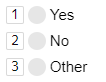

# Configure keyboard shortcuts

Add keyboard shortcuts for the frequently used interface elements. This will help users because keyboard combinations are somewhat faster than mouse clicks.

In [Toloka]({{ toloka-requester-index-dita }}), shortcuts are particularly helpful because performers will do your tasks faster and you can pay less for them. If your project has a low score for “Interface usability“, adding shortcuts will help improve the rating.

## Shortcut features {#hotkeys-features}

Shortcuts are digits or letters shown next to buttons. Shortcuts help users do an action by pressing a key.



A shortcut is always added to a button if they do the same thing.

Keyboard shortcuts are independent of the interface. They work even if they are not displayed, like if you set up a shortcut without setting up a button.

Some components provide additional ways for setting up shortcuts. For example, the [field.image-annotation](../reference/field.image-annotation.md) component has its own [plugin](../reference/plugin.field.image-annotation.hotkeys.md).

## How to configure shortcuts {#set-hotkeys}

Use a separate plugin to configure shortcuts: [plugin.hotkeys](../reference/plugin.hotkeys.md). Use this plugin to assign keys to actions. Plugins are added to the `plugins` array in the configuration root.

```json
{
  "type": "plugin.hotkeys",
    "p": {
     "type": "action.play-pause",
     "view": {
       "$ref": "view.items.0"
    }
  }
}
```

In this example, pressing **P** triggers the [action.play-pause](../reference/action.play-pause.md) action. It starts or pauses playback in the player. The player is specified in the `view` property by using the [$ref](reuse.md) structure, which links to another place in the configuration.

[View example in the sandbox](https://clck.ru/TR7Vs).



Mind the keyboard layout when setting up shortcuts: if you choose a character that looks similar in the Cyrillic and Latin layouts, this might confuse Russian users.




## Radio buttons and checkboxes {#radio-check}

Use the [action.set](../reference/action.set.md) component to set up shortcuts for radio buttons. For checkboxes, use [action.toggle](../reference/action.toggle.md). Assign shortcuts to actions that your radio buttons or checkboxes do.

[View example in the sandbox](https://clck.ru/R4kTo).

## Reusing shortcuts {#reuse}

You can [reuse](reuse.md) shortcuts just like any other code fragments. To do this, use the structure `{ "$ref": "path.to.element" }`. Reuse is helpful when you need to insert the same shortcuts in multiple places in your code.

[View example in the sandbox](https://clck.ru/TR7YY).



Put your reused code into `vars` so that you don't have to change the path in the `$ref` property when you change the configuration.




## Multiple actions {#bulk-actions}

For the user to trigger multiple actions by pressing a button, add the [action.bulk](../reference/action.bulk.md) component. For example, you can use it to show multiple notifications.

[View example in the sandbox](https://clck.ru/TR7bK).

## Conditions in shortcuts {#if-switch}

If you use a condition ([helper.if](../reference/helper.if.md) or [helper.switch](../reference/helper.switch.md)), also add it to the shortcut to ensure consistency.

If you set up a shortcut without a condition, the shortcut will still work, but won't be visualized. This might cause errors.

Here is an example of an error. In this example, if the user responds **Yes**, they see another question. But they can use a keyboard shortcut to respond to it, even if it's not shown in the interface.

[View example with error in the sandbox](https://clck.ru/TR8kq).

[View corrected example in the sandbox](https://clck.ru/TR8j4).

## Troubleshooting {#troubleshooting}

To display a shortcut in the interface, set the shortcut to the same [action](../troubleshooting/../reference/actions.md) that is performed when the button is clicked.

Assign an action to the component if you haven't yet:
- [action.set](../troubleshooting/../reference/action.set.md) for radio buttons.
- [action.toggle](../troubleshooting/../reference/action.toggle.md) for checkboxes.
- [action.play-pause](../troubleshooting/../reference/action.play-pause.md) for playback control.
- [action.open-close](../troubleshooting/../reference/action.open-close.md) to zoom in on images.

You can see the full list of actions in [List of actions](../troubleshooting/../reference/actions.md).

Keep in mind the following:

- The data types for actions must be the same. For example, in the following case the shortcut works but is not displayed: clicking on the button saves the `“true”` string to the results, and the Boolean value `true` is defined for the shortcut.
- If multiple actions are triggered when the button is clicked ([action.bulk](../troubleshooting/../reference/action.bulk.md)), the sequence of these actions for the shortcut must be the same.
- If you use a conditional operator to select an action, such as [helper.if](../troubleshooting/../reference/helper.if.md), the same conditional operator (**helper.if**) must be called under the same rules when the shortcut key is pressed.


[](../concepts/support.md)
