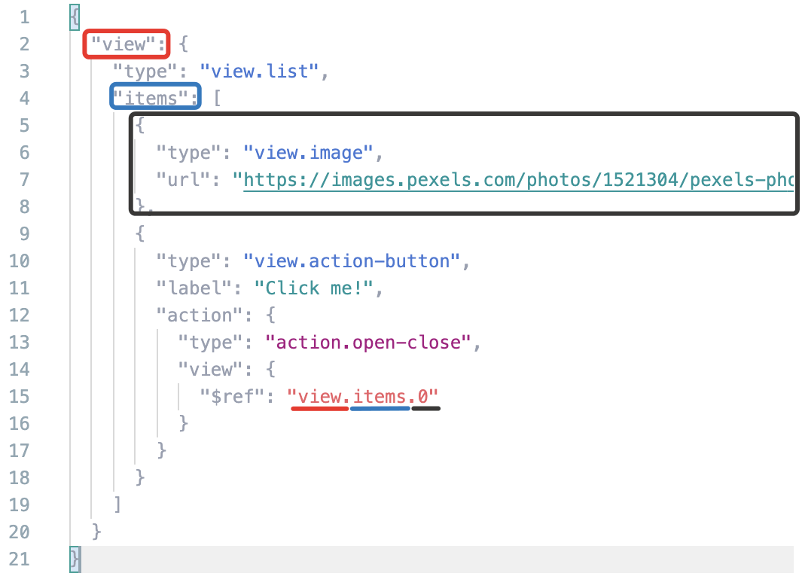

# Reuse code

If you need to insert the same or similar code snippets many times, reuse them. This helps make your configuration shorter and makes it easier for you to edit duplicate chunks of code.

## $ref to any snippet inside the configuration {#ref}

You can insert a code snippet from another part of the configuration anywhere inside the configuration. To do this, use the structure `{ "$ref": "path.to.element" }`.

This is useful when you need to insert the same snippet at multiple places in your code. For example, if you need to run the same action using multiple buttons, put this action in a variable and call it using `$ref`.

[View example in the sandbox](https://tb.yandex.net/editor?locale=en&config=N4Igxg9gdgZglgcxALhMAOlABF9IBucApgO57JYbY64gAuAngA5Hm2GkB0ANnAM508AGkw1acOkQC2fNgG1RYyoqW1GLNng4lOkgB6CQI6qryQoki5pAAVABZE+RLACMArnTrQ+WPnYgkWHQOvgCGUs5QEHRw8GChMdB4KjQAvsaqVKo4eOqsKOzEOrwCwilieBLSsgUKJtlZ2RX0zPkUWkWcoWCJUAC07p5JRuXZeNyhLkTc1gBCHl7YAIxl9U143b1sjU3NACQATkQw1vihB3xdPXDDo6qpd2kZuzu7ua2nnZs3-YOLq7saONJtM5gtoFgAEwAwG0b7DCivQF4Q7HU7nS7wqDJNbZB64sT4poAXWephAABM4EdrgjaP4DnAAF7QOihGYgUZEmjExTpRRaDHbFIbWnYgpItQfAqi3qcKIxGAMGHNJihBjcCChCnCglqBwRaxwWAQFVKMysohWGUgACSdAA5D5gs4+OFnMFjQgsER8EQDgwgnBDZzcdycNz8akjCBjUwPCg0NHUkA).



Store your reused code using variables in `vars`. Otherwise, you may need to change the path in the `$ref` property when you edit the configuration.



The path in the `$ref` structure starts from the root. Array elements start from zero. Example:



Some components have properties with the type ref or something similar, like [action.open-close](../reference/action.open-close.md). In such cases, that property is a pointer to a specific interface element.



A pointer to a visual component using the construction `{ "$ref": "path.to.element" }`.

[View example in the sandbox](https://clck.ru/ReUWS).



The list of components you can link to might be limited. For example, [action.play-pause](../reference/action.play-pause.md) works only with the components that support audio or video playback.







## helper.transform {#helper-transform}

The [helper.transform](../reference/helper.transform.md) component lets you convert one array into another. This is useful if you don't know the number of elements in the array, or the array is very big.

**Examples:**

- [Convert links into images](https://tb.yandex.net/editor?locale=en&config=N4Igxg9gdgZglgcxALhMAOlABF9IBucApgO57JYbY64gAuAngA5Hm2GkB0ANnAM508AGkw1acOkQC2fNlTE48jFmzwALItxYAnTnW0BDKHxgRtU4aIV4J02SkpWFtZawd4AJgboHOcKEwAroIgItTOeEzeaqogcFIGCET2TjQAvmERcVB0EHKpYkrMbhR4HCR+CUmW4dYggdrc+bVZrrFePjwQYAZNoQV1UXQx7nGSFiADOGkDM7Vz05hpodlBdChoVjZVyWwA2qnqdHRMfMgA9OdgHlCcAt0A1nxQBkx+EOfxCAC0w4FSACM+OcAJwANgADCRznwGjAiNpviQDPgiAB9ADMABEAEIAeQAmjiAAo4jEADU4ACsmAgaoUQGpjqcLlcbndcmAni83nAPl9fmp-kDQZDofA+BpzEZvnw4Nw1BBAkRjuiAKoAQSxaoAMgAlPUACQAogBpam0+k0I4nM6Xa63e5c56vd6fKQ-P6A4HgqHnCDcDzfJiK3JogDixoAigAmADseIA6gAtABqqYtdMm1AAuksQGkgA).
- [Say hello in multiple languages](https://tb.yandex.net/editor?config=N4Igxg9gdgZglgcxALhMAOlABF9IBucApgO57JYbY64gAuAngA5Hm2GkB0ANnAM508AGkw1acOkQC2fNgG1RYyoqW1GLNnnhFuAE06SAHoJAjqqvNwCGAIx2aQAdQAWVuln5YGEAK4AnLCgrKSIAfmEVJTwmazAiZwg9Ij8HACkIZygI8yiQXTcrNipVMTx1VhRafLorTjgoST8g7mySmmi3ZwcgkLxIsQBffqwBs1VikrLmCoo8Zx0WPzqYVsnwaF0JOGgi4dL6aYdIKE26bahOPyIARx84K91VtrxqwsqJtpwpjUqXgrqGslmk9Ph06F1fiAehU9jQhjlBmM1uCiFl3rCvgcfrMCMQSDx+CYkc8QBJpLJ0QjkYdIfNuIsDH4rFA+DAIH4pCCSWSZPIMbkABI6bgQLmgkCAfBBAAIggA4QQBMIIBWEEAQiBikkAIR80CsWD4yTexM+mIFiX1-P2Aqs3BFfSpqgAugbuQ1RZTDftyg4OPijESze11oCGrtbeKPbSFslOAArCD1VXinkUigKEOGj5uixYmZVf4isCW+MZsEQnE8m0Z1SjP3javU7E5moAxrA0y1zNMTrdYIw1OfeEVmgOtu0GwMBxCWi1-tu6dtWdKec4ed2xTwgamUlQJg+OgoNDrgZAA&locale=en).

