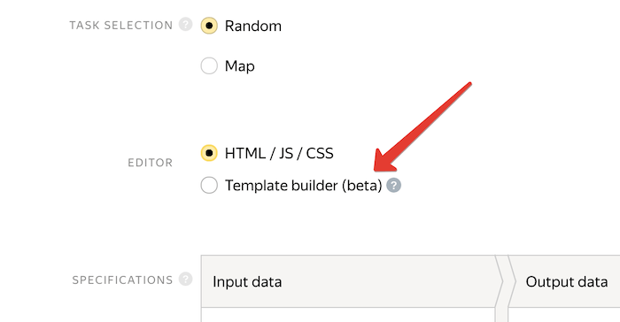
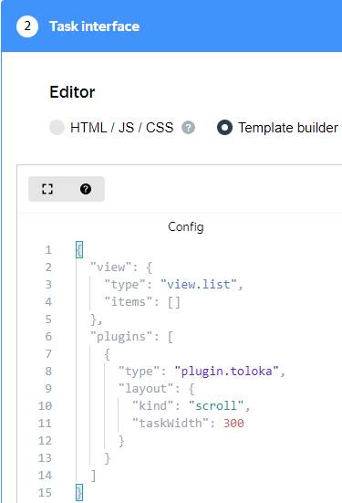
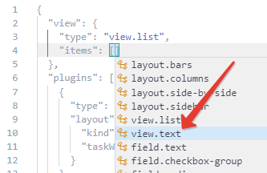
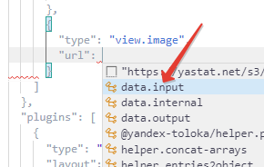
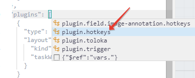
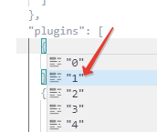

# Quick start

In this section, you will learn how to use Template Builder. As an example, you will create a task interface for a picture with multiple response options.

## Before you start {#before-begin}

Open Template Builder.



- In Toloka

  1. You must be registered in Toloka as a requester.
  1. Log in to [Toloka]({{ toloka }}).
  1. Start creating a new project in Toloka. Template Builder is integrated into Toloka and can be used for creating or editing projects.
  1. Select **Template Builder** in the **Task interface** section.

     

      

     
  
- In the Template Builder sandbox

  [Link]({{ template-builder }}) to the Template Builder sandbox.



## Theory {#theory}

We recommend that you read these sections to get familiar with Template Builder:

### Template Builder interface {#interface}

The Template Builder interface consists of four vertical panels:
1. **Configuration**: for editing the task interface in JSON format. It supports auto-completion with hints and preset code snippets.

1. **Example of input data**: for editing input data in JSON format. The input data specification is automatically generated based on this field.

1. **Preview**: shows what the task will look like.

    If the configuration contains an error, the reason is displayed here. For example, `[3:2]The closing bracket "}" is missing`. It means that you omitted a bracket at character 2 on line 3.

1. **Sent data**: sample JSON output. This panel appears when you click **Send** in the preview. To copy the output data, click . To hide this panel, click **Close Panel** at the bottom.

To hide or display the first three panels, use the  buttons in the upper-right corner.

If you opened Template Builder in Toloka, click  in the upper-right corner to switch to full-screen mode. If you opened the Template Builder sandbox, it is already displayed full-screen.


### Shortcuts {#editor}

To view all the available commands and shortcuts, click **F1**. Main shortcuts:
- **Tab**: Get auto-completion hints.
- **Ctrl**+**S**: Use for automatic formatting (alignment of text indents).



If you use [VS Code]({{ visualstudio }}), the editor will be familiar to you because most of its shortcuts are the same as in VS Code.




### If you're not familiar with JSON {#json-guide}

If you haven't written in JSON before, you might have some difficulties like unclosed brackets or missing commas and quotation marks.


 
Objects are the main elements in JSON. They are enclosed in curly brackets, `{}`. An object contains `"key":value` pairs separated by commas.
```json
{
  "name": "John",
  "surname": "Smith"
}
```



JSON is insensitive to spaces and line breaks between JSON elements. You may omit line breaks. When you click **Ctrl**+**S** in the editor, the code is formatted automatically.




Values may contain different data types:
- `string`: A string enclosed in double quotes, such as `"Hello world"`.
    To add a quotation mark `"` or a backslash `\` to a string, add another backslash `\` to it. Don't escape quotation marks `” “` and `/`.
    
    

    Input data|Result
    --|--
    `"\"Before you pour your heart out, make sure that the\"vessel\" doesn't leak\". \\George Bernard Shaw"`|`"Before you pour your heart out, make sure that the "vessel" doesn't leak". \George Bernard Shaw`
    `"“Before youpour your heart out, make sure that the“vessel” doesn'tleak”. /George Bernard Shaw"`|`“Before you pour your heart out, make sure that the “vessel” doesn't leak”. /George Bernard Shaw`

    
    
  To add a line break, paste ``\n`` in the appropriate spot. Paste `\t` to add a tab.

- `number`: A number without quotation marks, like `"age": 25`.
- `boolean`: A Boolean value without quotation marks (`true` or `false`).
- `object`: Another object, for example:
    ```json
    {
      "person": {
        "name": "John",
        "surname": "Smith"
      }
    }
    ```

- `array`: An array of comma-separated elements. You can use absolutely anything as an element, like a string, a number, a Boolean value, or an object. An array is enclosed in square brackets, `[]`:
    ```json
    "cities": ["Moscow", "Tokyo", "New York"]
    ```



If you enclose a number or Boolean value in quotation marks, it becomes a string. This means that `"disabled": true` is not the same as `"disabled": "true"`.



If you have more questions, see the documentation on the [json.org]({{ json }}) website.



### Configuration format {#config-format}

```json
{
  "view": {
    "type": "category.name",
    ...
  },
  "plugins": [
    {
      "type": "plugin.name",
      ...
    }
  ],
  "vars": {
    "varName": "value",
    ...
  }
}
```

There are 3 elements at the top configuration level:
- `view`: The component to be displayed, such as an image or list of nested components.

    In the `type` property, specify the name of the component, then list the other properties. Each component has its own set of properties. See the hints in the editor and the component descriptions in the [Component reference guide](reference/index.md).

- `plugins`: An array of added [plugins](reference/plugins.md). These are special components that provide additional functionality, such as shortcuts.

- `vars`: Variables with JSON code that can be [reused](best-practices/reuse.md) anywhere in the configuration using the $ref structure as follows:
    ```json
    {
      "view": {
        "type": "view.text",
        "content": {
          "$ref": "vars.my-text"
        }
      },
      "vars": {
        "my-text": "Hello World"
      }
    }
    ```


## Practice {#practice}

In this section, you will create a task interface for an image. The interface will consist of three elements: a title with the task description, a picture, and a group of three buttons with answer options.



If something goes wrong during the creation process, you can [view the correct code in the sandbox](https://clck.ru/UC4df).




### Creating a task interface {#create-interface}

1. The configuration editor will display an empty code template with two blocks: `view` and `plugins`.

    If you're working in Template Builder, not in the Toloka interface, use the [empty template](https://clck.ru/TfifV).

    The `view` block has the[view.list](reference/view.list.md) component to display data in a list. We'll use it to create the interface we need.
    
    
    
    

    To see additional information about a component, hover over it in the list of components or in the editor.

    

1. Go to the **Example of input data** panel to configure the input data.

    Copy the sample input data there (the link to an image). It will be used in the next steps.

    ```json
    {
      "image": "https://yastatic.net/s3/toloka/p/requester/a66492018a130d7337d57a787970f376.jpg"
    }
    ```

1. Go back to the **Configuration** panel. Add the array of elements of the future interface to the `items` property of the `view.list` component. To do this, place the cursor inside the square brackets and click **Tab**. A list will appear where you need to select the [view.text](reference/view.text.md) component. Change the value of the `content` property to `"Look at the picture and answer the question."`. This text will appear above the image as the task title.

    
1. Add the next element. To do this, place the cursor behind the curly bracket that closes the `view.text` component, type a comma, and click **Tab**. A list will appear where you need to select the [view.image](reference/view.image.md) component. It is used to display the image. Its `url` property contains a link to the image. Delete the link and the quotation marks and click **Tab**. A list will appear where you need to select the [data.input](operations/work-with-data.md) component. It is used to get values from the sample input data.

    
    
1. Change the value of the `path` property in the `data.input` component to `"image"`. The image from the sample input data will appear on the **Preview** panel.

1. The next interface element is the [field.button-radio-group](reference/field.button-radio-group.md) component that adds a group of buttons. Its `label` property contains the text that will be displayed above the answer options. Change its value to `"What is the cat's mood?"`.

1. The `options` property contains a list of options for selecting a response. By default, there are two options. Add a third option the same way you added other components. Don't forget to put a comma between the second and third options.

    Each option contains two properties: `label` (title) and `value` (the value to be passed in the output). Change the property titles to `"Good"`, `"Bad"`, and `"Loading error"`, and the values to `"ok"`, `"bad"`, and `"error"`.

1. The next property after the group of buttons is `data`. It determines what the output data will look like ([data.output](operations/work-with-data.md)). The output data is the values that take the responses to the task questions.

1. The [plugin.toloka](reference/plugin.toloka.md) component at the end of the code specifies the additional task settings. Change the value of the `taskWidth` property (the width of the task block) to 500.
1. The task is ready to use. Try to complete it in the **Preview** window and click **Submit** to view the result.



```json
{
  "view": {
    "type": "view.list",
    "items": [
      {
        "type": "view.text",
        "content": "Look at the picture and answer the question."
      },
      {
        "type": "view.image",
        "url": {
          "type": "data.input",
          "path": "image"
        }
      },
      {
        "type": "field.button-radio-group",
        "label": "What is the cat's mood?",
        "options": [
          {
            "label": "Good",
            "value": "ok"
          },
          {
            "label": "Bad",
            "value": "bad"
          },
          {
            "label": "Loading error",
            "value": "error"
          }
        ],
        "data": {
          "type": "data.output",
          "path": "result"
        },
        "validation": {
          "type": "condition.required"
        }
      }
    ]
  },
  "plugins": [
    {
      "type": "plugin.toloka",
      "layout": {
        "kind": "scroll",
        "taskWidth": 500
      }
    }
  ]
}
```





Use code snippets to see what property values you can use. In autocomplete, snippets are labeled with the icon .

To view the list of snippets for a property, delete the property value, position the cursor after the colon, and press **Tab**.




### Adding shortcuts {#add-hotkeys}

To help users complete your tasks faster, add shortcuts to the interface.

Learn more about shortcuts in [Configure keyboard shortcuts](best-practices/hotkeys.md).

Shortcuts are not part of visual components. They are added via a separate plugin, [plugin.hotkeys](reference/plugin.hotkeys.md). Use this plugin to assign keys to actions.

1. Shortcuts are added to the `plugins` section. Place the cursor after the square bracket that opens the`plugins` section and press **Tab**. In the list that appears, select `plugin.hotkeys`.

    
    
1. The `plugins.hotkeys` component is now empty. Fill it with the desired values. To do this, place the cursor after the opening curly bracket and click **Tab**. Two lists will appear in the following order: the first for selecting a shortcut, and the second for setting an action. In the first list, select the `"1"` shortcut; in the second, the [action.set](reference/action.set.md) action.

    
    
1. Add two more shortcuts. To do this, place the cursor at the end of the `"1"` shortcut block (after the closing curly bracket and comma) and press **Tab**. Add the `"2"` shortcut with the same `action.set` action. Then add the `"3"` shortcut in the same way.

    
    
1. Each shortcut block has a `data` property that specifies the output data format. Change the value of its `path` property to `"result"` for each shortcut. The output data path should be the same for shortcuts as for the buttons that you assign them to.

1. Each shortcut also has a `payload` property with the value to be passed to the output data when this button is selected. Change this property for the three buttons to `"ok"`, `"bad"`, and `"error"`.

1. Go to the **Preview** panel and click anywhere on the panel to move the cursor away from the editor. Now you can test the shortcuts.




```json
{
  "view": {
    "type": "view.list",
    "items": [
      {
        "type": "view.text",
        "content": "Look at the picture and answer the question."
      },
      {
        "type": "view.image",
        "url": {
          "type": "data.input",
          "path": "image"
        }
      },
      {
        "type": "field.button-radio-group",
        "label": "Header",
        "options": [
          {
            "label": "Good",
            "value": "ok"
          },
          {
            "label": "Bad",
            "value": "bad"
          },
          {
            "label": "Loading error",
            "value": "error"
          }
        ],
        "data": {
          "type": "data.output",
          "path": "result"
        },
        "validation": {
          "type": "condition.required"
        }
      }
    ]
  },
  "plugins": [
    {
      "1": {
        "type": "action.set",
        "data": {
          "type": "data.output",
          "path": "result"
        },
        "payload": "ok"
      },
      "2": {
        "type": "action.set",
        "data": {
          "type": "data.output",
          "path": "result"
        },
        "payload": "bad"
      },
      "3": {
        "type": "action.set",
        "data": {
          "type": "data.output",
          "path": "result"
        },
        "payload": "error"
      },
      "type": "plugin.hotkeys"
    },
    {
      "type": "plugin.toloka",
      "layout": {
        "kind": "scroll",
        "taskWidth": 500
      }
    }
  ]
}
```



### Configuring validation {#validation}

Validation lets you check the values that users enter. The next part of the code in this section checks that performers select one of the options.

To enable this, add the`validation` property with the [condition.required](reference/condition.required.md) component to the component's code. In the examples above, this code has already been added.

You can also add a hint to this code telling the user what they need to correct to pass validation. To do this, add a `hint` property with the hint so that it looks like this:
```json
{
  "validation": {
    "type": "condition.required",
    "hint": "select one of the options"
  }
}
```

Go to the **Preview** panel and try submitting the task without selecting any of the options.

Learn more about automated checks in [Reviewing assignments automatically](best-practices/conditions.md).


### Checking the data specifications {#check-specs}

After you configure the task interface, check the input and output data specifications in the **Data specification** field. It's located right below the field for choosing an editor. Specifications are generated automatically, but errors are possible.

After that, you can continue creating or editing the project in Toloka.


## What's next {#what-next}

- See [instructions](operations/all.md) for popular tasks.
- Check the [list of available components](reference/index.md).


[](concepts/support.md)
