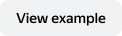

# action.open-link

Opens a new tab in the browser with the specified web page. For example, you can open a link when a button is clicked.

## Component properties {#properties}

#|
|| **Name** | **Type** | **Description** ||
|| `type`\* | "action.open-link" | Set component type ||
|| `payload` | _string_ | URL of the web page. ||
|#


