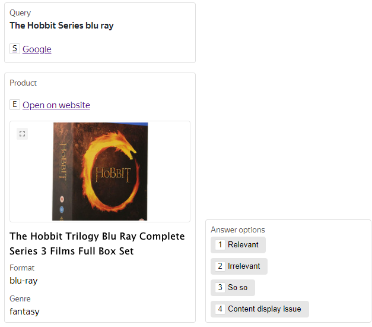
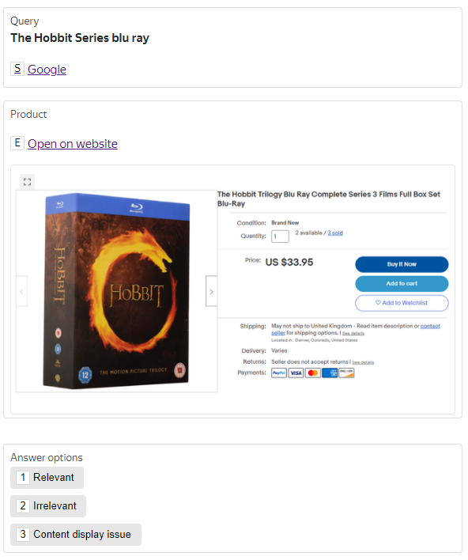

# Product search relevance

This Bespoke solution helps you solve product search relevance task.

## Use cases {#use_cases}

- To improve search quality by training algorithms.
- To understand how well your search algorithms work.
- To compare different versions of algorithms before A/B tests.

## Input data {#input-data}

Choose one of available types for your input data. Supported data formats with examples for each type are listed under the cut.





This feature is disabled by default. [Contact our support team](../../guide/troubleshooting/support.md) to get access to it.



Product cards have advantages compared to other input types:

- It is not necessary to have a product page available.
- Performers can concentrate on tasks better, because there is no distracting page interface.
- The task interface is convenient and adaptive.
- It saves performers' traffic and helps do tasks faster.



Data can be provided in JSON format.

```json
[
  {
    "id": "1",
    "query": "The Hobbit Series blu ray",
    "website_url": "https://example.com/search?q=The+Hobbit+Series+blu+ray",
    "product_name": "The Hobbit Trilogy Blu Ray Complete Series 3 Films Full Box Set",
    "product_image": "https://example.com/images/hobbit.png",
    "product_description": [
      {
        "label": "Format",
        "value": "blu-ray"
      },
      {
        "label": "Genre",
        "value": "fantasy"
      }
    ]
  }
]
```





Provide a search query and a link to the product page.





- JSON

  ```json
  [
    {
      "id": "1",
      "query": "The Hobbit Series blu ray",
      "website_url": "https://example.com/search?q=The+Hobbit+Series+blu+ray"
    }
  ]
  ```

- XLSX

  id | query | website_url
  -- | ----- | -----------
  1 | The Hobbit Series blu ray | https://example.com/search?q=The+Hobbit+Series+blu+ray

- CSV

  ```
  id,query,website_url
  1,The Hobbit Series blu ray,https://example.com/search?q=The+Hobbit+Series+blu+ray
  ```

- TSV

  ```
  id query website_url
  1 The Hobbit Series blu ray https://example.com/search?q=The+Hobbit+Series+blu+ray
  ```







You may use screenshots of pages instead of links to them.




- JSON

  ```json
  [
    {
      "id": "1",
      "query": "The Hobbit Series blu ray",
      "screenshot_url": "https://example.com/images/hobbit.png"
    }
  ]
  ```

- XLSX

  id | query | screenshot
  -- | ----- | ----------
  1 | The Hobbit Series blu ray | https://example.com/images/hobbit.png

- CSV

  ```
  id,query,screenshot_url
  1,The Hobbit Series blu ray,https://example.com/images/hobbit.png
  ```

- TSV

  ```
  id query website_url
  1 The Hobbit Series blu ray https://example.com/images/hobbit.png
  ```





## How to run the solution {#how-to-use}

1. Go to **Projects → Create a project → Bespoke**.

1. In the **Images** section select the **Product Search Relevance** solution.

1. Select the language of performers.

1. Name the project.

1. Describe labeling classes. Make sure that all possible variants and corner cases are mentioned.

1. Add examples to make the description more clear for performers.

1. Wait the project to pass moderation. Then its status changes to **Active**.

1. Upload input data.

1. Click **Launch** to start labeling data in Toloka.

## More features {#another}

You may [ask to add more features](../../guide/troubleshooting/support.md) to the project:

- To search a product on your platform with our search engine.
- To use meta information. For example, to handle the location of a performer.

## Pricing {#pricing}

Base price depends on data volume to label per month.

Item count | Base price per labeled item
---------- | ---------------------------
Up to 10,000 | $0.25
10,001 - 100,000 | $0.20
100,001 - 500,000 | $0.17
Over 500,000 | [Contact support](../../guide/troubleshooting/support.md) to get special offer.



