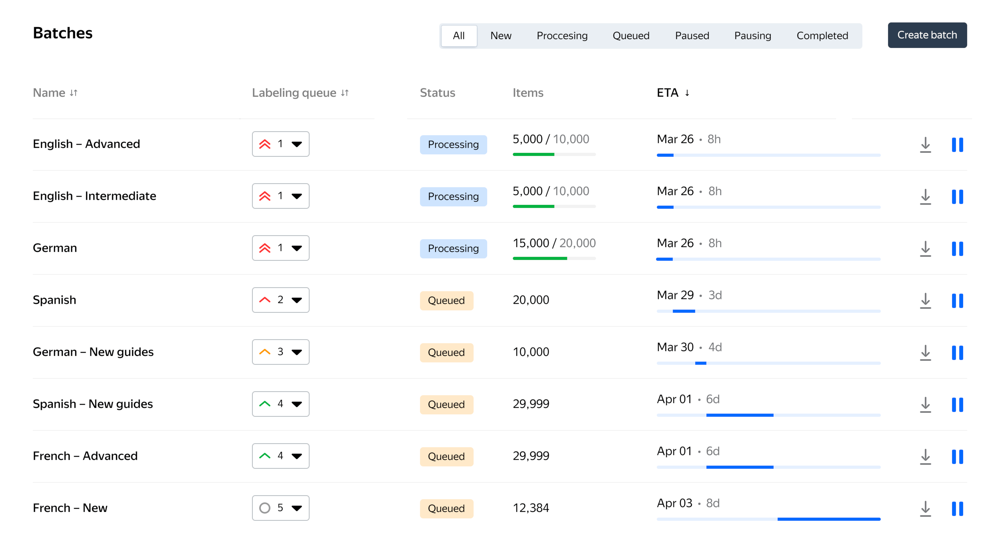

# Starting and stopping labeling

## Start labeling {#start-batch}

You can start labeling after uploading task items to a project batch.

The following project statuses are supported:

- **Active** — The project can be used for labeling. [Create batches](add-task.md#new-batch) and [upload task items](add-task.md#edit).
- **Archive** — The project is archived. You can only preview or clone such projects.

To send a batch of data for labeling:

1. Make sure that the project status is **Active**.

1. Open the project clicking its name.

1. Click **Launch**.

## Watch labeling progress and ETA {#batch-eta}

Once the labeling starts, you can view its progress and the estimated time when it finishes.

Open the project. It will display a list of all the project batches.



The following batch properties are available here:

Property | Description
-------- | -----------
Name | The batch name that helps distinguish it among other batches in the same project.
Labeling queue | The batch priority that you assigned to the batch when [creating](add-task.md#new-batch) it or [uploading task items](add-task.md#edit).
Status | The current [batch status](#batch-status).
Items | The number of task items in the batch. If the batch is in the **Processing** status, the number of labeled task items and the total number of task items is displayed  divided with a slash.
ETA | The estimated date and time when the labeling will be finished. It depends on the batch priority (the **Labeling queue** value).

You can sort the batches by their names or ETA.

### Batch statuses {#batch-status}

The batch can be in one of the following statuses:

Batch status | Description
------------ | -----------
New | The processing of the batch items has not been started.
Queued | The batch is ready for labeling but is currently queued because other batches with higher priority are being labeled. Labeling of these batches will automatically start once the labeling of the batches with higher priority finishes.
Processing | Batch items are [being processed](#start-batch) by Tolokers.
Completed | Labeling of all batch items is completed.
Error | An error occurred during processing.
Canceled | Batch processing canceled.
No money | There is not enough money for processing the task items in the batch.
Archive | The batch is [archived](archive-batch.md).
Loading | Tasks are [loading](add-task.md) to the batch.
Stopping | The batch is [stopping](#stop-batch).
Stopped | The batch has [stopped](#stop-batch).

## Stop labeling {#stop-batch}

You can stop labeling if it isn't completed.



- From a project

  1. Open the project.

  1. Click  on the right, next to the batch name.

- From a batch

  1. Open the project.

  1. Go to the desired batch.

  1. Click **Pause labeling**.

- Using the apps API

  Send the following `POST` request:

  ```bash
  curl -X POST 'https://toloka.dev/api/app/v0/app-projects/{project_id}/batches/{batch_id}/stop' \
       -H 'Authorization: OAuth PlaceYourRealOAuthToken_Here'
  ```

  Where `{project_id}` is the ID of the project with which the batch is associated, and `{batch_id}` is the ID of the batch you want to pause.

  

  Refer to the [Stop batch processing](https://toloka.ai/docs/api/apps-reference/#post-/app-projects/-app_project_id-/batches/-batch_id-/stop) section of the apps API documentation for more details about the request, its parameters, and possible responses. You will find examples of the requests for [Toloka-Kit](../../toloka-kit/index.md) and other code samples there.

  





Task items in the **Processing** status will continue to be labeled and you'll be charged for them. These tasks are already reserved for performers and are being executed, so it isn't possible to stop their labeling.





