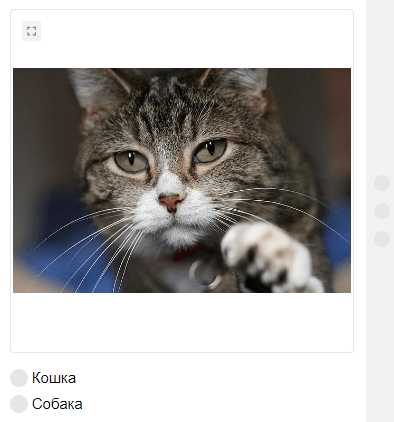

# Обзор



Чтобы лучше понять принцип работы Толоки, попробуйте сначала настроить задания в интерфейсе Толоки с помощью [Руководства заказчика](../../guide/concepts/main-steps.md) и после этого приступить к настройке при помощи API.



Для примера создайте проект с заданиями, в которых исполнители будут определять вид животного.





Пример проекта, описанный в разделе «Быстрый старт», приведен для песочницы. Для настройки заданий в основной версии Толоки во всех запросах измените [URL ресурса](access.md#urls) и [OAuth-токен](access.md#token).

## Порядок действий {#algorithm}

1. Разместите задания.

    - [Выберите платформу и получите токен](qs-placement.md).
    - [Создайте проект](qs-placement.md) (`POST /api/v1/projects`).
    - [Добавьте пул](qs-placement.md) (`POST /api/v1/pools`).
    - [Загрузите задания](qs-placement.md) (`POST /api/v1/tasks`).
    - [Запустите (откройте) пул](qs-placement.md) (`POST /api/v1/pools/<pool_id>/open`).
    - [Проверьте задания из интерфейса исполнителя](qs-placement.md).

1. Получите необходимые результаты после выполнения заданий исполнителями.

    - [Получите ответы](qs-results.md) (`GET /api/v1/assignments?pool_id=<id пула>`).
    - [Скачайте вложения](get-attachment-list.md) (`GET /api/v1/attachments`).

## Что дальше {#what-next}

Почитайте [инструкцию по размещению заданий](qs-placement.md)