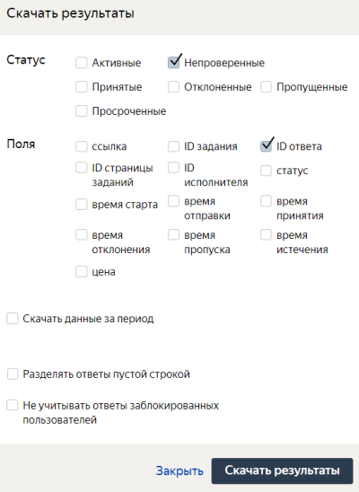

# Проверка ответов исполнителей

Вы запустили пул с [отложенной приемкой](offline-accept.md), а исполнители завершили все ваши задания. Что теперь?

- Проверяйте ответы исполнителей до указанного вами **Срока проверки**. По его окончанию непроверенные ответы принимаются автоматически.
- Если исполнитель плохо выполнил задание — отклоните его ответ.
- Исполнитель может оспорить ваше решение, подав [апелляцию](#appeal).

## Как проверить задания {#acception}

#### В интерфейсе Толоки — этот вариант подходит для небольшого количества заданий.

Чтобы принять или отклонить ответы:

Если в настройках пула вы указали [отложенную приемку](offline-accept.md), то вам нужно проверить ответы исполнителей в течение срока, установленного в поле **Срок проверки**. Исполнитель может оспорить отклонение своего ответа, подав [апелляцию](#appeal).

Вы можете проверить задания онлайн или загрузить результаты проверки в виде файла.



Учтите, нельзя изменить статус задания, если пул заданий был [отправлен в архив](pool-archive.md).



#### Проверка онлайн для одного задания.

Чтобы принять или отклонить одно задание:

1. Нажмите кнопку **Проверить задания****Review assignments** на странице пула.

1. Выберите задание.

    Если в ответах содержатся файлы, отправленные исполнителями, нажмите , чтобы скачать их. Чтобы скачать все файлы из непроверенных ответов в ZIP-архиве, нажмите  на странице проверки заданий.

1. Проверьте ответы, нажмите **Принять****Accept** или **Отказать****Decline**. Для отклоненных ответов введите комментарий (укажите причину).

#### В файле с результатами — он понадобится для фильтрации результатов и их программной обработки.



Ещё этот способ проверки подойдет, когда результат не отображается в интерфейсе.

Пример 1: в задании используется JS-код, а ответ вводится в изначально скрытые поля.

Пример 2: задание, где для проверки ответов нужно скачать файлы, приложенные толокером (например, записи видео или аудио).



Чтобы принять или отклонить ответы:

1. Нажмите кнопку **Проверить задания****Review assignments** на странице пула.

1. Чтобы скачать ответы, которые вы еще не проверяли: на странице пула нажмите кнопку **Скачать результаты****Download results**. В открывшемся окне:

    1. В блоке **Статус****Status** оставьте включенной только опцию **Не проверенные****Submitted**.

    1. В блоке **Поля****Columns** оставьте включенной только опцию **id ответа****assignment ID**.

    1. Отключите опцию **Разделять ответы пустой строкой****Separate assignments with empty row**.

    1. Нажмите кнопку **Скачать результаты****Download results**.

1. Если по условию задания толокеры должны были отправить вам картинки/видео/аудио, скачайте их для проверки отдельным архивом следующим образом.

    Нажмите .

    

    **Что содержит архив с ответами?**

    Система автоматически присваивает имена файлам в процессе их загрузки исполнителем. Вы можете переименовывать файлы вручную или скриптом, если нужно.

    - `Архив с ответами`

    - `Папка1_ID_ответов`

    - `Файл1_ID_вложения`

    - `Файл2_ID_вложения`

    - `Папка2_ID_ответов`

    По ID ответа и ID вложения можно понять, что к чему относится в результатах. ID вложения содержится в столбце с выходным полем, куда был загружен файл.

    - `файл`

    - `Столбец1_с_выходным_полем`

    - `ID_вложения`

    - `Столбец2_с_выходным_полем`

    - `ID_вложения`

    

1. Откройте [файл с ответами](result-of-eval.md).

    Для одного ID ответа вердикт и комментарий надо заполнять только по одному разу. Остальные следует оставлять пустыми или удалять.

    - Если на странице одно задание, то к каждому ID ответа добавляйте вердикт и комментарий (если есть отклонение).
    - Если на странице больше одного задания, то у разных заданий на странице будет один и тот же ID ответа.

    **Расшифровка**

    - `ASSIGNMENT:assignment_id` — идентификатор выданной страницы заданий.

    - `ACCEPT:verdict` — результат проверки:

    - <q>+</q>, если ответы приняты;

    - <q>-</q>, если ответы отклонены.

    - `ACCEPT:comment` — комментарий для исполнителя в случае отклонения ответов (например, укажите несоблюденный пункт [инструкции](../../glossary.md#task-instruction-ru)).

1. Загрузите отредактированный файл в Толоку ().

#### Делегировать проверку ответов толокерам.

Разместите отдельное задание с проверкой ответов исполнителей. Чтобы научиться этому, пройдите туториал [Выделение области на изображении](image-segmentation-overview.md) — в нем в [последнем проекте](image-segmentation-project3.md) выполняется проверка ответов с помощью исполнителей.



Учтите, нельзя изменить статус задания, если пул заданий был [отправлен в архив](pool-archive.md).



## Апелляция {#appeal}

В течение 7 дней проверки исполнитель имеет возможность оспорить результат — [подать апелляцию]({{ appeal }}).

Вы получите от него сообщение, в котором будут:

- Идентификатор толокера (`assignment_id`) в теме.
- Объяснение, почему ответы нужно принять (опционально).

Для того, чтобы рассмотреть апелляцию, вам понадобится ID ответа. Если исполнитель написал вам со страницы отклоненного ответа, ID ответа автоматически прикрепляется к сообщению толокера в виде ссылки. Если ID нет, запросите его у толокера.

Что вам нужно делать:

- Если ответы были ошибочно отклонены, примите их.
- Рассматривайте все обращения и отвечайте в срок — в течение 9 дней (с момента отклонения задания).

## Порядок приемки {#acceptance-procedure}

1.1. Заказчик принимает Услуги посредством Личного кабинета Заказчика либо API. Возможны два вида приёмки: автоматическая и отложенная. Вид приёмки определяется Заказчиком при размещении Задания посредством Личного кабинета Заказчика или API.

1.2. В случае, если Заказчиком при размещении Задания выбрана автоматическая приёмка, все Задания, выполненные в течение срока, указанного в Заданиях, считаются принятыми Заказчиком автоматически с момента завершения каждого отдельного Задания Пользователем, а Услуги – оказанными Исполнителем надлежащим образом и подлежащими оплате вне зависимости от каких-либо иных условий. Несоответствие результатов выполнения Задания требованиям, установленным Исполнителем в Инструкции, не является основанием для отказа в приёмке соответствующих Услуг, если Заказчиком была выбрана автоматическая приёмка.

1.3. В случае если Заказчиком при размещении Задания выбрана отложенная приёмка, Заказчик обязан выбрать срок, который отсчитывается с момента завершения выполнения Задания Пользователем и может составлять от 1 до 21 календарных дней, в течение которого Заказчик вправе осуществить проверку результатов Заданий и приёмку Услуг (далее – «**Срок отложенной приёмки**») посредством Личного кабинета Заказчика либо API. В случае, если Заказчик не осуществил приёмку Услуг в течение Срока отложенной приёмки, Услуги считаются принятыми в последний день Срока отложенной приёмки, оказанными надлежащим образом и подлежащими оплате.

1.4. Заказчик вправе отказаться от приёмки Услуг исключительно в случаях, когда в совокупности выполняются следующие условия:

а) Заказчиком при размещении соответствующего Задания была выбрана отложенная приёмка;

б) не истёк Срок отложенной приёмки;

в) Заказчиком разместил инструкцию по выполнению Задания, содержащую алгоритм действий, который надлежит совершить для получения надлежащего результата выполнения Задания и исчерпывающие требования к такому результату (далее – «Инструкция»);

г) результат выполнения Задания не соответствует Инструкции.

1.5. В случае, если Заказчик в соответствии с п. 1.4. Руководства отказывается от приёмки Услуг, в т.ч. с учетом порядка рассмотрения возражений, предусмотренного п. 1.7., Заказчик вправе использовать сумму, внесённую в качестве предварительной оплаты соответствующих Услуг по Договору, для оплаты Услуг при последующем размещении Заданий Заказчиком в течение срока действия Договора.

1.6. В случае, если Заказчик в соответствии с п. 1.4. Руководства отказывается от приёмки Услуг, Заказчик обязан указать, какие именно положения Инструкции были нарушены при выполнении Задания, с помощью Интерфейсов Сайта «Толока» (в том числе API).

1.7. В случае, если Заказчик в соответствии с п. 1.4. Руководства отказывается от приёмки Услуг, Исполнитель вправе направить Заказчику возражения с помощью Интерфейсов Сайта «Толока» в течение семи (7) календарных дней со дня, когда было отказано в приёмке соответствующего Задания. Стороны обязуются урегулировать спор не позднее, чем в течение девяти (9) календарных дней со дня, когда было отказано в приёмке соответствующего Задания. По итогам рассмотрения возражений Заказчиком может быть принято решение о приёмке Услуг либо о повторном отказе в приёмке Услуг. В случае, если Заказчиком было принято решение принять Услуги по результатам рассмотрения возражений, Услуги считаются принятыми в день, когда Заказчиком было совершено соответствующее действие в Личном кабинете Заказчика или посредством API.

## Решение проблем {#troubleshooting}

#### Можно ли попросить исполнителя переделать задание, если он допустил в нем ошибки?

Нет, после отправки задания исполнитель уже не может внести в него изменения. Неверно [выполненные задания](../../glossary.md#submitted-answers-ru) можно добавить в новый пул.

#### Могу ли я самостоятельно исправить что-то в выполненном задании?

Нет, в самом задании ничего исправить нельзя. Но это можно сделать вручную при обработке файла с результатами.

#### Что делать, если я хочу принять задание, а пул уже заархивирован или исполнитель написал мне позже допускаемого срока?

Просто [начислите толокеру бонус](bonus.md) без изменения статуса задания. Изменить статус задания в пуле в этой ситуации уже невозможно.

#### Что делать, если я не указал в инструкции того, за что отклонил задание?

Примите задание и скорректируйте инструкцию. Иначе вы нарушаете [**Соглашение с заказчиком**]({{ customeragreement }}), согласно которому нужно четко прописывать требования к выполнению задания и ожидаемым от исполнителя результатам.

#### Могу ли я отклонить часть ответов на странице, а часть принять?

Нет. Например, на странице 10 заданий стоимостью 0,1 $, а исполнитель сделал только 2 из них неправильно.

Вы не можете принять правильные ответы и заплатить ему часть стоимости - 0,08 $. Страницы с ответами принимаются либо отклоняются только целиком.

