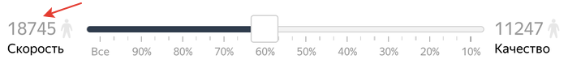

# Соотношение скорости и качества

По умолчанию ваши задания доступны всем исполнителям. Если вы настроили [фильтры](filters.md), то только тем, кто соответствует им.

Когда исполнителей много, вы сможете быстро получить результат, но качество ответов исполнителей может быть плохим. Количество [активных исполнителей](../../glossary.md#active-workers) (которым будет доступно задание, если опубликовать его сейчас) отображается на вкладке **ТОП %****TOP %** слева от ползунка:

Вы можете подобрать исполнителей, которые качественно выполнят именно ваше задание, на основе персонализированного прогноза качества.

## Как это работает {#how-it-works}

Персонализированный прогноз качества строится на основе большого объема накопленной информации о том, как исполнитель вел себя в системе, как другие исполнители справлялись с вашим заданием, и что из себя представляет само задание. На основе этих данных в режиме реального времени мы прогнозируем, с каким качеством исполнитель справится с задачей. Сравнивая прогноз качества для всех исполнителей, мы отбираем самых лучших.

## Повысить качество результатов {#concept_cgm_vzq_xlb}

Вы можете отобрать только лучших исполнителей с помощью одного из фильтров по [персонализированному прогнозу качества](../../glossary.md#worker-quality-prediction):
- **ТОП %****TOP %** — позволяет задать в процентах количество лучших исполнителей, которым будет доступно ваше задание.
- **Онлайн****Online** — позволяет задать максимальное количество лучших исполнителей, которым будет доступно ваше задание.

## Рекомендации {#concept_gtb_2zk_xlb}

- Следите, чтобы итоговое количество исполнителей было в несколько раз больше, чем требуется для выполнения вашего задания. Иначе ваше задание может быть не закончено из-за нехватки исполнителей.

- Если вы не знаете, какие настройки выставлять, сделайте задание доступным только самым лучшим исполнителям. Например, выставьте 20% в настройке **ТОП %****TOP %**. Если скорость выполнения заданий будет недостаточной, повысьте значение, чтобы получить результаты быстрее.

## Что дальше {#what-next}

- [Добавьте задания в пул](pool.md).
- Узнайте больше про настройку пула:
    - [Настройка ценообразования](dynamic-pricing.md).
    - [Динамическое перекрытие](dynamic-overlap.md).
    - [Выборочная проверка мнением большинства](selective-mvote.md).
    - [Фильтры](filters.md).
    - [Настройка контроля качества](qa-pool-settings.md).
    - [Отложенная приемка](offline-accept.md).
    - [Статья в блоге Толоки]({{ toloka-blog-pool }}).

## Решение проблем {#troubleshooting}



Возможные причины:
- Вы остановили [обучающий пул](../../glossary.md#training-pool), и тем самым ограничили количество исполнителей имеющих доступ к заданиям. Запустите обучающий пул снова. Исполнителей, которым доступны задания, станет больше.

- Установлены слишком жесткие фильтры, например строгое ограничение по навыку, которого нет у большинства исполнителей.
- Слишком много исполнителей заблокированы. Сделайте правила контроля качества мягче.





- Мотивируйте исполнителей, назначив [публичный навык](nav-create.md#public) и [динамическое ценообразование](dynamic-pricing.md).
- Постарайтесь [повысить рейтинг проекта](project_rating_stat.md), чтобы ваше задание оказалось выше в списке заданий у исполнителей.
- Отрегулируйте [соотношение скорости и качества](adjust.md).
- Установите более высокий [приоритет](pool_poolparams.md#priority) пула среди всех пулов проекта.



