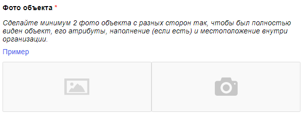
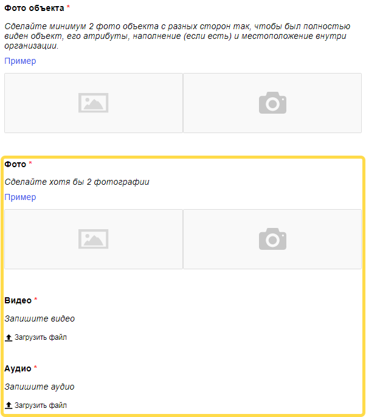

# Прикрепление файлов

Возможно, от исполнителей вам требуется получить не только фотографии, но и видео- или аудиофайлы. В таком случае можно добавить блоки для прикрепления нужных файлов.



Было:



Стало:





Для вашего удобства мы подготовили код для шаблона «Мониторинг объектов в организациях», в котором каждое из полей добавлено по одному разу в первую кнопку для ответа. Используйте этот код для самопроверки. Наши вставки в этом коде вы можете найти поиском слова «кастомизация».





 
```html
{{#if reviewMode}}
    <div class="header-review">
        <div class="header-review__title">
            {{texts.task_title}}
        </div>
        <div class="header-review__buttons">
            {{#if (equal verdict "ok")}}
                <div class="header-review__btn header-review__btn_green">
                    {{texts.btn_ok.title}}
                </div>
            {{/if}}
            {{#if (equal verdict "no_obj")}}
                <div class="header-review__btn header-review__btn_red">
                    {{texts.btn_no_obj.title}}
                </div>
            {{/if}}
            {{#if (equal verdict "no_org")}}
                <div class="header-review__btn header-review__btn_red">
                    {{texts.btn_no_org.title}}
                </div>
            {{/if}}
        </div>
    </div>
{{else}}
    <div class="header">
        {{texts.task_title}}
    </div>
{{/if}}

<div class="info">
    {{#if reviewMode}}
        <div class="info__review">
            <div class="info__review-block">
                <div class="info__title">
                    {{texts.info_name}}
                </div>
                <div class="info__content">
                    {{name}}
                </div>
            </div>
            <div class="info__review-block">
                <div class="info__title">
                    {{texts.info_address}}
                </div>
                <div class="info__content">
                    {{address}}
                </div>
            </div>
        </div>
    {{else}}
        <div class="info__block">
            <div class="info__title">
                {{texts.info_name}}
            </div>
            <div class="info__content">
                {{name}}
            </div>
        </div>
        <div class="info__block">
            <div class="info__title">
                {{texts.info_address}}
            </div>
            <div class="info__content">
                {{address}}
            </div>
        </div>
    {{/if}}
    <div class="info__block">
        <div class="info__title">
            {{texts.info_description}}
        </div>
        <div class="info__content">
            {{product}}
        </div>
    </div>
    <div class="info__block">
        <div class="info__content">
            <a href={{image}} target="_blank" class="info__link">Ссылка на изображение товара</a>
        </div>
    </div>
</div>

{{#if reviewMode}}
    <div class="review">
        <div class="review__map">
            <div id="{{concat 'map_' id}}" style="width: 100%; height: 400px;"></div>
        </div>
        {{#if (equal verdict "ok")}}
            <div class="review__block">
                <div class="review__title">
                    {{texts.btn_ok.question_1.title}}
                </div>
                <div class="review__imgs-grid">
                    {{#each imgs_facade}}
                        <div class="review__grid-item">
                            <div class="review__grid-inner">
                                
                                <div class="review__rotate-panel">
                                    <span class="review__rotate review__rotate_left">&larr;</span>
                                    <span class="review__rotate review__rotate_right">&rarr;</span>
                                </div>
                            </div>
                        </div>
                    {{/each}}
                </div>
            </div>
            <div class="review__block">
                <div class="review__title">
                    {{texts.btn_ok.question_2.title}}
                </div>
                <div class="review__imgs-grid">
                    {{#each imgs_obj}}
                        <div class="review__grid-item">
                            <div class="review__grid-inner">
                                
                                <div class="review__rotate-panel">
                                    <span class="review__rotate review__rotate_left">&larr;</span>
                                    <span class="review__rotate review__rotate_right">&rarr;</span>
                                </div>
                            </div>
                        </div>
                    {{/each}}
                </div>
            </div>

            <!-- кастомизация начало фрагмента -->
            <!-- фото -->
            <div class="review__block">
              <div class="review__title">
                {{texts.btn_ok.question_new_imgs.title}}
              </div>
              <div class="review__imgs-grid">
                {{#each new_imgs}}
                  <div class="review__grid-item">
                    <div class="review__grid-inner">
                      
                      <div class="review__rotate-panel">
                        <span class="review__rotate review__rotate_left">&larr;</span>
                        <span class="review__rotate review__rotate_right">&rarr;</span>
                      </div>
                    </div>
                  </div>
                {{/each}}
              </div>
            </div>

            <!-- видео -->
            <div class="review__block">
              <div class="review__title">
                {{texts.btn_ok.question_new_video.title}}
              </div>
              <div class="review__video-grid">
                {{#each new_video}}
                  <div class="review__video-grid-item">
                    <video width="50%" controls>
                      <source src={{this}} type="video/mp4">
                    </video>
                  </div>
                {{/each}}
              </div>
            </div>

            <!-- аудио -->
            <div class="review__block">
              <div class="review__title">
                {{texts.btn_ok.question_new_audio.title}}
              </div>
              <div class="review__audio-grid">
                {{#each new_audio}}
                  <div class="review__audio-grid-item">
                    <audio src={{this}} controls type="audio/wav">Невозможно воспроизвести</audio>
                  </div>
                {{/each}}
              </div>
            </div>
            <!-- кастомизация конец фрагмента -->

        {{/if}}
        {{#if (equal verdict "no_obj")}}
            <div class="review__block">
                <div class="review__title">
                    {{texts.btn_no_obj.question_1.title}}
                </div>
                <div class="review__imgs-grid">
                    {{#each imgs_facade}}
                        <div class="review__grid-item">
                            <div class="review__grid-inner">
                                
                                <div class="review__rotate-panel">
                                    <span class="review__rotate review__rotate_left">&larr;</span>
                                    <span class="review__rotate review__rotate_right">&rarr;</span>
                                </div>
                            </div>
                        </div>
                    {{/each}}
                </div>
            </div>
            <div class="review__block">
                <div class="review__title">
                    {{texts.btn_no_obj.question_2.title}}
                </div>
                <div class="review__imgs-grid">
                    {{#each imgs_plate_or_address}}
                        <div class="review__grid-item">
                            <div class="review__grid-inner">
                                
                                <div class="review__rotate-panel">
                                    <span class="review__rotate review__rotate_left">&larr;</span>
                                    <span class="review__rotate review__rotate_right">&rarr;</span>
                                </div>
                            </div>
                        </div>
                    {{/each}}
                </div>
            </div>
            <div class="review__block">
                <div class="review__title">
                    {{texts.btn_no_obj.question_3.title}}
                </div>
                <div class="review__imgs-grid">
                    {{#each imgs_around_obj}}
                        <div class="review__grid-item">
                            <div class="review__grid-inner">
                                
                                <div class="review__rotate-panel">
                                    <span class="review__rotate review__rotate_left">&larr;</span>
                                    <span class="review__rotate review__rotate_right">&rarr;</span>
                                </div>
                            </div>
                        </div>
                    {{/each}}
                </div>
            </div>
            {{#if comment}}
                <div class="review__block">
                    <div class="review__title">
                        {{texts.btn_no_obj.question_4.title}}
                    </div>
                    <div class="review__comment">
                        {{field type="textarea" name="comment" width="100%" rows=5}}
                    </div>
                </div>
            {{/if}}
        {{/if}}
        {{#if (equal verdict "no_org")}}
            <div class="review__block">
                <div class="review__title">
                    {{texts.btn_no_org.question_1.title}}
                </div>
                <div class="review__imgs-grid">
                    {{#each imgs_around_org}}
                        <div class="review__grid-item">
                            <div class="review__grid-inner">
                                
                                <div class="review__rotate-panel">
                                    <span class="review__rotate review__rotate_left">&larr;</span>
                                    <span class="review__rotate review__rotate_right">&rarr;</span>
                                </div>
                            </div>
                        </div>
                    {{/each}}
                </div>
            </div>
            <div class="review__block">
                <div class="review__title">
                    {{texts.btn_no_org.question_2.title}}
                </div>
                <div class="review__imgs-grid">
                    {{#each imgs_plate_or_address}}
                        <div class="review__grid-item">
                            <div class="review__grid-inner">
                                
                                <div class="review__rotate-panel">
                                    <span class="review__rotate review__rotate_left">&larr;</span>
                                    <span class="review__rotate review__rotate_right">&rarr;</span>
                                </div>
                            </div>
                        </div>
                    {{/each}}
                </div>
            </div>
            <div class="review__block">
                <div class="review__title">
                    {{texts.btn_no_org.question_3.title}}
                </div>
                <div class="review__comment">
                    {{field type="textarea" name="comment" width="100%" rows=5}}
                </div>
            </div>
        {{/if}}
    </div>
{{else}}
    <div class="main">
        <div class="main__title">
            Выберите вариант выполнения задания:
        </div>
        <div class="main__container">
            <div class="main__popup main__popup_hidden">Не выбран ни один вариант ответа</div>
            <div class="main__block">
                <div class="main__btn main__btn_green">
                    {{texts.btn_ok.title}}
                </div>
                <div class="main__content">
                    <div class="main__content-block">
                        <div class="main__content-title main__content-title_req">
                            {{texts.btn_ok.question_1.title}}
                        </div>
                        <div class="main__text">
                            {{texts.btn_ok.question_1.description}}
                        </div>
                        <div class="main__ex">
                            <a href="{{texts.btn_ok.question_1.example_link_1}}" target="_blank" class="main__ex-link">Пример</a>
                        </div>
                        <div class="main__imgs">
                            {{field type="file-img" name="imgs_facade" camera=true preview=true compress=false validation-show="top-left"}}
                        </div>
                    </div>
                    <div class="main__content-block">
                        <div class="main__content-title main__content-title_req">
                            {{texts.btn_ok.question_2.title}}
                        </div>
                        <div class="main__text">
                            {{texts.btn_ok.question_2.description}}
                        </div>
                        <div class="main__ex">
                            <a href="{{texts.btn_ok.question_2.example_link_1}}" target="_blank" class="main__ex-link">Пример</a>
                        </div>
                        <div class="main__imgs">
                            {{field type="file-img" name="imgs_obj" camera=true preview=true compress=false validation-show="top-left"}}
                        </div>
                    </div>

                    <!-- кастомизация начало фрагмента -->
                    <!-- фото -->
                    <div class="main__content-block">
                      <div class="main__content-title main__content-title_req">
                        {{texts.btn_ok.question_new_imgs.title}}
                      </div>
                      <div class="main__text">
                        {{texts.btn_ok.question_new_imgs.description}}
                      </div>
                      <div class="main__ex">
                        <a href="{{texts.btn_ok.question_new_imgs.example_link_1}}" target="_blank" class="main__ex-link">Пример</a>
                      </div>
                      <div class="main__imgs">
                        {{field type="file-img" name="new_imgs" camera=true validation-show="top-left"}}
                      </div>
                    </div>

                    <!-- видео -->
                    <div class="main__content-block">
                      <div class="main__content-title main__content-title_req">
                        {{texts.btn_ok.question_new_video.title}}
                      </div>
                      <div class="main__text">
                        {{texts.btn_ok.question_new_video.description}}
                      </div>
                      <div class="main__video">
                        {{field type="file" name="new_video" sources="CAMERA GALLERY" fileType="VIDEO" camera=true validation-show="top-left"}}
                      </div>
                    </div>

                    <!-- аудио -->
                    <div class="main__content-block">
                      <div class="main__content-title main__content-title_req">
                        {{texts.btn_ok.question_new_audio.title}}
                      </div>
                      <div class="main__text">
                        {{texts.btn_ok.question_new_audio.description}}
                      </div>
                      <div class="main__audio">
                        {{field type="file" name="new_audio" sources="RECORDER FILE_MANAGER" fileType="AUDIO" validation-show="top-left"}}
                      </div>
                    </div>
                    <!-- кастомизация конец фрагмента -->

                </div>
            </div>
            <div class="main__block">
                <div class="main__btn main__btn_red">
                    {{texts.btn_no_obj.title}}
                </div>
                <div class="main__content">
                    <div class="main__content-block">
                        <div class="main__content-title main__content-title_req">
                            {{texts.btn_no_obj.question_1.title}}
                        </div>
                        <div class="main__text">
                            {{texts.btn_no_obj.question_1.description}}
                        </div>
                        <div class="main__ex">
                            <a href="{{texts.btn_no_obj.question_1.example_link_1}}" target="_blank" class="main__ex-link">Пример</a>
                        </div>
                        <div class="main__imgs">
                            {{field type="file-img" name="imgs_facade" camera=true validation-show="top-left"}}
                        </div>
                    </div>
                    <div class="main__content-block">
                        <div class="main__content-title main__content-title_req">
                            {{texts.btn_no_obj.question_2.title}}
                        </div>
                        <div class="main__text">
                            {{texts.btn_no_obj.question_2.description}}
                        </div>
                        <div class="main__ex">
                            <a href="{{texts.btn_no_obj.question_2.example_link_1}}" target="_blank" class="main__ex-link">Пример</a>
                        </div>
                        <div class="main__imgs">
                            {{field type="file-img" name="imgs_plate_or_address" camera=true validation-show="top-left"}}
                        </div>
                    </div>
                    <div class="main__content-block">
                        <div class="main__content-title main__content-title_req">
                            {{texts.btn_no_obj.question_3.title}}
                        </div>
                        <div class="main__text">
                            {{texts.btn_no_obj.question_3.description}}
                        </div>
                        <div class="main__ex">
                            <a href="{{texts.btn_no_obj.question_3.example_link_1}}" target="_blank" class="main__ex-link">Пример</a>
                        </div>
                        <div class="main__imgs">
                            {{field type="file-img" name="imgs_around_obj" camera=true validation-show="top-left"}}
                        </div>
                    </div>
                    <div class="main__content-block">
                        <div class="main__content-title">
                            {{texts.btn_no_obj.question_4.title}}
                        </div>
                        <div class="main__text">
                            {{texts.btn_no_obj.question_4.description}}
                        </div>
                        <div class="main__comment">
                            {{field type="textarea" name="comment" width="100%" rows=5 validation-show="top-left"}}
                        </div>
                    </div>
                </div>
            </div>
            <div class="main__block">
                <div class="main__btn main__btn_red">
                    {{texts.btn_no_org.title}}
                </div>
                <div class="main__content">
                    <div class="main__content-block">
                        <div class="main__text main__text_req">
                            {{texts.btn_no_org.question_1.description}}
                        </div>
                        <div class="main__imgs">
                            {{field type="file-img" name="imgs_around_org" camera=true validation-show="top-left"}}
                        </div>
                    </div>
                    <div class="main__content-block">
                        <div class="main__text main__text_req">
                            {{texts.btn_no_org.question_2.description}}
                        </div>
                        <div class="main__ex">
                            <a href="{{texts.btn_no_org.question_2.example_link_1}}" target="_blank" class="main__ex-link">Пример</a>
                        </div>
                        <div class="main__imgs">
                            {{field type="file-img" name="imgs_plate_or_address" camera=true validation-show="top-left"}}
                        </div>
                    </div>
                    <div class="main__content-block">
                        <div class="main__content-title main__content-title_req">
                            {{texts.btn_no_org.question_3.title}}
                        </div>
                        <div class="main__text">
                            {{texts.btn_no_org.question_3.description}}
                        </div>
                        <div class="main__comment">
                            {{field type="textarea" name="comment" width="100%" rows=5 validation-show="top-left"}}
                        </div>
                    </div>
                </div>
            </div>
        </div>
    </div>
{{/if}}
```

```html
{{#if reviewMode}}
    <div class="header-review">
        <div class="header-review__title">
            {{texts.task_title}}
        </div>
        <div class="header-review__buttons">
            {{#if (equal verdict "ok")}}
                <div class="header-review__btn header-review__btn_green">
                    {{texts.btn_ok.title}}
                </div>
            {{/if}}
            {{#if (equal verdict "no_obj")}}
                <div class="header-review__btn header-review__btn_red">
                    {{texts.btn_no_obj.title}}
                </div>
            {{/if}}
            {{#if (equal verdict "no_org")}}
                <div class="header-review__btn header-review__btn_red">
                    {{texts.btn_no_org.title}}
                </div>
            {{/if}}
        </div>
    </div>
{{else}}
    <div class="header">
        {{texts.task_title}}
    </div>
{{/if}}

<div class="info">
    {{#if reviewMode}}
        <div class="info__review">
            <div class="info__review-block">
                <div class="info__title">
                    {{texts.info_name}}
                </div>
                <div class="info__content">
                    {{name}}
                </div>
            </div>
            <div class="info__review-block">
                <div class="info__title">
                    {{texts.info_address}}
                </div>
                <div class="info__content">
                    {{address}}
                </div>
            </div>
        </div>
    {{else}}
        <div class="info__block">
            <div class="info__title">
                {{texts.info_name}}
            </div>
            <div class="info__content">
                {{name}}
            </div>
        </div>
        <div class="info__block">
            <div class="info__title">
                {{texts.info_address}}
            </div>
            <div class="info__content">
                {{address}}
            </div>
        </div>
    {{/if}}
    <div class="info__block">
        <div class="info__title">
            {{texts.info_description}}
        </div>
        <div class="info__content">
            {{product}}
        </div>
    </div>
    <div class="info__block">
        <div class="info__content">
            <a href={{image}} target="_blank" class="info__link">Link to the product image</a>
        </div>
    </div>
</div>

{{#if reviewMode}}
    <div class="review">
        <div class="review__map">
            <div id="{{concat 'map_' id}}" style="width: 100%; height: 400px;"></div>
        </div>
        {{#if (equal verdict "ok")}}
            <div class="review__block">
                <div class="review__title">
                    {{texts.btn_ok.question_1.title}}
                </div>
                <div class="review__imgs-grid">
                    {{#each imgs_facade}}
                        <div class="review__grid-item">
                            <div class="review__grid-inner">
                                
                                <div class="review__rotate-panel">
                                    <span class="review__rotate review__rotate_left">←</span>
                                    <span class="review__rotate review__rotate_right">→</span>
                                </div>
                            </div>
                        </div>
                    {{/each}}
                </div>
            </div>
            <div class="review__block">
                <div class="review__title">
                    {{texts.btn_ok.question_2.title}}
                </div>
                <div class="review__imgs-grid">
                    {{#each imgs_obj}}
                        <div class="review__grid-item">
                            <div class="review__grid-inner">
                                
                                <div class="review__rotate-panel">
                                    <span class="review__rotate review__rotate_left">←</span>
                                    <span class="review__rotate review__rotate_right">→</span>
                                </div>
                            </div>
                        </div>
                    {{/each}}
                </div>
            </div>

            <!-- customization fragment start -->
            <!-- photo -->
            <div class="review__block">
              <div class="review__title">
                {{texts.btn_ok.question_new_imgs.title}}
              </div>
              <div class="review__imgs-grid">
                {{#each new_imgs}}
                  <div class="review__grid-item">
                    <div class="review__grid-inner">
                      
                      <div class="review__rotate-panel">
                        <span class="review__rotate review__rotate_left">←</span>
                        <span class="review__rotate review__rotate_right">→</span>
                      </div>
                    </div>
                  </div>
                {{/each}}
              </div>
            </div>

            <!-- video -->
            <div class="review__block">
              <div class="review__title">
                {{texts.btn_ok.question_new_video.title}}
              </div>
              <div class="review__video-grid">
                {{#each new_video}}
                  <div class="review__video-grid-item">
                    <video width="50%" controls>
                      <source src={{this}} type="video/mp4">
                    </video>
                  </div>
                {{/each}}
              </div>
            </div>

            <!-- audio -->
            <div class="review__block">
              <div class="review__title">
                {{texts.btn_ok.question_new_audio.title}}
              </div>
              <div class="review__audio-grid">
                {{#each new_audio}}
                  <div class="review__audio-grid-item">
                    <audio src={{this}} controls type="audio/wav">Audio doesn't play</audio>
                  </div>
                {{/each}}
              </div>
            </div>
            <!-- customization fragment end -->

        {{/if}}
        {{#if (equal verdict "no_obj")}}
            <div class="review__block">
                <div class="review__title">
                    {{texts.btn_no_obj.question_1.title}}
                </div>
                <div class="review__imgs-grid">
                    {{#each imgs_facade}}
                        <div class="review__grid-item">
                            <div class="review__grid-inner">
                                
                                <div class="review__rotate-panel">
                                    <span class="review__rotate review__rotate_left">←</span>
                                    <span class="review__rotate review__rotate_right">→</span>
                                </div>
                            </div>
                        </div>
                    {{/each}}
                </div>
            </div>
            <div class="review__block">
                <div class="review__title">
                    {{texts.btn_no_obj.question_2.title}}
                </div>
                <div class="review__imgs-grid">
                    {{#each imgs_plate_or_address}}
                        <div class="review__grid-item">
                            <div class="review__grid-inner">
                                
                                <div class="review__rotate-panel">
                                    <span class="review__rotate review__rotate_left">←</span>
                                    <span class="review__rotate review__rotate_right">→</span>
                                </div>
                            </div>
                        </div>
                    {{/each}}
                </div>
            </div>
            <div class="review__block">
                <div class="review__title">
                    {{texts.btn_no_obj.question_3.title}}
                </div>
                <div class="review__imgs-grid">
                    {{#each imgs_around_obj}}
                        <div class="review__grid-item">
                            <div class="review__grid-inner">
                                
                                <div class="review__rotate-panel">
                                    <span class="review__rotate review__rotate_left">←</span>
                                    <span class="review__rotate review__rotate_right">→</span>
                                </div>
                            </div>
                        </div>
                    {{/each}}
                </div>
            </div>
            {{#if comment}}
                <div class="review__block">
                    <div class="review__title">
                        {{texts.btn_no_obj.question_4.title}}
                    </div>
                    <div class="review__comment">
                        {{field type="textarea" name="comment" width="100%" rows=5}}
                    </div>
                </div>
            {{/if}}
        {{/if}}
        {{#if (equal verdict "no_org")}}
            <div class="review__block">
                <div class="review__title">
                    {{texts.btn_no_org.question_1.title}}
                </div>
                <div class="review__imgs-grid">
                    {{#each imgs_around_org}}
                        <div class="review__grid-item">
                            <div class="review__grid-inner">
                                
                                <div class="review__rotate-panel">
                                    <span class="review__rotate review__rotate_left">←</span>
                                    <span class="review__rotate review__rotate_right">→</span>
                                </div>
                            </div>
                        </div>
                    {{/each}}
                </div>
            </div>
            <div class="review__block">
                <div class="review__title">
                    {{texts.btn_no_org.question_2.title}}
                </div>
                <div class="review__imgs-grid">
                    {{#each imgs_plate_or_address}}
                        <div class="review__grid-item">
                            <div class="review__grid-inner">
                                
                                <div class="review__rotate-panel">
                                    <span class="review__rotate review__rotate_left">←</span>
                                    <span class="review__rotate review__rotate_right">→</span>
                                </div>
                            </div>
                        </div>
                    {{/each}}
                </div>
            </div>
            <div class="review__block">
                <div class="review__title">
                    {{texts.btn_no_org.question_3.title}}
                </div>
                <div class="review__comment">
                    {{field type="textarea" name="comment" width="100%" rows=5}}
                </div>
            </div>
        {{/if}}
    </div>
{{else}}
    <div class="main">
        <div class="main__title">
            Select a task completion option:
        </div>
        <div class="main__container">
            <div class="main__popup main__popup_hidden">No answer selected</div>
            <div class="main__block">
                <div class="main__btn main__btn_green">
                    {{texts.btn_ok.title}}
                </div>
                <div class="main__content">
                    <div class="main__content-block">
                        <div class="main__content-title main__content-title_req">
                            {{texts.btn_ok.question_1.title}}
                        </div>
                        <div class="main__text">
                            {{texts.btn_ok.question_1.description}}
                        </div>
                        <div class="main__ex">
                            <a href="{{texts.btn_ok.question_1.example_link_1}}" target="_blank" class="main__ex-link">Example</a>
                        </div>
                        <div class="main__imgs">
                            {{field type="file-img" name="imgs_facade" camera=true preview=true compress=false validation-show="top-left"}}
                        </div>
                    </div>
                    <div class="main__content-block">
                        <div class="main__content-title main__content-title_req">
                            {{texts.btn_ok.question_2.title}}
                        </div>
                        <div class="main__text">
                            {{texts.btn_ok.question_2.description}}
                        </div>
                        <div class="main__ex">
                            <a href="{{texts.btn_ok.question_2.example_link_1}}" target="_blank" class="main__ex-link">Example</a>
                        </div>
                        <div class="main__imgs">
                            {{field type="file-img" name="imgs_obj" camera=true preview=true compress=false validation-show="top-left"}}
                        </div>
                    </div>

                    <!-- customization fragment start -->
            <!-- photo -->
                    <div class="main__content-block">
                      <div class="main__content-title main__content-title_req">
                        {{texts.btn_ok.question_new_imgs.title}}
                      </div>
                      <div class="main__text">
                        {{texts.btn_ok.question_new_imgs.description}}
                      </div>
                      <div class="main__ex">
                        <a href="{{texts.btn_ok.question_new_imgs.example_link_1}}" target="_blank" class="main__ex-link">Example</a>
                      </div>
                      <div class="main__imgs">
                        {{field type="file-img" name="new_imgs" camera=true validation-show="top-left"}}
                      </div>
                    </div>

                    <!-- video -->
                    <div class="main__content-block">
                      <div class="main__content-title main__content-title_req">
                        {{texts.btn_ok.question_new_video.title}}
                      </div>
                      <div class="main__text">
                        {{texts.btn_ok.question_new_video.description}}
                      </div>
                      <div class="main__video">
                        {{field type="file" name="new_video" sources="CAMERA GALLERY" fileType="VIDEO" camera=true validation-show="top-left"}}
                      </div>
                    </div>

                    <!-- audio -->
                    <div class="main__content-block">
                      <div class="main__content-title main__content-title_req">
                        {{texts.btn_ok.question_new_audio.title}}
                      </div>
                      <div class="main__text">
                        {{texts.btn_ok.question_new_audio.description}}
                      </div>
                      <div class="main__audio">
                        {{field type="file" name="new_audio" sources="RECORDER FILE_MANAGER" fileType="AUDIO" validation-show="top-left"}}
                      </div>
                    </div>
                    <!-- customization fragment end -->

                </div>
            </div>
            <div class="main__block">
                <div class="main__btn main__btn_red">
                    {{texts.btn_no_obj.title}}
                </div>
                <div class="main__content">
                    <div class="main__content-block">
                        <div class="main__content-title main__content-title_req">
                            {{texts.btn_no_obj.question_1.title}}
                        </div>
                        <div class="main__text">
                            {{texts.btn_no_obj.question_1.description}}
                        </div>
                        <div class="main__ex">
                            <a href="{{texts.btn_no_obj.question_1.example_link_1}}" target="_blank" class="main__ex-link">Example</a>
                        </div>
                        <div class="main__imgs">
                            {{field type="file-img" name="imgs_facade" camera=true validation-show="top-left"}}
                        </div>
                    </div>
                    <div class="main__content-block">
                        <div class="main__content-title main__content-title_req">
                            {{texts.btn_no_obj.question_2.title}}
                        </div>
                        <div class="main__text">
                            {{texts.btn_no_obj.question_2.description}}
                        </div>
                        <div class="main__ex">
                            <a href="{{texts.btn_no_obj.question_2.example_link_1}}" target="_blank" class="main__ex-link">Example</a>
                        </div>
                        <div class="main__imgs">
                            {{field type="file-img" name="imgs_plate_or_address" camera=true validation-show="top-left"}}
                        </div>
                    </div>
                    <div class="main__content-block">
                        <div class="main__content-title main__content-title_req">
                            {{texts.btn_no_obj.question_3.title}}
                        </div>
                        <div class="main__text">
                            {{texts.btn_no_obj.question_3.description}}
                        </div>
                        <div class="main__ex">
                            <a href="{{texts.btn_no_obj.question_3.example_link_1}}" target="_blank" class="main__ex-link">Example</a>
                        </div>
                        <div class="main__imgs">
                            {{field type="file-img" name="imgs_around_obj" camera=true validation-show="top-left"}}
                        </div>
                    </div>
                    <div class="main__content-block">
                        <div class="main__content-title">
                            {{texts.btn_no_obj.question_4.title}}
                        </div>
                        <div class="main__text">
                            {{texts.btn_no_obj.question_4.description}}
                        </div>
                        <div class="main__comment">
                            {{field type="textarea" name="comment" width="100%" rows=5 validation-show="top-left"}}
                        </div>
                    </div>
                </div>
            </div>
            <div class="main__block">
                <div class="main__btn main__btn_red">
                    {{texts.btn_no_org.title}}
                </div>
                <div class="main__content">
                    <div class="main__content-block">
                        <div class="main__text main__text_req">
                            {{texts.btn_no_org.question_1.description}}
                        </div>
                        <div class="main__imgs">
                            {{field type="file-img" name="imgs_around_org" camera=true validation-show="top-left"}}
                        </div>
                    </div>
                    <div class="main__content-block">
                        <div class="main__text main__text_req">
                            {{texts.btn_no_org.question_2.description}}
                        </div>
                        <div class="main__ex">
                            <a href="{{texts.btn_no_org.question_2.example_link_1}}" target="_blank" class="main__ex-link">Example</a>
                        </div>
                        <div class="main__imgs">
                            {{field type="file-img" name="imgs_plate_or_address" camera=true validation-show="top-left"}}
                        </div>
                    </div>
                    <div class="main__content-block">
                        <div class="main__content-title main__content-title_req">
                            {{texts.btn_no_org.question_3.title}}
                        </div>
                        <div class="main__text">
                            {{texts.btn_no_org.question_3.description}}
                        </div>
                        <div class="main__comment">
                            {{field type="textarea" name="comment" width="100%" rows=5 validation-show="top-left"}}
                        </div>
                    </div>
                </div>
            </div>
        </div>
    </div>
{{/if}}
```






 
```javascript
var texts = {
    'task_title': 'Мониторинг объектов в организациях',
    'info_name': 'Название организации:',
    'info_address': 'Адрес:',
    'info_description': 'Описание объекта:',
    'btn_ok': {
        'title': 'Я нашел объект',
        'question_1': {
            'title': 'Фото фасада организации',
            'description': 'Сделайте 2 фото фасада организации с разных сторон так, чтобы на фото была видна вывеска и название хорошо читалось.',
            'example_link_1': 'https://mt-content-public.s3.yandex.net/instructions/toloka_field_templates/obj_org_1_3-min.png'
        },
        'question_2': {
            'title': 'Фото объекта',
            'description': 'Сделайте минимум 2 фото объекта с разных сторон так, чтобы был полностью виден объект, его атрибуты, наполнение (если есть) и местоположение внутри организации.',
            'example_link_1': 'https://mt-content-public.s3.yandex.net/instructions/toloka_field_templates/obj_org_2-min.png'
        },

        // кастомизация начало фрагмента
        'question_new_imgs': {
          'title': 'Фото',
          'description': 'Сделайте хотя бы 2 фотографии',
          'example_link_1': 'ссылка на пример фото'
        },
        'question_new_video': {
          'title': 'Видео',
          'description': 'Запишите видео'
        },
        'question_new_audio': {
          'title': 'Аудио',
          'description': 'Запишите аудио'
        }
        // кастомизация конец фрагмента

    },
    'btn_no_obj': {
        'title': 'Я в организации, но объекта нет',
        'question_1': {
            'title': 'Фото фасада организации',
            'description': 'Сделайте 2 фото фасада организации с разных сторон так, чтобы на фото была видна вывеска и название хорошо читалось.',
            'example_link_1': 'https://mt-content-public.s3.yandex.net/instructions/toloka_field_templates/obj_org_1_3-min.png'
        },
        'question_2': {
            'title': 'Фото таблички организации',
            'description': 'Сфотографируйте табличку искомого адреса или информационный лист с адресом организации на входе.',
            'example_link_1': 'https://mt-content-public.s3.yandex.net/instructions/toloka_field_templates/obj_org_4_5-min.png'
        },
        'question_3': {
            'title': 'Фото окружения',
            'description': 'Сфотографируйте место, где должен находиться объект, со всех сторон так, чтобы можно было сделать однозначный вывод об отсутствии объекта.',
            'example_link_1': 'https://mt-content-public.s3.yandex.net/instructions/toloka_field_templates/obj_org_6-min.png'
        },
        'question_4': {
            'title': 'Комментарий',
            'description': 'Попробуйте узнать причину отсутствия объекта в организации и укажите в комментарии (например: не выставили, не привезли, стоит на складе и т.п.).'
        }
    },
    'btn_no_org': {
        'title': 'Организация закрыта или отсутствует',
        'question_1': {
            'title': 'Фото здания со всех сторон',
            'description': 'Сфотографируйте со всех сторон здание или место, где должна находиться организация, так, чтобы можно было убедиться, что нужной организации нет. '
        },
        'question_2': {
            'title': 'Фото таблички организации',
            'description': 'Сфотографируйте табличку искомого адреса или информационный лист с адресом организации на входе.',
            'example_link_1': 'https://mt-content-public.s3.yandex.net/instructions/toloka_field_templates/obj_org_4_5-min.png'
        },
        'question_3': {
            'title': 'Обязательный комментарий',
            'description': 'Напишите причину отсутствия или закрытия организации (например: на ремонте, закрыт, не удалось найти и пр.).'
        }
    }
};


// Максимальная удаленность исполнителя от магазина в километрах.
var MAX_DISTANCE = 1;

var verdictsOut = ['ok', 'no_obj', 'no_org'];

var injectMaps = function(locale) {
    return new Promise(function(resolve, reject) {
        var script = document.createElement('script');

        script.async = true;
        script.src = "https://api-maps.yandex.ru/2.1/?load=package.full,vectorEngine.preload&lang=" + locale + "_" + locale.toUpperCase() + "&csp=true";
        script.addEventListener('load', resolve);
        script.addEventListener('error', reject);
        script.addEventListener('abort', reject);

        document.head.appendChild(script);
    });
};

var map;

exports.Assignment = extend(TolokaAssignment, function (options) {
    TolokaAssignment.call(this, options);

    var workspaceOptions = this.getWorkspaceOptions();

    if (workspaceOptions.isReviewMode) {
        map = injectMaps('ru');
    }
}, {});

exports.Task = extend(TolokaHandlebarsTask, function (options) {
    TolokaHandlebarsTask.call(this, options);
}, {
    getTemplateData: function() {
        var data = TolokaHandlebarsTask.prototype.getTemplateData.apply(this, arguments);
        var workspaceOptions = this.getWorkspaceOptions();
        var outputValues = this.getSolution().output_values;

        this.setSolutionOutputValue('coordinates', data.coordinates);
        this.setSolutionOutputValue('address', data.address);

        data.id = this.getTask().id;
        data.texts = texts;

        if (workspaceOptions.isReviewMode) {
            data.reviewMode = true;

            if (outputValues.imgs_facade && outputValues.imgs_facade.length > 0) {
                data.imgs_facade = [];
                for (var i = 0; i < outputValues.imgs_facade.length; i++) {
                    data.imgs_facade.push(workspaceOptions.apiOrigin + '/api/attachments/' + outputValues.imgs_facade[i] + '/preview');
                }
            }

            if (outputValues.imgs_obj && outputValues.imgs_obj.length > 0) {
                data.imgs_obj = [];
                for (var i = 0; i < outputValues.imgs_obj.length; i++) {
                    data.imgs_obj.push(workspaceOptions.apiOrigin + '/api/attachments/' + outputValues.imgs_obj[i] + '/preview');
                }
            }

            if (outputValues.imgs_plate_or_address && outputValues.imgs_plate_or_address.length > 0) {
                data.imgs_plate_or_address = [];
                for (var i = 0; i < outputValues.imgs_plate_or_address.length; i++) {
                    data.imgs_plate_or_address.push(workspaceOptions.apiOrigin + '/api/attachments/' + outputValues.imgs_plate_or_address[i] + '/preview');
                }
            }

            if (outputValues.imgs_around_obj && outputValues.imgs_around_obj.length > 0) {
                data.imgs_around_obj = [];
                for (var i = 0; i < outputValues.imgs_around_obj.length; i++) {
                    data.imgs_around_obj.push(workspaceOptions.apiOrigin + '/api/attachments/' + outputValues.imgs_around_obj[i] + '/preview');
                }
            }

            if (outputValues.imgs_around_org && outputValues.imgs_around_org.length > 0) {
                data.imgs_around_org = [];
                for (var i = 0; i < outputValues.imgs_around_org.length; i++) {
                    data.imgs_around_org.push(workspaceOptions.apiOrigin + '/api/attachments/' + outputValues.imgs_around_org[i] + '/preview');
                }
            }

            if (outputValues.comment) {
                data.comment = outputValues.comment;
            }

            if (outputValues.verdict) {
                data.verdict = outputValues.verdict;
            }

            // кастомизация начало фрагмента
            // фото
            if (outputValues.new_imgs && outputValues.new_imgs.length > 0) {
              data.new_imgs = [];
              for (var i = 0; i < outputValues.new_imgs.length; i++) {
                data.new_imgs.push(workspaceOptions.apiOrigin + '/api/attachments/' + outputValues.new_imgs[i] + '/preview');
              }
            }

            // видео
            if (outputValues.new_video && outputValues.new_video.length > 0) {
              data.new_video = [];
              for (var i = 0; i < outputValues.new_video.length; i++) {
                data.new_video.push(workspaceOptions.apiOrigin + '/api/attachments/' + outputValues.new_video[i] + '/preview');
              }
            }

            // аудио
            if (outputValues.new_audio && outputValues.new_audio.length > 0) {
              data.new_audio = [];
              for (var i = 0; i < outputValues.new_audio.length; i++) {
                data.new_audio.push(workspaceOptions.apiOrigin + '/api/attachments/' + outputValues.new_audio[i] + '/preview');
              }
            }
            // кастомизация конец фрагмента

        } else {
            data.reviewMode = false;

            var assId = this.getOptions().assignment._options.assignment.id;
            var taskID = this.getTask().id;
            var solutionStorage = this.storage.getItem('solution_' + assId);

            if (solutionStorage && solutionStorage[taskID]) {
                this.setSolutionOutputValue('verdict', solutionStorage[taskID].verdict);
            }
        }

        return data;
    },
    initFastFileSelector: function() {
        var $el = $(this.getDOMElement()),
            sources = [],
            type = '',
            audioRecorder = $el.find('.audioRecorder');

        $el.find('.field_file-img__upload_camera').each(function (i,el) {
            $(el).on('click',function () {
                sources = ['CAMERA'];
                type = 'IMAGE';
            })
        });

        $el.find(".field_file-img__label").prepend($("<span/>", {class: "field_file-img__upload gallery"}));

        $el.find('.gallery').on('click',function () {
            sources = ['GALLERY'];
            type = 'IMAGE';
        });

        var baseGetFile = this.file.getFile.bind(this.file);
        this.file.getFile = function(options) {
            var promise = baseGetFile(
                _.extend(options, {
                    sources: _.isEmpty(sources) ? ["GALLERY", "CAMERA"] : sources
                })
            );
            sources = ["GALLERY", "CAMERA"];

            return promise;
        };
    },
    onRender: function() {
        this.rendered = true;

        var task = this.getDOMElement();
        var that = this;
        var workspaceOptions = this.getWorkspaceOptions();
        var outputValues = this.getSolution().output_values;

        if (workspaceOptions.isReviewMode) {
            var reviewImgs = task.querySelectorAll('.review__grid-item');
            var initMap = this.initMap.bind(this);

            for (var i = 0; i < reviewImgs.length; i++) {
                reviewImgs[i].addEventListener('click', this.handleImg);
            }

            map.then(function() {
                ymaps.ready(initMap);
            });
        } else if (workspaceOptions.isReadOnly) {
            var mainBlocks = task.querySelectorAll('.main__block');
            var selectedBtnId = verdictsOut.indexOf(outputValues.verdict);

            for (var f = 0; f < mainBlocks.length; f++) {
                if (f === selectedBtnId) {
                    mainBlocks[f].querySelector('.main__content').classList.add('main__content_active');
                    mainBlocks[f].querySelector('.main__btn').classList.add('main__btn_active');
                } else {
                    mainBlocks[f].classList.add('main__block_hidden');
                }
            }

            this.initFastFileSelector();

        } else {
            var btns = task.querySelectorAll('.main__btn');
            var mainBlocks = task.querySelectorAll('.main__block');
            var assId = this.getOptions().assignment._options.assignment.id;
            var taskID = this.getTask().id;
            var solutionStorage = this.storage.getItem('solution_' + assId);

            if (solutionStorage && solutionStorage[taskID]) {
                if (solutionStorage[taskID].selectedBtnId >= 0) {
                    var selectedBtnId = solutionStorage[taskID].selectedBtnId;

                    for (var f = 0; f < mainBlocks.length; f++) {
                        if (f === selectedBtnId) {
                            mainBlocks[f].querySelector('.main__content').classList.add('main__content_active');
                            mainBlocks[f].querySelector('.main__btn').classList.add('main__btn_active');
                        } else {
                            mainBlocks[f].classList.add('main__block_hidden');
                        }
                    }
                }
            }

            for (var i = 0; i < btns.length; i++) {
                btns[i].addEventListener('click', this.handleBtn.bind(this, i, mainBlocks));
            }

            this.initFastFileSelector();

            task.querySelector('.main__popup').addEventListener('click', this.handleMainPopup);
        }
    },
    initMap: function() {
        var inputValues = this.getTask().input_values;
        var outputValues = this.getSolution().output_values;

        if (!inputValues.coordinates || inputValues.coordinates === '') {
            return;
        }

        var coordinates = inputValues.coordinates.split(',');

        var myMap = new ymaps.Map('map_' + inputValues.id, {
            center: coordinates,
            zoom: 15
        });

        var shop = new ymaps.GeoObject({
            geometry: {
                type: "Point",
                coordinates: coordinates
            },
            properties: {
                iconContent: 'Организация'
            }
        }, {
            preset: 'islands#greenStretchyIcon'
        });

        myMap.geoObjects.add(shop);

        if (outputValues.worker_coordinates) {
            var workerCoordinates = outputValues.worker_coordinates.split(',');

            var worker = new ymaps.GeoObject({
                geometry: {
                    type: "Point",
                    coordinates: workerCoordinates
                },
                properties: {
                    iconContent: 'Исполнитель'
                }
            }, {
                preset: 'islands#blueStretchyIcon'
            });

            myMap.geoObjects.add(worker);
        }
    },
    handleImg: function(e) {
        var img = e.currentTarget.querySelector('.review__img');

        if (e.target.classList.contains('review__rotate_left')) {
            img.dataset.rotationdeg = parseInt(img.dataset.rotationdeg, 10) - 90;
            img.style.transform = 'rotate(' + img.dataset.rotationdeg + 'deg)';
        } else if (e.target.classList.contains('review__rotate_right')) {
            img.dataset.rotationdeg = parseInt(img.dataset.rotationdeg, 10) + 90;
            img.style.transform = 'rotate(' + img.dataset.rotationdeg + 'deg)';
        }

        if (e.target.classList.contains('review__img') || e.target.classList.contains('review__grid-inner')) {
            e.currentTarget.querySelector('.review__grid-inner').classList.toggle('review__grid-inner_zoomed');
        }
    },
    handleBtn: function(i, mainBlocks, e) {
        var mainContent = e.currentTarget.parentNode.querySelector('.main__content');
        var outputValues = this.getSolution().output_values;
        var task = this.getDOMElement();
        var assId = this.getOptions().assignment._options.assignment.id;
        var taskID = this.getTask().id;
        var solutionStorage = this.storage.getItem('solution_' + assId);
        var newSolution = {};
        newSolution[taskID] = {};

        if (!e.currentTarget.classList.contains('main__btn_active')) {
            task.querySelector('.main__popup').classList.add('main__popup_hidden');

            this.setSolutionOutputValue('verdict', verdictsOut[i]);

            e.currentTarget.classList.add('main__btn_active');
            mainContent.classList.add('main__content_active');
            for (var j = 0; j < mainBlocks.length; j++) {
                if (j !== i) {
                    mainBlocks[j].classList.add('main__block_hidden');
                }
            }

            if (assId) {
                if (!solutionStorage) {
                    newSolution[taskID].selectedBtnId = i;
                    newSolution[taskID].verdict = verdictsOut[i];
                    if (i === 0) {
                        newSolution[taskID].comment = '';
                    }

                    this.storage.setItem('solution_' + assId, newSolution, new Date().getTime() + 21600000);
                } else {
                    if (!solutionStorage[taskID]) {
                        solutionStorage[taskID] = {};
                    }

                    solutionStorage[taskID].selectedBtnId = i;
                    solutionStorage[taskID].verdict = verdictsOut[i];

                    this.storage.setItem('solution_' + assId, solutionStorage, new Date().getTime() + 21600000);
                }
            }
        } else {
            var fields = this._fields;
            var deleteBtnsLength = task.querySelectorAll('.main .file__delete').length;

            for (var h = 0; h < deleteBtnsLength; h++) {
                $(task).find('.main .file__delete').first().trigger('click');
            }

            this.setSolutionOutputValue('verdict', '');
            this.setSolutionOutputValue('comment', '');

            e.currentTarget.classList.remove('main__btn_active');
            mainContent.classList.remove('main__content_active');

            for (var key in fields) {
                if (fields.hasOwnProperty(key)) {
                    for (var p = 0; p < fields[key].length; p++) {
                        fields[key][p].hideError();
                    }
                }
            }

            for (var j = 0; j < mainBlocks.length; j++) {
                if (j !== i) {
                    mainBlocks[j].classList.remove('main__block_hidden');
                }
            }

            if (assId) {
                if (!solutionStorage) {
                    newSolution[taskID].selectedBtnId = -1;
                    newSolution[taskID].verdict = '';
                    this.storage.setItem('solution_' + assId, newSolution, new Date().getTime() + 21600000);
                } else {
                    if (!solutionStorage[taskID]) {
                        solutionStorage[taskID] = {};
                    }

                    solutionStorage[taskID].selectedBtnId = -1;
                    solutionStorage[taskID].verdict = '';
                    this.storage.setItem('solution_' + assId, solutionStorage, new Date().getTime() + 21600000);
                }
            }
        }
    },
    // Функция определения расстояния между точками по их широте и долготе.
    _getDistanceBetweenCoords: function(lat1, lon1, lat2, lon2) {
        var Earth = 6371; // Radius of the Earth in km
        var x =
            (((lon2 - lon1) * Math.PI) / 180) *
            Math.cos((((lat1 + lat2) / 2) * Math.PI) / 180);
        var y = ((lat2 - lat1) * Math.PI) / 180;
        return Earth * Math.sqrt(x * x + y * y);
    },
    // Функция определения расстояния между двумя точками.
    _getDistance: function(coords1, coords2) {
        var coordFirst = {
            lat: parseFloat(coords1.split(",")[0]),
            lon: parseFloat(coords1.split(",")[1])
        };
        var coordSecond = {
            lat: parseFloat(coords2.split(",")[0]),
            lon: parseFloat(coords2.split(",")[1])
        };

        var dist = this._getDistanceBetweenCoords(
            coordFirst.lat,
            coordFirst.lon,
            coordSecond.lat,
            coordSecond.lon
        );
        return dist;
    },
    checkUserPosition: function(inputValues, outputValues) {
        if (outputValues["worker_coordinates"] &&
            inputValues["coordinates"] && this._getDistance(outputValues["worker_coordinates"], inputValues["coordinates"]) > MAX_DISTANCE) {
            return true;
        } else {
            return false;
        }
    },
    addError: function (message, field, errors) {
        errors || (errors = {
            task_id: this.getOptions().task.id,
            errors: {}
        });
        errors.errors[field] = {
            message: message
        };

        return errors;
    },
    onValidationFail: function (errors) {
        TolokaTask.prototype.onValidationFail.call(this, errors);

        var task = this.getDOMElement();

        _.each(errors.errors, function (error, fieldName) {
            if (fieldName === '__TASK__') {
                this.showTaskError(error.message);
            } else if (fieldName === 'verdict') {
                task.querySelector('.main__popup').classList.remove('main__popup_hidden');
            } else {
                var fields = this._fields[fieldName];

                if (fields) {
                    for (var i = 0; i < fields.length; i++) {
                        fields[i].showError(error);
                    }
                }
            }
        }.bind(this));
    },
    handleMainPopup: function(e) {
        e.currentTarget.classList.add('main__popup_hidden');
    },
    validate: function (solution) {
        this.errors = null;
        var task = this.getDOMElement();
        var input_values = this.getTask().input_values;

        if (!solution.output_values.verdict || solution.output_values.verdict === '') {
            this.errors = this.addError('Не выбран ни один вариант ответа', "verdict", this.errors);
        } else if (solution.output_values.verdict === 'ok') {
            if (!solution.output_values.imgs_facade || solution.output_values.imgs_facade.length === 0) {
                this.errors = this.addError('Нужно приложить фото организации', "imgs_facade", this.errors);
            } else if (solution.output_values.imgs_facade.length < 2) {
                this.errors = this.addError('Должно быть хотя бы 2 фото организации', "imgs_facade", this.errors);
            }

            if (!solution.output_values.imgs_obj || solution.output_values.imgs_obj.length === 0) {
                this.errors = this.addError('Нужно приложить фото объекта', "imgs_obj", this.errors);
            } else if (solution.output_values.imgs_obj.length < 2) {
                this.errors = this.addError('Должны быть хотя бы 2 фотографии объекта', "imgs_obj", this.errors);
            }

            // кастомизация начало фрагмента
            if (!solution.output_values.new_imgs || solution.output_values.new_imgs.length === 0) {
              this.errors = this.addError('Нужно приложить фото', "new_imgs", this.errors);
            } else if (solution.output_values.new_imgs.length < 2) {
              this.errors = this.addError('Должно быть хотя бы 2 фото', "new_imgs", this.errors);
            }

            if (!solution.output_values.new_video || solution.output_values.new_video.length < 1) {
              this.errors = this.addError('Нужно приложить видео', 'new_video', this.errors);
            }

            if (!solution.output_values.new_audio || solution.output_values.new_audio.length < 1) {
              this.errors = this.addError('Нужно приложить аудио', 'new_audio', this.errors);
            }
            // кастомизация конец фрагмента

        } else if (solution.output_values.verdict === 'no_obj') {
            if (!solution.output_values.imgs_facade || solution.output_values.imgs_facade.length === 0) {
                this.errors = this.addError('Нужно приложить фото организации', "imgs_facade", this.errors);
            } else if (solution.output_values.imgs_facade.length < 2) {
                this.errors = this.addError('Должно быть хотя бы 2 фото организации', "imgs_facade", this.errors);
            }

            if (!solution.output_values.imgs_plate_or_address || solution.output_values.imgs_plate_or_address.length === 0) {
                this.errors = this.addError('Нужно приложить фото таблички организации', "imgs_plate_or_address", this.errors);
            }

            if (!solution.output_values.imgs_around_obj || solution.output_values.imgs_around_obj.length === 0) {
                this.errors = this.addError('Нужно приложить фотографии окружения', "imgs_around_obj", this.errors);
            } else if (solution.output_values.imgs_around_obj.length < 4) {
                this.errors = this.addError('Должно быть хотя бы 4 фотографии окружения', "imgs_around_obj", this.errors);
            }
        } else if (solution.output_values.verdict === 'no_org') {
            if (!solution.output_values.imgs_around_org || solution.output_values.imgs_around_org.length === 0) {
                this.errors = this.addError('Нужно приложить фото здания', "imgs_around_org", this.errors);
            } else if (solution.output_values.imgs_around_org.length < 4) {
                this.errors = this.addError('Должно быть хотя бы 4 фотографии здания', "imgs_around_org", this.errors);
            }

            if (!solution.output_values.imgs_plate_or_address || solution.output_values.imgs_plate_or_address.length === 0) {
                this.errors = this.addError('Нужно приложить фото таблички организации', "imgs_plate_or_address", this.errors);
            }

            if (!solution.output_values.comment || solution.output_values.comment.trim() === '') {
                this.errors = this.addError('Нужно написать комментарий', "comment", this.errors);
            }
        }

        if (this.checkUserPosition.call(this, input_values, solution.output_values)) {
            this.errors = this.addError('Вы находитесь слишком далеко от организации', "__TASK__", this.errors);
        }

        if (!solution.output_values.worker_coordinates) {
            this.errors = this.addError('Не удалось получить ваши координаты. Пожалуйста, включите геолокацию.', "__TASK__", this.errors);
        }

        return this.errors || TolokaHandlebarsTask.prototype.validate.call(this, solution);
    },
    onDestroy: function() {

    }
});

exports.TaskSuite = extend(TolokaHandlebarsTaskSuite, function (options) {
    TolokaHandlebarsTaskSuite.call(this, options);
}, {
    onValidationFail: function (errors) {
        TolokaTaskSuite.prototype.onValidationFail.call(this, errors);

        var tasks = this.getDOMElement().querySelectorAll('.task');

        if (errors && errors.length > 0) {
            var firstError;

            for (var i = 0; i < errors.length; i++) {
                if (errors[i]) {
                    firstError = errors[i];
                    break;
                }
            }

            var firstTaskWithError = tasks[parseInt(firstError.task_id, 10)];
            this.focusTask(parseInt(firstError.task_id, 10));

            _.each(firstError.errors, function (error, fieldName) {
                if (fieldName === '__TASK__') {
                    firstTaskWithError.querySelector('.task__error').scrollIntoView();
                } else if (fieldName === 'verdict') {
                    firstTaskWithError.querySelector('.main__popup').scrollIntoView();
                } else {
                    firstTaskWithError.querySelector('.main__btn_active').parentNode.querySelector('.popup_visible').scrollIntoView();
                }
            }.bind(this));
        }
    },
    focusTask: function(index) {
        TolokaTaskSuite.prototype.focusTask.call(this, index, 'withoutScroll');
    }
});

function extend(ParentClass, constructorFunction, prototypeHash) {
    constructorFunction = constructorFunction || function () {};
    prototypeHash = prototypeHash || {};
    if (ParentClass) {
        constructorFunction.prototype = Object.create(ParentClass.prototype);
    }
    for (var i in prototypeHash) {
        constructorFunction.prototype[i] = prototypeHash[i];
    }
    return constructorFunction;
}
```

```javascript
var texts = {
    'task_title': 'Monitoring objects in organizations',
    'info_name': 'Company name:',
    'info_address': 'Address:',
    'info_description': 'Object description:',
    'btn_ok': {
        'title': 'I found the object',
        'question_1': {
            'title': 'Photos of the facade of the organization',
            'description': 'Take 2 photos of the facade of the organization from different sides with its sign and name clearly visible.',
            'example_link_1': 'https://mt-content-public.s3.yandex.net/instructions/toloka_field_templates/obj_org_1_3-min.png'
        },
        'question_2': {
            'title': 'Object photos',
            'description': 'Take at least 2 photos of the object from different sides so that the object, its attributes, contents (if any), and location within the organization are fully visible.',
            'example_link_1': 'https://mt-content-public.s3.yandex.net/instructions/toloka_field_templates/obj_org_2-min.png'
        },

        // customization fragment start
        'question_new_imgs': {
          'title': 'Photos',
          'description': 'Take at least 2 photos',
          'example_link_1': 'link to an example of a photo'
        },
        'question_new_video': {
          'title': 'Video',
          'description': 'Record a video'
        },
        'question_new_audio': {
          'title': 'Audio',
          'description': 'Record an audio'
        }
        // customization fragment end

    },
    'btn_no_obj': {
        'title': 'I'm at the organization, but the object is missing',
        'question_1': {
            'title': 'Photos of the facade of the organization',
            'description': 'Take 2 photos of the facade of the organization from different sides with its sign and name clearly visible.',
            'example_link_1': 'https://mt-content-public.s3.yandex.net/instructions/toloka_field_templates/obj_org_1_3-min.png'
        },
        'question_2': {
            'title': 'Photo of the address sign',
            'description': 'Take a photo of the address plate or information stand with the address of the organization at the entrance.',
            'example_link_1': 'https://mt-content-public.s3.yandex.net/instructions/toloka_field_templates/obj_org_4_5-min.png'
        },
        'question_3': {
            'title': 'Photos of the surrounding area',
            'description': 'Take photos of the place where the object should be from all sides to show that it's really missing.',
            'example_link_1': 'https://mt-content-public.s3.yandex.net/instructions/toloka_field_templates/obj_org_6-min.png'
        },
        'question_4': {
            'title': 'Comment',
            'description': 'Try to find out why the object is missing and specify the reason in the comment (for example, not on display, wasn't delivered, at the warehouse, and so on).'
        }
    },
    'btn_no_org': {
        'title': 'The organization is closed or missing',
        'question_1': {
            'title': 'Photos of the building from all sides',
            'description': 'Takes photos of the building or place where the organization should be from all sides to show that it is not there.'
        },
        'question_2': {
            'title': 'Photos of the address sign',
            'description': 'Take a photo of the address plate or information stand with the address of the organization at the entrance.',
            'example_link_1': 'https://mt-content-public.s3.yandex.net/instructions/toloka_field_templates/obj_org_4_5-min.png'
        },
        'question_3': {
            'title': 'Mandatory comment',
            'description': 'Specify why the organization is closed or missing (for example, it's under repair, closed, or you couldn't find it).'
        }
    }
};


// Maximum distance of a performer from a store (in kilometers).
var MAX_DISTANCE = 1;

var verdictsOut = ['ok', 'no_obj', 'no_org'];

var injectMaps = function(locale) {
    return new Promise(function(resolve, reject) {
        var script = document.createElement('script');

        script.async = true;
        script.src = "https://api-maps.yandex.ru/2.1/?load=package.full,vectorEngine.preload&lang=" + locale + "_" + locale.toUpperCase() + "&csp=true";
        script.addEventListener('load', resolve);
        script.addEventListener('error', reject);
        script.addEventListener('abort', reject);

        document.head.appendChild(script);
    });
};

var map;

exports.Assignment = extend(TolokaAssignment, function (options) {
    TolokaAssignment.call(this, options);

    var workspaceOptions = this.getWorkspaceOptions();

    if (workspaceOptions.isReviewMode) {
        map = injectMaps('ru');
    }
}, {});

exports.Task = extend(TolokaHandlebarsTask, function (options) {
    TolokaHandlebarsTask.call(this, options);
}, {
    getTemplateData: function() {
        var data = TolokaHandlebarsTask.prototype.getTemplateData.apply(this, arguments);
        var workspaceOptions = this.getWorkspaceOptions();
        var outputValues = this.getSolution().output_values;

        this.setSolutionOutputValue('coordinates', data.coordinates);
        this.setSolutionOutputValue('address', data.address);

        data.id = this.getTask().id;
        data.texts = texts;

        if (workspaceOptions.isReviewMode) {
            data.reviewMode = true;

            if (outputValues.imgs_facade && outputValues.imgs_facade.length > 0) {
                data.imgs_facade = [];
                for (var i = 0; i < outputValues.imgs_facade.length; i++) {
                    data.imgs_facade.push(workspaceOptions.apiOrigin + '/api/attachments/' + outputValues.imgs_facade[i] + '/preview');
                }
            }

            if (outputValues.imgs_obj && outputValues.imgs_obj.length > 0) {
                data.imgs_obj = [];
                for (var i = 0; i < outputValues.imgs_obj.length; i++) {
                    data.imgs_obj.push(workspaceOptions.apiOrigin + '/api/attachments/' + outputValues.imgs_obj[i] + '/preview');
                }
            }

            if (outputValues.imgs_plate_or_address && outputValues.imgs_plate_or_address.length > 0) {
                data.imgs_plate_or_address = [];
                for (var i = 0; i < outputValues.imgs_plate_or_address.length; i++) {
                    data.imgs_plate_or_address.push(workspaceOptions.apiOrigin + '/api/attachments/' + outputValues.imgs_plate_or_address[i] + '/preview');
                }
            }

            if (outputValues.imgs_around_obj && outputValues.imgs_around_obj.length > 0) {
                data.imgs_around_obj = [];
                for (var i = 0; i < outputValues.imgs_around_obj.length; i++) {
                    data.imgs_around_obj.push(workspaceOptions.apiOrigin + '/api/attachments/' + outputValues.imgs_around_obj[i] + '/preview');
                }
            }

            if (outputValues.imgs_around_org && outputValues.imgs_around_org.length > 0) {
                data.imgs_around_org = [];
                for (var i = 0; i < outputValues.imgs_around_org.length; i++) {
                    data.imgs_around_org.push(workspaceOptions.apiOrigin + '/api/attachments/' + outputValues.imgs_around_org[i] + '/preview');
                }
            }

            if (outputValues.comment) {
                data.comment = outputValues.comment;
            }

            if (outputValues.verdict) {
                data.verdict = outputValues.verdict;
            }

            // customization fragment start
            // photo
            if (outputValues.new_imgs && outputValues.new_imgs.length > 0) {
              data.new_imgs = [];
              for (var i = 0; i < outputValues.new_imgs.length; i++) {
                data.new_imgs.push(workspaceOptions.apiOrigin + '/api/attachments/' + outputValues.new_imgs[i] + '/preview');
              }
            }

            // video
            if (outputValues.new_video && outputValues.new_video.length > 0) {
              data.new_video = [];
              for (var i = 0; i < outputValues.new_video.length; i++) {
                data.new_video.push(workspaceOptions.apiOrigin + '/api/attachments/' + outputValues.new_video[i] + '/preview');
              }
            }

            // audio
            if (outputValues.new_audio && outputValues.new_audio.length > 0) {
              data.new_audio = [];
              for (var i = 0; i < outputValues.new_audio.length; i++) {
                data.new_audio.push(workspaceOptions.apiOrigin + '/api/attachments/' + outputValues.new_audio[i] + '/preview');
              }
            }
            // customization fragment end

        } else {
            data.reviewMode = false;

            var assId = this.getOptions().assignment._options.assignment.id;
            var taskID = this.getTask().id;
            var solutionStorage = this.storage.getItem('solution_' + assId);

            if (solutionStorage && solutionStorage[taskID]) {
                this.setSolutionOutputValue('verdict', solutionStorage[taskID].verdict);
            }
        }

        return data;
    },
    initFastFileSelector: function() {
        var $el = $(this.getDOMElement()),
            sources = [],
            type = '',
            audioRecorder = $el.find('.audioRecorder');

        $el.find('.field_file-img__upload_camera').each(function (i,el) {
            $(el).on('click',function () {
                sources = ['CAMERA'];
                type = 'IMAGE';
            })
        });

        $el.find(".field_file-img__label").prepend($("<span/>", {class: "field_file-img__upload gallery"}));

        $el.find('.gallery').on('click',function () {
            sources = ['GALLERY'];
            type = 'IMAGE';
        });

        var baseGetFile = this.file.getFile.bind(this.file);
        this.file.getFile = function(options) {
            var promise = baseGetFile(
                _.extend(options, {
                    sources: _.isEmpty(sources) ? ["GALLERY", "CAMERA"] : sources
                })
            );
            sources = ["GALLERY", "CAMERA"];

            return promise;
        };
    },
    onRender: function() {
        this.rendered = true;

        var task = this.getDOMElement();
        var that = this;
        var workspaceOptions = this.getWorkspaceOptions();
        var outputValues = this.getSolution().output_values;

        if (workspaceOptions.isReviewMode) {
            var reviewImgs = task.querySelectorAll('.review__grid-item');
            var initMap = this.initMap.bind(this);

            for (var i = 0; i < reviewImgs.length; i++) {
                reviewImgs[i].addEventListener('click', this.handleImg);
            }

            map.then(function() {
                ymaps.ready(initMap);
            });
        } else if (workspaceOptions.isReadOnly) {
            var mainBlocks = task.querySelectorAll('.main__block');
            var selectedBtnId = verdictsOut.indexOf(outputValues.verdict);

            for (var f = 0; f < mainBlocks.length; f++) {
                if (f === selectedBtnId) {
                    mainBlocks[f].querySelector('.main__content').classList.add('main__content_active');
                    mainBlocks[f].querySelector('.main__btn').classList.add('main__btn_active');
                } else {
                    mainBlocks[f].classList.add('main__block_hidden');
                }
            }

            this.initFastFileSelector();

        } else {
            var btns = task.querySelectorAll('.main__btn');
            var mainBlocks = task.querySelectorAll('.main__block');
            var assId = this.getOptions().assignment._options.assignment.id;
            var taskID = this.getTask().id;
            var solutionStorage = this.storage.getItem('solution_' + assId);

            if (solutionStorage && solutionStorage[taskID]) {
                if (solutionStorage[taskID].selectedBtnId >= 0) {
                    var selectedBtnId = solutionStorage[taskID].selectedBtnId;

                    for (var f = 0; f < mainBlocks.length; f++) {
                        if (f === selectedBtnId) {
                            mainBlocks[f].querySelector('.main__content').classList.add('main__content_active');
                            mainBlocks[f].querySelector('.main__btn').classList.add('main__btn_active');
                        } else {
                            mainBlocks[f].classList.add('main__block_hidden');
                        }
                    }
                }
            }

            for (var i = 0; i < btns.length; i++) {
                btns[i].addEventListener('click', this.handleBtn.bind(this, i, mainBlocks));
            }

            this.initFastFileSelector();

            task.querySelector('.main__popup').addEventListener('click', this.handleMainPopup);
        }
    },
    initMap: function() {
        var inputValues = this.getTask().input_values;
        var outputValues = this.getSolution().output_values;

        if (!inputValues.coordinates || inputValues.coordinates === '') {
            return;
        }

        var coordinates = inputValues.coordinates.split(',');

        var myMap = new ymaps.Map('map_' + inputValues.id, {
            center: coordinates,
            zoom: 15
        });

        var shop = new ymaps.GeoObject({
            geometry: {
                type: "Point",
                coordinates: coordinates
            },
            properties: {
                iconContent: 'Company'
            }
        }, {
            preset: 'islands#greenStretchyIcon'
        });

        myMap.geoObjects.add(shop);

        if (outputValues.worker_coordinates) {
            var workerCoordinates = outputValues.worker_coordinates.split(',');

            var worker = new ymaps.GeoObject({
                geometry: {
                    type: "Point",
                    coordinates: workerCoordinates
                },
                properties: {
                    iconContent: 'Performer'
                }
            }, {
                preset: 'islands#blueStretchyIcon'
            });

            myMap.geoObjects.add(worker);
        }
    },
    handleImg: function(e) {
        var img = e.currentTarget.querySelector('.review__img');

        if (e.target.classList.contains('review__rotate_left')) {
            img.dataset.rotationdeg = parseInt(img.dataset.rotationdeg, 10) - 90;
            img.style.transform = 'rotate(' + img.dataset.rotationdeg + 'deg)';
        } else if (e.target.classList.contains('review__rotate_right')) {
            img.dataset.rotationdeg = parseInt(img.dataset.rotationdeg, 10) + 90;
            img.style.transform = 'rotate(' + img.dataset.rotationdeg + 'deg)';
        }

        if (e.target.classList.contains('review__img') || e.target.classList.contains('review__grid-inner')) {
            e.currentTarget.querySelector('.review__grid-inner').classList.toggle('review__grid-inner_zoomed');
        }
    },
    handleBtn: function(i, mainBlocks, e) {
        var mainContent = e.currentTarget.parentNode.querySelector('.main__content');
        var outputValues = this.getSolution().output_values;
        var task = this.getDOMElement();
        var assId = this.getOptions().assignment._options.assignment.id;
        var taskID = this.getTask().id;
        var solutionStorage = this.storage.getItem('solution_' + assId);
        var newSolution = {};
        newSolution[taskID] = {};

        if (!e.currentTarget.classList.contains('main__btn_active')) {
            task.querySelector('.main__popup').classList.add('main__popup_hidden');

            this.setSolutionOutputValue('verdict', verdictsOut[i]);

            e.currentTarget.classList.add('main__btn_active');
            mainContent.classList.add('main__content_active');
            for (var j = 0; j < mainBlocks.length; j++) {
                if (j !== i) {
                    mainBlocks[j].classList.add('main__block_hidden');
                }
            }

            if (assId) {
                if (!solutionStorage) {
                    newSolution[taskID].selectedBtnId = i;
                    newSolution[taskID].verdict = verdictsOut[i];
                    if (i === 0) {
                        newSolution[taskID].comment = '';
                    }

                    this.storage.setItem('solution_' + assId, newSolution, new Date().getTime() + 21600000);
                } else {
                    if (!solutionStorage[taskID]) {
                        solutionStorage[taskID] = {};
                    }

                    solutionStorage[taskID].selectedBtnId = i;
                    solutionStorage[taskID].verdict = verdictsOut[i];

                    this.storage.setItem('solution_' + assId, solutionStorage, new Date().getTime() + 21600000);
                }
            }
        } else {
            var fields = this._fields;
            var deleteBtnsLength = task.querySelectorAll('.main .file__delete').length;

            for (var h = 0; h < deleteBtnsLength; h++) {
                $(task).find('.main .file__delete').first().trigger('click');
            }

            this.setSolutionOutputValue('verdict', '');
            this.setSolutionOutputValue('comment', '');

            e.currentTarget.classList.remove('main__btn_active');
            mainContent.classList.remove('main__content_active');

            for (var key in fields) {
                if (fields.hasOwnProperty(key)) {
                    for (var p = 0; p < fields[key].length; p++) {
                        fields[key][p].hideError();
                    }
                }
            }

            for (var j = 0; j < mainBlocks.length; j++) {
                if (j !== i) {
                    mainBlocks[j].classList.remove('main__block_hidden');
                }
            }

            if (assId) {
                if (!solutionStorage) {
                    newSolution[taskID].selectedBtnId = -1;
                    newSolution[taskID].verdict = '';
                    this.storage.setItem('solution_' + assId, newSolution, new Date().getTime() + 21600000);
                } else {
                    if (!solutionStorage[taskID]) {
                        solutionStorage[taskID] = {};
                    }

                    solutionStorage[taskID].selectedBtnId = -1;
                    solutionStorage[taskID].verdict = '';
                    this.storage.setItem('solution_' + assId, solutionStorage, new Date().getTime() + 21600000);
                }
            }
        }
    },
    // A function for determining the distance between points by their latitude and longitude.
    _getDistanceBetweenCoords: function(lat1, lon1, lat2, lon2) {
        var Earth = 6371; // Radius of the Earth in km
        var x =
            (((lon2 - lon1) * Math.PI) / 180) *
            Math.cos((((lat1 + lat2) / 2) * Math.PI) / 180);
        var y = ((lat2 - lat1) * Math.PI) / 180;
        return Earth * Math.sqrt(x * x + y * y);
    },
    // A function for determining the distance between two points.
    _getDistance: function(coords1, coords2) {
        var coordFirst = {
            lat: parseFloat(coords1.split(",")[0]),
            lon: parseFloat(coords1.split(",")[1])
        };
        var coordSecond = {
            lat: parseFloat(coords2.split(",")[0]),
            lon: parseFloat(coords2.split(",")[1])
        };

        var dist = this._getDistanceBetweenCoords(
            coordFirst.lat,
            coordFirst.lon,
            coordSecond.lat,
            coordSecond.lon
        );
        return dist;
    },
    checkUserPosition: function(inputValues, outputValues) {
        if (outputValues["worker_coordinates"] &&
            inputValues["coordinates"] && this._getDistance(outputValues["worker_coordinates"], inputValues["coordinates"]) > MAX_DISTANCE) {
            return true;
        } else {
            return false;
        }
    },
    addError: function (message, field, errors) {
        errors || (errors = {
            task_id: this.getOptions().task.id,
            errors: {}
        });
        errors.errors[field] = {
            message: message
        };

        return errors;
    },
    onValidationFail: function (errors) {
        TolokaTask.prototype.onValidationFail.call(this, errors);

        var task = this.getDOMElement();

        _.each(errors.errors, function (error, fieldName) {
            if (fieldName === '__TASK__') {
                this.showTaskError(error.message);
            } else if (fieldName === 'verdict') {
                task.querySelector('.main__popup').classList.remove('main__popup_hidden');
            } else {
                var fields = this._fields[fieldName];

                if (fields) {
                    for (var i = 0; i < fields.length; i++) {
                        fields[i].showError(error);
                    }
                }
            }
        }.bind(this));
    },
    handleMainPopup: function(e) {
        e.currentTarget.classList.add('main__popup_hidden');
    },
    validate: function (solution) {
        this.errors = null;
        var task = this.getDOMElement();
        var input_values = this.getTask().input_values;

        if (!solution.output_values.verdict || solution.output_values.verdict === '') {
            this.errors = this.addError('No answer selected', "verdict", this.errors);
        } else if (solution.output_values.verdict === 'ok') {
            if (!solution.output_values.imgs_facade || solution.output_values.imgs_facade.length === 0) {
                this.errors = this.addError('Attach photos of the organization', "imgs_facade", this.errors);
            } else if (solution.output_values.imgs_facade.length < 2) {
                this.errors = this.addError('There must be at least 2 photos of the organization', "imgs_facade", this.errors);
            }

            if (!solution.output_values.imgs_obj || solution.output_values.imgs_obj.length === 0) {
                this.errors = this.addError('Attach photos of the object', "imgs_obj", this.errors);
            } else if (solution.output_values.imgs_obj.length < 2) {
                this.errors = this.addError('There must be at least 2 photos of the object', "imgs_obj", this.errors);
            }

            // customization fragment start
            if (!solution.output_values.new_imgs || solution.output_values.new_imgs.length === 0) {
              this.errors = this.addError('Attach photos', "new_imgs", this.errors);
            } else if (solution.output_values.new_imgs.length < 2) {
              this.errors = this.addError('There must be at least 2 photos', "new_imgs", this.errors);
            }

            if (!solution.output_values.new_video || solution.output_values.new_video.length < 1) {
              this.errors = this.addError('Attach a video', 'new_video', this.errors);
            }

            if (!solution.output_values.new_audio || solution.output_values.new_audio.length < 1) {
              this.errors = this.addError('Attach an audio', 'new_audio', this.errors);
            }
            // customization fragment end

        } else if (solution.output_values.verdict === 'no_obj') {
            if (!solution.output_values.imgs_facade || solution.output_values.imgs_facade.length === 0) {
                this.errors = this.addError('Attach photos of the organization', "imgs_facade", this.errors);
            } else if (solution.output_values.imgs_facade.length < 2) {
                this.errors = this.addError('There must be at least 2 photos of the organization', "imgs_facade", this.errors);
            }

            if (!solution.output_values.imgs_plate_or_address || solution.output_values.imgs_plate_or_address.length === 0) {
                this.errors = this.addError('Attach a photo of the address plate', "imgs_plate_or_address", this.errors);
            }

            if (!solution.output_values.imgs_around_obj || solution.output_values.imgs_around_obj.length === 0) {
                this.errors = this.addError('Attach photos of the surrounding area', "imgs_around_obj", this.errors);
            } else if (solution.output_values.imgs_around_obj.length < 4) {
                this.errors = this.addError('There must be at least 4 photos of the surrounding area', "imgs_around_obj", this.errors);
            }
        } else if (solution.output_values.verdict === 'no_org') {
            if (!solution.output_values.imgs_around_org || solution.output_values.imgs_around_org.length === 0) {
                this.errors = this.addError('Attach photos of the building', "imgs_around_org", this.errors);
            } else if (solution.output_values.imgs_around_org.length < 4) {
                this.errors = this.addError('There must be at least 4 photos of the building', "imgs_around_org", this.errors);
            }

            if (!solution.output_values.imgs_plate_or_address || solution.output_values.imgs_plate_or_address.length === 0) {
                this.errors = this.addError('Attach a photo of the address plate', "imgs_plate_or_address", this.errors);
            }

            if (!solution.output_values.comment || solution.output_values.comment.trim() === '') {
                this.errors = this.addError('Write a comment', "comment", this.errors);
            }
        }

        if (this.checkUserPosition.call(this, input_values, solution.output_values)) {
            this.errors = this.addError('You are too far from the organization', "__TASK__", this.errors);
        }

        if (!solution.output_values.worker_coordinates) {
            this.errors = this.addError('Couldn't get your coordinates. Please enable location tracking.', "__TASK__", this.errors);
        }

        return this.errors || TolokaHandlebarsTask.prototype.validate.call(this, solution);
    },
    onDestroy: function() {

    }
});

exports.TaskSuite = extend(TolokaHandlebarsTaskSuite, function (options) {
    TolokaHandlebarsTaskSuite.call(this, options);
}, {
    onValidationFail: function (errors) {
        TolokaTaskSuite.prototype.onValidationFail.call(this, errors);

        var tasks = this.getDOMElement().querySelectorAll('.task');

        if (errors && errors.length > 0) {
            var firstError;

            for (var i = 0; i < errors.length; i++) {
                if (errors[i]) {
                    firstError = errors[i];
                    break;
                }
            }

            var firstTaskWithError = tasks[parseInt(firstError.task_id, 10)];
            this.focusTask(parseInt(firstError.task_id, 10));

            _.each(firstError.errors, function (error, fieldName) {
                if (fieldName === '__TASK__') {
                    firstTaskWithError.querySelector('.task__error').scrollIntoView();
                } else if (fieldName === 'verdict') {
                    firstTaskWithError.querySelector('.main__popup').scrollIntoView();
                } else {
                    firstTaskWithError.querySelector('.main__btn_active').parentNode.querySelector('.popup_visible').scrollIntoView();
                }
            }.bind(this));
        }
    },
    focusTask: function(index) {
        TolokaTaskSuite.prototype.focusTask.call(this, index, 'withoutScroll');
    }
});

function extend(ParentClass, constructorFunction, prototypeHash) {
    constructorFunction = constructorFunction || function () {};
    prototypeHash = prototypeHash || {};
    if (ParentClass) {
        constructorFunction.prototype = Object.create(ParentClass.prototype);
    }
    for (var i in prototypeHash) {
        constructorFunction.prototype[i] = prototypeHash[i];
    }
    return constructorFunction;
}
```






```css
.task {
    display: block;
    max-width: 1200px;
    margin: 20px auto;
    padding: 0;
    border: none;
}

.task-suite {
    height: 100%;
}

.header {
    font-weight: 700;
    background-color: #c0d1db;
    padding: 15px;
}

.header-review {
    display: -webkit-box;
    display: -ms-flexbox;
    display: flex;
    -webkit-box-pack: justify;
    -ms-flex-pack: justify;
    justify-content: space-between;
    -webkit-box-align: center;
    -ms-flex-align: center;
    align-items: center;
    padding-left: 10px;
    border-bottom: 1px solid #eaeaea;
}

.header-review__title {
    font-weight: 700;
}

.header-review__btn {
    padding: 10px;
    text-align: center;
}

.header-review__btn_green {
    background-color: #87da84;
}

.header-review__btn_red {
    background-color: #ef5f56;
}

.info__review {
    display: -webkit-box;
    display: -ms-flexbox;
    display: flex;
    border-bottom: 1px solid #eaeaea;
}

.info__review-block {
    padding: 10px 0px;
}

.info__review-block:first-child {
    width: 35%;
    -ms-flex-negative: 0;
    flex-shrink: 0;
    margin-right: 15px;
    border-right: 1px solid #eaeaea;
}

.info {
    padding: 0px 10px;
    margin-bottom: 20px;
}

.info__block {
    padding: 10px 0px;
    border-bottom: 1px solid #eaeaea;
}

.info__title {
    padding-bottom: 10px;
}

.info__content {
    font-weight: 700;
}

.info__link {
    color: #314beb;
    text-decoration: none;
}

.main {
    padding-bottom: 15px;
    padding-right: 15px;
    padding-left: 15px;
}

.main__popup {
    position: absolute;
    bottom: 101%;
    left: 50%;
    -webkit-transform: translateX(-50%);
    -ms-transform: translateX(-50%);
    transform: translateX(-50%);
    margin: 0;
    width: 250px;
    max-width: 100%;
    white-space: normal;
    text-align: center;
    font-size: 13px;
    line-height: 20px;
    padding: 2px 8px;
    background: hsla(0,100%,70%,.9);
    color: #fff;
    -webkit-user-select: none;
    -moz-user-select: none;
    -ms-user-select: none;
    user-select: none;
    cursor: pointer;
    z-index: 98;
}

.main__popup_hidden {
    display: none;
}

.main__title {
    margin-bottom: 20px;
}

.main__container {
    padding: 0px 10px;
    position: relative;
}

.main__block {
    margin-bottom: 10px;
}

.main__block:last-child {
    margin-bottom: 0px;
}

.main__block_hidden {
    display: none;
}

.main__btn {
    padding: 20px;
    font-size: 18px;
    border: 1px solid #afc0cb;
    background-color: #c0d1db;
    text-align: center;
}

.main__btn_green.main__btn_active {
    border: 1px solid #84fe81;
    background-color: #87da84;
}

.main__btn_red.main__btn_active {
    background-color: #ef5f56;
}

.main__btn:hover {
    cursor: pointer;
}

.main__content {
    padding: 0px 5px;
    display: none;
}

.main__content_active {
    display: block;
}

.main__content-block {
    padding: 15px 0px;
}

.main__content-title {
    font-weight: 700;
    margin-bottom: 15px;
}

.main__text {
    font-style: italic;
    margin-bottom: 10px;
}

.main__ex {
    margin-bottom: 10px;
}

.main__ex-link {
    color: #314beb;
    text-decoration: none;
}

.main__ex-link:first-child {
    margin-right: 5px;
}

.task__error {
    left: 0;
    right: 0;
    top: 0;
    width: auto;
}

.review__block {
    padding: 15px;
}

.review__title {
    padding-bottom: 5px;
    font-weight: 700;
}

.review__comment {
    padding-top: 10px;
}

.review__imgs-grid {
    display: -webkit-box;
    display: -ms-flexbox;
    display: flex;
    -ms-flex-wrap: wrap;
    flex-wrap: wrap;
    margin: 0px -10px;
}

.review__grid-item {
    margin: 10px;
    width: 350px;
    height: 350px;
    position: relative;
    border: 1px solid #E5E5E5;
    border-radius: 5px;
    overflow: hidden;
}

.review__grid-inner_zoomed {
    position: fixed;
    top: 0px;
    left: 0px;
    width: 100%;
    height: 100%;
    background-color: rgba(0, 0, 0, 0.65);
    z-index: 1000;
    cursor: -webkit-zoom-out;
    cursor: zoom-out;
}

.review__img {
    position: absolute;
    margin: auto;
    top: 0;
    bottom: 0;
    left: 0;
    right: 0;
    cursor: -webkit-zoom-in;
    cursor: zoom-in;
    max-width: 100%;
    max-height: 100%;
}

.review__rotate-panel {
    position: absolute;
    bottom: 0;
    right: 0;
    background-color: rgba(0, 0, 0, 0.65);
    display: -webkit-box;
    display: -ms-flexbox;
    display: flex;
}

.review__rotate {
    cursor: pointer;
    padding: 10px;
    color: #fff;
    font-size: 20px;
}

.review__map {
    padding: 15px;
}

.review__video-grid {
  margin: 0px -10px;
}

.review__audio-grid {
  display: -webkit-box;
  display: -ms-flexbox;
  display: flex;
  -ms-flex-wrap: wrap;
      flex-wrap: wrap;
  margin: 0px -10px;
}

.review__audio-grid-item {
  margin: 10px;
}

.review__video-grid-item {
  margin: 10px;
}

.main__video .field,
.main__audio .field {
  white-space: normal;
}

.main__video .field_file__files__file,
.main__audio .field_file__files__file {
  margin-bottom: 10px;
}

.field_file-img__uploader {
    width: 100%;
    display: block;
    float: none;
    margin-right: 0;
}

.field_file-img__upload {
    display: inline-block;
    width: 50%;
    float: left;
}

.field_file-img_with-preview .field_file-img__label {
    width: 100%;
}

.field_file-img__files__file_with-preview {
    width: 100%;
    margin-right: 0px;
    height: 200px;
}

.field_type_file-img {
    margin-right: 0px;
}

.field_file-img__files {
    white-space: normal;
}

.field_file-img__files__file_with-preview .file__name {
    white-space: normal;
}

.popup__text {
    width: 230px;
}

.field_file-img__files__file_with-preview .file__delete {
    width: 35px;
    height: 35px;
    line-height: 35px;
}

.field_file__files__file {
    display: -webkit-box;
    display: -ms-flexbox;
    display: flex;
}

.icon_clear {
    -ms-flex-negative: 0;
    flex-shrink: 0;
    background-size: 40%;
    background: no-repeat 50% 0;
}

.main__content-title_req:after {
    display: inline-block;
    color: red;
    content: '*';
}

.main__text_req:after {
    display: inline-block;
    color: red;
    content: '*';
}

.task:not(.task_focused) .popup_visible.popup_type_error, .task:not(.task_focused) .task__error {
    opacity: 1;
}

@media screen and (max-width: 767px) {
    .header-review__title {
        margin-right: 10px;
        padding: 10px 0px;
    }
    .info__review {
        -ms-flex-wrap: wrap;
        flex-wrap: wrap;
    }
    .info__review-block:first-child {
        width: 100%;
        -ms-flex-negative: 1;
        flex-shrink: 1;
        margin-right: 0px;
        border-right: none;
        border-bottom: 1px solid #eaeaea;
    }
}
```





#### Редактирование выходной спецификации

Добавьте новые переменные с типом «файл» в выходную спецификацию. В них будут записываться загружаемые исполнителем файлы. Если необходимо, чтобы исполнитель имел возможность загрузить больше одного файла, то отметьте специальный флажок «массив» для переменной.

`new_imgs` — массив файлов для фотографий;

`new_video` — массив файлов для видео;

`new_audio` — массив файлов для аудио.

Для загрузки файлов используются специальные компоненты, о которых можно прочитать в следующих разделах:
[Кнопка для загрузки картинки](t-components/upload-picture.md)[Кнопка для записи и загрузки видео](t-components/upload-video.md)[Кнопка для записи и загрузки аудио](t-components/upload-audio.md)
#### Редактирование HTML

1. Код HTML состоит из блоков, описывающих различные элементы интерфейса. Каждый блок может содержать внутри себя другие блоки. Таких уровней вложенности может быть несколько. Например, блок с описанием кнопки ответа содержит в себе блоки с полями для заполнения. Каждое поле тоже содержит в себе другие элементы, например, заголовок и поле для комментария.

    Каждый блок оформляется так:
    
    ```html
    `<div class="наименование_блока">`
    <!-- код блока, может содержать вложенные блоки -->
    ...
    </div>
    ```
    
    ```html
    `<div class="block_name">`
    <!-- code for the block that may contain nested blocks -->
    ...
    </div>
    ```
    
1. Найдите блок `main` (он начинается со строки `<div class="main">`). Внутри него расположены блоки `main__block`, каждый из которых описывает одну из кнопок. Например, в шаблоне «Мониторинг объектов в организациях» есть 3 кнопки для ответа, значит, в блоке `main` у этого шаблона будет 3 блока `main__block` для каждой из кнопок.

    У каждой из кнопок есть наименование для обращения к ее свойствам. Например, в шаблоне «Мониторинг объектов в организациях» 3 кнопки называются `btn_ok`, `btn_no_obj` и `btn_no_org`. Запомните наименование той кнопки, в код которой добавляете новые поля.

    Внутри блока `main__block` расположен блок `main__content`, который содержит все поля для выбранной кнопки. Описание каждого отдельного поля расположено в блоках `main__content-block`.

    Найдите нужную кнопку `main__block`, в ней найдите поле `main__content-block`, после которого вы хотите добавить новое поле и вставьте после него следующий код:
    
    ```html
    <!-- фото -->
    <div class="main__content-block">
    <div class="main__content-title main__content-title_req">
    {{texts.btn_ok.question_new_imgs.title}}
    </div>
    <div class="main__text">
    {{texts.btn_ok.question_new_imgs.description}}
    </div>
    <div class="main__ex">
    <a href="{{texts.btn_ok.question_new_imgs.example_link_1}}" target="_blank" class="main__ex-link">Пример</a>
    </div>
    <div class="main__imgs">
    {{field type="file-img" name="new_imgs" camera=true validation-show="top-left"}}
    </div>
    </div>

    <!-- видео -->
    <div class="main__content-block">
    <div class="main__content-title main__content-title_req">
    {{texts.btn_ok.question_new_video.title}}
    </div>
    <div class="main__text">
    {{texts.btn_ok.question_new_video.description}}
    </div>
    <div class="main__video">
    {{field type="file" name="new_video" sources="CAMERA GALLERY" fileType="VIDEO" camera=true validation-show="top-left"}}
    </div>
    </div>

    <!-- аудио -->
    <div class="main__content-block">
    <div class="main__content-title main__content-title_req">
    {{texts.btn_ok.question_new_audio.title}}
    </div>
    <div class="main__text">
    {{texts.btn_ok.question_new_audio.description}}
    </div>
    <div class="main__audio">
    {{field type="file" name="new_audio" sources="RECORDER FILE_MANAGER" fileType="AUDIO" validation-show="top-left"}}
    </div>
    </div>
    ```
    
    ```html
    <!-- photo -->
    <div class="main__content-block">
    <div class="main__content-title main__content-title_req">
    {{texts.btn_ok.question_new_imgs.title}}
    </div>
    <div class="main__text">
    {{texts.btn_ok.question_new_imgs.description}}
    </div>
    <div class="main__ex">
    <a href="{{texts.btn_ok.question_new_imgs.example_link_1}}" target="_blank" class="main__ex-link">Example</a>
    </div>
    <div class="main__imgs">
    {{field type="file-img" name="new_imgs" camera=true validation-show="top-left"}}
    </div>
    </div>

    <!-- video -->
    <div class="main__content-block">
    <div class="main__content-title main__content-title_req">
    {{texts.btn_ok.question_new_video.title}}
    </div>
    <div class="main__text">
    {{texts.btn_ok.question_new_video.description}}
    </div>
    <div class="main__video">
    {{field type="file" name="new_video" sources="CAMERA GALLERY" fileType="VIDEO" camera=true validation-show="top-left"}}
    </div>
    </div>

    <!-- audio -->
    <div class="main__content-block">
    <div class="main__content-title main__content-title_req">
    {{texts.btn_ok.question_new_audio.title}}
    </div>
    <div class="main__text">
    {{texts.btn_ok.question_new_audio.description}}
    </div>
    <div class="main__audio">
    {{field type="file" name="new_audio" sources="RECORDER FILE_MANAGER" fileType="AUDIO" validation-show="top-left"}}
    </div>
    </div>
    ```
    
    В этом коде новые поля добавляются для первой кнопки с наименованием `btn_ok`. Если вы добавили поля для другой кнопки, измените наименование `btn_ok` на нужное.

1. Обновите режим приемки.

    Блок `review` содержит в себе код для каждой кнопки в режиме приемки. Этот код расположен в таких блоках:
    
    ```
    {{#if (equal verdict "ok")}}
    <!-- код для кнопки "ok" в режиме приемки -->
    <div class="review__block">
    <!-- код для поля внутри кнопки "ok" в режиме приемки -->
    ...
    </div>
    ...
    {{/if}}
    ```
    
    ```
    {{#if (equal verdict "ok")}}
    <!-- code for the "ok" button in acceptance mode -->
    <div class="review__block">
    <!-- code for the "ok" button field in acceptance mode -->
    ...
    </div>
    ...
    {{/if}}
    ```
    
    Переменная `verdict` указана в выходной спецификации, в нее будет передаваться значение ответа для той кнопки, которую нажал исполнитель.

    Например, в шаблоне «Мониторинг объектов в организациях» для трех кнопок описаны три выходных значения: `ok`, `no_obj` и `no_org`.

    Блоки `review__block` содержат описание каждого из полей для данной кнопки.

    Найдите нужную кнопку по строке `{{#if (equal verdict "значение_ответа_кнопки")}}`, в ней найдите поле `review__block`, после которого вы хотите добавить новое поле, и вставьте после него следующий код:
    
    ```html
    <!-- фото -->
    <div class="review__block">
    <div class="review__title">
    {{texts.btn_ok.question_new_imgs.title}}
    </div>
    <div class="review__imgs-grid">
    {{#each new_imgs}}
    <div class="review__grid-item">
    <div class="review__grid-inner">
    
    <div class="review__rotate-panel">
    <span class="review__rotate review__rotate_left">&larr;</span>
    <span class="review__rotate review__rotate_right">&rarr;</span>
    </div>
    </div>
    </div>
    {{/each}}
    </div>
    </div>

    <!-- видео -->
    <div class="review__block">
    <div class="review__title">
    {{texts.btn_ok.question_new_video.title}}
    </div>
    <div class="review__video-grid">
    {{#each new_video}}
    <div class="review__video-grid-item">
    <video width="50%" controls>
    <source src={{this}} type="video/mp4">
    </video>
    </div>
    {{/each}}
    </div>
    </div>

    <!-- аудио -->
    <div class="review__block">
    <div class="review__title">
    {{texts.btn_ok.question_new_audio.title}}
    </div>
    <div class="review__audio-grid">
    {{#each new_audio}}
    <div class="review__audio-grid-item">
    <audio src={{this}} controls type="audio/wav">Невозможно воспроизвести</audio>
    </div>
    {{/each}}
    </div>
    </div>
    ```
    
    ```html
    <!-- photo -->
    <div class="review__block">
    <div class="review__title">
    {{texts.btn_ok.question_new_imgs.title}}
    </div>
    <div class="review__imgs-grid">
    {{#each new_imgs}}
    <div class="review__grid-item">
    <div class="review__grid-inner">
    
    <div class="review__rotate-panel">
    <span class="review__rotate review__rotate_left">←</span>
    <span class="review__rotate review__rotate_right">→</span>
    </div>
    </div>
    </div>
    {{/each}}
    </div>
    </div>

    <!-- video -->
    <div class="review__block">
    <div class="review__title">
    {{texts.btn_ok.question_new_video.title}}
    </div>
    <div class="review__video-grid">
    {{#each new_video}}
    <div class="review__video-grid-item">
    <video width="50%" controls>
    <source src={{this}} type="video/mp4">
    </video>
    </div>
    {{/each}}
    </div>
    </div>

    <!-- audio -->
    <div class="review__block">
    <div class="review__title">
    {{texts.btn_ok.question_new_audio.title}}
    </div>
    <div class="review__audio-grid">
    {{#each new_audio}}
    <div class="review__audio-grid-item">
    <audio src={{this}} controls type="audio/wav">Audio doesn't play</audio>
    </div>
    {{/each}}
    </div>
    </div>
    ```
    
    В этом коде новые поля добавляются для первой кнопки с наименованием `btn_ok`. Если вы добавили поля для другой кнопки, измените наименование `btn_ok` на нужное.


#### Редактирование JS

1. Код JS состоит из блоков, описывающих различные элементы интерфейса. Эти блоки могут быть вложенными (кнопки содержат набор полей, поля содержат набор элементов и т. д.). Каждый блок заключен в фигурные скобки.

    В общем виде элементы описываются так:
    
    ```
    'свойство': 'значение'
    ```
    
    ```
    'property': 'value'
    ```
    
    Значение тоже может состоять из нескольких свойств, в этом случае оно заключается в фигурные скобки и образует следующий уровень вложенности.

1. В самом начале файла находится константа `texts`, в которой хранятся все необходимые для интерфейса тексты для каждой кнопки.

    У каждой из кнопок есть наименование для обращения к ее свойствам. Например, в шаблоне «Мониторинг объектов в организациях» 3 кнопки называются `btn_ok`, `btn_no_obj` и `btn_no_org`. Запомните наименование той кнопки, в код которой добавляете новый текст.

    Например, в шаблоне «Мониторинг объектов в организациях» тексты для кнопки `btn_ok` расположены в следующем блоке кода:
    
    ```
    var texts = {
    //<общий текст для заголовков>
    'btn_ok': {
    'title': 'Я нашел объект',
    'question_1': {
    //<тексты для первого поля (фото фасада организации)>
    },
    'question_2': {
    //<тексты для второго поля (фото объекта)>
    }
    },
    ```
    
    ```
    var texts = {
    //<common header text>
    'btn_ok': {
    'title': 'I found the object',
    'question_1': {
    //<texts for the first field (photos of the organization's facade)>
    },
    'question_2': {
    //<texts for the second field (object photos)>
    }
    },
    ```
    
1. Чтобы добавить нужные тексты, поставьте запятую после закрывающей фигурной скобки последнего поля и вставьте следующий код:
    
    ```javascript
    'question_new_imgs': {
    'title': 'Фото',
    'description': 'Сделайте хотя бы 2 фотографии',
    'example_link_1': 'ссылка на пример фото'
    },
    'question_new_video': {
    'title': 'Видео',
    'description': 'Запишите видео'
    },
    'question_new_audio': {
    'title': 'Аудио',
    'description': 'Запишите аудио'
    }
    ```
    
    ```javascript
    'question_new_imgs': {
    'title': 'Photos',
    'description': 'Take at least 2 photos',
    'example_link_1': 'link to an example of a photo'
    },
    'question_new_video': {
    'title': 'Video',
    'description': 'Record a video'
    },
    'question_new_audio': {
    'title': 'Audio',
    'description': 'Record an audio'
    }
    ```
    
1. Найдите функцию `getTemplateData`. Она содержит несколько блоков следующего вида:
    
    ```
    if (<условие проверки заполнения поля>) {
    ...
    <код для отображения загруженных данных>
    ...
    }
    ```
    
    ```
    if (<field checking condition>) {
    ...
    <code for displaying the uploaded data>
    ...
    }
    ```
    
    Вставьте после любого из таких блоков следующий код. Он нужен для того, чтобы отправить загруженные исполнителем фотографии, видео- и аудиофайлы во входные данные. Это понадобится для отображения данных в режиме приемки:
    
    ```javascript
    // фото
    if (outputValues.new_imgs && outputValues.new_imgs.length > 0) {
    data.new_imgs = [];
    for (var i = 0; i < outputValues.new_imgs.length; i++) {
    data.new_imgs.push(workspaceOptions.apiOrigin + '/api/attachments/' + outputValues.new_imgs[i] + '/preview');
    }
    }

    // видео
    if (outputValues.new_video && outputValues.new_video.length > 0) {
    data.new_video = [];
    for (var i = 0; i < outputValues.new_video.length; i++) {
    data.new_video.push(workspaceOptions.apiOrigin + '/api/attachments/' + outputValues.new_video[i] + '/preview');
    }
    }

    // аудио
    if (outputValues.new_audio && outputValues.new_audio.length > 0) {
    data.new_audio = [];
    for (var i = 0; i < outputValues.new_audio.length; i++) {
    data.new_audio.push(workspaceOptions.apiOrigin + '/api/attachments/' + outputValues.new_audio[i] + '/preview');
    }
    }
    ```
    
    ```javascript
    // photo
    if (outputValues.new_imgs && outputValues.new_imgs.length > 0) {
    data.new_imgs = [];
    for (var i = 0; i < outputValues.new_imgs.length; i++) {
    data.new_imgs.push(workspaceOptions.apiOrigin + '/api/attachments/' + outputValues.new_imgs[i] + '/preview');
    }
    }

    // video
    if (outputValues.new_video && outputValues.new_video.length > 0) {
    data.new_video = [];
    for (var i = 0; i < outputValues.new_video.length; i++) {
    data.new_video.push(workspaceOptions.apiOrigin + '/api/attachments/' + outputValues.new_video[i] + '/preview');
    }
    }

    // audio
    if (outputValues.new_audio && outputValues.new_audio.length > 0) {
    data.new_audio = [];
    for (var i = 0; i < outputValues.new_audio.length; i++) {
    data.new_audio.push(workspaceOptions.apiOrigin + '/api/attachments/' + outputValues.new_audio[i] + '/preview');
    }
    }
    ```
    
1. Добавьте валидацию.

    Найдите функцию `validate`. В ней находится код для проверки заполнения полей для каждой из кнопок. Например, в шаблоне «Мониторинг объектов в организациях» этот код выглядит так:
    
    ```
    if (!solution.output_values.verdict || solution.output_values.verdict === '') {
    this.errors = this.addError('Не выбран ни один вариант ответа', "verdict", this.errors);
    } else if (solution.output_values.verdict === 'ok') {
    // код проверки полей кнопки ok
    if (!solution.output_values.imgs_facade || solution.output_values.imgs_facade.length === 0) {
    // код проверки поля imgs_facade
    }

    if (!solution.output_values.imgs_obj || solution.output_values.imgs_obj.length === 0) {
    // код проверки поля imgs_obj
    }

    } else if (solution.output_values.verdict === 'no_obj') {
    // код проверки полей кнопки no_obj
    } else if (solution.output_values.verdict === 'no_org') {
    // код проверки полей кнопки no_org
    }
    ```
    
    ```
    if (!solution.output_values.verdict || solution.output_values.verdict === '') {
    this.errors = this.addError('No answer selected', "verdict", this.errors);
    } else if (solution.output_values.verdict === 'ok') {
    // code for checking the ok button fields
    if (!solution.output_values.imgs_facade || solution.output_values.imgs_facade.length === 0) {
    // code for checking the imgs_facade field
    }

    if (!solution.output_values.imgs_obj || solution.output_values.imgs_obj.length === 0) {
    // code for checking the imgs_obj field
    }

    } else if (solution.output_values.verdict === 'no_obj') {
    // code for checking the no_obj button fields
    } else if (solution.output_values.verdict === 'no_org') {
    // code for checking the no_org button fields
    }
    ```
    
    Значения ответа для кнопок в этом примере, которые передаются в выходную переменную `verdict`, называются так же, как на шаге обновления режима приемки: `ok`, `no_obj` и `no_org`.

    Найдите блок проверки нужной кнопки и внутри него после любого блока проверки поля вида
    
    ```
    if (!solution... ) {
    // код проверки поля
    }
    ```
    
    ```
    if (!solution... ) {
    // field validation code
    }
    ```
    
    добавьте следующий код:
    
    ```javascript
    if (!solution.output_values.new_imgs || solution.output_values.new_imgs.length === 0) {
    this.errors = this.addError('Нужно приложить фото', "new_imgs", this.errors);
    } else if (solution.output_values.new_imgs.length < 2) {
    this.errors = this.addError('Должно быть хотя бы 2 фото', "new_imgs", this.errors);
    }

    if (!solution.output_values.new_video || solution.output_values.new_video.length < 1) {
    this.errors = this.addError('Нужно приложить видео', 'new_video', this.errors);
    }

    if (!solution.output_values.new_audio || solution.output_values.new_audio.length < 1) {
    this.errors = this.addError('Нужно приложить аудио', 'new_audio', this.errors);
    }
    ```
    
    ```javascript
    if (!solution.output_values.new_imgs || solution.output_values.new_imgs.length === 0) {
    this.errors = this.addError('Attach photos', "new_imgs", this.errors);
    } else if (solution.output_values.new_imgs.length < 2) {
    this.errors = this.addError('There must be at least 2 photos', "new_imgs", this.errors);
    }

    if (!solution.output_values.new_video || solution.output_values.new_video.length < 1) {
    this.errors = this.addError('Attach a video', 'new_video', this.errors);
    }

    if (!solution.output_values.new_audio || solution.output_values.new_audio.length < 1) {
    this.errors = this.addError('Attach an audio', 'new_audio', this.errors);
    }
    ```
    

#### Редактирование CSS

В конце блока с кодом CSS вставьте стили для новых полей:

```css
.review__video-grid {
  margin: 0px -10px;
}

.review__audio-grid {
  display: -webkit-box;
  display: -ms-flexbox;
  display: flex;
  -ms-flex-wrap: wrap;
      flex-wrap: wrap;
  margin: 0px -10px;
}

.review__audio-grid-item {
  margin: 10px;
}

.review__video-grid-item {
  margin: 10px;
}

.main__video .field,
.main__audio .field {
  white-space: normal;
}

.main__video .field_file__files__file,
.main__audio .field_file__files__file {
  margin-bottom: 10px;
}
```

