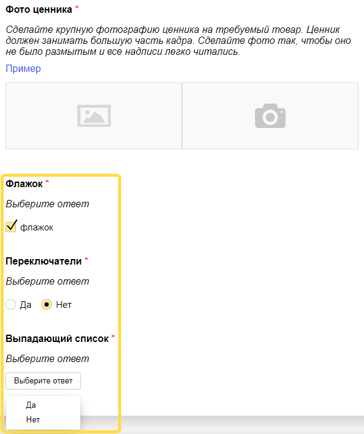

# Добавить варианты ответа

Добавьте новые варианты ответа: флажки, переключатели и выпадающие списки. Переключатель или выпадающий список подойдут, когда вы хотите предоставить один вариант ответа из нескольких предложенных. А флажки подходят, чтобы предоставить выбор любого сочетания из предложенных ответов.



Было:


Стало:





Для вашего удобства мы подготовили код для шаблона «Фото товара и ценника», в котором каждое из полей добавлено по одному разу в первую кнопку для ответа. Используйте этот код для самопроверки. Наши вставки в этом коде вы можете найти поиском слова «кастомизация».







```html
{{#if reviewMode}}
    <div class="header-review">
        <div class="header-review__title">
            not_var{{texts.task_title}}
        </div>
        <div class="header-review__buttons">
            {{#if (equal verdict "ok")}}
                <div class="header-review__btn header-review__btn_green">
                    not_var{{texts.btn_ok.title}}
                </div>
            {{/if}}
            {{#if (equal verdict "no_price")}}
                <div class="header-review__btn header-review__btn_red">
                    not_var{{texts.btn_no_price.title}}
                </div>
            {{/if}}
            {{#if (equal verdict "no_item")}}
                <div class="header-review__btn header-review__btn_red">
                    not_var{{texts.btn_no_item.title}}
                </div>
            {{/if}}
            {{#if (equal verdict "no_shop")}}
                <div class="header-review__btn header-review__btn_red">
                    not_var{{texts.btn_no_shop.title}}
                </div>
            {{/if}}
        </div>
    </div>
not_var{{else}}
    <div class="header">
        not_var{{texts.task_title}}
    </div>
{{/if}}

<div class="info">
    {{#if reviewMode}}
        <div class="info__review">
            <div class="info__review-block">
                <div class="info__title">
                    not_var{{texts.info_name}}
                </div>
                <div class="info__content">
                    not_var{{name}}
                </div>
            </div>
            <div class="info__review-block">
                <div class="info__title">
                    not_var{{texts.info_address}}
                </div>
                <div class="info__content">
                    not_var{{address}}
                </div>
            </div>
        </div>
    not_var{{else}}
        <div class="info__block">
            <div class="info__title">
                not_var{{texts.info_name}}
            </div>
            <div class="info__content">
                not_var{{name}}
            </div>
        </div>
        <div class="info__block">
            <div class="info__title">
                not_var{{texts.info_address}}
            </div>
            <div class="info__content">
                not_var{{address}}
            </div>
        </div>
    {{/if}}
    <div class="info__block">
        <div class="info__title">
            not_var{{texts.info_description}}
        </div>
        <div class="info__content">
            not_var{{product}}
        </div>
    </div>
    <div class="info__block">
        <div class="info__content">
            <a href=not_var{{image}} target="_blank" class="info__link">Ссылка на изображение товара</a>
        </div>
    </div>
</div>

{{#if reviewMode}}
    <div class="review">
        <div class="review__map">
            <div id="{{concat 'map_' id}}" style="width: 100%; height: 400px;"></div>
        </div>
        {{#if (equal verdict "ok")}}
            <div class="review__block">
                <div class="review__title">
                    not_var{{texts.btn_ok.question_1.title}}
                </div>
                <div class="review__imgs-grid">
                    {{#each imgs_facade}}
                        <div class="review__grid-item">
                            <div class="review__grid-inner">
                                
                                <div class="review__rotate-panel">
                                    <span class="review__rotate review__rotate_left">&larr;</span>
                                    <span class="review__rotate review__rotate_right">&rarr;</span>
                                </div>
                            </div>
                        </div>
                    {{/each}}
                </div>
            </div>
            <div class="review__block">
                <div class="review__title">
                    not_var{{texts.btn_ok.question_2.title}}
                </div>
                <div class="review__imgs-grid">
                    {{#each imgs_item}}
                        <div class="review__grid-item">
                            <div class="review__grid-inner">
                                
                                <div class="review__rotate-panel">
                                    <span class="review__rotate review__rotate_left">&larr;</span>
                                    <span class="review__rotate review__rotate_right">&rarr;</span>
                                </div>
                            </div>
                        </div>
                    {{/each}}
                </div>
            </div>
            <div class="review__block">
                <div class="review__title">
                    not_var{{texts.btn_ok.question_3.title}}
                </div>
                <div class="review__imgs-grid">
                    {{#each imgs_price}}
                        <div class="review__grid-item">
                            <div class="review__grid-inner">
                                
                                <div class="review__rotate-panel">
                                    <span class="review__rotate review__rotate_left">&larr;</span>
                                    <span class="review__rotate review__rotate_right">&rarr;</span>
                                </div>
                            </div>
                        </div>
                    {{/each}}
                </div>
            </div>

            <!-- кастомизация начало фрагмента -->
            <!-- флажок -->
            <div class="review__block">
              <div class="review__title">
                not_var{{texts.btn_ok.question_new_checkbox.title}}
              </div>
              <div class="review__box">
                {{field type="checkbox" name="checkbox_result" label="флажок" size="L"}}
              </div>
            </div>

            <!-- переключатель -->
            <div class="review__block">
              <div class="review__title">
                not_var{{texts.btn_ok.question_new_radio.title}}
              </div>
              <div class="review__box">
                {{field type="radio" name="radio_result" label="Да" value="Yes" size="L" validation-show="top-left"}}
                {{field type="radio" name="radio_result" label="Нет" value="No" size="L" validation-show="top-left"}}
              </div>
            </div>

            <!-- выпадающий список -->
            <div class="review__block">
              <div class="review__title">
                not_var{{texts.btn_ok.question_new_select.title}}
              </div>
              <div class="review__box">
                {{#field type="select" name="select_result" placeholder="Выберите ответ" validation-show="top-left"}}
                  {{select_item value="Yes" text="Да"}}
                  {{select_item value="No" text="Нет"}}
                {{/field}}
              </div>
            </div>
            <!-- кастомизация конец фрагмента -->

        {{/if}}
        {{#if (equal verdict "no_price")}}
            <div class="review__block">
                <div class="review__title">
                    not_var{{texts.btn_no_price.question_1.title}}
                </div>
                <div class="review__imgs-grid">
                    {{#each imgs_facade}}
                        <div class="review__grid-item">
                            <div class="review__grid-inner">
                                
                                <div class="review__rotate-panel">
                                    <span class="review__rotate review__rotate_left">&larr;</span>
                                    <span class="review__rotate review__rotate_right">&rarr;</span>
                                </div>
                            </div>
                        </div>
                    {{/each}}
                </div>
            </div>
            <div class="review__block">
                <div class="review__title">
                    not_var{{texts.btn_no_price.question_2.title}}
                </div>
                <div class="review__imgs-grid">
                    {{#each imgs_item}}
                        <div class="review__grid-item">
                            <div class="review__grid-inner">
                                
                                <div class="review__rotate-panel">
                                    <span class="review__rotate review__rotate_left">&larr;</span>
                                    <span class="review__rotate review__rotate_right">&rarr;</span>
                                </div>
                            </div>
                        </div>
                    {{/each}}
                </div>
            </div>
        {{/if}}
        {{#if (equal verdict "no_item")}}
            <div class="review__block">
                <div class="review__title">
                    not_var{{texts.btn_no_item.question_1.title}}
                </div>
                <div class="review__imgs-grid">
                    {{#each imgs_facade}}
                        <div class="review__grid-item">
                            <div class="review__grid-inner">
                                
                                <div class="review__rotate-panel">
                                    <span class="review__rotate review__rotate_left">&larr;</span>
                                    <span class="review__rotate review__rotate_right">&rarr;</span>
                                </div>
                            </div>
                        </div>
                    {{/each}}
                </div>
            </div>
            <div class="review__block">
                <div class="review__title">
                    not_var{{texts.btn_no_item.question_2.title}}
                </div>
                <div class="review__imgs-grid">
                    {{#each imgs_shelf}}
                        <div class="review__grid-item">
                            <div class="review__grid-inner">
                                
                                <div class="review__rotate-panel">
                                    <span class="review__rotate review__rotate_left">&larr;</span>
                                    <span class="review__rotate review__rotate_right">&rarr;</span>
                                </div>
                            </div>
                        </div>
                    {{/each}}
                </div>
            </div>
            {{#if comment}}
                <div class="review__block">
                    <div class="review__title">
                        not_var{{texts.btn_no_item.question_3.title}}
                    </div>
                    <div class="review__comment">
                        {{field type="textarea" name="comment" width="100%" rows=5}}
                    </div>
                </div>
            {{/if}}
        {{/if}}
        {{#if (equal verdict "no_shop")}}
            <div class="review__block">
                <div class="review__title">
                    not_var{{texts.btn_no_shop.question_1.title}}
                </div>
                <div class="review__imgs-grid">
                    {{#each imgs_around}}
                        <div class="review__grid-item">
                            <div class="review__grid-inner">
                                
                                <div class="review__rotate-panel">
                                    <span class="review__rotate review__rotate_left">&larr;</span>
                                    <span class="review__rotate review__rotate_right">&rarr;</span>
                                </div>
                            </div>
                        </div>
                    {{/each}}
                </div>
            </div>
            <div class="review__block">
                <div class="review__title">
                    not_var{{texts.btn_no_shop.question_2.title}}
                </div>
                <div class="review__imgs-grid">
                    {{#each imgs_address}}
                        <div class="review__grid-item">
                            <div class="review__grid-inner">
                                
                                <div class="review__rotate-panel">
                                    <span class="review__rotate review__rotate_left">&larr;</span>
                                    <span class="review__rotate review__rotate_right">&rarr;</span>
                                </div>
                            </div>
                        </div>
                    {{/each}}
                </div>
            </div>
            <div class="review__block">
                <div class="review__title">
                    not_var{{texts.btn_no_shop.question_3.title}}
                </div>
                <div class="review__comment">
                    {{field type="textarea" name="comment" width="100%" rows=5}}
                </div>
            </div>
        {{/if}}
    </div>
not_var{{else}}
    <div class="main">
        <div class="main__title">
            Выберите вариант выполнения задания:
        </div>
        <div class="main__container">
            <div class="main__popup main__popup_hidden">Не выбран ни один вариант ответа</div>
            <div class="main__block">
                <div class="main__btn main__btn_green">
                    not_var{{texts.btn_ok.title}}
                </div>
                <div class="main__content">
                    <div class="main__content-block">
                        <div class="main__content-title main__content-title_req">
                            not_var{{texts.btn_ok.question_1.title}}
                        </div>
                        <div class="main__text">
                            not_var{{texts.btn_ok.question_1.description}}
                        </div>
                        <div class="main__ex">
                            <a href="not_var{{texts.btn_ok.question_1.example_link_1}}" target="_blank" class="main__ex-link">Пример</a>
                        </div>
                        <div class="main__imgs">
                            {{field type="file-img" name="imgs_facade" camera=true preview=true compress=false validation-show="top-left"}}
                        </div>
                    </div>
                    <div class="main__content-block">
                        <div class="main__content-title main__content-title_req">
                            not_var{{texts.btn_ok.question_2.title}}
                        </div>
                        <div class="main__text">
                            not_var{{texts.btn_ok.question_2.description}}
                        </div>
                        <div class="main__ex">
                            <a href="not_var{{texts.btn_ok.question_2.example_link_1}}" target="_blank" class="main__ex-link">Пример</a>
                        </div>
                        <div class="main__imgs">
                            {{field type="file-img" name="imgs_item" camera=true preview=true compress=false validation-show="top-left"}}
                        </div>
                    </div>
                    <div class="main__content-block">
                        <div class="main__content-title main__content-title_req">
                            not_var{{texts.btn_ok.question_3.title}}
                        </div>
                        <div class="main__text">
                            not_var{{texts.btn_ok.question_3.description}}
                        </div>
                        <div class="main__ex">
                            <a href="not_var{{texts.btn_ok.question_3.example_link_1}}" target="_blank" class="main__ex-link">Пример</a>
                        </div>
                        <div class="main__imgs">
                            {{field type="file-img" name="imgs_price" camera=true preview=true compress=false validation-show="top-left"}}
                        </div>
                    </div>

                    <!-- кастомизация начало фрагмента -->
                    <!-- флажок -->
                    <div class="main__content-block">
                      <div class="main__content-title main__content-title_req">
                        not_var{{texts.btn_ok.question_new_checkbox.title}}
                      </div>
                      <div class="main__text">
                        not_var{{texts.btn_ok.question_new_checkbox.description}}
                      </div>
                      <div class="main__box">
                        {{field type="checkbox" name="checkbox_result" label="флажок" size="L"}}
                      </div>
                    </div>

                    <!-- переключатель -->
                    <div class="main__content-block">
                      <div class="main__content-title main__content-title_req">
                        not_var{{texts.btn_ok.question_new_radio.title}}
                      </div>
                      <div class="main__text">
                        not_var{{texts.btn_ok.question_new_radio.description}}
                      </div>
                      <div class="main__box">
                        {{field type="radio" name="radio_result" label="Да" value="Yes" size="L" validation-show="top-left"}}
                        {{field type="radio" name="radio_result" label="Нет" value="No" size="L" validation-show="top-left"}}
                      </div>
                    </div>

                    <!-- выпадающий список -->
                    <div class="main__content-block">
                      <div class="main__content-title main__content-title_req">
                        not_var{{texts.btn_ok.question_new_select.title}}
                      </div>
                      <div class="main__text">
                        not_var{{texts.btn_ok.question_new_select.description}}
                      </div>
                      <div class="main__box">
                        {{#field type="select" name="select_result" placeholder="Выберите ответ" validation-show="top-left"}}
                          {{select_item value="Yes" text="Да"}}
                          {{select_item value="No" text="Нет"}}
                        {{/field}}
                      </div>
                    </div>
                    <!-- кастомизация конец фрагмента -->

                </div>
            </div>
            <div class="main__block">
                <div class="main__btn main__btn_red">
                    not_var{{texts.btn_no_price.title}}
                </div>
                <div class="main__content">
                    <div class="main__content-block">
                        <div class="main__content-title main__content-title_req">
                            not_var{{texts.btn_no_price.question_1.title}}
                        </div>
                        <div class="main__text">
                            not_var{{texts.btn_no_price.question_1.description}}
                        </div>
                        <div class="main__ex">
                            <a href="not_var{{texts.btn_no_price.question_1.example_link_1}}" target="_blank" class="main__ex-link">Пример</a>
                        </div>
                        <div class="main__imgs">
                            {{field type="file-img" name="imgs_facade" camera=true validation-show="top-left"}}
                        </div>
                    </div>
                    <div class="main__content-block">
                        <div class="main__content-title main__content-title_req">
                            not_var{{texts.btn_no_price.question_2.title}}
                        </div>
                        <div class="main__text">
                            not_var{{texts.btn_no_price.question_2.description}}
                        </div>
                        <div class="main__ex">
                            <a href="not_var{{texts.btn_no_price.question_2.example_link_1}}" target="_blank" class="main__ex-link">Пример</a>
                        </div>
                        <div class="main__imgs">
                            {{field type="file-img" name="imgs_item" camera=true validation-show="top-left"}}
                        </div>
                    </div>
                </div>
            </div>
            <div class="main__block">
                <div class="main__btn main__btn_red">
                    not_var{{texts.btn_no_item.title}}
                </div>
                <div class="main__content">
                    <div class="main__content-block">
                        <div class="main__content-title main__content-title_req">
                            not_var{{texts.btn_no_item.question_1.title}}
                        </div>
                        <div class="main__text">
                            not_var{{texts.btn_no_item.question_1.description}}
                        </div>
                        <div class="main__ex">
                            <a href="not_var{{texts.btn_no_item.question_1.example_link_1}}" target="_blank" class="main__ex-link">Пример</a>
                        </div>
                        <div class="main__imgs">
                            {{field type="file-img" name="imgs_facade" camera=true validation-show="top-left"}}
                        </div>
                    </div>
                    <div class="main__content-block">
                        <div class="main__content-title main__content-title_req">
                            not_var{{texts.btn_no_item.question_2.title}}
                        </div>
                        <div class="main__text">
                            not_var{{texts.btn_no_item.question_2.description}}
                        </div>
                        <div class="main__ex">
                            <a href="not_var{{texts.btn_no_item.question_2.example_link_1}}" target="_blank" class="main__ex-link">Пример</a>
                        </div>
                        <div class="main__imgs">
                            {{field type="file-img" name="imgs_shelf" camera=true validation-show="top-left"}}
                        </div>
                    </div>
                    <div class="main__content-block">
                        <div class="main__content-title">
                            not_var{{texts.btn_no_item.question_3.title}}
                        </div>
                        <div class="main__text">
                            not_var{{texts.btn_no_item.question_3.description}}
                        </div>
                        <div class="main__comment">
                            {{field type="textarea" name="comment" width="100%" rows=5 validation-show="top-left"}}
                        </div>
                    </div>
                </div>
            </div>
            <div class="main__block">
                <div class="main__btn main__btn_red">
                    not_var{{texts.btn_no_shop.title}}
                </div>
                <div class="main__content">
                    <div class="main__content-block">
                        <div class="main__text main__text_req">
                            not_var{{texts.btn_no_shop.question_1.description}}
                        </div>
                        <div class="main__imgs">
                            {{field type="file-img" name="imgs_around" camera=true validation-show="top-left"}}
                        </div>
                    </div>
                    <div class="main__content-block">
                        <div class="main__text main__text_req">
                            not_var{{texts.btn_no_shop.question_2.description}}
                        </div>
                        <div class="main__ex">
                            <a href="not_var{{texts.btn_no_shop.question_2.example_link_1}}" target="_blank" class="main__ex-link">Пример</a>
                        </div>
                        <div class="main__imgs">
                            {{field type="file-img" name="imgs_address" camera=true validation-show="top-left"}}
                        </div>
                    </div>
                    <div class="main__content-block">
                        <div class="main__content-title main__content-title_req">
                            not_var{{texts.btn_no_shop.question_3.title}}
                        </div>
                        <div class="main__text">
                            not_var{{texts.btn_no_shop.question_3.description}}
                        </div>
                        <div class="main__comment">
                            {{field type="textarea" name="comment" width="100%" rows=5 validation-show="top-left"}}
                        </div>
                    </div>
                </div>
            </div>
        </div>
    </div>
{{/if}}
```



```html
{{#if reviewMode}}
    <div class="header-review">
        <div class="header-review__title">
            not_var{{texts.task_title}}
        </div>
        <div class="header-review__buttons">
            {{#if (equal verdict "ok")}}
                <div class="header-review__btn header-review__btn_green">
                    not_var{{texts.btn_ok.title}}
                </div>
            {{/if}}
            {{#if (equal verdict "no_price")}}
                <div class="header-review__btn header-review__btn_red">
                    not_var{{texts.btn_no_price.title}}
                </div>
            {{/if}}
            {{#if (equal verdict "no_item")}}
                <div class="header-review__btn header-review__btn_red">
                    not_var{{texts.btn_no_item.title}}
                </div>
            {{/if}}
            {{#if (equal verdict "no_shop")}}
                <div class="header-review__btn header-review__btn_red">
                    not_var{{texts.btn_no_shop.title}}
                </div>
            {{/if}}
        </div>
    </div>
not_var{{else}}
    <div class="header">
        not_var{{texts.task_title}}
    </div>
{{/if}}

<div class="info">
    {{#if reviewMode}}
        <div class="info__review">
            <div class="info__review-block">
                <div class="info__title">
                    not_var{{texts.info_name}}
                </div>
                <div class="info__content">
                    not_var{{name}}
                </div>
            </div>
            <div class="info__review-block">
                <div class="info__title">
                    not_var{{texts.info_address}}
                </div>
                <div class="info__content">
                    not_var{{address}}
                </div>
            </div>
        </div>
    not_var{{else}}
        <div class="info__block">
            <div class="info__title">
                not_var{{texts.info_name}}
            </div>
            <div class="info__content">
                not_var{{name}}
            </div>
        </div>
        <div class="info__block">
            <div class="info__title">
                not_var{{texts.info_address}}
            </div>
            <div class="info__content">
                not_var{{address}}
            </div>
        </div>
    {{/if}}
    <div class="info__block">
        <div class="info__title">
            not_var{{texts.info_description}}
        </div>
        <div class="info__content">
            not_var{{product}}
        </div>
    </div>
    <div class="info__block">
        <div class="info__content">
            <a href=not_var{{image}} target="_blank" class="info__link">Link to the product image</a>
        </div>
    </div>
</div>

{{#if reviewMode}}
    <div class="review">
        <div class="review__map">
            <div id="{{concat 'map_' id}}" style="width: 100%; height: 400px;"></div>
        </div>
        {{#if (equal verdict "ok")}}
            <div class="review__block">
                <div class="review__title">
                    not_var{{texts.btn_ok.question_1.title}}
                </div>
                <div class="review__imgs-grid">
                    {{#each imgs_facade}}
                        <div class="review__grid-item">
                            <div class="review__grid-inner">
                                
                                <div class="review__rotate-panel">
                                    <span class="review__rotate review__rotate_left">←</span>
                                    <span class="review__rotate review__rotate_right">→</span>
                                </div>
                            </div>
                        </div>
                    {{/each}}
                </div>
            </div>
            <div class="review__block">
                <div class="review__title">
                    not_var{{texts.btn_ok.question_2.title}}
                </div>
                <div class="review__imgs-grid">
                    {{#each imgs_item}}
                        <div class="review__grid-item">
                            <div class="review__grid-inner">
                                
                                <div class="review__rotate-panel">
                                    <span class="review__rotate review__rotate_left">←</span>
                                    <span class="review__rotate review__rotate_right">→</span>
                                </div>
                            </div>
                        </div>
                    {{/each}}
                </div>
            </div>
            <div class="review__block">
                <div class="review__title">
                    not_var{{texts.btn_ok.question_3.title}}
                </div>
                <div class="review__imgs-grid">
                    {{#each imgs_price}}
                        <div class="review__grid-item">
                            <div class="review__grid-inner">
                                
                                <div class="review__rotate-panel">
                                    <span class="review__rotate review__rotate_left">←</span>
                                    <span class="review__rotate review__rotate_right">→</span>
                                </div>
                            </div>
                        </div>
                    {{/each}}
                </div>
            </div>

            <!-- customization fragment start -->
            <!-- checkbox -->
            <div class="review__block">
              <div class="review__title">
                not_var{{texts.btn_ok.question_new_checkbox.title}}
              </div>
              <div class="review__box">
                {{field type="checkbox" name="checkbox_result" label="checkbox" size="L"}}
              </div>
            </div>

            <!-- radio button -->
            <div class="review__block">
              <div class="review__title">
                not_var{{texts.btn_ok.question_new_radio.title}}
              </div>
              <div class="review__box">
                {{field type="radio" name="radio_result" label="Yes" value="Yes" size="L" validation-show="top-left"}}
                {{field type="radio" name="radio_result" label="No" value="No" size="L" validation-show="top-left"}}
              </div>
            </div>

            <!-- drop-down list -->
            <div class="review__block">
              <div class="review__title">
                not_var{{texts.btn_ok.question_new_select.title}}
              </div>
              <div class="review__box">
                {{#field type="select" name="select_result" placeholder="Select an answer" validation-show="top-left"}}
                  {{select_item value="Yes" text="Yes"}}
                  {{select_item value="No" text="No"}}
                {{/field}}
              </div>
            </div>
            <!-- customization fragment end -->

        {{/if}}
        {{#if (equal verdict "no_price")}}
            <div class="review__block">
                <div class="review__title">
                    not_var{{texts.btn_no_price.question_1.title}}
                </div>
                <div class="review__imgs-grid">
                    {{#each imgs_facade}}
                        <div class="review__grid-item">
                            <div class="review__grid-inner">
                                
                                <div class="review__rotate-panel">
                                    <span class="review__rotate review__rotate_left">←</span>
                                    <span class="review__rotate review__rotate_right">→</span>
                                </div>
                            </div>
                        </div>
                    {{/each}}
                </div>
            </div>
            <div class="review__block">
                <div class="review__title">
                    not_var{{texts.btn_no_price.question_2.title}}
                </div>
                <div class="review__imgs-grid">
                    {{#each imgs_item}}
                        <div class="review__grid-item">
                            <div class="review__grid-inner">
                                
                                <div class="review__rotate-panel">
                                    <span class="review__rotate review__rotate_left">←</span>
                                    <span class="review__rotate review__rotate_right">→</span>
                                </div>
                            </div>
                        </div>
                    {{/each}}
                </div>
            </div>
        {{/if}}
        {{#if (equal verdict "no_item")}}
            <div class="review__block">
                <div class="review__title">
                    not_var{{texts.btn_no_item.question_1.title}}
                </div>
                <div class="review__imgs-grid">
                    {{#each imgs_facade}}
                        <div class="review__grid-item">
                            <div class="review__grid-inner">
                                
                                <div class="review__rotate-panel">
                                    <span class="review__rotate review__rotate_left">←</span>
                                    <span class="review__rotate review__rotate_right">→</span>
                                </div>
                            </div>
                        </div>
                    {{/each}}
                </div>
            </div>
            <div class="review__block">
                <div class="review__title">
                    not_var{{texts.btn_no_item.question_2.title}}
                </div>
                <div class="review__imgs-grid">
                    {{#each imgs_shelf}}
                        <div class="review__grid-item">
                            <div class="review__grid-inner">
                                
                                <div class="review__rotate-panel">
                                    <span class="review__rotate review__rotate_left">←</span>
                                    <span class="review__rotate review__rotate_right">→</span>
                                </div>
                            </div>
                        </div>
                    {{/each}}
                </div>
            </div>
            {{#if comment}}
                <div class="review__block">
                    <div class="review__title">
                        not_var{{texts.btn_no_item.question_3.title}}
                    </div>
                    <div class="review__comment">
                        {{field type="textarea" name="comment" width="100%" rows=5}}
                    </div>
                </div>
            {{/if}}
        {{/if}}
        {{#if (equal verdict "no_shop")}}
            <div class="review__block">
                <div class="review__title">
                    not_var{{texts.btn_no_shop.question_1.title}}
                </div>
                <div class="review__imgs-grid">
                    {{#each imgs_around}}
                        <div class="review__grid-item">
                            <div class="review__grid-inner">
                                
                                <div class="review__rotate-panel">
                                    <span class="review__rotate review__rotate_left">←</span>
                                    <span class="review__rotate review__rotate_right">→</span>
                                </div>
                            </div>
                        </div>
                    {{/each}}
                </div>
            </div>
            <div class="review__block">
                <div class="review__title">
                    not_var{{texts.btn_no_shop.question_2.title}}
                </div>
                <div class="review__imgs-grid">
                    {{#each imgs_address}}
                        <div class="review__grid-item">
                            <div class="review__grid-inner">
                                
                                <div class="review__rotate-panel">
                                    <span class="review__rotate review__rotate_left">←</span>
                                    <span class="review__rotate review__rotate_right">→</span>
                                </div>
                            </div>
                        </div>
                    {{/each}}
                </div>
            </div>
            <div class="review__block">
                <div class="review__title">
                    not_var{{texts.btn_no_shop.question_3.title}}
                </div>
                <div class="review__comment">
                    {{field type="textarea" name="comment" width="100%" rows=5}}
                </div>
            </div>
        {{/if}}
    </div>
not_var{{else}}
    <div class="main">
        <div class="main__title">
            Select a task completion option:
        </div>
        <div class="main__container">
            <div class="main__popup main__popup_hidden">No option selected</div>
            <div class="main__block">
                <div class="main__btn main__btn_green">
                    not_var{{texts.btn_ok.title}}
                </div>
                <div class="main__content">
                    <div class="main__content-block">
                        <div class="main__content-title main__content-title_req">
                            not_var{{texts.btn_ok.question_1.title}}
                        </div>
                        <div class="main__text">
                            not_var{{texts.btn_ok.question_1.description}}
                        </div>
                        <div class="main__ex">
                            <a href="not_var{{texts.btn_ok.question_1.example_link_1}}" target="_blank" class="main__ex-link">Example</a>
                        </div>
                        <div class="main__imgs">
                            {{field type="file-img" name="imgs_facade" camera=true preview=true compress=false validation-show="top-left"}}
                        </div>
                    </div>
                    <div class="main__content-block">
                        <div class="main__content-title main__content-title_req">
                            not_var{{texts.btn_ok.question_2.title}}
                        </div>
                        <div class="main__text">
                            not_var{{texts.btn_ok.question_2.description}}
                        </div>
                        <div class="main__ex">
                            <a href="not_var{{texts.btn_ok.question_2.example_link_1}}" target="_blank" class="main__ex-link">Example</a>
                        </div>
                        <div class="main__imgs">
                            {{field type="file-img" name="imgs_item" camera=true preview=true compress=false validation-show="top-left"}}
                        </div>
                    </div>
                    <div class="main__content-block">
                        <div class="main__content-title main__content-title_req">
                            not_var{{texts.btn_ok.question_3.title}}
                        </div>
                        <div class="main__text">
                            not_var{{texts.btn_ok.question_3.description}}
                        </div>
                        <div class="main__ex">
                            <a href="not_var{{texts.btn_ok.question_3.example_link_1}}" target="_blank" class="main__ex-link">Example</a>
                        </div>
                        <div class="main__imgs">
                            {{field type="file-img" name="imgs_price" camera=true preview=true compress=false validation-show="top-left"}}
                        </div>
                    </div>

                    <!-- customization fragment start -->
            <!-- checkbox -->
                    <div class="main__content-block">
                      <div class="main__content-title main__content-title_req">
                        not_var{{texts.btn_ok.question_new_checkbox.title}}
                      </div>
                      <div class="main__text">
                        not_var{{texts.btn_ok.question_new_checkbox.description}}
                      </div>
                      <div class="main__box">
                        {{field type="checkbox" name="checkbox_result" label="checkbox" size="L"}}
                      </div>
                    </div>

                    <!-- radio button -->
                    <div class="main__content-block">
                      <div class="main__content-title main__content-title_req">
                        not_var{{texts.btn_ok.question_new_radio.title}}
                      </div>
                      <div class="main__text">
                        not_var{{texts.btn_ok.question_new_radio.description}}
                      </div>
                      <div class="main__box">
                        {{field type="radio" name="radio_result" label="Yes" value="Yes" size="L" validation-show="top-left"}}
                        {{field type="radio" name="radio_result" label="No" value="No" size="L" validation-show="top-left"}}
                      </div>
                    </div>

                    <!-- drop-down list -->
                    <div class="main__content-block">
                      <div class="main__content-title main__content-title_req">
                        not_var{{texts.btn_ok.question_new_select.title}}
                      </div>
                      <div class="main__text">
                        not_var{{texts.btn_ok.question_new_select.description}}
                      </div>
                      <div class="main__box">
                        {{#field type="select" name="select_result" placeholder="Select an answer" validation-show="top-left"}}
                          {{select_item value="Yes" text="Yes"}}
                          {{select_item value="No" text="No"}}
                        {{/field}}
                      </div>
                    </div>
                    <!-- customization fragment end -->

                </div>
            </div>
            <div class="main__block">
                <div class="main__btn main__btn_red">
                    not_var{{texts.btn_no_price.title}}
                </div>
                <div class="main__content">
                    <div class="main__content-block">
                        <div class="main__content-title main__content-title_req">
                            not_var{{texts.btn_no_price.question_1.title}}
                        </div>
                        <div class="main__text">
                            not_var{{texts.btn_no_price.question_1.description}}
                        </div>
                        <div class="main__ex">
                            <a href="not_var{{texts.btn_no_price.question_1.example_link_1}}" target="_blank" class="main__ex-link">Example</a>
                        </div>
                        <div class="main__imgs">
                            {{field type="file-img" name="imgs_facade" camera=true validation-show="top-left"}}
                        </div>
                    </div>
                    <div class="main__content-block">
                        <div class="main__content-title main__content-title_req">
                            not_var{{texts.btn_no_price.question_2.title}}
                        </div>
                        <div class="main__text">
                            not_var{{texts.btn_no_price.question_2.description}}
                        </div>
                        <div class="main__ex">
                            <a href="not_var{{texts.btn_no_price.question_2.example_link_1}}" target="_blank" class="main__ex-link">Example</a>
                        </div>
                        <div class="main__imgs">
                            {{field type="file-img" name="imgs_item" camera=true validation-show="top-left"}}
                        </div>
                    </div>
                </div>
            </div>
            <div class="main__block">
                <div class="main__btn main__btn_red">
                    not_var{{texts.btn_no_item.title}}
                </div>
                <div class="main__content">
                    <div class="main__content-block">
                        <div class="main__content-title main__content-title_req">
                            not_var{{texts.btn_no_item.question_1.title}}
                        </div>
                        <div class="main__text">
                            not_var{{texts.btn_no_item.question_1.description}}
                        </div>
                        <div class="main__ex">
                            <a href="not_var{{texts.btn_no_item.question_1.example_link_1}}" target="_blank" class="main__ex-link">Example</a>
                        </div>
                        <div class="main__imgs">
                            {{field type="file-img" name="imgs_facade" camera=true validation-show="top-left"}}
                        </div>
                    </div>
                    <div class="main__content-block">
                        <div class="main__content-title main__content-title_req">
                            not_var{{texts.btn_no_item.question_2.title}}
                        </div>
                        <div class="main__text">
                            not_var{{texts.btn_no_item.question_2.description}}
                        </div>
                        <div class="main__ex">
                            <a href="not_var{{texts.btn_no_item.question_2.example_link_1}}" target="_blank" class="main__ex-link">Example</a>
                        </div>
                        <div class="main__imgs">
                            {{field type="file-img" name="imgs_shelf" camera=true validation-show="top-left"}}
                        </div>
                    </div>
                    <div class="main__content-block">
                        <div class="main__content-title">
                            not_var{{texts.btn_no_item.question_3.title}}
                        </div>
                        <div class="main__text">
                            not_var{{texts.btn_no_item.question_3.description}}
                        </div>
                        <div class="main__comment">
                            {{field type="textarea" name="comment" width="100%" rows=5 validation-show="top-left"}}
                        </div>
                    </div>
                </div>
            </div>
            <div class="main__block">
                <div class="main__btn main__btn_red">
                    not_var{{texts.btn_no_shop.title}}
                </div>
                <div class="main__content">
                    <div class="main__content-block">
                        <div class="main__text main__text_req">
                            not_var{{texts.btn_no_shop.question_1.description}}
                        </div>
                        <div class="main__imgs">
                            {{field type="file-img" name="imgs_around" camera=true validation-show="top-left"}}
                        </div>
                    </div>
                    <div class="main__content-block">
                        <div class="main__text main__text_req">
                            not_var{{texts.btn_no_shop.question_2.description}}
                        </div>
                        <div class="main__ex">
                            <a href="not_var{{texts.btn_no_shop.question_2.example_link_1}}" target="_blank" class="main__ex-link">Example</a>
                        </div>
                        <div class="main__imgs">
                            {{field type="file-img" name="imgs_address" camera=true validation-show="top-left"}}
                        </div>
                    </div>
                    <div class="main__content-block">
                        <div class="main__content-title main__content-title_req">
                            not_var{{texts.btn_no_shop.question_3.title}}
                        </div>
                        <div class="main__text">
                            not_var{{texts.btn_no_shop.question_3.description}}
                        </div>
                        <div class="main__comment">
                            {{field type="textarea" name="comment" width="100%" rows=5 validation-show="top-left"}}
                        </div>
                    </div>
                </div>
            </div>
        </div>
    </div>
{{/if}}
```









```javascript
var texts = {
    'task_title': 'Фото товара и ценника',
    'info_name': 'Название магазина:',
    'info_address': 'Адрес магазина:',
    'info_description': 'Описание товара:',
    'btn_ok': {
        'title': 'Я нашел ценник на нужный товар',
        'question_1': {
            'title': 'Фото фасада магазина',
            'description': 'Сделайте 2 фото фасада магазина с разных сторон так, чтобы на фото была видна вывеска и название хорошо читалось.',
            'example_link_1': 'https://mt-content-public.s3.yandex.net/instructions/toloka_field_templates/price_org_1_4_6-min.png'
        },
        'question_2': {
            'title': 'Фото товара',
            'description': 'Сделайте несколько фото, чтобы была видна лицевая сторона с названием и атрибутами товара.',
            'example_link_1': 'https://mt-content-public.s3.yandex.net/instructions/toloka_field_templates/price_org_2-min.png'
        },
        'question_3': {
            'title': 'Фото ценника',
            'description': 'Сделайте крупную фотографию ценника на требуемый товар. Ценник должен занимать большую часть кадра. Сделайте фото так, чтобы оно не было размытым и все надписи легко читались.',
            'example_link_1': 'https://mt-content-public.s3.yandex.net/instructions/toloka_field_templates/price_org_3-min.png'
        },

        // кастомизация начало фрагмента
        'question_new_checkbox': {
          'title': 'Флажок',
          'description': 'Выберите ответ'
        },
        'question_new_radio': {
          'title': 'Переключатели',
          'description': 'Выберите ответ'
        },
        'question_new_select': {
          'title': 'Выпадающий список',
          'description': 'Выберите ответ'
        }
        // кастомизация конец фрагмента

    },
    'btn_no_price': {
        'title': 'Товар есть, но без ценника',
        'question_1': {
            'title': 'Фото фасада магазина',
            'description': 'Сделайте 2 фото фасада магазина с разных сторон так, чтобы на фото была видна вывеска и название хорошо читалось.',
            'example_link_1': 'https://mt-content-public.s3.yandex.net/instructions/toloka_field_templates/price_org_1_4_6-min.png'
        },
        'question_2': {
            'title': 'Фото товара',
            'description': 'Сделайте несколько фотографий так, чтобы был виден держатель для ценника и лицевая сторона с названием и атрибутами товара. Необходимо сфотографировать всю область, если товар стоит в несколько рядов.',
            'example_link_1': 'https://mt-content-public.s3.yandex.net/instructions/toloka_field_templates/price_org_5-min.png'
        }
    },
    'btn_no_item': {
        'title': 'Товара нет на полке',
        'question_1': {
            'title': 'Фото фасада магазина',
            'description': 'Сделайте 2 фото фасада магазина с разных сторон так, чтобы на фото была видна вывеска и название хорошо читалось.',
            'example_link_1': 'https://mt-content-public.s3.yandex.net/instructions/toloka_field_templates/price_org_1_4_6-min.png'
        },
        'question_2': {
            'title': 'Фото полок или стеллажа',
            'description': 'Сфотографируйте все полки и стеллажи с товарами той же категории. Должно быть видно название товаров. Захватите на фотографии соседние полки — так будет понятно, что нужного товара действительно нет.',
            'example_link_1': 'https://mt-content-public.s3.yandex.net/instructions/toloka_field_templates/price_org_7-min.png'
        },
        'question_3': {
            'title': 'Комментарии',
            'description': 'Попробуйте узнать у сотрудников магазина причину отсутствия товара на полке и укажите в комментарии (например: товар закончился, товар больше не продается, не было поставки и т.п.)'
        }
    },
    'btn_no_shop': {
        'title': 'Магазин закрыт или отсутствует',
        'question_1': {
            'title': 'Фото здания со всех сторон',
            'description': 'Сфотографируйте со всех сторон здание или место, где должен находиться магазин, так, чтобы можно было убедиться, что нужной организации нет. '
        },
        'question_2': {
            'title': 'Фото таблички с адресом',
            'description': 'Сфотографируйте адресную табличку или информационный лист с адресом магазина на входе.',
            'example_link_1': 'https://mt-content-public.s3.yandex.net/instructions/toloka_field_templates/price_org_8-min.png'
        },
        'question_3': {
            'title': 'Обязательный комментарий',
            'description': 'Напишите причину отсутствия или закрытия магазина (например: на ремонте, закрыт, не удалось найти и пр.).'
        }
    }
};

// Максимальная удаленность исполнителя от магазина в километрах.
var MAX_DISTANCE = 1;

var verdictsOut = ['ok', 'no_price', 'no_item', 'no_shop'];

var injectMaps = function(locale) {
    return new Promise(function(resolve, reject) {
        var script = document.createElement('script');

        script.async = true;
        script.src = "https://api-maps.yandex.ru/2.1/?load=package.full,vectorEngine.preload&lang=" + locale + "_" + locale.toUpperCase() + "&csp=true";
        script.addEventListener('load', resolve);
        script.addEventListener('error', reject);
        script.addEventListener('abort', reject);

        document.head.appendChild(script);
    });
};

var map;

exports.Assignment = extend(TolokaAssignment, function (options) {
    TolokaAssignment.call(this, options);

    var workspaceOptions = this.getWorkspaceOptions();

    if (workspaceOptions.isReviewMode) {
        map = injectMaps('ru');
    }
}, {});

exports.Task = extend(TolokaHandlebarsTask, function (options) {
    TolokaHandlebarsTask.call(this, options);
}, {
    getTemplateData: function() {
        var data = TolokaHandlebarsTask.prototype.getTemplateData.apply(this, arguments);
        var workspaceOptions = this.getWorkspaceOptions();
        var outputValues = this.getSolution().output_values;

        this.setSolutionOutputValue('coordinates', data.coordinates);
        this.setSolutionOutputValue('address', data.address);

        data.id = this.getTask().id;
        data.texts = texts;

        if (workspaceOptions.isReviewMode) {
            data.reviewMode = true;

            if (outputValues.imgs_facade && outputValues.imgs_facade.length > 0) {
                data.imgs_facade = [];
                for (var i = 0; i < outputValues.imgs_facade.length; i++) {
                    data.imgs_facade.push(workspaceOptions.apiOrigin + '/api/attachments/' + outputValues.imgs_facade[i] + '/preview');
                }
            }

            if (outputValues.imgs_item && outputValues.imgs_item.length > 0) {
                data.imgs_item = [];
                for (var i = 0; i < outputValues.imgs_item.length; i++) {
                    data.imgs_item.push(workspaceOptions.apiOrigin + '/api/attachments/' + outputValues.imgs_item[i] + '/preview');
                }
            }

            if (outputValues.imgs_price && outputValues.imgs_price.length > 0) {
                data.imgs_price = [];
                for (var i = 0; i < outputValues.imgs_price.length; i++) {
                    data.imgs_price.push(workspaceOptions.apiOrigin + '/api/attachments/' + outputValues.imgs_price[i] + '/preview');
                }
            }

            if (outputValues.imgs_shelf && outputValues.imgs_shelf.length > 0) {
                data.imgs_shelf = [];
                for (var i = 0; i < outputValues.imgs_shelf.length; i++) {
                    data.imgs_shelf.push(workspaceOptions.apiOrigin + '/api/attachments/' + outputValues.imgs_shelf[i] + '/preview');
                }
            }

            if (outputValues.imgs_address && outputValues.imgs_address.length > 0) {
                data.imgs_address = [];
                for (var i = 0; i < outputValues.imgs_address.length; i++) {
                    data.imgs_address.push(workspaceOptions.apiOrigin + '/api/attachments/' + outputValues.imgs_address[i] + '/preview');
                }
            }

            if (outputValues.imgs_around && outputValues.imgs_around.length > 0) {
                data.imgs_around = [];
                for (var i = 0; i < outputValues.imgs_around.length; i++) {
                    data.imgs_around.push(workspaceOptions.apiOrigin + '/api/attachments/' + outputValues.imgs_around[i] + '/preview');
                }
            }

            if (outputValues.comment) {
                data.comment = outputValues.comment;
            }

            if (outputValues.verdict) {
                data.verdict = outputValues.verdict;
            }
        } else {
            data.reviewMode = false;

            var assId = this.getOptions().assignment._options.assignment.id;
            var taskID = this.getTask().id;
            var solutionStorage = this.storage.getItem('solution_' + assId);

            if (solutionStorage && solutionStorage[taskID]) {
                this.setSolutionOutputValue('verdict', solutionStorage[taskID].verdict);
            }
        }

        return data;
    },
    initFastFileSelector: function() {
        var $el = $(this.getDOMElement()),
            sources = [],
            type = '',
            audioRecorder = $el.find('.audioRecorder');

        $el.find('.field_file-img__upload_camera').each(function (i,el) {
            $(el).on('click',function () {
                sources = ['CAMERA'];
                type = 'IMAGE';
            })
        });

        $el.find(".field_file-img__label").prepend($("<span/>", {class: "field_file-img__upload gallery"}));

        $el.find('.gallery').on('click',function () {
            sources = ['GALLERY'];
            type = 'IMAGE';
        });

        var baseGetFile = this.file.getFile.bind(this.file);
        this.file.getFile = function(options) {
            var promise = baseGetFile(
                _.extend(options, {
                    sources: _.isEmpty(sources) ? ["GALLERY", "CAMERA"] : sources
                })
            );
            sources = ["GALLERY", "CAMERA"];

            return promise;
        };
    },
    onRender: function() {
        this.rendered = true;

        var task = this.getDOMElement();
        var that = this;
        var workspaceOptions = this.getWorkspaceOptions();
        var outputValues = this.getSolution().output_values;

        if (workspaceOptions.isReviewMode) {
            var reviewImgs = task.querySelectorAll('.review__grid-item');
            var initMap = this.initMap.bind(this);

            for (var i = 0; i < reviewImgs.length; i++) {
                reviewImgs[i].addEventListener('click', this.handleImg);
            }

            map.then(function() {
                ymaps.ready(initMap);
            });
        } else if (workspaceOptions.isReadOnly) {
            var mainBlocks = task.querySelectorAll('.main__block');
            var selectedBtnId = verdictsOut.indexOf(outputValues.verdict);

            for (var f = 0; f < mainBlocks.length; f++) {
                if (f === selectedBtnId) {
                    mainBlocks[f].querySelector('.main__content').classList.add('main__content_active');
                    mainBlocks[f].querySelector('.main__btn').classList.add('main__btn_active');
                } else {
                    mainBlocks[f].classList.add('main__block_hidden');
                }
            }

            this.initFastFileSelector();

        } else {
            var btns = task.querySelectorAll('.main__btn');
            var mainBlocks = task.querySelectorAll('.main__block');
            var assId = this.getOptions().assignment._options.assignment.id;
            var taskID = this.getTask().id;
            var solutionStorage = this.storage.getItem('solution_' + assId);

            if (solutionStorage && solutionStorage[taskID]) {
                if (solutionStorage[taskID].selectedBtnId >= 0) {
                    var selectedBtnId = solutionStorage[taskID].selectedBtnId;

                    for (var f = 0; f < mainBlocks.length; f++) {
                        if (f === selectedBtnId) {
                            mainBlocks[f].querySelector('.main__content').classList.add('main__content_active');
                            mainBlocks[f].querySelector('.main__btn').classList.add('main__btn_active');
                        } else {
                            mainBlocks[f].classList.add('main__block_hidden');
                        }
                    }
                }
            }

            for (var i = 0; i < btns.length; i++) {
                btns[i].addEventListener('click', this.handleBtn.bind(this, i, mainBlocks));
            }

            this.initFastFileSelector();

            task.querySelector('.main__popup').addEventListener('click', this.handleMainPopup);
        }
    },
    initMap: function() {
        var inputValues = this.getTask().input_values;
        var outputValues = this.getSolution().output_values;

        if (!inputValues.coordinates || inputValues.coordinates === '') {
            return;
        }

        var coordinates = inputValues.coordinates.split(',');

        var myMap = new ymaps.Map('map_' + inputValues.id, {
            center: coordinates,
            zoom: 15
        });

        var shop = new ymaps.GeoObject({
            geometry: {
                type: "Point",
                coordinates: coordinates
            },
            properties: {
                iconContent: 'Магазин'
            }
        }, {
            preset: 'islands#greenStretchyIcon'
        });

        myMap.geoObjects.add(shop);

        if (outputValues.worker_coordinates) {
            var workerCoordinates = outputValues.worker_coordinates.split(',');

            var worker = new ymaps.GeoObject({
                geometry: {
                    type: "Point",
                    coordinates: workerCoordinates
                },
                properties: {
                    iconContent: 'Исполнитель'
                }
            }, {
                preset: 'islands#blueStretchyIcon'
            });

            myMap.geoObjects.add(worker);
        }
    },
    handleImg: function(e) {
        var img = e.currentTarget.querySelector('.review__img');

        if (e.target.classList.contains('review__rotate_left')) {
            img.dataset.rotationdeg = parseInt(img.dataset.rotationdeg, 10) - 90;
            img.style.transform = 'rotate(' + img.dataset.rotationdeg + 'deg)';
        } else if (e.target.classList.contains('review__rotate_right')) {
            img.dataset.rotationdeg = parseInt(img.dataset.rotationdeg, 10) + 90;
            img.style.transform = 'rotate(' + img.dataset.rotationdeg + 'deg)';
        }

        if (e.target.classList.contains('review__img') || e.target.classList.contains('review__grid-inner')) {
            e.currentTarget.querySelector('.review__grid-inner').classList.toggle('review__grid-inner_zoomed');
        }
    },
    handleBtn: function(i, mainBlocks, e) {
        var mainContent = e.currentTarget.parentNode.querySelector('.main__content');
        var outputValues = this.getSolution().output_values;
        var task = this.getDOMElement();
        var assId = this.getOptions().assignment._options.assignment.id;
        var taskID = this.getTask().id;
        var solutionStorage = this.storage.getItem('solution_' + assId);
        var newSolution = {};
        newSolution[taskID] = {};

        if (!e.currentTarget.classList.contains('main__btn_active')) {
            task.querySelector('.main__popup').classList.add('main__popup_hidden');

            this.setSolutionOutputValue('verdict', verdictsOut[i]);

            e.currentTarget.classList.add('main__btn_active');
            mainContent.classList.add('main__content_active');
            for (var j = 0; j < mainBlocks.length; j++) {
                if (j !== i) {
                    mainBlocks[j].classList.add('main__block_hidden');
                }
            }

            if (assId) {
                if (!solutionStorage) {
                    newSolution[taskID].selectedBtnId = i;
                    newSolution[taskID].verdict = verdictsOut[i];

                    this.storage.setItem('solution_' + assId, newSolution, new Date().getTime() + 21600000);
                } else {
                    if (!solutionStorage[taskID]) {
                        solutionStorage[taskID] = {};
                    }

                    solutionStorage[taskID].selectedBtnId = i;
                    solutionStorage[taskID].verdict = verdictsOut[i];

                    this.storage.setItem('solution_' + assId, solutionStorage, new Date().getTime() + 21600000);
                }
            }
        } else {
            var fields = this._fields;
            var deleteBtnsLength = task.querySelectorAll('.main .file__delete').length;

            for (var h = 0; h < deleteBtnsLength; h++) {
                $(task).find('.main .file__delete').first().trigger('click');
            }

            this.setSolutionOutputValue('verdict', '');
            this.setSolutionOutputValue('comment', '');

            e.currentTarget.classList.remove('main__btn_active');
            mainContent.classList.remove('main__content_active');

            for (var key in fields) {
                if (fields.hasOwnProperty(key)) {
                    for (var p = 0; p < fields[key].length; p++) {
                        fields[key][p].hideError();
                    }
                }
            }

            for (var j = 0; j < mainBlocks.length; j++) {
                if (j !== i) {
                    mainBlocks[j].classList.remove('main__block_hidden');
                }
            }

            if (assId) {
                if (!solutionStorage) {
                    newSolution[taskID].selectedBtnId = -1;
                    newSolution[taskID].verdict = '';
                    this.storage.setItem('solution_' + assId, newSolution, new Date().getTime() + 21600000);
                } else {
                    if (!solutionStorage[taskID]) {
                        solutionStorage[taskID] = {};
                    }

                    solutionStorage[taskID].selectedBtnId = -1;
                    solutionStorage[taskID].verdict = '';
                    this.storage.setItem('solution_' + assId, solutionStorage, new Date().getTime() + 21600000);
                }
            }
        }
    },
    // Функция определения расстояния между точками по их широте и долготе.
    _getDistanceBetweenCoords: function(lat1, lon1, lat2, lon2) {
        var Earth = 6371;
        var x =
            (((lon2 - lon1) * Math.PI) / 180) *
            Math.cos((((lat1 + lat2) / 2) * Math.PI) / 180);
        var y = ((lat2 - lat1) * Math.PI) / 180;
        return Earth * Math.sqrt(x * x + y * y);
    },
    // Функция определения расстояния между двумя точками.
    _getDistance: function(coords1, coords2) {
        var coordFirst = {
            lat: parseFloat(coords1.split(",")[0]),
            lon: parseFloat(coords1.split(",")[1])
        };
        var coordSecond = {
            lat: parseFloat(coords2.split(",")[0]),
            lon: parseFloat(coords2.split(",")[1])
        };

        var dist = this._getDistanceBetweenCoords(
            coordFirst.lat,
            coordFirst.lon,
            coordSecond.lat,
            coordSecond.lon
        );
        return dist;
    },
    checkUserPosition: function(inputValues, outputValues) {
        if (outputValues["worker_coordinates"] &&
            inputValues["coordinates"] && this._getDistance(outputValues["worker_coordinates"], inputValues["coordinates"]) > MAX_DISTANCE) {
            return true;
        } else {
            return false;
        }
    },
    addError: function (message, field, errors) {
        errors || (errors = {
            task_id: this.getOptions().task.id,
            errors: {}
        });
        errors.errors[field] = {
            message: message
        };

        return errors;
    },
    onValidationFail: function (errors) {
        TolokaTask.prototype.onValidationFail.call(this, errors);

        var task = this.getDOMElement();

        _.each(errors.errors, function (error, fieldName) {
            if (fieldName === '__TASK__') {
                this.showTaskError(error.message);
            } else if (fieldName === 'verdict') {
                task.querySelector('.main__popup').classList.remove('main__popup_hidden');
            } else {
                var fields = this._fields[fieldName];

                if (fields) {
                    for (var i = 0; i < fields.length; i++) {
                        fields[i].showError(error);
                    }
                }
            }
        }.bind(this));
    },
    handleMainPopup: function(e) {
        e.currentTarget.classList.add('main__popup_hidden');
    },
    validate: function (solution) {
        this.errors = null;
        var task = this.getDOMElement();
        var input_values = this.getTask().input_values;

        if (!solution.output_values.verdict || solution.output_values.verdict === '') {
            this.errors = this.addError('Не выбран ни один вариант ответа', "verdict", this.errors);
        } else if (solution.output_values.verdict === 'ok') {
            if (!solution.output_values.imgs_facade || solution.output_values.imgs_facade.length === 0) {
                this.errors = this.addError('Нужно приложить фото магазина', "imgs_facade", this.errors);
            } else if (solution.output_values.imgs_facade.length < 2) {
                this.errors = this.addError('Должны быть хотя бы 2 фотографии магазина', "imgs_facade", this.errors);
            }

            if (!solution.output_values.imgs_item || solution.output_values.imgs_item.length === 0) {
                this.errors = this.addError('Нужно приложить фото товара', "imgs_item", this.errors);
            } else if (solution.output_values.imgs_item.length < 2) {
                this.errors = this.addError('Должны быть хотя бы 2 фотографии товара', "imgs_item", this.errors);
            }

            if (!solution.output_values.imgs_price || solution.output_values.imgs_price.length === 0) {
                this.errors = this.addError('Нужно приложить фото ценника', "imgs_price", this.errors);
            }

            // кастомизация начало фрагмента
            if (!solution.output_values.radio_result) {
              this.errors = this.addError('Это обязательное поле', 'radio_result', this.errors);
            }

            if (!solution.output_values.select_result) {
              this.errors = this.addError('Это обязательное поле', 'select_result', this.errors);
            }
            // кастомизация конец фрагмента

        } else if (solution.output_values.verdict === 'no_price') {
            if (!solution.output_values.imgs_facade || solution.output_values.imgs_facade.length === 0) {
                this.errors = this.addError('Нужно приложить фото магазина', "imgs_facade", this.errors);
            } else if (solution.output_values.imgs_facade.length < 2) {
                this.errors = this.addError('Должно быть хотя бы 2 фото магазина', "imgs_facade", this.errors);
            }

            if (!solution.output_values.imgs_item || solution.output_values.imgs_item.length === 0) {
                this.errors = this.addError('Нужно приложить фото товара', "imgs_item", this.errors);
            } else if (solution.output_values.imgs_item.length < 2) {
                this.errors = this.addError('Должны быть хотя бы 2 фотографии товара', "imgs_item", this.errors);
            }
        } else if (solution.output_values.verdict === 'no_item') {
            if (!solution.output_values.imgs_facade || solution.output_values.imgs_facade.length === 0) {
                this.errors = this.addError('Нужно приложить фото магазина', "imgs_facade", this.errors);
            } else if (solution.output_values.imgs_facade.length < 2) {
                this.errors = this.addError('Должны быть хотя бы 2 фотографии магазина', "imgs_facade", this.errors);
            }

            if (!solution.output_values.imgs_shelf || solution.output_values.imgs_shelf.length === 0) {
                this.errors = this.addError('Нужно приложить фото полок/стеллажей', "imgs_shelf", this.errors);
            } else if (solution.output_values.imgs_shelf.length < 2) {
                this.errors = this.addError('Должны быть хотя бы 2 фотографии полок/стеллажей', "imgs_shelf", this.errors);
            }
        } else if (solution.output_values.verdict === 'no_shop') {
            if (!solution.output_values.imgs_around || solution.output_values.imgs_around.length === 0) {
                this.errors = this.addError('Нужно приложить фотографии окружения', "imgs_around", this.errors);
            } else if (solution.output_values.imgs_around.length < 4) {
                this.errors = this.addError('Должны быть хотя бы 4 фотографии окружения', "imgs_around", this.errors);
            }

            if (!solution.output_values.imgs_address || solution.output_values.imgs_address.length === 0) {
                this.errors = this.addError('Нужно приложить фото адресной таблички', "imgs_address", this.errors);
            }

            if (!solution.output_values.comment || solution.output_values.comment.trim() === '') {
                this.errors = this.addError('Нужно написать комментарий', "comment", this.errors);
            }
        }

        if (this.checkUserPosition.call(this, input_values, solution.output_values)) {
            this.errors = this.addError('Вы находитесь слишком далеко от магазина', "__TASK__", this.errors);
        }

        if (!solution.output_values.worker_coordinates) {
            this.errors = this.addError('Не удалось получить ваши координаты. Пожалуйста, включите геолокацию.', "__TASK__", this.errors);
        }

        return this.errors || TolokaHandlebarsTask.prototype.validate.call(this, solution);
    },
    onDestroy: function() {

    }
});

exports.TaskSuite = extend(TolokaHandlebarsTaskSuite, function (options) {
    TolokaHandlebarsTaskSuite.call(this, options);
}, {
    onValidationFail: function (errors) {
        TolokaTaskSuite.prototype.onValidationFail.call(this, errors);

        var tasks = this.getDOMElement().querySelectorAll('.task');

        if (errors && errors.length > 0) {
            var firstError;

            for (var i = 0; i < errors.length; i++) {
                if (errors[i]) {
                    firstError = errors[i];
                    break;
                }
            }

            var firstTaskWithError = tasks[parseInt(firstError.task_id, 10)];
            this.focusTask(parseInt(firstError.task_id, 10));

            _.each(firstError.errors, function (error, fieldName) {
                if (fieldName === '__TASK__') {
                    firstTaskWithError.querySelector('.task__error').scrollIntoView();
                } else if (fieldName === 'verdict') {
                    firstTaskWithError.querySelector('.main__popup').scrollIntoView();
                } else {
                    firstTaskWithError.querySelector('.main__btn_active').parentNode.querySelector('.popup_visible').scrollIntoView();
                }
            }.bind(this));
        }
    },
    focusTask: function(index) {
        TolokaTaskSuite.prototype.focusTask.call(this, index, 'withoutScroll');
    }
});

function extend(ParentClass, constructorFunction, prototypeHash) {
    constructorFunction = constructorFunction || function () {};
    prototypeHash = prototypeHash || {};
    if (ParentClass) {
        constructorFunction.prototype = Object.create(ParentClass.prototype);
    }
    for (var i in prototypeHash) {
        constructorFunction.prototype[i] = prototypeHash[i];
    }
    return constructorFunction;
}
```



```javascript
var texts = {
    'task_title': 'Product and price tag photo',
    'info_name': 'Store name:',
    'info_address': 'Store address:',
    'info_description': 'Product description:',
    'btn_ok': {
        'title': 'I found the price tag for the product',
        'question_1': {
            'title': 'Store facade photo',
            'description': 'Take 2 photos of the store's front from different angles so that its sign and name are clearly visible.',
            'example_link_1': 'https://mt-content-public.s3.yandex.net/instructions/toloka_field_templates/price_org_1_4_6-min.png'
        },
        'question_2': {
            'title': 'Product photo',
            'description': 'Take a few photos of the product so that its front side with the name and details is clearly visible.',
            'example_link_1': 'https://mt-content-public.s3.yandex.net/instructions/toloka_field_templates/price_org_2-min.png'
        },
        'question_3': {
            'title': 'Price tag photo',
            'description': 'Take a close-up photo of the product's price tag. The price tag should take up most of the frame. The photo shouldn't be blurry, and all the text should be easy to read.',
            'example_link_1': 'https://mt-content-public.s3.yandex.net/instructions/toloka_field_templates/price_org_3-min.png'
        },

        // customization fragment start
        'question_new_checkbox': {
          'title': 'Checkbox',
          'description': 'Select an option'
        },
        'question_new_radio': {
          'title': 'Radio buttons',
          'description': 'Select an option'
        },
        'question_new_select': {
          'title': 'Drop-down list',
          'description': 'Select an option'
        }
        // customization fragment end

    },
    'btn_no_price': {
        'title': 'I found the product, but the price tag is missing',
        'question_1': {
            'title': 'Store's front photo',
            'description': 'Take 2 photos of the store's front from different angles so that its sign and name are clearly visible.',
            'example_link_1': 'https://mt-content-public.s3.yandex.net/instructions/toloka_field_templates/price_org_1_4_6-min.png'
        },
        'question_2': {
            'title': 'Product photo',
            'description': 'Take a few photos of the price tag holder and the front side of the product with its name and details clearly visible. If the products are placed in several rows, you need to photograph the entire area.',
            'example_link_1': 'https://mt-content-public.s3.yandex.net/instructions/toloka_field_templates/price_org_5-min.png'
        }
    },
    'btn_no_item': {
        'title': 'The product isn't on the shelf',
        'question_1': {
            'title': 'Store's front photo',
            'description': 'Take 2 photos of the store's front from different angles so that its sign and name are clearly visible.',
            'example_link_1': 'https://mt-content-public.s3.yandex.net/instructions/toloka_field_templates/price_org_1_4_6-min.png'
        },
        'question_2': {
            'title': 'Photos of shelves or racks',
            'description': 'Take photos of all shelves and racks with the products of the same category. The names of the products should be clearly visible. Be sure to capture the neighboring shelves to show that the required product is indeed missing.',
            'example_link_1': 'https://mt-content-public.s3.yandex.net/instructions/toloka_field_templates/price_org_7-min.png'
        },
        'question_3': {
            'title': 'Comments',
            'description': 'Try to find out from the store employees why the product isn't on the shelf and specify the reason in the comments (for example, the product is sold out, the store no longer sells this product, it wasn't delivered, or something else)'
        }
    },
    'btn_no_shop': {
        'title': 'The store is closed or missing',
        'question_1': {
            'title': 'Photos of the building from all sides',
            'description': 'Take photos of the building or place where the store should be from all sides so that they clearly show it's really not there.'
        },
        'question_2': {
            'title': 'Photo of the address plate',
            'description': 'Take a photo of the address plate or information sheet with the store's address at the entrance.',
            'example_link_1': 'https://mt-content-public.s3.yandex.net/instructions/toloka_field_templates/price_org_8-min.png'
        },
        'question_3': {
            'title': 'Mandatory comments',
            'description': 'Specify why the store is closed or missing (for example, under repair, closed, or you couldn't find it).'
        }
    }
};

// Maximum distance of a performer from a store (in kilometers).
var MAX_DISTANCE = 1;

var verdictsOut = ['ok', 'no_price', 'no_item', 'no_shop'];

var injectMaps = function(locale) {
    return new Promise(function(resolve, reject) {
        var script = document.createElement('script');

        script.async = true;
        script.src = "https://api-maps.yandex.ru/2.1/?load=package.full,vectorEngine.preload&lang=" + locale + "_" + locale.toUpperCase() + "&csp=true";
        script.addEventListener('load', resolve);
        script.addEventListener('error', reject);
        script.addEventListener('abort', reject);

        document.head.appendChild(script);
    });
};

var map;

exports.Assignment = extend(TolokaAssignment, function (options) {
    TolokaAssignment.call(this, options);

    var workspaceOptions = this.getWorkspaceOptions();

    if (workspaceOptions.isReviewMode) {
        map = injectMaps('ru');
    }
}, {});

exports.Task = extend(TolokaHandlebarsTask, function (options) {
    TolokaHandlebarsTask.call(this, options);
}, {
    getTemplateData: function() {
        var data = TolokaHandlebarsTask.prototype.getTemplateData.apply(this, arguments);
        var workspaceOptions = this.getWorkspaceOptions();
        var outputValues = this.getSolution().output_values;

        this.setSolutionOutputValue('coordinates', data.coordinates);
        this.setSolutionOutputValue('address', data.address);

        data.id = this.getTask().id;
        data.texts = texts;

        if (workspaceOptions.isReviewMode) {
            data.reviewMode = true;

            if (outputValues.imgs_facade && outputValues.imgs_facade.length > 0) {
                data.imgs_facade = [];
                for (var i = 0; i < outputValues.imgs_facade.length; i++) {
                    data.imgs_facade.push(workspaceOptions.apiOrigin + '/api/attachments/' + outputValues.imgs_facade[i] + '/preview');
                }
            }

            if (outputValues.imgs_item && outputValues.imgs_item.length > 0) {
                data.imgs_item = [];
                for (var i = 0; i < outputValues.imgs_item.length; i++) {
                    data.imgs_item.push(workspaceOptions.apiOrigin + '/api/attachments/' + outputValues.imgs_item[i] + '/preview');
                }
            }

            if (outputValues.imgs_price && outputValues.imgs_price.length > 0) {
                data.imgs_price = [];
                for (var i = 0; i < outputValues.imgs_price.length; i++) {
                    data.imgs_price.push(workspaceOptions.apiOrigin + '/api/attachments/' + outputValues.imgs_price[i] + '/preview');
                }
            }

            if (outputValues.imgs_shelf && outputValues.imgs_shelf.length > 0) {
                data.imgs_shelf = [];
                for (var i = 0; i < outputValues.imgs_shelf.length; i++) {
                    data.imgs_shelf.push(workspaceOptions.apiOrigin + '/api/attachments/' + outputValues.imgs_shelf[i] + '/preview');
                }
            }

            if (outputValues.imgs_address && outputValues.imgs_address.length > 0) {
                data.imgs_address = [];
                for (var i = 0; i < outputValues.imgs_address.length; i++) {
                    data.imgs_address.push(workspaceOptions.apiOrigin + '/api/attachments/' + outputValues.imgs_address[i] + '/preview');
                }
            }

            if (outputValues.imgs_around && outputValues.imgs_around.length > 0) {
                data.imgs_around = [];
                for (var i = 0; i < outputValues.imgs_around.length; i++) {
                    data.imgs_around.push(workspaceOptions.apiOrigin + '/api/attachments/' + outputValues.imgs_around[i] + '/preview');
                }
            }

            if (outputValues.comment) {
                data.comment = outputValues.comment;
            }

            if (outputValues.verdict) {
                data.verdict = outputValues.verdict;
            }
        } else {
            data.reviewMode = false;

            var assId = this.getOptions().assignment._options.assignment.id;
            var taskID = this.getTask().id;
            var solutionStorage = this.storage.getItem('solution_' + assId);

            if (solutionStorage && solutionStorage[taskID]) {
                this.setSolutionOutputValue('verdict', solutionStorage[taskID].verdict);
            }
        }

        return data;
    },
    initFastFileSelector: function() {
        var $el = $(this.getDOMElement()),
            sources = [],
            type = '',
            audioRecorder = $el.find('.audioRecorder');

        $el.find('.field_file-img__upload_camera').each(function (i,el) {
            $(el).on('click',function () {
                sources = ['CAMERA'];
                type = 'IMAGE';
            })
        });

        $el.find(".field_file-img__label").prepend($("<span/>", {class: "field_file-img__upload gallery"}));

        $el.find('.gallery').on('click',function () {
            sources = ['GALLERY'];
            type = 'IMAGE';
        });

        var baseGetFile = this.file.getFile.bind(this.file);
        this.file.getFile = function(options) {
            var promise = baseGetFile(
                _.extend(options, {
                    sources: _.isEmpty(sources) ? ["GALLERY", "CAMERA"] : sources
                })
            );
            sources = ["GALLERY", "CAMERA"];

            return promise;
        };
    },
    onRender: function() {
        this.rendered = true;

        var task = this.getDOMElement();
        var that = this;
        var workspaceOptions = this.getWorkspaceOptions();
        var outputValues = this.getSolution().output_values;

        if (workspaceOptions.isReviewMode) {
            var reviewImgs = task.querySelectorAll('.review__grid-item');
            var initMap = this.initMap.bind(this);

            for (var i = 0; i < reviewImgs.length; i++) {
                reviewImgs[i].addEventListener('click', this.handleImg);
            }

            map.then(function() {
                ymaps.ready(initMap);
            });
        } else if (workspaceOptions.isReadOnly) {
            var mainBlocks = task.querySelectorAll('.main__block');
            var selectedBtnId = verdictsOut.indexOf(outputValues.verdict);

            for (var f = 0; f < mainBlocks.length; f++) {
                if (f === selectedBtnId) {
                    mainBlocks[f].querySelector('.main__content').classList.add('main__content_active');
                    mainBlocks[f].querySelector('.main__btn').classList.add('main__btn_active');
                } else {
                    mainBlocks[f].classList.add('main__block_hidden');
                }
            }

            this.initFastFileSelector();

        } else {
            var btns = task.querySelectorAll('.main__btn');
            var mainBlocks = task.querySelectorAll('.main__block');
            var assId = this.getOptions().assignment._options.assignment.id;
            var taskID = this.getTask().id;
            var solutionStorage = this.storage.getItem('solution_' + assId);

            if (solutionStorage && solutionStorage[taskID]) {
                if (solutionStorage[taskID].selectedBtnId >= 0) {
                    var selectedBtnId = solutionStorage[taskID].selectedBtnId;

                    for (var f = 0; f < mainBlocks.length; f++) {
                        if (f === selectedBtnId) {
                            mainBlocks[f].querySelector('.main__content').classList.add('main__content_active');
                            mainBlocks[f].querySelector('.main__btn').classList.add('main__btn_active');
                        } else {
                            mainBlocks[f].classList.add('main__block_hidden');
                        }
                    }
                }
            }

            for (var i = 0; i < btns.length; i++) {
                btns[i].addEventListener('click', this.handleBtn.bind(this, i, mainBlocks));
            }

            this.initFastFileSelector();

            task.querySelector('.main__popup').addEventListener('click', this.handleMainPopup);
        }
    },
    initMap: function() {
        var inputValues = this.getTask().input_values;
        var outputValues = this.getSolution().output_values;

        if (!inputValues.coordinates || inputValues.coordinates === '') {
            return;
        }

        var coordinates = inputValues.coordinates.split(',');

        var myMap = new ymaps.Map('map_' + inputValues.id, {
            center: coordinates,
            zoom: 15
        });

        var shop = new ymaps.GeoObject({
            geometry: {
                type: "Point",
                coordinates: coordinates
            },
            properties: {
                iconContent: 'Store'
            }
        }, {
            preset: 'islands#greenStretchyIcon'
        });

        myMap.geoObjects.add(shop);

        if (outputValues.worker_coordinates) {
            var workerCoordinates = outputValues.worker_coordinates.split(',');

            var worker = new ymaps.GeoObject({
                geometry: {
                    type: "Point",
                    coordinates: workerCoordinates
                },
                properties: {
                    iconContent: 'Performer'
                }
            }, {
                preset: 'islands#blueStretchyIcon'
            });

            myMap.geoObjects.add(worker);
        }
    },
    handleImg: function(e) {
        var img = e.currentTarget.querySelector('.review__img');

        if (e.target.classList.contains('review__rotate_left')) {
            img.dataset.rotationdeg = parseInt(img.dataset.rotationdeg, 10) - 90;
            img.style.transform = 'rotate(' + img.dataset.rotationdeg + 'deg)';
        } else if (e.target.classList.contains('review__rotate_right')) {
            img.dataset.rotationdeg = parseInt(img.dataset.rotationdeg, 10) + 90;
            img.style.transform = 'rotate(' + img.dataset.rotationdeg + 'deg)';
        }

        if (e.target.classList.contains('review__img') || e.target.classList.contains('review__grid-inner')) {
            e.currentTarget.querySelector('.review__grid-inner').classList.toggle('review__grid-inner_zoomed');
        }
    },
    handleBtn: function(i, mainBlocks, e) {
        var mainContent = e.currentTarget.parentNode.querySelector('.main__content');
        var outputValues = this.getSolution().output_values;
        var task = this.getDOMElement();
        var assId = this.getOptions().assignment._options.assignment.id;
        var taskID = this.getTask().id;
        var solutionStorage = this.storage.getItem('solution_' + assId);
        var newSolution = {};
        newSolution[taskID] = {};

        if (!e.currentTarget.classList.contains('main__btn_active')) {
            task.querySelector('.main__popup').classList.add('main__popup_hidden');

            this.setSolutionOutputValue('verdict', verdictsOut[i]);

            e.currentTarget.classList.add('main__btn_active');
            mainContent.classList.add('main__content_active');
            for (var j = 0; j < mainBlocks.length; j++) {
                if (j !== i) {
                    mainBlocks[j].classList.add('main__block_hidden');
                }
            }

            if (assId) {
                if (!solutionStorage) {
                    newSolution[taskID].selectedBtnId = i;
                    newSolution[taskID].verdict = verdictsOut[i];

                    this.storage.setItem('solution_' + assId, newSolution, new Date().getTime() + 21600000);
                } else {
                    if (!solutionStorage[taskID]) {
                        solutionStorage[taskID] = {};
                    }

                    solutionStorage[taskID].selectedBtnId = i;
                    solutionStorage[taskID].verdict = verdictsOut[i];

                    this.storage.setItem('solution_' + assId, solutionStorage, new Date().getTime() + 21600000);
                }
            }
        } else {
            var fields = this._fields;
            var deleteBtnsLength = task.querySelectorAll('.main .file__delete').length;

            for (var h = 0; h < deleteBtnsLength; h++) {
                $(task).find('.main .file__delete').first().trigger('click');
            }

            this.setSolutionOutputValue('verdict', '');
            this.setSolutionOutputValue('comment', '');

            e.currentTarget.classList.remove('main__btn_active');
            mainContent.classList.remove('main__content_active');

            for (var key in fields) {
                if (fields.hasOwnProperty(key)) {
                    for (var p = 0; p < fields[key].length; p++) {
                        fields[key][p].hideError();
                    }
                }
            }

            for (var j = 0; j < mainBlocks.length; j++) {
                if (j !== i) {
                    mainBlocks[j].classList.remove('main__block_hidden');
                }
            }

            if (assId) {
                if (!solutionStorage) {
                    newSolution[taskID].selectedBtnId = -1;
                    newSolution[taskID].verdict = '';
                    this.storage.setItem('solution_' + assId, newSolution, new Date().getTime() + 21600000);
                } else {
                    if (!solutionStorage[taskID]) {
                        solutionStorage[taskID] = {};
                    }

                    solutionStorage[taskID].selectedBtnId = -1;
                    solutionStorage[taskID].verdict = '';
                    this.storage.setItem('solution_' + assId, solutionStorage, new Date().getTime() + 21600000);
                }
            }
        }
    },
    // A function for determining the distance between points by their latitude and longitude.
    _getDistanceBetweenCoords: function(lat1, lon1, lat2, lon2) {
        var Earth = 6371;
        var x =
            (((lon2 - lon1) * Math.PI) / 180) *
            Math.cos((((lat1 + lat2) / 2) * Math.PI) / 180);
        var y = ((lat2 - lat1) * Math.PI) / 180;
        return Earth * Math.sqrt(x * x + y * y);
    },
    // A function for determining the distance between two points.
    _getDistance: function(coords1, coords2) {
        var coordFirst = {
            lat: parseFloat(coords1.split(",")[0]),
            lon: parseFloat(coords1.split(",")[1])
        };
        var coordSecond = {
            lat: parseFloat(coords2.split(",")[0]),
            lon: parseFloat(coords2.split(",")[1])
        };

        var dist = this._getDistanceBetweenCoords(
            coordFirst.lat,
            coordFirst.lon,
            coordSecond.lat,
            coordSecond.lon
        );
        return dist;
    },
    checkUserPosition: function(inputValues, outputValues) {
        if (outputValues["worker_coordinates"] &&
            inputValues["coordinates"] && this._getDistance(outputValues["worker_coordinates"], inputValues["coordinates"]) > MAX_DISTANCE) {
            return true;
        } else {
            return false;
        }
    },
    addError: function (message, field, errors) {
        errors || (errors = {
            task_id: this.getOptions().task.id,
            errors: {}
        });
        errors.errors[field] = {
            message: message
        };

        return errors;
    },
    onValidationFail: function (errors) {
        TolokaTask.prototype.onValidationFail.call(this, errors);

        var task = this.getDOMElement();

        _.each(errors.errors, function (error, fieldName) {
            if (fieldName === '__TASK__') {
                this.showTaskError(error.message);
            } else if (fieldName === 'verdict') {
                task.querySelector('.main__popup').classList.remove('main__popup_hidden');
            } else {
                var fields = this._fields[fieldName];

                if (fields) {
                    for (var i = 0; i < fields.length; i++) {
                        fields[i].showError(error);
                    }
                }
            }
        }.bind(this));
    },
    handleMainPopup: function(e) {
        e.currentTarget.classList.add('main__popup_hidden');
    },
    validate: function (solution) {
        this.errors = null;
        var task = this.getDOMElement();
        var input_values = this.getTask().input_values;

        if (!solution.output_values.verdict || solution.output_values.verdict === '') {
            this.errors = this.addError('No answer selected', "verdict", this.errors);
        } else if (solution.output_values.verdict === 'ok') {
            if (!solution.output_values.imgs_facade || solution.output_values.imgs_facade.length === 0) {
                this.errors = this.addError('Attach photos of the store', "imgs_facade", this.errors);
            } else if (solution.output_values.imgs_facade.length < 2) {
                this.errors = this.addError('There must be at least 2 photos of the store', "imgs_facade", this.errors);
            }

            if (!solution.output_values.imgs_item || solution.output_values.imgs_item.length === 0) {
                this.errors = this.addError('Attach photos of the product', "imgs_item", this.errors);
            } else if (solution.output_values.imgs_item.length < 2) {
                this.errors = this.addError('There must be at least 2 photos of the product', "imgs_item", this.errors);
            }

            if (!solution.output_values.imgs_price || solution.output_values.imgs_price.length === 0) {
                this.errors = this.addError('Attach a photo of the price tag', "imgs_price", this.errors);
            }

            // customization fragment start
            if (!solution.output_values.radio_result) {
              this.errors = this.addError('This is a required field', 'radio_result', this.errors);
            }

            if (!solution.output_values.select_result) {
              this.errors = this.addError('This is a required field', 'select_result', this.errors);
            }
            // customization fragment end

        } else if (solution.output_values.verdict === 'no_price') {
            if (!solution.output_values.imgs_facade || solution.output_values.imgs_facade.length === 0) {
                this.errors = this.addError('Attach photos of the store', "imgs_facade", this.errors);
            } else if (solution.output_values.imgs_facade.length < 2) {
                this.errors = this.addError('There must be at least 2 photos of the store', "imgs_facade", this.errors);
            }

            if (!solution.output_values.imgs_item || solution.output_values.imgs_item.length === 0) {
                this.errors = this.addError('Attach photos of the product', "imgs_item", this.errors);
            } else if (solution.output_values.imgs_item.length < 2) {
                this.errors = this.addError('There must be at least 2 photos of the product', "imgs_item", this.errors);
            }
        } else if (solution.output_values.verdict === 'no_item') {
            if (!solution.output_values.imgs_facade || solution.output_values.imgs_facade.length === 0) {
                this.errors = this.addError('Attach photos of the store', "imgs_facade", this.errors);
            } else if (solution.output_values.imgs_facade.length < 2) {
                this.errors = this.addError('There must be at least 2 photos of the store', "imgs_facade", this.errors);
            }

            if (!solution.output_values.imgs_shelf || solution.output_values.imgs_shelf.length === 0) {
                this.errors = this.addError('Attach photos of shelves or racks', "imgs_shelf", this.errors);
            } else if (solution.output_values.imgs_shelf.length < 2) {
                this.errors = this.addError('There must be at least 2 photos of shelves or racks', "imgs_shelf", this.errors);
            }
        } else if (solution.output_values.verdict === 'no_shop') {
            if (!solution.output_values.imgs_around || solution.output_values.imgs_around.length === 0) {
                this.errors = this.addError('Attach photos of the surroundings', "imgs_around", this.errors);
            } else if (solution.output_values.imgs_around.length < 4) {
                this.errors = this.addError('There must be at least 4 photos of the surroundings', "imgs_around", this.errors);
            }

            if (!solution.output_values.imgs_address || solution.output_values.imgs_address.length === 0) {
                this.errors = this.addError('Attach a photo of the address plate', "imgs_address", this.errors);
            }

            if (!solution.output_values.comment || solution.output_values.comment.trim() === '') {
                this.errors = this.addError('Write a comment', "comment", this.errors);
            }
        }

        if (this.checkUserPosition.call(this, input_values, solution.output_values)) {
            this.errors = this.addError('You're too far from the store', "__TASK__", this.errors);
        }

        if (!solution.output_values.worker_coordinates) {
            this.errors = this.addError('Couldn't get your coordinates. Please enable location tracking.', "__TASK__", this.errors);
        }

        return this.errors || TolokaHandlebarsTask.prototype.validate.call(this, solution);
    },
    onDestroy: function() {

    }
});

exports.TaskSuite = extend(TolokaHandlebarsTaskSuite, function (options) {
    TolokaHandlebarsTaskSuite.call(this, options);
}, {
    onValidationFail: function (errors) {
        TolokaTaskSuite.prototype.onValidationFail.call(this, errors);

        var tasks = this.getDOMElement().querySelectorAll('.task');

        if (errors && errors.length > 0) {
            var firstError;

            for (var i = 0; i < errors.length; i++) {
                if (errors[i]) {
                    firstError = errors[i];
                    break;
                }
            }

            var firstTaskWithError = tasks[parseInt(firstError.task_id, 10)];
            this.focusTask(parseInt(firstError.task_id, 10));

            _.each(firstError.errors, function (error, fieldName) {
                if (fieldName === '__TASK__') {
                    firstTaskWithError.querySelector('.task__error').scrollIntoView();
                } else if (fieldName === 'verdict') {
                    firstTaskWithError.querySelector('.main__popup').scrollIntoView();
                } else {
                    firstTaskWithError.querySelector('.main__btn_active').parentNode.querySelector('.popup_visible').scrollIntoView();
                }
            }.bind(this));
        }
    },
    focusTask: function(index) {
        TolokaTaskSuite.prototype.focusTask.call(this, index, 'withoutScroll');
    }
});

function extend(ParentClass, constructorFunction, prototypeHash) {
    constructorFunction = constructorFunction || function () {};
    prototypeHash = prototypeHash || {};
    if (ParentClass) {
        constructorFunction.prototype = Object.create(ParentClass.prototype);
    }
    for (var i in prototypeHash) {
        constructorFunction.prototype[i] = prototypeHash[i];
    }
    return constructorFunction;
}
```







Теперь рассмотрим, как добавить каждое поле вручную.



- Добавить флажок

  В шаблоне используется специальный компонент, облегчающий разработку. Подробнее о нем можно прочитать в разделе [Флажок](t-components/checkboxes.md).

  #### Редактирование выходной спецификации

  Добавьте новое поле:

  `checkbox_result` – флажок (логический тип).

  Добавьте столько полей, сколько вам требуется флажков, но придумайте им уникальные имена. Например, если вам нужно три флажка, добавьте три поля с именами `checkbox_result1`, `checkbox_result2` и `checkbox_result3`.

  #### Редактирование HTML

  1. Код HTML состоит из блоков, описывающих различные элементы интерфейса. Каждый блок может содержать внутри себя другие блоки. Таких уровней вложенности может быть несколько. Например, блок с описанием кнопки ответа содержит в себе блоки с полями для заполнения. Каждое поле тоже содержит в себе другие элементы, например, заголовок и поле для комментария.

      Каждый блок оформляется так:

      

      ```html
      `<div class="наименование_блока">`
      <!-- код блока, может содержать вложенные блоки -->
      ...
      </div>
      ```

      

      ```html
      `<div class="block_name">`
      <!-- code for the block that may contain nested blocks -->
      ...
      </div>
      ```

      

  1. Найдите блок `main` (он начинается со строки `<div class="main">`). Внутри него расположены блоки `main__block`, каждый из которых описывает одну из кнопок. Например, в шаблоне «Фото товара и ценника» есть 4 кнопки для ответа, значит, в блоке `main` у этого шаблона будет 4 блока `main__block` для каждой из кнопок.

      У каждой из кнопок есть наименование для обращения к ее свойствам. Например, в шаблоне «Фото товара и ценника» 4 кнопки называются `btn_ok`, `btn_no_price`, `btn_no_item` и `btn_no_shop`. Запомните наименование той кнопки, в код которой добавляете новые поля.

      Внутри блока `main__block` расположен блок `main__content`, который содержит все поля для выбранной кнопки. Описание каждого отдельного поля расположено в блоках `main__content-block`.

      Найдите нужную кнопку `main__block`, в ней найдите поле `main__content-block`, после которого вы хотите добавить новое поле и вставьте после него следующий код:

      

      ```html
      <!-- флажок -->
      <div class="main__content-block">
      <div class="main__content-title main__content-title_req">
      not_var{{texts.btn_ok.question_new_checkbox.title}}
      </div>
      <div class="main__text">
      not_var{{texts.btn_ok.question_new_checkbox.description}}
      </div>
      <div class="main__box">
      {{field type="checkbox" name="checkbox_result" label="флажок" size="L"}}
      </div>
      </div>
      ```

      

      ```html
      <!-- checkbox -->
      <div class="main__content-block">
      <div class="main__content-title main__content-title_req">
      not_var{{texts.btn_ok.question_new_checkbox.title}}
      </div>
      <div class="main__text">
      not_var{{texts.btn_ok.question_new_checkbox.description}}
      </div>
      <div class="main__box">
      {{field type="checkbox" name="checkbox_result" label="checkbox" size="L"}}
      </div>
      </div>
      ```

      

      В этом коде флажок добавляется для кнопки с наименованием `btn_ok`. Если вы добавили флажок для другой кнопки, измените наименование `btn_ok` на нужное.

      Флажки перечислены в блоке `main__box` в виде строк:

      

      ```html
      {{field type="checkbox" name="checkbox_result" label="флажок" size="L"}}
      ```

      

      ```html
      {{field type="checkbox" name="checkbox_result" label="checkbox" size="L"}}
      ```

      

      В коде выше добавлен один флажок. Выходное значение будет передано в поле `checkbox_result`, которое вы добавили в выходную спецификацию.

      Чтобы добавить несколько флажков, вставьте такие же строки столько раз, сколько новых полей этого типа вы добавили в выходную спецификацию. Измените значение параметра `name` для каждого из флажков так, как вы их назвали в выходной спецификации. Например, если вы добавили в выходную спецификацию новые поля для трех флажков, то вставьте эту строку три раза, а затем измените значения `"checkbox_result"` в каждой строке так, как назвали их в спецификации.

      Измените значения параметра `label`. Он содержит подпись, которая отображается рядом с флажком.

  1. Обновите режим приемки.

      Блок `review` содержит в себе код для каждой кнопки в режиме приемки. Этот код расположен в таких блоках:

      

      ```html
      {{#if (equal verdict "ok")}}
      <!-- код для кнопки "ok" в режиме приемки -->
      <div class="review__block">
      <!-- код для поля внутри кнопки "ok" в режиме приемки -->
      ...
      </div>
      ...
      {{/if}}
      ```

      

      ```html
      {{#if (equal verdict "ok")}}
      <!-- code for the "ok" button in acceptance mode -->
      <div class="review__block">
      <!-- code for the "ok" button field in acceptance mode -->
      ...
      </div>
      ...
      {{/if}}
      ```

      

      Переменная `verdict` указана в выходной спецификации, в нее будет передаваться значение ответа для той кнопки, которую нажал исполнитель.

      Например, в шаблоне «Фото товара и ценника» для четырех кнопок описаны четыре значения: `ok`, `no_price`, `no_item` и `no_shop`.

      Блоки `review__block` содержат описание каждого из полей для данной кнопки.

      Найдите нужную кнопку по строке `{{#if (equal verdict "значение_ответа_кнопки")}}`, в ней найдите поле `review__block`, после которого вы хотите добавить новое поле, и вставьте после него следующий код:

      

      ```html
      <!-- флажок -->
      <div class="review__block">
      <div class="review__title">
      not_var{{texts.btn_ok.question_new_checkbox.title}}
      </div>
      <div class="review__box">
      {{field type="checkbox" name="checkbox_result" label="флажок" size="L"}}
      </div>
      </div>
      ```

      

      ```html
      <!-- checkbox -->
      <div class="review__block">
      <div class="review__title">
      not_var{{texts.btn_ok.question_new_checkbox.title}}
      </div>
      <div class="review__box">
      {{field type="checkbox" name="checkbox_result" label="checkbox" size="L"}}
      </div>
      </div>
      ```

      

      

      Флажки перечислены в блоке `review__box` в виде строк:

      

      ```html
      {{field type="checkbox" name="checkbox_result" label="флажок" size="L"}}
      ```

      

      ```html
      {{field type="checkbox" name="checkbox_result" label="checkbox" size="L"}}
      ```

      

      

      

      

  #### Редактирование JS

  1. Код JS состоит из блоков, описывающих различные элементы интерфейса. Эти блоки могут быть вложенными (кнопки содержат набор полей, поля содержат набор элементов и т. д.). Каждый блок заключен в фигурные скобки.

      В общем виде элементы описываются так:

      

      ```plaintext
      'свойство': 'значение'
      ```

      

      ```plaintext
      'property': 'value'
      ```

      

      Значение тоже может состоять из нескольких свойств, в этом случае оно заключается в фигурные скобки и образует следующий уровень вложенности.

  1. В самом начале файла находится константа `texts`, в которой хранятся все необходимые для интерфейса тексты для каждой кнопки.

      У каждой из кнопок есть наименование для обращения к ее свойствам. Например, в шаблоне «Фото товара и ценника» 4 кнопки называются `btn_ok`, `btn_no_price`, `btn_no_item` и `btn_no_shop`. Запомните наименование той кнопки, в код которой добавляете новый текст.

      Например, в шаблоне «Фото товара и ценника» тексты для кнопки `btn_ok` расположены в следующем блоке кода:

      

      ```javascript
      var texts = {
      //<общий текст для заголовков>
      'btn_ok': {
      'title': 'Я нашел ценник на нужный товар',
      'question_1': {
      //<тексты для первого поля (фото фасада магазина)>
      },
      'question_2': {
      //<тексты для второго поля (фото товара)>
      },
      'question_3': {
      //<тексты для третьего поля (фото ценника)>
      }
      },
      ```

      

      ```javascript
      var texts = {
      //<common header text>
      'btn_ok': {
      'title': 'I found the price tag for the product',
      'question_1': {
      //<texts for the first field (photos of the store's front)>
      },
      'question_2': {
      //<texts for the second field (product photos)>
      },
      'question_3': {
      //<texts for the third field (photo of the price tag)>
      }
      },
      ```

      

  1. Чтобы добавить нужные тексты для флажков, поставьте запятую после закрывающей фигурной скобки последнего поля и вставьте следующий код:

      

      ```javascript
      'question_new_checkbox': {
      'title': 'Флажок',
      'description': 'Выберите ответ'
      }
      ```

      

      ```javascript
      'question_new_checkbox': {
      'title': 'Checkbox',
      'description': 'Select an answer'
      }
      ```

      

      Измените значения свойств `title` и `description`. Свойство `title` содержит заголовок, который будет отображаться над всей группой флажков, а `description` — вопрос для исполнителя.

  1. Валидация.

      Флажок может быть снят или установлен, оба значения допустимы, поэтому отдельные правила валидации для флажка не нужны.

      

      Если вы укажете в выходной спецификации поле с флажком как обязательное, это не значит, что оно должно быть заполнено. Флажок имеет логический тип и принимает одно из двух значений: `true` или `false`.

      

- Добавить переключатель

  В шаблоне используется специальный компонент, облегчающий разработку. Подробнее о нем можно прочитать в разделе [Переключатель](t-components/radiobuttons.md).

  #### Редактирование выходной спецификации

  Добавьте новое поле:

  `radio_result` – переключатель (тип строка).

  #### Редактирование HTML

  1. Код HTML состоит из блоков, описывающих различные элементы интерфейса. Каждый блок может содержать внутри себя другие блоки. Таких уровней вложенности может быть несколько. Например, блок с описанием кнопки ответа содержит в себе блоки с полями для заполнения. Каждое поле тоже содержит в себе другие элементы, например, заголовок и поле для комментария.

      Каждый блок оформляется так:

      

      ```html
      `<div class="наименование_блока">`
      <!-- код блока, может содержать вложенные блоки -->
      ...
      </div>
      ```

      

      ```html
      `<div class="block_name">`
      <!-- code for the block that may contain nested blocks -->
      ...
      </div>
      ```

      

  1. 

      

      

      

      

      ```html
      <!-- переключатель -->
      <div class="main__content-block">
      <div class="main__content-title main__content-title_req">
      not_var{{texts.btn_ok.question_new_radio.title}}
      </div>
      <div class="main__text">
      not_var{{texts.btn_ok.question_new_radio.description}}
      </div>
      <div class="main__box">
      {{field type="radio" name="radio_result" label="Да" value="Yes" size="L" validation-show="top-left"}}
      {{field type="radio" name="radio_result" label="Нет" value="No" size="L" validation-show="top-left"}}
      </div>
      </div>
      ```

      

      ```html
      <!-- radio button -->
      <div class="main__content-block">
      <div class="main__content-title main__content-title_req">
      not_var{{texts.btn_ok.question_new_radio.title}}
      </div>
      <div class="main__text">
      not_var{{texts.btn_ok.question_new_radio.description}}
      </div>
      <div class="main__box">
      {{field type="radio" name="radio_result" label="Yes" value="Yes" size="L" validation-show="top-left"}}
      {{field type="radio" name="radio_result" label="No" value="No" size="L" validation-show="top-left"}}
      </div>
      </div>
      ```

      

      В этом коде переключатель добавляется для кнопки с наименованием `btn_ok`. Если вы добавили переключатель для другой кнопки, измените наименование `btn_ok` на нужное.

      Переключатели перечислены в блоке `main__box` в виде строк:

      

      ```html
      {{field type="radio" name="radio_result" label="Да" value="Yes" size="L" validation-show="top-left"}}
      {{field type="radio" name="radio_result" label="Нет" value="No" size="L" validation-show="top-left"}}
      ```

      

      ```html
      {{field type="radio" name="radio_result" label="Yes" value="Yes" size="L" validation-show="top-left"}}
      {{field type="radio" name="radio_result" label="No" value="No" size="L" validation-show="top-left"}}
      ```

      

      В коде выше добавлен переключатель из двух элементов: **Да** и **Нет** с выходными значениями `Yes` и `No`. Выходное значение будет передано в поле `radio_result`, которое вы добавили в выходную спецификацию.

      Чтобы добавить новые элементы, вставьте такие же строки нужное количество раз, затем переименуйте значения параметров `value` (выходное значение) и `label` (подпись для элемента переключателя).

  1. Обновите режим приемки.

      Блок `review` содержит в себе код для каждой кнопки в режиме приемки. Этот код расположен в таких блоках:

      

      ```html
      {{#if (equal verdict "ok")}}
      <!-- код для кнопки "ok" в режиме приемки -->
      <div class="review__block">
      <!-- код для поля внутри кнопки "ok" в режиме приемки -->
      ...
      </div>
      ...
      {{/if}}
      ```

      

      ```html
      {{#if (equal verdict "ok")}}
      <!-- code for the "ok" button in acceptance mode -->
      <div class="review__block">
      <!-- code for the "ok" button field in acceptance mode -->
      ...
      </div>
      ...
      {{/if}}
      ```

      

      Переменная `verdict` указана в выходной спецификации, в нее будет передаваться значение ответа для той кнопки, которую нажал исполнитель.

      Например, в шаблоне «Фото товара и ценника» для 4 кнопок описаны 4 значения: `ok`, `no_price`, `no_item` и `no_shop`.

      Блоки `review__block` содержат описание каждого из полей для данной кнопки.

      Найдите нужную кнопку по строке `{{#if (equal verdict "значение_ответа_кнопки")}}`, в ней найдите поле `review__block`, после которого вы хотите добавить новое поле и вставьте после него следующий код:

      

      ```html
      <!-- переключатель -->
      <div class="review__block">
      <div class="review__title">
      not_var{{texts.btn_ok.question_new_radio.title}}
      </div>
      <div class="review__box">
      {{field type="radio" name="radio_result" label="Да" value="Yes" size="L" validation-show="top-left"}}
      {{field type="radio" name="radio_result" label="Нет" value="No" size="L" validation-show="top-left"}}
      </div>
      </div>
      ```

      

      ```html
      <!-- radio button -->
      <div class="review__block">
      <div class="review__title">
      not_var{{texts.btn_ok.question_new_radio.title}}
      </div>
      <div class="review__box">
      {{field type="radio" name="radio_result" label="Yes" value="Yes" size="L" validation-show="top-left"}}
      {{field type="radio" name="radio_result" label="No" value="No" size="L" validation-show="top-left"}}
      </div>
      </div>
      ```

      

      

      Переключатели перечислены в блоке `review__box` в виде строк:

      

      ```html
      {{field type="radio" name="radio_result" label="Да" value="Yes" size="L" validation-show="top-left"}}
      {{field type="radio" name="radio_result" label="Нет" value="No" size="L" validation-show="top-left"}}
      ```

      

      ```html
      {{field type="radio" name="radio_result" label="Yes" value="Yes" size="L" validation-show="top-left"}}
      {{field type="radio" name="radio_result" label="No" value="No" size="L" validation-show="top-left"}}
      ```

      

      

      

  #### Редактирование JS

  1. Код JS состоит из блоков, описывающих различные элементы интерфейса. Эти блоки могут быть вложенными (кнопки содержат набор полей, поля содержат набор элементов и т. д.). Каждый блок заключен в фигурные скобки.

      В общем виде элементы описываются так:

      

      ```plaintext
      'свойство': 'значение'
      ```

      

      ```plaintext
      'property': 'value'
      ```

      

      Значение тоже может состоять из нескольких свойств, в этом случае оно заключается в фигурные скобки и образует следующий уровень вложенности.

  1. В самом начале файла находится константа `texts`, в которой хранятся все необходимые для интерфейса тексты для каждой кнопки.

      У каждой из кнопок есть наименование для обращения к ее свойствам. Например, в шаблоне «Фото товара и ценника» 4 кнопки называются `btn_ok`, `btn_no_price`, `btn_no_item` и `btn_no_shop`. Запомните наименование той кнопки, в код которой добавляете новый текст.

      Например, в шаблоне «Фото товара и ценника» тексты для кнопки `btn_ok` расположены в следующем блоке кода:

      

      ```javascript
      var texts = {
      //<общий текст для заголовков>
      'btn_ok': {
      'title': 'Я нашел ценник на нужный товар',
      'question_1': {
      //<тексты для первого поля (фото фасада магазина)>
      },
      'question_2': {
      //<тексты для второго поля (фото товара)>
      },
      'question_3': {
      //<тексты для третьего поля (фото ценника)>
      }
      },
      ```

      

      ```javascript
      var texts = {
      //<common header text>
      'btn_ok': {
      'title': 'I found the price tag for the product',
      'question_1': {
      //<texts for the first field (photos of the store's front)>
      },
      'question_2': {
      //<texts for the second field (product photos)>
      },
      'question_3': {
      //<texts for the third field (photo of the price tag)>
      }
      },
      ```

      

  1. Чтобы добавить нужные тексты, поставьте запятую после закрывающей фигурной скобки последнего поля и вставьте следующий код:

      

      ```javascript
      'question_new_radio': {
      'title': 'Переключатели',
      'description': 'Выберите ответ'
      }
      ```

      

      ```javascript
      'question_new_radio': {
      'title': 'Radio buttons',
      'description': 'Select an answer'
      }
      ```

      

      Измените значения свойств `title` и `description`. Свойство `title` содержит заголовок, который будет отображаться над всей группой переключателей, а `description` — вопрос для исполнителя.

  1. Добавьте валидацию.

      Найдите функцию `validate`. В ней находится код для проверки заполнения полей для каждой из кнопок. Например, в шаблоне «Фото товара и ценника» этот код выглядит так:

      

      ```javascript
      if (!solution.output_values.verdict || solution.output_values.verdict === '') {
      this.errors = this.addError('Не выбран ни один вариант ответа', "verdict", this.errors);
      } else if (solution.output_values.verdict === 'ok') {
      // код проверки полей кнопки ok
      if (!solution.output_values.imgs_facade || solution.output_values.imgs_facade.length === 0) {
      // код проверки поля imgs_facade
      }

      if (!solution.output_values.imgs_item || solution.output_values.imgs_item.length === 0) {
      // код проверки поля imgs_item
      }

      if (!solution.output_values.imgs_price || solution.output_values.imgs_price.length === 0) {
      // код проверки поля imgs_price
      }

      } else if (solution.output_values.verdict === 'no_price') {
      // код проверки полей кнопки no_price
      }
      } else if (solution.output_values.verdict === 'no_item') {
      // код проверки полей кнопки no_item
      }
      } else if (solution.output_values.verdict === 'no_shop') {
      // код проверки полей кнопки no_shop
      }
      ```

      

      ```javascript
      if (!solution.output_values.verdict || solution.output_values.verdict === '') {
      this.errors = this.addError('No answer selected', "verdict", this.errors);
      } else if (solution.output_values.verdict === 'ok') {
      // code for checking the ok button fields
      if (!solution.output_values.imgs_facade || solution.output_values.imgs_facade.length === 0) {
      // code for checking the imgs_facade field
      }

      if (!solution.output_values.imgs_item || solution.output_values.imgs_item.length === 0) {
      // code for checking the imgs_item field
      }

      if (!solution.output_values.imgs_price || solution.output_values.imgs_price.length === 0) {
      // code for checking the imgs_price field
      }

      } else if (solution.output_values.verdict === 'no_price') {
      //  code for checking the no_price button fields
      }
      } else if (solution.output_values.verdict === 'no_item') {
      //  code for checking the no_item button fields
      }
      } else if (solution.output_values.verdict === 'no_shop') {
      // code for checking the no_shop button fields
      }
      ```

      

      Значения ответа для кнопок в этом примере, которые передаются в выходную переменную `verdict`, называются так же, как на шаге обновления режима приемки: `ok`, `no_price`, `no_item` и `no_shop`.

      Найдите блок проверки нужной кнопки и внутри него после любого блока проверки поля вида

      

      ```javascript
      if (!solution... ) {
      // код проверки поля
      }
      ```

      

      ```javascript
      if (!solution... ) {
      // field validation code
      }
      ```

      

      добавьте следующий код:

      

      ```javascript
      if (!solution.output_values.radio_result) {
      this.errors = this.addError('Это обязательное поле', 'radio_result', this.errors);
      }
      ```

      

      ```javascript
      if (!solution.output_values.radio_result) {
      this.errors = this.addError('This is a required field', 'radio_result', this.errors);
      }
      ```

      

- Добавить выпадающий список

  В шаблоне используется специальный компонент, облегчающий разработку. Подробнее о нем можно прочитать в разделе [Выпадающий список](t-components/list.md).

  #### Редактирование выходной спецификации

  Добавьте новое поле:

  `select_result` – выпадающий список (тип строка).

  #### Редактирование HTML

  1. Код HTML состоит из блоков, описывающих различные элементы интерфейса. Каждый блок может содержать внутри себя другие блоки. Таких уровней вложенности может быть несколько. Например, блок с описанием кнопки ответа содержит в себе блоки с полями для заполнения. Каждое поле тоже содержит в себе другие элементы, например, заголовок и поле для комментария.

      Каждый блок оформляется так:

      

      ```html
      `<div class="наименование_блока">`
      <!-- код блока, может содержать вложенные блоки -->
      ...
      </div>
      ```

      

      ```html
      `<div class="block_name">`
      <!-- code for the block that may contain nested blocks -->
      ...
      </div>
      ```

      

  1. 

      

      

      

      

      ```html
      <!-- выпадающий список -->
      <div class="main__content-block">
      <div class="main__content-title main__content-title_req">
      not_var{{texts.btn_ok.question_new_select.title}}
      </div>
      <div class="main__text">
      not_var{{texts.btn_ok.question_new_select.description}}
      </div>
      <div class="main__box">
      {{#field type="select" name="select_result" placeholder="Выберите ответ" validation-show="top-left"}}
      {{select_item value="Yes" text="Да"}}
      {{select_item value="No" text="Нет"}}
      {{/field}}
      </div>
      </div>
      ```

      

      ```html
      <!-- drop-down list -->
      <div class="main__content-block">
      <div class="main__content-title main__content-title_req">
      not_var{{texts.btn_ok.question_new_select.title}}
      </div>
      <div class="main__text">
      not_var{{texts.btn_ok.question_new_select.description}}
      </div>
      <div class="main__box">
      {{#field type="select" name="select_result" placeholder="Select an answer" validation-show="top-left"}}
      {{select_item value="Yes" text="Yes"}}
      {{select_item value="No" text="No"}}
      {{/field}}
      </div>
      </div>
      ```

      

      В этом коде выпадающий список добавляется для кнопки с наименованием `btn_ok`. Если вы добавили выпадающий список для другой кнопки, измените наименование `btn_ok` на нужное.

      Элементы выпадающего списка перечислены в блоке `main__box` в виде строк:

      

      ```html
      {{select_item value="Yes" text="Да"}}
      {{select_item value="No" text="Нет"}}
      ```

      

      ```html
      {{select_item value="Yes" text="Yes"}}
      {{select_item value="No" text="No"}}
      ```

      

      В коде выше добавлено всего два элемента списка: **Да** и **Нет** с выходными значениями `Yes` и `No`. Выходное значение будет передано в переменную `select_result`, которую вы добавили в выходную спецификацию.

      Чтобы добавить новые элементы, вставьте такие же строки нужное количество раз и переименуйте значения параметров `value` (выходное значение) и `text` (этот текст будет отображаться в самом выпадающем списке).

  1. Обновите режим приемки.

      Блок `review` содержит в себе код для каждой кнопки в режиме приемки. Этот код расположен в таких блоках:

      

      ```html
      {{#if (equal verdict "ok")}}
      <!-- код для кнопки "ok" в режиме приемки -->
      <div class="review__block">
      <!-- код для поля внутри кнопки "ok" в режиме приемки -->
      ...
      </div>
      ...
      {{/if}}
      ```

      

      ```html
      {{#if (equal verdict "ok")}}
      <!-- code for the "ok" button in acceptance mode -->
      <div class="review__block">
      <!-- code for the "ok" button field in acceptance mode -->
      ...
      </div>
      ...
      {{/if}}
      ```

      

      Поле `verdict` указано в выходной спецификации, в него будет передаваться значение ответа для той кнопки, которую нажал исполнитель.

      Например, в шаблоне «Фото товара и ценника» для 4 кнопок описаны 4 значения: `ok`, `no_price`, `no_item` и `no_shop`.

      Блоки `review__block` содержат описание каждого из полей для данной кнопки.

      Найдите нужную кнопку по строке `{{#if (equal verdict "значение_ответа_кнопки")}}`, в ней найдите поле `review__block`, после которого вы хотите добавить новое поле и вставьте после него следующий код:

      

      ```html
      <!-- выпадающий список -->
      <div class="review__block">
      <div class="review__title">
      not_var{{texts.btn_ok.question_new_select.title}}
      </div>
      <div class="review__box">
      {{#field type="select" name="select_result" placeholder="Выберите ответ" validation-show="top-left"}}
      {{select_item value="Yes" text="Да"}}
      {{select_item value="No" text="Нет"}}
      {{/field}}
      </div>
      </div>
      ```

      

      ```html
      <!-- drop-down list -->
      <div class="review__block">
      <div class="review__title">
      not_var{{texts.btn_ok.question_new_select.title}}
      </div>
      <div class="review__box">
      {{#field type="select" name="select_result" placeholder="Select an answer" validation-show="top-left"}}
      {{select_item value="Yes" text="Yes"}}
      {{select_item value="No" text="No"}}
      {{/field}}
      </div>
      </div>
      ```

      

      Переименуйте наименование кнопки `btn_ok` на нужное.

      Если на предыдущем шаге вы добавили в выпадающий список новые элементы (строки `{{select_item value= ... }}`), то добавьте в этот код такие же строки.

  #### Редактирование JS

  1. Код JS состоит из блоков, описывающих различные элементы интерфейса. Эти блоки могут быть вложенными (кнопки содержат набор полей, поля содержат набор элементов и т. д.). Каждый блок заключен в фигурные скобки.

      В общем виде элементы описываются так:

      

      ```plaintext
      'свойство': 'значение'
      ```

      

      ```plaintext
      'property': 'value'
      ```

      

      Значение тоже может состоять из нескольких свойств, в этом случае оно заключается в фигурные скобки и образует следующий уровень вложенности.

  1. В самом начале файла находится константа `texts`, в которой хранятся все необходимые для интерфейса тексты для каждой кнопки.

      У каждой из кнопок есть наименование для обращения к ее свойствам. Например, в шаблоне «Фото товара и ценника» 4 кнопки называются `btn_ok`, `btn_no_price`, `btn_no_item` и `btn_no_shop`. Запомните наименование той кнопки, в код которой добавляете новый текст.

      Например, в шаблоне «Фото товара и ценника» тексты для кнопки `btn_ok` расположены в следующем блоке кода:

      

      ```javascript
      var texts = {
      //<общий текст для заголовков>
      'btn_ok': {
      'title': 'Я нашел ценник на нужный товар',
      'question_1': {
      //<тексты для первого поля (фото фасада магазина)>
      },
      'question_2': {
      //<тексты для второго поля (фото товара)>
      },
      'question_3': {
      //<тексты для третьего поля (фото ценника)>
      }
      },
      ```

      

      ```javascript
      var texts = {
      //<common header text>
      'btn_ok': {
      'title': 'I found the price tag for the product',
      'question_1': {
      //<texts for the first field (photos of the store's front)>
      },
      'question_2': {
      //<texts for the second field (product photos)>
      },
      'question_3': {
      //<texts for the third field (photo of the price tag)>
      }
      },
      ```

      

  1. Чтобы добавить нужные тексты, поставьте запятую после закрывающей фигурной скобки последнего поля и вставьте следующий код:

      

      ```plaintext
      'question_new_select': {
      'title': 'Выпадающий список',
      'description': 'Выберите ответ'
      }
      ```

      

      ```plaintext
      'question_new_select': {
      'title': 'Drop-down list',
      'description': 'Select an answer'
      }
      ```

      

      Измените значения свойств `title` и `description`. Свойство `title` содержит заголовок, который будет отображаться над выпадающим списком, а `description` — вопрос для исполнителя.

  1. Добавьте валидацию.

      Найдите функцию `validate`. В ней находится код для проверки заполнения полей для каждой из кнопок. Например, в шаблоне «Фото товара и ценника» этот код выглядит так:

      

      ```javascript
      else if (solution.output_values.verdict === 'ok') {
      // код проверки полей кнопки ok
      if (!solution.output_values.imgs_facade || solution.output_values.imgs_facade.length === 0) {
      // код проверки поля imgs_facade
      }

      if (!solution.output_values.imgs_item || solution.output_values.imgs_item.length === 0) {
      // код проверки поля imgs_item
      }

      if (!solution.output_values.imgs_price || solution.output_values.imgs_price.length === 0) {
      // код проверки поля imgs_price
      }

      } else if (solution.output_values.verdict === 'no_price') {
      // код проверки полей кнопки no_price
      }
      } else if (solution.output_values.verdict === 'no_item') {
      // код проверки полей кнопки no_item
      }
      } else if (solution.output_values.verdict === 'no_shop') {
      // код проверки полей кнопки no_shop
      }
      ```

      

      ```javascript
      else if (solution.output_values.verdict === 'ok') {
      // code for checking the ok button fields
      if (!solution.output_values.imgs_facade || solution.output_values.imgs_facade.length === 0) {
      // code for checking the imgs_facade field
      }

      if (!solution.output_values.imgs_item || solution.output_values.imgs_item.length === 0) {
      // code for checking the imgs_item field
      }

      if (!solution.output_values.imgs_price || solution.output_values.imgs_price.length === 0) {
      // code for checking the imgs_price field
      }

      } else if (solution.output_values.verdict === 'no_price') {
      //  code for checking the no_price button fields
      }
      } else if (solution.output_values.verdict === 'no_item') {
      //  code for checking the no_item button fields
      }
      } else if (solution.output_values.verdict === 'no_shop') {
      // code for checking the no_shop button fields
      }
      ```

      

      Значения ответа для кнопок в этом примере, которые передаются в выходное поле `verdict`, называются точно, как на шаге обновления режима приемки: `ok`, `no_price`, `no_item` и `no_shop`.

      Найдите блок проверки нужной кнопки и внутри него после любого блока проверки поля вида

      

      ```javascript
      if (!solution... ) {
      // код проверки поля
      }
      ```

      

      ```javascript
      if (!solution... ) {
      // field validation code
      }
      ```

      

      добавьте следующий код:

      

      ```javascript
      if (!solution.output_values.select_result) {
      this.errors = this.addError('Это обязательное поле', 'select_result', this.errors);
      }
      ```

      

      ```javascript
      if (!solution.output_values.select_result) {
      this.errors = this.addError('This is a required field', 'select_result', this.errors);
      }
      ```

      



