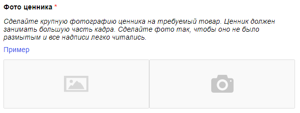
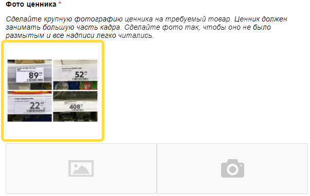

# Добавить картинку



В стандартных шаблонах размещены ссылки на примеры фотографий, которые должен предоставить исполнитель. Но можно отобразить картинку с примером прямо в шаблоне.

Проще всего для этого использовать стандартный компонент Толоки, подробнее о котором можно прочитать в разделе [Картинка](t-components/img.md).



Было:



Стало:





Для вашего удобства мы подготовили код для шаблона «Фото товара и ценника», в котором картинка добавлена в первую кнопку для ответа. Используйте этот код для самопроверки. Наши вставки в этом коде вы можете найти поиском слова «кастомизация».







```html
{{#if reviewMode}}
    <div class="header-review">
        <div class="header-review__title">
            not_var{{texts.task_title}}
        </div>
        <div class="header-review__buttons">
            {{#if (equal verdict "ok")}}
                <div class="header-review__btn header-review__btn_green">
                    not_var{{texts.btn_ok.title}}
                </div>
            {{/if}}
            {{#if (equal verdict "no_price")}}
                <div class="header-review__btn header-review__btn_red">
                    not_var{{texts.btn_no_price.title}}
                </div>
            {{/if}}
            {{#if (equal verdict "no_item")}}
                <div class="header-review__btn header-review__btn_red">
                    not_var{{texts.btn_no_item.title}}
                </div>
            {{/if}}
            {{#if (equal verdict "no_shop")}}
                <div class="header-review__btn header-review__btn_red">
                    not_var{{texts.btn_no_shop.title}}
                </div>
            {{/if}}
        </div>
    </div>
not_var{{else}}
    <div class="header">
        not_var{{texts.task_title}}
    </div>
{{/if}}

<div class="info">
    {{#if reviewMode}}
        <div class="info__review">
            <div class="info__review-block">
                <div class="info__title">
                    not_var{{texts.info_name}}
                </div>
                <div class="info__content">
                    not_var{{name}}
                </div>
            </div>
            <div class="info__review-block">
                <div class="info__title">
                    not_var{{texts.info_address}}
                </div>
                <div class="info__content">
                    not_var{{address}}
                </div>
            </div>
        </div>
    not_var{{else}}
        <div class="info__block">
            <div class="info__title">
                not_var{{texts.info_name}}
            </div>
            <div class="info__content">
                not_var{{name}}
            </div>
        </div>
        <div class="info__block">
            <div class="info__title">
                not_var{{texts.info_address}}
            </div>
            <div class="info__content">
                not_var{{address}}
            </div>
        </div>
    {{/if}}
    <div class="info__block">
        <div class="info__title">
            not_var{{texts.info_description}}
        </div>
        <div class="info__content">
            not_var{{product}}
        </div>
    </div>
    <div class="info__block">
        <div class="info__content">
            <a href=not_var{{image}} target="_blank" class="info__link">Ссылка на изображение товара</a>
        </div>
    </div>
</div>

{{#if reviewMode}}
    <div class="review">
        <div class="review__map">
            <div id="{{concat 'map_' id}}" style="width: 100%; height: 400px;"></div>
        </div>
        {{#if (equal verdict "ok")}}
            <div class="review__block">
                <div class="review__title">
                    not_var{{texts.btn_ok.question_1.title}}
                </div>
                <div class="review__imgs-grid">
                    {{#each imgs_facade}}
                        <div class="review__grid-item">
                            <div class="review__grid-inner">
                                
                                <div class="review__rotate-panel">
                                    <span class="review__rotate review__rotate_left">&larr;</span>
                                    <span class="review__rotate review__rotate_right">&rarr;</span>
                                </div>
                            </div>
                        </div>
                    {{/each}}
                </div>
            </div>
            <div class="review__block">
                <div class="review__title">
                    not_var{{texts.btn_ok.question_2.title}}
                </div>
                <div class="review__imgs-grid">
                    {{#each imgs_item}}
                        <div class="review__grid-item">
                            <div class="review__grid-inner">
                                
                                <div class="review__rotate-panel">
                                    <span class="review__rotate review__rotate_left">&larr;</span>
                                    <span class="review__rotate review__rotate_right">&rarr;</span>
                                </div>
                            </div>
                        </div>
                    {{/each}}
                </div>
            </div>
            <div class="review__block">
                <div class="review__title">
                    not_var{{texts.btn_ok.question_3.title}}
                </div>
                <div class="review__imgs-grid">
                    {{#each imgs_price}}
                        <div class="review__grid-item">
                            <div class="review__grid-inner">
                                
                                <div class="review__rotate-panel">
                                    <span class="review__rotate review__rotate_left">&larr;</span>
                                    <span class="review__rotate review__rotate_right">&rarr;</span>
                                </div>
                            </div>
                        </div>
                    {{/each}}
                </div>
            </div>
        {{/if}}
        {{#if (equal verdict "no_price")}}
            <div class="review__block">
                <div class="review__title">
                    not_var{{texts.btn_no_price.question_1.title}}
                </div>
                <div class="review__imgs-grid">
                    {{#each imgs_facade}}
                        <div class="review__grid-item">
                            <div class="review__grid-inner">
                                
                                <div class="review__rotate-panel">
                                    <span class="review__rotate review__rotate_left">&larr;</span>
                                    <span class="review__rotate review__rotate_right">&rarr;</span>
                                </div>
                            </div>
                        </div>
                    {{/each}}
                </div>
            </div>
            <div class="review__block">
                <div class="review__title">
                    not_var{{texts.btn_no_price.question_2.title}}
                </div>
                <div class="review__imgs-grid">
                    {{#each imgs_item}}
                        <div class="review__grid-item">
                            <div class="review__grid-inner">
                                
                                <div class="review__rotate-panel">
                                    <span class="review__rotate review__rotate_left">&larr;</span>
                                    <span class="review__rotate review__rotate_right">&rarr;</span>
                                </div>
                            </div>
                        </div>
                    {{/each}}
                </div>
            </div>
        {{/if}}
        {{#if (equal verdict "no_item")}}
            <div class="review__block">
                <div class="review__title">
                    not_var{{texts.btn_no_item.question_1.title}}
                </div>
                <div class="review__imgs-grid">
                    {{#each imgs_facade}}
                        <div class="review__grid-item">
                            <div class="review__grid-inner">
                                
                                <div class="review__rotate-panel">
                                    <span class="review__rotate review__rotate_left">&larr;</span>
                                    <span class="review__rotate review__rotate_right">&rarr;</span>
                                </div>
                            </div>
                        </div>
                    {{/each}}
                </div>
            </div>
            <div class="review__block">
                <div class="review__title">
                    not_var{{texts.btn_no_item.question_2.title}}
                </div>
                <div class="review__imgs-grid">
                    {{#each imgs_shelf}}
                        <div class="review__grid-item">
                            <div class="review__grid-inner">
                                
                                <div class="review__rotate-panel">
                                    <span class="review__rotate review__rotate_left">&larr;</span>
                                    <span class="review__rotate review__rotate_right">&rarr;</span>
                                </div>
                            </div>
                        </div>
                    {{/each}}
                </div>
            </div>
            {{#if comment}}
                <div class="review__block">
                    <div class="review__title">
                        not_var{{texts.btn_no_item.question_3.title}}
                    </div>
                    <div class="review__comment">
                        {{field type="textarea" name="comment" width="100%" rows=5}}
                    </div>
                </div>
            {{/if}}
        {{/if}}
        {{#if (equal verdict "no_shop")}}
            <div class="review__block">
                <div class="review__title">
                    not_var{{texts.btn_no_shop.question_1.title}}
                </div>
                <div class="review__imgs-grid">
                    {{#each imgs_around}}
                        <div class="review__grid-item">
                            <div class="review__grid-inner">
                                
                                <div class="review__rotate-panel">
                                    <span class="review__rotate review__rotate_left">&larr;</span>
                                    <span class="review__rotate review__rotate_right">&rarr;</span>
                                </div>
                            </div>
                        </div>
                    {{/each}}
                </div>
            </div>
            <div class="review__block">
                <div class="review__title">
                    not_var{{texts.btn_no_shop.question_2.title}}
                </div>
                <div class="review__imgs-grid">
                    {{#each imgs_address}}
                        <div class="review__grid-item">
                            <div class="review__grid-inner">
                                
                                <div class="review__rotate-panel">
                                    <span class="review__rotate review__rotate_left">&larr;</span>
                                    <span class="review__rotate review__rotate_right">&rarr;</span>
                                </div>
                            </div>
                        </div>
                    {{/each}}
                </div>
            </div>
            <div class="review__block">
                <div class="review__title">
                    not_var{{texts.btn_no_shop.question_3.title}}
                </div>
                <div class="review__comment">
                    {{field type="textarea" name="comment" width="100%" rows=5}}
                </div>
            </div>
        {{/if}}
    </div>
not_var{{else}}
    <div class="main">
        <div class="main__title">
            Выберите вариант выполнения задания:
        </div>
        <div class="main__container">
            <div class="main__popup main__popup_hidden">Не выбран ни один вариант ответа</div>
            <div class="main__block">
                <div class="main__btn main__btn_green">
                    not_var{{texts.btn_ok.title}}
                </div>
                <div class="main__content">
                    <div class="main__content-block">
                        <div class="main__content-title main__content-title_req">
                            not_var{{texts.btn_ok.question_1.title}}
                        </div>
                        <div class="main__text">
                            not_var{{texts.btn_ok.question_1.description}}
                        </div>
                        <div class="main__ex">
                            <a href="not_var{{texts.btn_ok.question_1.example_link_1}}" target="_blank" class="main__ex-link">Пример</a>
                        </div>
                        <div class="main__imgs">
                            {{field type="file-img" name="imgs_facade" camera=true preview=true compress=false validation-show="top-left"}}
                        </div>
                    </div>
                    <div class="main__content-block">
                        <div class="main__content-title main__content-title_req">
                            not_var{{texts.btn_ok.question_2.title}}
                        </div>
                        <div class="main__text">
                            not_var{{texts.btn_ok.question_2.description}}
                        </div>
                        <div class="main__ex">
                            <a href="not_var{{texts.btn_ok.question_2.example_link_1}}" target="_blank" class="main__ex-link">Пример</a>
                        </div>
                        <div class="main__imgs">
                            {{field type="file-img" name="imgs_item" camera=true preview=true compress=false validation-show="top-left"}}
                        </div>
                    </div>
                    <div class="main__content-block">
                        <div class="main__content-title main__content-title_req">
                            not_var{{texts.btn_ok.question_3.title}}
                        </div>
                        <div class="main__text">
                            not_var{{texts.btn_ok.question_3.description}}
                        </div>

                        <!-- кастомизация начало фрагмента -->
                        <div class="main__ex">
                            {{img src=texts.btn_ok.question_3.example_link_1 width="200px" height="200px" class="main-ex__img"}}
                        </div>
                        <!-- кастомизация конец фрагмента -->

                        <div class="main__imgs">
                            {{field type="file-img" name="imgs_price" camera=true preview=true compress=false validation-show="top-left"}}
                        </div>
                    </div>
                </div>
            </div>
            <div class="main__block">
                <div class="main__btn main__btn_red">
                    not_var{{texts.btn_no_price.title}}
                </div>
                <div class="main__content">
                    <div class="main__content-block">
                        <div class="main__content-title main__content-title_req">
                            not_var{{texts.btn_no_price.question_1.title}}
                        </div>
                        <div class="main__text">
                            not_var{{texts.btn_no_price.question_1.description}}
                        </div>
                        <div class="main__ex">
                            <a href="not_var{{texts.btn_no_price.question_1.example_link_1}}" target="_blank" class="main__ex-link">Пример</a>
                        </div>
                        <div class="main__imgs">
                            {{field type="file-img" name="imgs_facade" camera=true validation-show="top-left"}}
                        </div>
                    </div>
                    <div class="main__content-block">
                        <div class="main__content-title main__content-title_req">
                            not_var{{texts.btn_no_price.question_2.title}}
                        </div>
                        <div class="main__text">
                            not_var{{texts.btn_no_price.question_2.description}}
                        </div>
                        <div class="main__ex">
                            <a href="not_var{{texts.btn_no_price.question_2.example_link_1}}" target="_blank" class="main__ex-link">Пример</a>
                        </div>
                        <div class="main__imgs">
                            {{field type="file-img" name="imgs_item" camera=true validation-show="top-left"}}
                        </div>
                    </div>
                </div>
            </div>
            <div class="main__block">
                <div class="main__btn main__btn_red">
                    not_var{{texts.btn_no_item.title}}
                </div>
                <div class="main__content">
                    <div class="main__content-block">
                        <div class="main__content-title main__content-title_req">
                            not_var{{texts.btn_no_item.question_1.title}}
                        </div>
                        <div class="main__text">
                            not_var{{texts.btn_no_item.question_1.description}}
                        </div>
                        <div class="main__ex">
                            <a href="not_var{{texts.btn_no_item.question_1.example_link_1}}" target="_blank" class="main__ex-link">Пример</a>
                        </div>
                        <div class="main__imgs">
                            {{field type="file-img" name="imgs_facade" camera=true validation-show="top-left"}}
                        </div>
                    </div>
                    <div class="main__content-block">
                        <div class="main__content-title main__content-title_req">
                            not_var{{texts.btn_no_item.question_2.title}}
                        </div>
                        <div class="main__text">
                            not_var{{texts.btn_no_item.question_2.description}}
                        </div>
                        <div class="main__ex">
                            <a href="not_var{{texts.btn_no_item.question_2.example_link_1}}" target="_blank" class="main__ex-link">Пример</a>
                        </div>
                        <div class="main__imgs">
                            {{field type="file-img" name="imgs_shelf" camera=true validation-show="top-left"}}
                        </div>
                    </div>
                    <div class="main__content-block">
                        <div class="main__content-title">
                            not_var{{texts.btn_no_item.question_3.title}}
                        </div>
                        <div class="main__text">
                            not_var{{texts.btn_no_item.question_3.description}}
                        </div>
                        <div class="main__comment">
                            {{field type="textarea" name="comment" width="100%" rows=5 validation-show="top-left"}}
                        </div>
                    </div>
                </div>
            </div>
            <div class="main__block">
                <div class="main__btn main__btn_red">
                    not_var{{texts.btn_no_shop.title}}
                </div>
                <div class="main__content">
                    <div class="main__content-block">
                        <div class="main__text main__text_req">
                            not_var{{texts.btn_no_shop.question_1.description}}
                        </div>
                        <div class="main__imgs">
                            {{field type="file-img" name="imgs_around" camera=true validation-show="top-left"}}
                        </div>
                    </div>
                    <div class="main__content-block">
                        <div class="main__text main__text_req">
                            not_var{{texts.btn_no_shop.question_2.description}}
                        </div>
                        <div class="main__ex">
                            <a href="not_var{{texts.btn_no_shop.question_2.example_link_1}}" target="_blank" class="main__ex-link">Пример</a>
                        </div>
                        <div class="main__imgs">
                            {{field type="file-img" name="imgs_address" camera=true validation-show="top-left"}}
                        </div>
                    </div>
                    <div class="main__content-block">
                        <div class="main__content-title main__content-title_req">
                            not_var{{texts.btn_no_shop.question_3.title}}
                        </div>
                        <div class="main__text">
                            not_var{{texts.btn_no_shop.question_3.description}}
                        </div>
                        <div class="main__comment">
                            {{field type="textarea" name="comment" width="100%" rows=5 validation-show="top-left"}}
                        </div>
                    </div>
                </div>
            </div>
        </div>
    </div>
{{/if}}
```



```html
{{#if reviewMode}}
    <div class="header-review">
        <div class="header-review__title">
            not_var{{texts.task_title}}
        </div>
        <div class="header-review__buttons">
            {{#if (equal verdict "ok")}}
                <div class="header-review__btn header-review__btn_green">
                    not_var{{texts.btn_ok.title}}
                </div>
            {{/if}}
            {{#if (equal verdict "no_price")}}
                <div class="header-review__btn header-review__btn_red">
                    not_var{{texts.btn_no_price.title}}
                </div>
            {{/if}}
            {{#if (equal verdict "no_item")}}
                <div class="header-review__btn header-review__btn_red">
                    not_var{{texts.btn_no_item.title}}
                </div>
            {{/if}}
            {{#if (equal verdict "no_shop")}}
                <div class="header-review__btn header-review__btn_red">
                    not_var{{texts.btn_no_shop.title}}
                </div>
            {{/if}}
        </div>
    </div>
not_var{{else}}
    <div class="header">
        not_var{{texts.task_title}}
    </div>
{{/if}}

<div class="info">
    {{#if reviewMode}}
        <div class="info__review">
            <div class="info__review-block">
                <div class="info__title">
                    not_var{{texts.info_name}}
                </div>
                <div class="info__content">
                    not_var{{name}}
                </div>
            </div>
            <div class="info__review-block">
                <div class="info__title">
                    not_var{{texts.info_address}}
                </div>
                <div class="info__content">
                    not_var{{address}}
                </div>
            </div>
        </div>
    not_var{{else}}
        <div class="info__block">
            <div class="info__title">
                not_var{{texts.info_name}}
            </div>
            <div class="info__content">
                not_var{{name}}
            </div>
        </div>
        <div class="info__block">
            <div class="info__title">
                not_var{{texts.info_address}}
            </div>
            <div class="info__content">
                not_var{{address}}
            </div>
        </div>
    {{/if}}
    <div class="info__block">
        <div class="info__title">
            not_var{{texts.info_description}}
        </div>
        <div class="info__content">
            not_var{{product}}
        </div>
    </div>
    <div class="info__block">
        <div class="info__content">
            <a href=not_var{{image}} target="_blank" class="info__link">Link to the product image</a>
        </div>
    </div>
</div>

{{#if reviewMode}}
    <div class="review">
        <div class="review__map">
            <div id="{{concat 'map_' id}}" style="width: 100%; height: 400px;"></div>
        </div>
        {{#if (equal verdict "ok")}}
            <div class="review__block">
                <div class="review__title">
                    not_var{{texts.btn_ok.question_1.title}}
                </div>
                <div class="review__imgs-grid">
                    {{#each imgs_facade}}
                        <div class="review__grid-item">
                            <div class="review__grid-inner">
                                
                                <div class="review__rotate-panel">
                                    <span class="review__rotate review__rotate_left">←</span>
                                    <span class="review__rotate review__rotate_right">→</span>
                                </div>
                            </div>
                        </div>
                    {{/each}}
                </div>
            </div>
            <div class="review__block">
                <div class="review__title">
                    not_var{{texts.btn_ok.question_2.title}}
                </div>
                <div class="review__imgs-grid">
                    {{#each imgs_item}}
                        <div class="review__grid-item">
                            <div class="review__grid-inner">
                                
                                <div class="review__rotate-panel">
                                    <span class="review__rotate review__rotate_left">←</span>
                                    <span class="review__rotate review__rotate_right">→</span>
                                </div>
                            </div>
                        </div>
                    {{/each}}
                </div>
            </div>
            <div class="review__block">
                <div class="review__title">
                    not_var{{texts.btn_ok.question_3.title}}
                </div>
                <div class="review__imgs-grid">
                    {{#each imgs_price}}
                        <div class="review__grid-item">
                            <div class="review__grid-inner">
                                
                                <div class="review__rotate-panel">
                                    <span class="review__rotate review__rotate_left">←</span>
                                    <span class="review__rotate review__rotate_right">→</span>
                                </div>
                            </div>
                        </div>
                    {{/each}}
                </div>
            </div>
        {{/if}}
        {{#if (equal verdict "no_price")}}
            <div class="review__block">
                <div class="review__title">
                    not_var{{texts.btn_no_price.question_1.title}}
                </div>
                <div class="review__imgs-grid">
                    {{#each imgs_facade}}
                        <div class="review__grid-item">
                            <div class="review__grid-inner">
                                
                                <div class="review__rotate-panel">
                                    <span class="review__rotate review__rotate_left">←</span>
                                    <span class="review__rotate review__rotate_right">→</span>
                                </div>
                            </div>
                        </div>
                    {{/each}}
                </div>
            </div>
            <div class="review__block">
                <div class="review__title">
                    not_var{{texts.btn_no_price.question_2.title}}
                </div>
                <div class="review__imgs-grid">
                    {{#each imgs_item}}
                        <div class="review__grid-item">
                            <div class="review__grid-inner">
                                
                                <div class="review__rotate-panel">
                                    <span class="review__rotate review__rotate_left">←</span>
                                    <span class="review__rotate review__rotate_right">→</span>
                                </div>
                            </div>
                        </div>
                    {{/each}}
                </div>
            </div>
        {{/if}}
        {{#if (equal verdict "no_item")}}
            <div class="review__block">
                <div class="review__title">
                    not_var{{texts.btn_no_item.question_1.title}}
                </div>
                <div class="review__imgs-grid">
                    {{#each imgs_facade}}
                        <div class="review__grid-item">
                            <div class="review__grid-inner">
                                
                                <div class="review__rotate-panel">
                                    <span class="review__rotate review__rotate_left">←</span>
                                    <span class="review__rotate review__rotate_right">→</span>
                                </div>
                            </div>
                        </div>
                    {{/each}}
                </div>
            </div>
            <div class="review__block">
                <div class="review__title">
                    not_var{{texts.btn_no_item.question_2.title}}
                </div>
                <div class="review__imgs-grid">
                    {{#each imgs_shelf}}
                        <div class="review__grid-item">
                            <div class="review__grid-inner">
                                
                                <div class="review__rotate-panel">
                                    <span class="review__rotate review__rotate_left">←</span>
                                    <span class="review__rotate review__rotate_right">→</span>
                                </div>
                            </div>
                        </div>
                    {{/each}}
                </div>
            </div>
            {{#if comment}}
                <div class="review__block">
                    <div class="review__title">
                        not_var{{texts.btn_no_item.question_3.title}}
                    </div>
                    <div class="review__comment">
                        {{field type="textarea" name="comment" width="100%" rows=5}}
                    </div>
                </div>
            {{/if}}
        {{/if}}
        {{#if (equal verdict "no_shop")}}
            <div class="review__block">
                <div class="review__title">
                    not_var{{texts.btn_no_shop.question_1.title}}
                </div>
                <div class="review__imgs-grid">
                    {{#each imgs_around}}
                        <div class="review__grid-item">
                            <div class="review__grid-inner">
                                
                                <div class="review__rotate-panel">
                                    <span class="review__rotate review__rotate_left">←</span>
                                    <span class="review__rotate review__rotate_right">→</span>
                                </div>
                            </div>
                        </div>
                    {{/each}}
                </div>
            </div>
            <div class="review__block">
                <div class="review__title">
                    not_var{{texts.btn_no_shop.question_2.title}}
                </div>
                <div class="review__imgs-grid">
                    {{#each imgs_address}}
                        <div class="review__grid-item">
                            <div class="review__grid-inner">
                                
                                <div class="review__rotate-panel">
                                    <span class="review__rotate review__rotate_left">←</span>
                                    <span class="review__rotate review__rotate_right">→</span>
                                </div>
                            </div>
                        </div>
                    {{/each}}
                </div>
            </div>
            <div class="review__block">
                <div class="review__title">
                    not_var{{texts.btn_no_shop.question_3.title}}
                </div>
                <div class="review__comment">
                    {{field type="textarea" name="comment" width="100%" rows=5}}
                </div>
            </div>
        {{/if}}
    </div>
not_var{{else}}
    <div class="main">
        <div class="main__title">
            Select a task completion option:
        </div>
        <div class="main__container">
            <div class="main__popup main__popup_hidden">No response selected</div>
            <div class="main__block">
                <div class="main__btn main__btn_green">
                    not_var{{texts.btn_ok.title}}
                </div>
                <div class="main__content">
                    <div class="main__content-block">
                        <div class="main__content-title main__content-title_req">
                            not_var{{texts.btn_ok.question_1.title}}
                        </div>
                        <div class="main__text">
                            not_var{{texts.btn_ok.question_1.description}}
                        </div>
                        <div class="main__ex">
                            <a href="not_var{{texts.btn_ok.question_1.example_link_1}}" target="_blank" class="main__ex-link">Example</a>
                        </div>
                        <div class="main__imgs">
                            {{field type="file-img" name="imgs_facade" camera=true preview=true compress=false validation-show="top-left"}}
                        </div>
                    </div>
                    <div class="main__content-block">
                        <div class="main__content-title main__content-title_req">
                            not_var{{texts.btn_ok.question_2.title}}
                        </div>
                        <div class="main__text">
                            not_var{{texts.btn_ok.question_2.description}}
                        </div>
                        <div class="main__ex">
                            <a href="not_var{{texts.btn_ok.question_2.example_link_1}}" target="_blank" class="main__ex-link">Example</a>
                        </div>
                        <div class="main__imgs">
                            {{field type="file-img" name="imgs_item" camera=true preview=true compress=false validation-show="top-left"}}
                        </div>
                    </div>
                    <div class="main__content-block">
                        <div class="main__content-title main__content-title_req">
                            not_var{{texts.btn_ok.question_3.title}}
                        </div>
                        <div class="main__text">
                            not_var{{texts.btn_ok.question_3.description}}
                        </div>

                        <!-- customization fragment start -->
                        <div class="main__ex">
                            {{img src=texts.btn_ok.question_3.example_link_1 width="200px" height="200px" class="main-ex__img"}}
                        </div>
                        <!-- customization fragment end -->

                        <div class="main__imgs">
                            {{field type="file-img" name="imgs_price" camera=true preview=true compress=false validation-show="top-left"}}
                        </div>
                    </div>
                </div>
            </div>
            <div class="main__block">
                <div class="main__btn main__btn_red">
                    not_var{{texts.btn_no_price.title}}
                </div>
                <div class="main__content">
                    <div class="main__content-block">
                        <div class="main__content-title main__content-title_req">
                            not_var{{texts.btn_no_price.question_1.title}}
                        </div>
                        <div class="main__text">
                            not_var{{texts.btn_no_price.question_1.description}}
                        </div>
                        <div class="main__ex">
                            <a href="not_var{{texts.btn_no_price.question_1.example_link_1}}" target="_blank" class="main__ex-link">Example</a>
                        </div>
                        <div class="main__imgs">
                            {{field type="file-img" name="imgs_facade" camera=true validation-show="top-left"}}
                        </div>
                    </div>
                    <div class="main__content-block">
                        <div class="main__content-title main__content-title_req">
                            not_var{{texts.btn_no_price.question_2.title}}
                        </div>
                        <div class="main__text">
                            not_var{{texts.btn_no_price.question_2.description}}
                        </div>
                        <div class="main__ex">
                            <a href="not_var{{texts.btn_no_price.question_2.example_link_1}}" target="_blank" class="main__ex-link">Example</a>
                        </div>
                        <div class="main__imgs">
                            {{field type="file-img" name="imgs_item" camera=true validation-show="top-left"}}
                        </div>
                    </div>
                </div>
            </div>
            <div class="main__block">
                <div class="main__btn main__btn_red">
                    not_var{{texts.btn_no_item.title}}
                </div>
                <div class="main__content">
                    <div class="main__content-block">
                        <div class="main__content-title main__content-title_req">
                            not_var{{texts.btn_no_item.question_1.title}}
                        </div>
                        <div class="main__text">
                            not_var{{texts.btn_no_item.question_1.description}}
                        </div>
                        <div class="main__ex">
                            <a href="not_var{{texts.btn_no_item.question_1.example_link_1}}" target="_blank" class="main__ex-link">Example</a>
                        </div>
                        <div class="main__imgs">
                            {{field type="file-img" name="imgs_facade" camera=true validation-show="top-left"}}
                        </div>
                    </div>
                    <div class="main__content-block">
                        <div class="main__content-title main__content-title_req">
                            not_var{{texts.btn_no_item.question_2.title}}
                        </div>
                        <div class="main__text">
                            not_var{{texts.btn_no_item.question_2.description}}
                        </div>
                        <div class="main__ex">
                            <a href="not_var{{texts.btn_no_item.question_2.example_link_1}}" target="_blank" class="main__ex-link">Example</a>
                        </div>
                        <div class="main__imgs">
                            {{field type="file-img" name="imgs_shelf" camera=true validation-show="top-left"}}
                        </div>
                    </div>
                    <div class="main__content-block">
                        <div class="main__content-title">
                            not_var{{texts.btn_no_item.question_3.title}}
                        </div>
                        <div class="main__text">
                            not_var{{texts.btn_no_item.question_3.description}}
                        </div>
                        <div class="main__comment">
                            {{field type="textarea" name="comment" width="100%" rows=5 validation-show="top-left"}}
                        </div>
                    </div>
                </div>
            </div>
            <div class="main__block">
                <div class="main__btn main__btn_red">
                    not_var{{texts.btn_no_shop.title}}
                </div>
                <div class="main__content">
                    <div class="main__content-block">
                        <div class="main__text main__text_req">
                            not_var{{texts.btn_no_shop.question_1.description}}
                        </div>
                        <div class="main__imgs">
                            {{field type="file-img" name="imgs_around" camera=true validation-show="top-left"}}
                        </div>
                    </div>
                    <div class="main__content-block">
                        <div class="main__text main__text_req">
                            not_var{{texts.btn_no_shop.question_2.description}}
                        </div>
                        <div class="main__ex">
                            <a href="not_var{{texts.btn_no_shop.question_2.example_link_1}}" target="_blank" class="main__ex-link">Example</a>
                        </div>
                        <div class="main__imgs">
                            {{field type="file-img" name="imgs_address" camera=true validation-show="top-left"}}
                        </div>
                    </div>
                    <div class="main__content-block">
                        <div class="main__content-title main__content-title_req">
                            not_var{{texts.btn_no_shop.question_3.title}}
                        </div>
                        <div class="main__text">
                            not_var{{texts.btn_no_shop.question_3.description}}
                        </div>
                        <div class="main__comment">
                            {{field type="textarea" name="comment" width="100%" rows=5 validation-show="top-left"}}
                        </div>
                    </div>
                </div>
            </div>
        </div>
    </div>
{{/if}}
```







```css
.task {
    display: block;
    max-width: 1200px;
    margin: 20px auto;
    padding: 0;
    border: none;
}

.task-suite {
    height: 100%;
}

.header {
    font-weight: 700;
    background-color: #c0d1db;
    padding: 15px;
}

.header-review {
    display: -webkit-box;
    display: -ms-flexbox;
    display: flex;
    -webkit-box-pack: justify;
    -ms-flex-pack: justify;
    justify-content: space-between;
    -webkit-box-align: center;
    -ms-flex-align: center;
    align-items: center;
    padding-left: 10px;
    border-bottom: 1px solid #eaeaea;
}

.header-review__title {
    font-weight: 700;
}

.header-review__btn {
    padding: 10px;
    text-align: center;
}

.header-review__btn_green {
    background-color: #87da84;
}

.header-review__btn_red {
    background-color: #ef5f56;
}

.info__review {
    display: -webkit-box;
    display: -ms-flexbox;
    display: flex;
    border-bottom: 1px solid #eaeaea;
}

.info__review-block {
    padding: 10px 0px;
}

.info__review-block:first-child {
    width: 35%;
    -ms-flex-negative: 0;
    flex-shrink: 0;
    margin-right: 15px;
    border-right: 1px solid #eaeaea;
}

.info {
    padding: 0px 10px;
    margin-bottom: 20px;
}

.info__block {
    padding: 10px 0px;
    border-bottom: 1px solid #eaeaea;
}

.info__title {
    padding-bottom: 10px;
}

.info__content {
    font-weight: 700;
}

.info__link {
    color: #314beb;
    text-decoration: none;
}

.main {
    padding-bottom: 15px;
    padding-right: 15px;
    padding-left: 15px;
}

.main__popup {
    position: absolute;
    bottom: 101%;
    left: 50%;
    -webkit-transform: translateX(-50%);
    -ms-transform: translateX(-50%);
    transform: translateX(-50%);
    margin: 0;
    width: 250px;
    max-width: 100%;
    white-space: normal;
    text-align: center;
    font-size: 13px;
    line-height: 20px;
    padding: 2px 8px;
    background: hsla(0,100%,70%,.9);
    color: #fff;
    -webkit-user-select: none;
    -moz-user-select: none;
    -ms-user-select: none;
    user-select: none;
    cursor: pointer;
    z-index: 98;
}

.main__popup_hidden {
    display: none;
}

.main__title {
    margin-bottom: 20px;
}

.main__container {
    padding: 0px 10px;
    position: relative;
}

.main__block {
    margin-bottom: 10px;
}

.main__block:last-child {
    margin-bottom: 0px;
}

.main__block_hidden {
    display: none;
}

.main__btn {
    padding: 20px;
    font-size: 18px;
    border: 1px solid #afc0cb;
    background-color: #c0d1db;
    text-align: center;
}

.main__btn_green.main__btn_active {
    border: 1px solid #84fe81;
    background-color: #87da84;
}

.main__btn_red.main__btn_active {
    background-color: #ef5f56;
}

.main__btn:hover {
    cursor: pointer;
}

.main__content {
    padding: 0px 5px;
    display: none;
}

.main__content_active {
    display: block;
}

.main__content-block {
    padding: 15px 0px;
}

.main__content-title {
    font-weight: 700;
    margin-bottom: 15px;
}

.main__text {
    font-style: italic;
    margin-bottom: 10px;
}

.main__ex {
    margin-bottom: 10px;
}

.main__ex-link {
    color: #314beb;
    text-decoration: none;
}

.main__ex-link:first-child {
    margin-right: 5px;
}

.task__error {
    left: 0;
    right: 0;
    top: 0;
    width: auto;
}

.review__block {
    padding: 15px;
}

.review__title {
    padding-bottom: 5px;
    font-weight: 700;
}

.review__comment {
    padding-top: 10px;
}

.review__imgs-grid {
    display: -webkit-box;
    display: -ms-flexbox;
    display: flex;
    -ms-flex-wrap: wrap;
    flex-wrap: wrap;
    margin: 0px -10px;
}

.review__grid-item {
    margin: 10px;
    width: 350px;
    height: 350px;
    position: relative;
    border: 1px solid #E5E5E5;
    border-radius: 5px;
    overflow: hidden;
}

.review__grid-inner_zoomed {
    position: fixed;
    top: 0px;
    left: 0px;
    width: 100%;
    height: 100%;
    background-color: rgba(0, 0, 0, 0.65);
    z-index: 1000;
    cursor: -webkit-zoom-out;
    cursor: zoom-out;
}

.review__img {
    position: absolute;
    margin: auto;
    top: 0;
    bottom: 0;
    left: 0;
    right: 0;
    cursor: -webkit-zoom-in;
    cursor: zoom-in;
    max-width: 100%;
    max-height: 100%;
}

.review__rotate-panel {
    position: absolute;
    bottom: 0;
    right: 0;
    background-color: rgba(0, 0, 0, 0.65);
    display: -webkit-box;
    display: -ms-flexbox;
    display: flex;
}

.review__rotate {
    cursor: pointer;
    padding: 10px;
    color: #fff;
    font-size: 20px;
}

.review__map {
    padding: 15px;
}

.field_file-img__uploader {
    width: 100%;
    display: block;
    float: none;
    margin-right: 0;
}

.field_file-img__upload {
    display: inline-block;
    width: 50%;
    float: left;
}

.field_file-img_with-preview .field_file-img__label {
    width: 100%;
}

.field_file-img__files__file_with-preview {
    width: 100%;
    margin-right: 0px;
    height: 200px;
}

.field_type_file-img {
    margin-right: 0px;
}

.field_file-img__files {
    white-space: normal;
}

.field_file-img__files__file_with-preview .file__name {
    white-space: normal;
}

.popup__text {
    width: 230px;
}

.field_file-img__files__file_with-preview .file__delete {
    width: 35px;
    height: 35px;
    line-height: 35px;
}

.field_file__files__file {
    display: -webkit-box;
    display: -ms-flexbox;
    display: flex;
}

.icon_clear {
    -ms-flex-negative: 0;
    flex-shrink: 0;
    background-size: 40%;
    background: no-repeat 50% 0;
}

.main__content-title_req:after {
    display: inline-block;
    color: red;
    content: '*';
}

.main__text_req:after {
    display: inline-block;
    color: red;
    content: '*';
}

.task:not(.task_focused) .popup_visible.popup_type_error, .task:not(.task_focused) .task__error {
    opacity: 1;
}

@media screen and (max-width: 767px) {
    .header-review__title {
        margin-right: 10px;
        padding: 10px 0px;
    }
    .info__review {
        -ms-flex-wrap: wrap;
        flex-wrap: wrap;
    }
    .info__review-block:first-child {
        width: 100%;
        -ms-flex-negative: 1;
        flex-shrink: 1;
        margin-right: 0px;
        border-right: none;
        border-bottom: 1px solid #eaeaea;
    }
}

.main-ex__img {
  border: 1px solid #eeeeee;
  border-radius: 5px;
}
```





#### Редактирование HTML

1. Код HTML состоит из блоков, описывающих различные элементы интерфейса. Каждый блок может содержать внутри себя другие блоки. Таких уровней вложенности может быть несколько. Например, блок с описанием кнопки ответа содержит в себе блоки с полями для заполнения. Каждое поле тоже содержит в себе другие элементы, например, заголовок и поле для комментария.

    Каждый блок оформляется так:

    

    ```html
    `<div class="наименование_блока">`
    <!-- код блока, может содержать вложенные блоки -->
    ...
    </div>
    ```

    

    ```html
    `<div class="block_name">`
    <!-- code for the block that may contain nested blocks -->
    ...
    </div>
    ```

    

1. Найдите блок `main` (он начинается со строки `<div class="main">`). Внутри него расположены блоки `main__block`, каждый из которых описывает одну из кнопок. Например, в шаблоне «Фото товара и ценника» есть 4 кнопки для ответа, значит, в блоке `main` у этого шаблона будет 4 блока `main__block` для каждой из кнопок.

    У каждой из кнопок есть наименование для обращения к ее свойствам. Например, в шаблоне «Фото товара и ценника» 4 кнопки называются `btn_ok`, `btn_no_price`, `btn_no_item` и `btn_no_shop`. Запомните наименование той кнопки, в код которой добавляете новые поля.

    Внутри блока `main__block` расположен блок `main__content`, который содержит все поля для выбранной кнопки. Описание каждого отдельного поля расположено в блоках `main__content-block`.

    Найдите нужную кнопку `main__block`, в ней найдите поле `main__content-block` со ссылкой на пример картинки, вместо которой вы хотите отобразить саму картинку. Ссылка на пример картинки расположена в блоке `main__ex` в таком виде:

    

    ```html
    <div class="main__ex">
    <a href="not_var{{texts.btn_ok.question_3.example_link_1}}" target="_blank" class="main__ex-link">Пример</a>
    </div>
    ```

    

    ```html
    <div class="main__ex">
    <a href="not_var{{texts.btn_ok.question_3.example_link_1}}" target="_blank" class="main__ex-link">Example</a>
    </div>
    ```

    

    Замените ссылку на компонент `img` так, чтобы код выглядел следующим образом:

    ```html
    <div class="main__ex">
    {{img src=texts.btn_ok.question_3.example_link_1 width="200px" height="200px" class="main-ex__img"}}
    </div>
    ```

    В этом коде картинка добавляется для кнопки с наименованием `btn_ok`. Если вы добавили картинку для другой кнопки, измените наименование `btn_ok` на нужное.

    Проверьте, чтобы параметр `texts.btn_ok.question_3.example_link_1` был таким же, как и до замены ссылки на компонент `img`. Этот параметр содержит саму ссылку на картинку и описывается в виде константы в блоке JS-кода.

#### Редактирование CSS

В конце блока с кодом CSS вставьте стили для картинок:

```css
.main-ex__img {
  border: 1px solid #eeeeee;
  border-radius: 5px;
}
```

