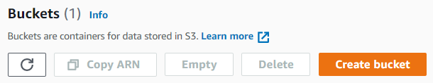
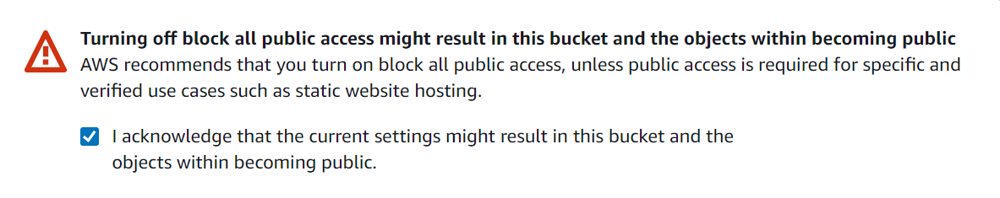
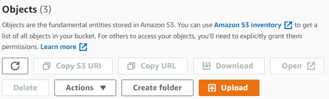
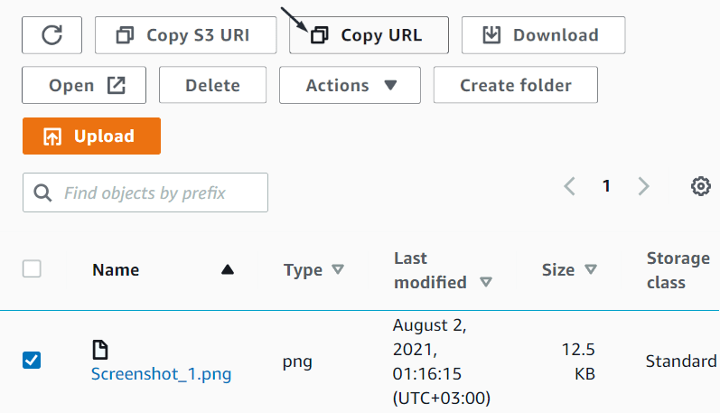

# Amazon S3



Если вы хотите разместить небольшое количество картинок, вы можете воспользоваться любым фотохостингом, например: [imgbb]({{ imgbb }}), [ImageShack]({{ imageshack }}) или [imgur]({{ imgur }}). Если вы хотите разместить небольшое количество картинок, вы можете воспользоваться любым фотохостингом, например: [imgbb]({{ imgbb }}) или [ImageShack]({{ imageshack }}).  Так вы сможете быстро получить прямые ссылки на ваши картинки, которые можно добавить в файл с заданиями или в инструкцию.



Чтобы опробовать возможности [S3]({{ amazon-s3-about }}), вы можете активировать [пробный период]({{ amazon-s3-free }}).

#### Условия пробного периода

Длительность | Размер бесплатного хранилища | Сумма гранта
----- | ----- | -----
12 месяцев | 5 ГБ | —

## Порядок действий {#workflow}

Чтобы получить ссылки на файлы:

1. Зарегистрируйтесь в [Amazon Web Services]({{ aws }}).
1. Войдите в [консоль управления]({{ amazon-console }}).
1. Войдите в сервис [Amazon S3]({{ amazon-s3-console }}).
1. [Создайте бакет](#create-bucket).
1. [Загрузите файлы в бакет](#upload).
1. [Скопируйте ссылки](#get-files).

## Создайте бакет {#create-bucket}

1. В разделе **Buckets** нажмите **Create Bucket**.

    

1. Введите имя бакета. Имя должно быть уникальным и не содержать пробелов и прописных букв.

    Подробнее о [Правилах наименования бакетов]({{ amazon-s3-bucket-naming }}).

1. Выберите наиболее близкий к исполнителям регион. Например, для исполнителей из Германии: **AWS Region** → **EU (Frankfurt) eu-central-1**.

1. Чтобы файлы в бакете были доступны по ссылке, в разделе **Block Public Access settings for this bucket** отключите опцию **Block all public access**.

    

    Файлы по ссылке будут доступны всем. В целях безопасности рекомендуем использовать хешированные имена файлов. Для хеширования вы можете использовать онлайн генератор (например, [Online MD5 Hash Generator]({{ hash-function-wiki }})). Подробнее о [хеш-функции]({{ hash-function-wiki }}).

    

1. Подтвердите изменения.

    

1. Если хотите включить систему контроля версий, выберите .

    Чтобы упростить навигацию по файлам, добавьте [теги]({{ amazon-s3-tags }}).

1. Нажмите **Create bucket**.



Вы можете настроить время жизни файлов в бакете, чтобы они автоматически удалялись через несколько дней. [Подробнее]({{ amazon-s3-ttl }}).



## Загрузите файлы в бакет {#upload}

1. В разделе **Buckets** выберите бакет.

1. На вкладке **Objects** нажмите **Upload**.

    

1. 

    Выберите файлы на компьютере и нажмите **Add files**.

    

    

    Выберите папку с файлами на компьютере и нажмите **Add folder**.

    

    

    Чтобы создать папку в бакете, нажмите **Create folder** и загрузите файлы в нее.

    

    

    Все символы, кроме латинских букв, будут заменены на коды символов, пробелы будуи заменены знаками плюс.

    

1. Нажмите **Upload**.

1. По окончании загрузки нажмите **Close**.

## Скопируйте ссылки {#get-files}

1. Выберите загруженный файл и на вкладке **Object** нажмите **Copy URL**.

    

1. Все ссылки на файлы создаются по одному шаблону.

    Ссылка выглядит так:

    

    ```plaintext
    https://<имя-бакета>.s3.<код-региона>.amazonaws.com/<имя-файла>
    ```

    

    ```plaintext
    https://<bucket-name>.s3.<region-code>.amazonaws.com/<filename>
    ```

    

    Ссылка в папке выглядит так:

    

    ```plaintext
    https://<имя-бакета>.s3.<код-региона>.amazonaws.com/<путь-к-файлу>/<имя-файла>
    ```

    

    ```plaintext
    https://<bucket-name>.s3.<region-code>.amazonaws.com/<path-to-file>/<filename>
    ```

    

    

    Чтобы быстро получить ссылки на другие файлы, скопируйте ссылку на один из них и подставьте вместо `<имя-файла>` имена других загруженных файлов.

    

1. 

    

    ```plaintext
    INPUT:image
    https://mybucket.s3.eu-north-1.amazonaws.com/newfolder/image1.png
    https://mybucket.s3.eu-north-1.amazonaws.com/newfolder/image2.png
    ```

