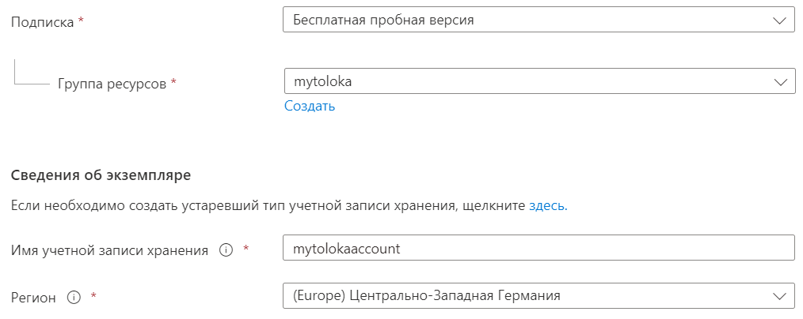
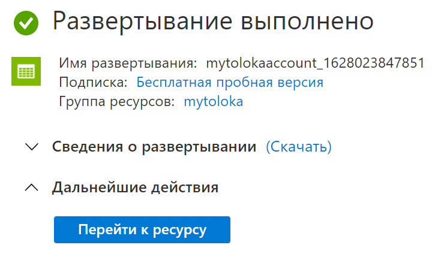
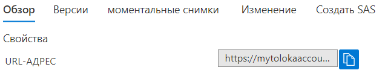

# Azure Blob Storage



Чтобы опробовать возможности [Microsoft Azure]({{ azure-blob }}), создайте [бесплатную учетную запись]({{ azure-free }}).

#### Условия пробного периода

Длительность | Размер бесплатного хранилища | Сумма гранта
----- | ----- | -----
12 месяцев | 5 ГБ | 200 $ в течение 30 дней

## Порядок действий {#workflow}

Чтобы получить ссылки на файлы:

1. Зарегистрируйтесь в [Azure]({{ azure-sign-up }}).
1. [Создайте учетную запись хранения.](#create-account)
1. [Создайте контейнер.](#container)
1. [Загрузите файлы в контейнер.](#upload)
1. [Скопируйте ссылки.](#get-files)

## Создайте учетную запись хранения {#create-account}

1. Откройте меню портала Azure на [главной странице]({{ azure-home }}) и слева вверху нажмите .

1. Выберите **Учетные записи хранения**.

1. На верхней панели нажмите  **Создать**.

1. На вкладке **Основные** выберите подписку, в которой будет создана учетная запись хранения.

1. Введите имя группы ресурсов и учетной записи.

1. Выберите наиболее близкий к исполнителям регион. Например, для исполнителей из Германии: **Регион** → **(Europe) Центрально-Западная Германия****Region → (Europe) West Central Germany**.

    

    

    

1. Остальные поля оставьте без изменений. Нажмите **Проверка и создание**.

1. Дождитесь окончания развертывания. Нажмите **Перейти к ресурсу.**

    

## Создайте контейнер {#container}

1. Слева в меню в разделе **Хранилище данных** выберите **Контейнеры**.

1. На верхней панели нажмите  **Контейнер**.

1. Введите имя контейнера.

1. В поле **Общедоступный уровень доступа** выберите **Контейнер**.

    

1. Нажмите **Создать**.



Вы можете настроить время жизни файлов в контейнере, чтобы они автоматически удалялись через несколько дней. [Подробнее]({{ azure-ttl }}).



## Загрузите файлы в контейнер {#upload}

1. Чтобы войти в контейнер, нажмите на его имя.

1. На верхней панели нажмите **Отправка**.

1.  

    Выберите файлы на компьютере.

    

    

    В разделе **Дополнительно** в поле **Отправить в папку** введите имя папки. Если папки не было, она будет создана.

    

    

    В имени файлов не должно быть пробелов. Файлы будут недоступны по ссылке.

    

1. Нажмите **Отправка**.

## Скопируйте ссылки {#get-files}

1. Выберите загруженный файл и в разделе **Обзор** скопируйте **URL-адрес**.

    

    

    

1. 

    

    

    ```plaintext
    https://<учетная-запись-хранения>.blob.core.windows.net/<контейнер>/<имя-файла>
    ```

    

    ```plaintext
    https://<storage-account>.blob.core.windows.net/<container>/<filename>
    ```

    

    

    

    ```plaintext
    https://<учетная-запись-хранения>.blob.core.windows.net/<контейнер>/<путь-к-файлу>/<имя-файла>
    ```

    

    ```plaintext
    https://<storage-account>.blob.core.windows.net/<container>/<file-path>/<filename>
    ```

    

    

1. 

    

    ```plaintext
    INPUT:image
    https://mytolokaaccount.blob.core.windows.net/mycontainer/newfolder/image1.png
    https://mytolokaaccount.blob.core.windows.net/mycontainer/newfolder/image2.png
    ```

