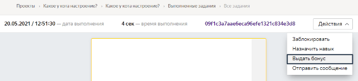
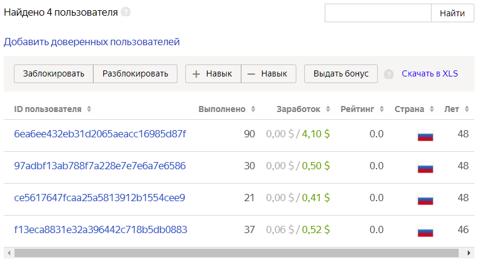
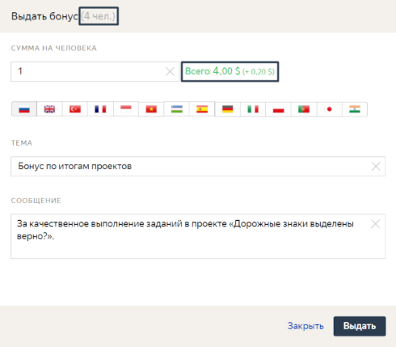
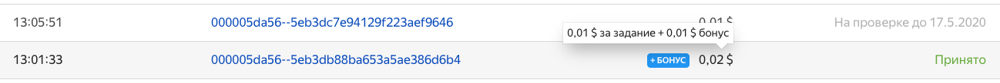

# Бонусы

Чтобы дополнительно заинтересовать исполнителей в своевременном и качественном выполнении ваших проектов, можно начислять бонусы за отдельное задание, а также одному или нескольким доверенным исполнителям (помимо платы за [выполненные задания](../../glossary.md#submitted-answers-ru)).

Сумма бонуса может составлять от 0,01 до 100 долларов одному исполнителю единовременно.

[Комиссия](budget.md) распространяется и на бонусы.

## Для отдельного задания {#bonus-task}

Это рекомендуемый способ, так как является наиболее экономным и адресным для мотивации исполнителей.

Для начисления бонуса по конкретному заданию пула используйте [проверку заданий онлайн](accept.md#acception):

1. Нажмите кнопку **Проверить задания****Review assignments** на странице пула.

1. Выберите задание и перейдите в него. Учтите, что выдать бонус можно только за принятое задание.

1. Нажмите кнопку 
    #### Пример
    

1. Заполните поля в появившемся окне **Выдать бонус****Issue bonus**:

    - **Сумма на человека****Bonus per user** в долларах.

    - **Тема****Topic** и **Сообщение****Message** для исполнителей. Укажите, за что конкретно начислен бонус. Чтобы отправить сообщения на разных языках, используйте кнопки для переключения языков.

    #### Пример
    

1. Нажмите кнопку **Выдать****Grant**.


## Выбранным исполнителям {#bonus-selected-performers}

Для начисления бонусов исполнителям:

1. Перейдите на страницу [Пользователи]({{ users }}).

1. Выберите исполнителей, которым будет начислен бонус.

    #### Как отобрать исполнителей
    
    

    Список может грузиться несколько минут. Если написано **Исполнители не найдены**, попробуйте подождать немного или воспользоваться фильтрами.

    

    
    #### Если вы знаете идентификаторы исполнителей

    Чтобы выбрать одного исполнителя, введите его идентификатор в поле поиска и нажмите **Найти**.

    Чтобы выбрать несколько исполнителей:
    1. Создайте текстовый файл и запишите в него идентификаторы исполнителей, например:
    ```
    059db2fa0927xec84a4cb9ccafc77ea4
    1a1f14bd48f0be13cb10c18sqgeb0679
    83khfalkdg78m3qhfai3kaf91h9n3ls3
    ```

    1. Нажмите кнопку **Загрузить файл****Upload file** слева внизу и выберите файл.
    1. После завершения загрузки файла нажмите кнопку **Добавить****Add**.

    

    Чтобы посмотреть подробную информацию об исполнителе, нажмите на его идентификатор.

    

    #### Показать заблокированных исполнителей

    По умолчанию отображаются только незаблокированные исполнители. Если нажать на выпадающий список, то доступны другие опции:
    - **Заблокированы на проекте** — те, кого вы заблокировали в одном из пулов проекта, например на основе правила контроля качества.
    - **Заблокированы заказчиком** — те, кого вы заблокировали на всех своих проектах.
    - **Заблокированы в системе** — те, кто был заблокирован на платформе за нарушение правил, плохое качество или частые ошибки при вводе капчи.
    - **Все** — показать и заблокированных, и незаблокированных исполнителей.
    
    #### Исключить тех, кто давно не пользовался Толокой
    Поставьте галочку **Показывать только активных** и укажите количество дней, в течение которых исполнитель должен был выполнить хотя бы одно задание.
    #### Найти тех, кто открывал или выполнял мои задания

    **В левой части окна** используйте поля **Проект** и **Пул**, чтобы отобрать исполнителей, которые открывали задания в одном из ваших проектов или пулов.

    На странице со статистикой пула эти исполнители указаны в графе **Заинтересовались**.

    В столбце **Выполнено** отображается количество выполненных заданий. Если написано `0`, значит исполнитель только открыл задание, но передумал его выполнять.

    #### Найти исполнителей с навыком

    Чтобы найти исполнителей по навыку, используйте [фильтры](../../glossary.md#filtering-ru):

    1. Нажмите **Добавить фильтр**.
    1. Прокрутите вниз и выберите **Выбрать навык**.
    1. Укажите навык и необходимое значение навыка.

    Фильтры для отбора исполнителей работают так же, как в пуле. Подробнее читайте в разделе [Фильтры](filters.md).

1. Укажите [проект](../../glossary.md#project-ru) или [пул](../../glossary.md#pool-ru) в соответствующих полях слева на странице.

    #### Пример
    

1. Для начисления бонусов одному исполнителю нажмите нужную ссылку на его идентификатор в столбце **ID исполнителя****Toloker ID**.

    На открывшейся странице нажмите кнопку .

    Для начисления бонусов группе исполнителей нажмите кнопку **Выдать бонус****Issue bonus**.

1. Заполните поля в появившемся окне **Выдать бонус****Issue bonus**:

    - **Сумма на человека****Bonus per Toloker** в долларах.

    - **Тема****Topic** и **Сообщение****Message** для исполнителей. Укажите, за какие заслуги и проекты начислен бонус. Чтобы отправить сообщения на разных языках, используйте кнопки для переключения языков.

1. Нажмите кнопку **Выдать****Grant**.

    Перед этим обязательно проверьте количество человек, которым будет начислен бонус, и итоговую сумму.

    #### Пример
    


Исполнитель в своем профиле (вкладка **История****History**) будет видеть начисленные бонусы за выполненные задания, активность и качество работы в проектах. И зачисленные суммы добавляются в список выплат.

#### Пример


Отследить списание денег на бонусы вы можете в своем [профиле]({{ profile }}) (вкладка **Затраты****Expences**).


## Решение проблем {#troubleshooting}

#### Как поощрить исполнителей в дополнение к базовой стоимости задания

Вы можете повысить базовую стоимость задания для исполнителей с более высоким навыком. Для этого настройте [Динамическое ценообразование](dynamic-pricing.md). Если вы хотите повысить мотивацию исполнителей за качественное выполнение заданий, независимо от их навыка, используйте [бонусы](#bonuses). Опишите в инструкции задания, сколько бонусов и в каких случаях получат исполнители.

#### Как посмотреть статистику по выплаченным бонусам

Чтобы посмотреть расходы на выплату бонусов, перейдите в ваш  [профиль]({{ profile }}) и откройте вкладку **Затраты**.

