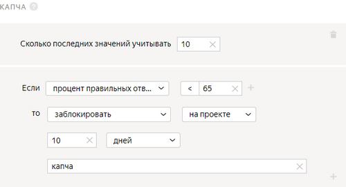

# Капча



Капча и правило [быстрые ответы](quick-answers.md) обеспечивают высокий уровень защиты от роботов.

Чтобы показывать капчу исполнителям, установите [частоту показа капчи](pool_poolparams.md#captcha)[captcha frequency](pool_poolparams.md#captcha) в настройках [пула](../../glossary.md#pool).

Обычно капчу показывают один раз на 10 страниц с заданиями. Если задания выполняются быстро и капча мешает исполнителям, ее можно показывать через каждые 20 страниц.

## Когда использовать {#when-use}

Ограничьте доступ к заданиям исполнителям, которые неправильно вводят капчу несколько раз подряд. Такая настройка необходима, если вы хотите обеспечить дополнительную защиту от роботов.

#### Не используйте, если:

- в пулах мало заданий. Например, если задание — опрос на одну страницу, то капча не поможет контролировать качество, так как минимальная частота показа капчи — каждые 10 страниц заданий;

- сложно или невозможно автоматизировать работу: выделение областей, полевые задания, везде, где надо прикрепить файлы, писать осмысленные тексты.

## Как настроить {#rule}



#|
||**Поле**|**Описание**||
||**Учитывать последних вводов капчи****Recent captchas to use** | Количество последних раз, когда исполнителю была предложена капча.

Если поле не заполнено, в расчете учитываются все вводы капчи только того пула, к которому применяется правило.

Если поле заполнено, то правило считает вводы капчи в рамках значения, указанного в поле. При этом учитываются не только вводы капчи из этого пула, но и из других пулов, где это поле заполнено.

[Подробнее](remember-values.md) о том, как работает это поле.||
||**Если****If** | Условие, при котором выполняется действие в поле **то****then**:

- **количество ответов****number of responses** — количество вводов капчи (меньше или равно количеству в поле **Учитывать последних вводов капчи****Recent values to use**).

- **процент правильных ответов****correct responses (%)** — доля правильных ответов (от 0 до 100).

- **процент неправильных ответов****incorrect responses (%)** — доля неправильных ответов (от 0 до 100).

Чтобы добавить несколько условий, нажмите .||
||**то****then** | Действие, выполняемое при условии:

- **заблокировать****ban** — закрыть доступ к проекту или всем проектам заказчика на указанное количество дней. Причина блокировки отображается только заказчику.

    Если доступ к заданиям блокируется на ограниченный срок (например, на 7 дней), после снятия блокировки история ответов исполнителя не сохраняется. Навык рассчитывается на основании новых ответов.

- **установить значение навыка из поля****assign skill from the field** — сохранить долю правильных ответов исполнителя на контрольные задания как значение навыка.

- **приостановить****suspend** — приостановить доступ исполнителя к пулу на указанное количество дней. Причина отображается только заказчику.

- **принять все ответы исполнителя в пуле****accept all assignments from this performer in the pool** — требует настройки [отложенной приемки](offline-accept.md).

    Пригодится, если исполнитель выполняет большинство заданий качественно. Пример: исполнитель выполнил больше 80% заданий правильно и вас устраивает такой результат. Правило сработает автоматически — все ответы в пуле будут приняты.

- **установить значение навыка****assign skill value** — присвоить исполнителю фиксированное значение [навыка](nav.md).||
|#

## Пример правила {#examples}

Поскольку человек тоже может ошибиться при вводе капчи, целесообразно добавлять поле **количество ответов** и указывать цифру большую, чем 1. В противном случае исполнитель может быть заблокирован после первого ввода капчи.



#### Блокировка за неправильные ответы на капчу



- Правильная настройка

  

  Если исполнитель ввел капчу не меньше 5 раз и доля правильных ответов меньше 65%, он будет заблокирован и не сможет выполнять ваши задания 10 дней.

- Неправильная настройка

  

  Исполнитель будет заблокирован после первого ввода капчи.



## Решение проблем {#troubleshooting}



Лучше использовать один [навык](../../glossary.md#skill) в проекте. Можно выбрать способ подсчета навыка:

- Подсчет навыка для каждого пула отдельно. Текущее значение навыка — это значение навыка в пуле, который выполнялся последним. Такой вариант удобен, если:

    - Пулы предназначены для разных групп исполнителей (например, настроены фильтры по городам, странам).

    - Пулы запускаются последовательно, и вы не хотите учитывать качество ответов в предыдущих пулах при подсчете навыка в выполняемом пуле.

    Этот способ подсчета действует по умолчанию при добавлении блока контроля качества в пул. Для блока по контрольным заданиям оставьте пустым поле **Учитывать последних ответов на контрольные и обучающие задания**.

- Подсчет навыка по всем выполненным заданиям в проекте. Такой вариант удобен, если пулы небольшие и вам не нужно рассчитывать навык для каждого пула.

    Этот способ подсчета доступен только для навыков по контрольным заданиям. Чтобы использовать его, заполните поле **Учитывать последних ответов на контрольные и обучающие задания** в блоках контроля качества в пулах.





Да, конечно, один и тот же навык можно назначать и использовать на различных проектах. Но чаще всего один навык используется в рамках одного проекта. Если исполнитель хорошо выполняет одно задание, это не значит, что он так же успешно справится с другим. Кроме того, используя фильтры по давно настроенным навыкам, вы ограничиваете количество доступных исполнителей.





Действительно, такое правило выглядит слишком строго. Даже самый внимательный исполнитель может ошибиться — правило лучше сделать менее строгим. Помимо блокировки у отдельных заказчиков, у нас есть системные процессы, которые блокируют в Толоке исполнителей, которые систематически проваливают проверку капчей.





Частота показа [капчи](captcha.md) настраивается в пуле.

Нет

: Не показывать капчу.

Низкая

: Показывать капчу каждые 20 страниц заданий.

Средняя / Высокая

: Показывать капчу каждые 10 страниц заданий.





[Капча](captcha.md) используется обычно в простых проектах с автоприемкой: классификация, категоризация, поиск информации; то есть там, где мало вариантов ответов, не нужно загружать файлы или писать тексты. Она позволяет отсеивать ботов и исполнителей, которые размечают очень небрежно.

Частота показа капчи настраивается в пуле.

Нет

: Не показывать капчу.

Низкая

: Показывать капчу каждые 20 страниц заданий.

Средняя / Высокая

: Показывать капчу каждые 10 страниц заданий.





Процент правильных ответов определяется исходя из общего количества обработанных исполнителем капч в пределах «окна», указанного в поле **Учитывать последних ответов на контрольные и обучающие задания**. Если значение в поле не указано, то в расчет попадают все капчи, которые появляются при выполнении заданий пула, использующего данное правило.



