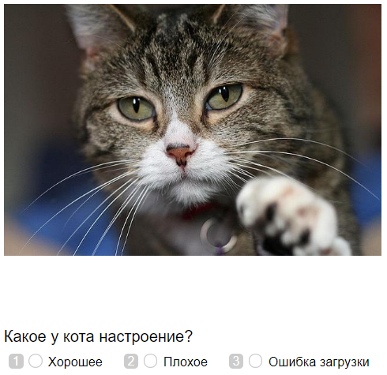
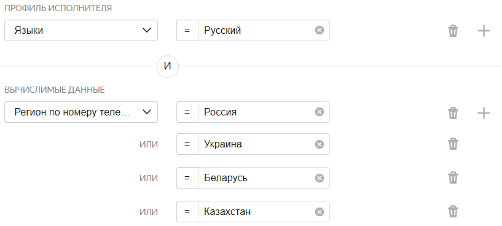
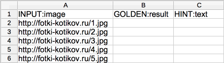
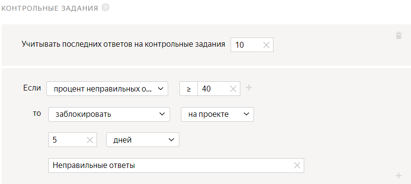
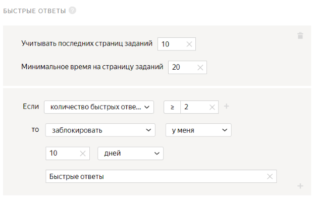
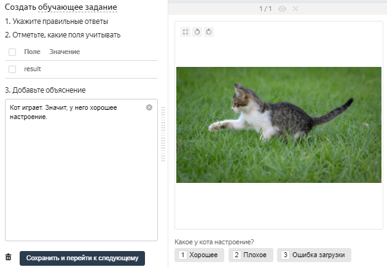

# Классификация изображений

[Проекты](../../glossary.md#project) с типом классификация предназначены для заданий с конечным количеством вариантов ответа. Например, модерация контента или распределение изображений по заданным категориям.

Возможно, для вашего задания нужны дополнительные проекты, например предварительная проверка датасета или проверка ответов исполнителей. Подробнее об этом читайте в разделе [Декомпозиция задания](solution-architecture.md).

Предположим, вы хотите распределить фотографии с изображением котов по группам — хорошее настроение у кота или плохое. Создадим задание: исполнитель смотрит на картинку и выбирает вариант ответа.



Сначала запустите проект в [Песочнице]({{ sandbox }}). Так вы сможете избежать ошибок и потраченных средств, если окажется, что ваше задание не работает.









Чтобы запустить задания и получить ответы:

1. [Создайте проект](#project)
1. [Добавьте пул заданий](#pool)
1. [Загрузите задания](#tasks_upload)
1. [Настройте контроль качества](#quality_control)
1. [Добавьте обучение](#training)
1. [Запустите пул и получите результаты](#launch)

## Создайте проект {#project}



#### В интерфейсе:

1. Выберите шаблон:

    1. 

    1. 

1. Заполните общую информацию:

    1. Дайте проекту понятное название и краткое описание. Их увидят исполнители в списке доступных заданий.

    1. По желанию добавьте **Приватный комментарий**.

    1. Нажмите **Сохранить**.

1. 

    

    - Конструктор шаблонов

      1. 

          Для этого проекта воспользуйтесь готовым шаблоном, где уже настроена валидация, горячие клавиши и внешний вид задания. Исполнитель не сможет отправить задание, если не выберет варианта ответа.

          Подробнее в Справке конструктора шаблонов:

          - [настройка условий]({{ tb-conditions }});

          - шаблон [Классификация изображений]({{ tb-image-classification }}).

      1. 

          В данном проекте:

          - Поле входных данных: `image` — ссылка для загрузки картинки.

              Измените тип данных на строку, чтобы использовать ссылки на свои файлы или [загружать картинки](prepare-data.md#interface), хранящиеся на Яндекс Диске.

          - Поле выходных данных: `result` — строка, в которую будет записан ответ исполнителя.

      1. Большинство людей просматривает изображения слева направо, поэтому первое изображение может влиять на восприятие второго. Если перемешивать изображения в заданиях, повышается достоверность результатов опроса. Картинки в парах будут отображаться каждый раз в новом порядке для разных исполнителей.

    - Редактор HTML/CSS/JS

      1. 

          

         1. В блоке **Интерфейс задания** отредактируйте блок **HTML**. После строки с изображением добавьте вопрос: 

          ```html
          {{img src=image width="100%" height="400px"}}
          <div>Какое у кота настроение</b>?<div>
          ```

          

          ```html
          {{img src=image width="100%" height="400px"}}
          <div>What's the cat's mood</b>?<div>
          ```

          

          3.1.2. Для этого проекта оставьте блоки **JS** и **CSS** без изменений.

      1. В блоке **Спецификация данных** задаются поля входных и выходных данных.

          

          

          

          

          

      1. Нажмите кнопку , чтобы увидеть получившееся задание.

          

          В предварительном просмотре проекта отображается одно задание со стандартными данными. Количество заданий на странице вы сможете настроить далее.

          

          Проверьте работу опций задания. В правом нижнем углу **Отправить**.

          Чтобы выйти из режима предпросмотра, внизу слева нажмите **Выйти**. Если при тестировании задания были ошибки — проверьте блоки кода, которые вы вводили.

      1. 

    

1. 1. Напишите краткую и ясную инструкцию. Опишите в ней, что надо сделать, и приведите примеры.

    Вы можете подготовить инструкцию в формате HTML и вставить ее в редактор. Чтобы переключиться в режим HTML, нажмите **<>**.

   1. Нажмите **Завершить**.

Подробнее о работе с проектом читайте в разделе [Проект](project.md).

## Добавьте пул заданий {#pool}

Пул — это набор оплачиваемых заданий, которые одновременно выдаются исполнителям.

1. Откройте проект и нажмите **Добавить пул**.

1. Дайте пулу любое удобное название — оно доступно только вам, исполнитель увидит название проекта.

1. В блоке **Аудитория** добавьте **Фильтры** для отбора исполнителей. Чтобы ваше задание было доступно только исполнителям, владеющим русским языком, установите язык и страну по номеру телефона.

    

    

1. В блоке **Цена** установите цену за страницу заданий, например `0.02`.

    

    На одной странице может отображаться одно или несколько заданий. Если задания простые, то можно добавлять 10–20 заданий на одну страницу. Не рекомендуем создавать длинные страницы, поскольку это снизит скорость загрузки данных у исполнителя.

    Исполнитель получит оплату, только если выполнил все задания на странице.

    Количество заданий на странице вы определите при [загрузке заданий](#smart-mixing).

    

    

    Общее правило формирования цены — чем больше времени исполнитель тратит на выполнение, тем выше цена.

    Вы можете зарегистрироваться в Толоке как исполнитель и узнать, сколько платят другие заказчики за задания.

    

1. В блоке **Контроль качества** установите **Перекрытие задания** — количество исполнителей, которые должны выполнить задание. Для заданий классификации достаточно перекрытия — 3.

1. В блоке **Дополнительные настройки** укажите **Время на страницу заданий**. Его должно быть достаточно, в том числе для чтения инструкции и загрузки задания. Например, 600 секунд.

1. Нажмите кнопку **Создать пул**.

## Загрузите задания {#tasks_upload}



1. Нажмите кнопку **Загрузить****Upload**. В открывшемся окне вы можете скачать шаблон файла.

    #### Использовать пример данных

    Если вы хотите посмотреть, как ваш проект будет выглядеть после запуска, но у вас еще нет заданий для разметки, вы можете загрузить в пул готовый пример данных.

    Нажмите **Использовать пример данных****Use sample data** справа от надписи **Прикрепите подготовленный файл с данными****Attach the prepared file with data**. Это позволит избежать дополнительных действий с файлами.

    После того, как вы поработали с примером данных и вас все устроило, подготовьте свои данные и загрузите их в пул.

1. Добавьте в файл входные данные. Заголовок столбца с входными данными содержит слово `INPUT`. Остальные столбцы оставьте пустыми.

    

1. Добавьте в него входные данные. Заголовок столбца с входными данными содержит слово `INPUT`. Остальные столбцы оставьте пустыми.

1. Загрузите задания, выбрав **Умное смешивание** и указав количество заданий на странице. Например: 9 [основных](../../glossary.md#general-task) и 1 контрольное.

    

    **Умное смешивание** случайным образом формирует страницы с заданиями так, чтобы задания не повторялись для каждого исполнителя.

    

1. Добавьте контрольные задания. Для этого нажмите **Разметить** и укажите правильные ответы у нескольких заданий.

    

    Если вместо **умного смешивания** было выбрано другое, необходимо нажать кнопку **Разметить**. Если такой кнопки нет, удалите файл и загрузите заново.

    

    

    Контрольные задания — это задания с заранее известным ответом. Они нужны, чтобы следить за качеством ответов исполнителя. Заданный вами ответ сравнивается с ответом исполнителя, и если они не совпадают, значит исполнитель ответил неверно.

    Контрольных заданий должно быть [не менее 1%](../troubleshooting/pool-setup.md#why-one-percent) от общего числа заданий, то есть на 1000 заданий нужно добавить минимум 10 контрольных.

    Подробнее о [контрольных заданиях](goldenset.md).

    

## Настройте контроль качества {#quality_control}

[Блоки контроля качества](control.md) позволяют отсеивать невнимательных исполнителей. Контроль качества можно настраивать как в проекте, так и в пуле.



Настройки контроля качества в проекте будут действовать во всех пулах проекта, и изменить их настройку в одном из пулов будет невозможно.

При [клонировании проекта](project.md) настройки контроля качества проекта не переносятся.



1. 

1. Добавьте блок **Контрольные задания** и укажите следующие значения:

    

    Это означает, что если исполнитель даст больше 40% неправильных ответов на контрольные вопросы, то он будет заблокирован и не сможет больше выполнять задания этого проекта в течение пяти дней.

1. Добавьте блок **Быстрые ответы**.

    Значение параметра **Минимальное время на страницу** зависит от количества заданий на этой странице. Чтобы определить настроение кота, достаточно 2-4 секунды. Значит, на страницу с 10-ю заданиями может хватить 20-30 секунд.

    Один раз можно ошибиться неумышленно, а вот после 2-3 закономерных раз можно и заблокировать исполнителя на какое-то время.

    Укажите следующие значения:

    

    Это означает, что если исполнитель выполнит 2 страницы заданий быстрее чем за 20 секунд, он будет заблокирован и не сможет больше выполнять ваши задания 10 дней.

    

## Добавьте обучение {#training}

Создайте [обучающий пул](../../glossary.md#training-pool):

1. Откройте страницу [проекта](../../glossary.md#project).

1. Перейдите на вкладку **Обучения****Training**

1. Нажмите кнопку **Добавить обучение****Add training**.

1. Заполните поля с [настройками обучения](train.md).

    С помощью поля **Повторное прохождение****Retry after** вы можете настроить [переобучение](train.md).

1. Нажмите кнопку **Сохранить обучение****Save training**.

После создания обучающего пула:

1. Скачайте **шаблон задания (TSV)** или отредактируйте тот, в котором загружали задания для основного пула.

    

    Файлы с заданиями для всех пулов одного проекта имеют одинаковую структуру.

    

1. Добавьте в файл с заданиями ссылки на картинки для обучающих заданий.

1. Загрузите файл, указав количество заданий на странице. Например, 10. Это число не должно превышать количество заданий на странице в основном пуле.

1. Нажмите **Загрузить** и укажите количество обучающих заданий на странице.

1. Нажмите **Добавить**.

1. Нажмите кнопку **Разметить**, а затем кнопку **Создать обучающие**. Далее добавьте правильный ответ и подсказку для всех загруженных заданий.

    

1. После успешной загрузки откройте **Предпросмотр** и проверьте, что задания отображаются корректно.

1. Откройте основной пул с заданиями, привяжите **Обучение** и установите **Уровень прохождения** 55. Тогда пул будет доступен исполнителям, допустившим не более 45% ошибок при обучении.

    Чтобы выполнить привязку, зайдите в режим редактирования основного пула и в выпадающем списке параметра **Обучение** выберите ваш обучающий пул.

Подробнее [о создании пула с обучением](train.md).

## Запустите пул и получите результаты {#launch}

1. Запустите пул, нажав кнопку .

1. Следите за выполнением в блоке **Статистика пула**.

1. Запустите агрегацию результатов, когда пул будет полностью выполнен. Для этого около кнопки **Скачать результаты** нажмите .

    Агрегация ответов нужна для того, чтобы у вас была полная картина по всем результатам. Подробнее [об агрегации](result-aggregation.md).

1. Отслеживайте ход агрегации на странице **Операции**. По завершении нажмите кнопку **Скачать**.

## Решение проблем {#troubleshooting}







Если картинки, аудио или видео с Яндекс Диска не отображаются в [инструкции](../../glossary.md#task-instruction) или на [странице задания](../../glossary.md#task-page), убедитесь, что вы правильно подключили Диск и загрузили файлы.

- [Как подключить Яндекс Диск](prepare-data.md#prepare-data__connect)
- [Как загрузить файлы для инструкции](prepare-data.md#prepare-data__instruction)
- [Как загрузить файлы для задания](prepare-data.md#prepare-data__interface)



Для создания задания возьмите за основу [шаблон для разметки видео]({{ templates-video-new }}).

Чтобы разместить ваши видеоролики на Яндекс Диске, его нужно подключить и настроить проект.



Подробная видеоинструкция об этом [в нашем блоге]({{ toloka-blog-yadisk }}).







Проблема в шаблоне задания. Проверьте, что:

- Для поля входных данных, куда вы передаете ссылку на файл, в проекте указан тип «строка».

- В компоненте в шаблоне задания используется выражение proxy.

- Формат относительных ссылок в файле с заданиями указан верно: <уникальное имя>/<путь и имя файла>.

Подробная инструкцию и видео на странице [Использование файлов с Яндекс Диска]({{ using-files-yandex-disk }}).







- В настройках проекта в поле **Входные данные** указан тип _ссылка_. Необходимо выбрать тип _строка_.

- В [файле с заданиями](../../glossary.md#tsv-file-definition) указаны абсолютные ссылки на файлы для заданий. Необходимо вставить ссылку вида `<уникальное имя>/<путь и имя файла>`. Например: `yadisk/image1.jpg` или `yadisk/photos/image1.png`.

- Фото с Яндекс Диска используются в инструкции к заданию в мобильном приложении. Чтобы фото отобразилось в инструкции, используйте только прямые ссылки.

- Файлы удалены или находятся не в той папке на Диске, на которую ведет ссылка.

- OAuth-токен не активен. Обновите токен на странице [Интеграция]({{ integration }}).

Чтобы файлы, загруженные на Яндекс Диск (картинки, аудио, видео), отображались у исполнителя, нужно:

1. Подключить Яндекс Диск в профиле.

1. Установить тип строка для поля [входных данных](../../glossary.md#input-output-data).

1. Вставлять ссылку на файл при помощи компонента `proxy`.

[Подробная инструкция](prepare-data.md)











Попробуйте воспользоваться рекомендациями с [этой страницы]({{ yadisk-uploading }}) или написать в службу поддержки Яндекс Диска.





- В настройках проекта в поле **Входные данные** указан тип _ссылка_. Необходимо выбрать тип _строка_.

- В [файле с заданиями](../../glossary.md#tsv-file-definition) указаны абсолютные ссылки на файлы для заданий. Необходимо вставить ссылку вида `<уникальное имя>/<путь и имя файла>`. Например: `yadisk/image1.jpg` или `yadisk/photos/image1.png`.

- Фото с Яндекс Диска используются в инструкции к заданию в мобильном приложении. Чтобы фото отобразилось в инструкции, используйте только прямые ссылки.

- Файлы удалены или находятся не в той папке на Диске, на которую ведет ссылка.

- OAuth-токен не активен. Обновите токен на странице [Интеграция]({{ integration }}).

Чтобы файлы, загруженные на Яндекс Диск (картинки, аудио, видео), отображались у исполнителя, нужно:

1. Подключить Яндекс Диск в профиле.

1. Установить тип строка для поля [входных данных](../../glossary.md#input-output-data).

1. Вставлять ссылку на файл при помощи компонента `proxy`.

[Подробная инструкция](prepare-data.md)





Проблема в шаблоне задания. Проверьте, что:

- Для поля входных данных, куда вы передаете ссылку на файл, в проекте указан тип «строка».

- В компоненте в шаблоне задания используется выражение proxy.

- Формат относительных ссылок в файле с заданиями указан верно: <уникальное имя>/<путь и имя файла>.



Подробная [инструкция и видео](prepare-data.md).



Подробная [инструкция](prepare-data.md).







Чтобы добавить картинки с помощью ссылок на Яндекс Диск:

1. Используйте ссылку, например: /api/proxy/yadisk/image1.jpg .

1. В настройках профиля заказчика перейдите в .

1. Настройте интеграцию с внешними сервисами.

    [Подробно об использовании файлов с Яндекс Диска](prepare-data.md).







Ошибка будет возникать, если на вход ожидается тип URL, а приходит строка.

Причин может быть две:

- Входное поле имеет тип "ссылка".

- Пул работает на неактуальной версии проекта. То есть создан до того, как вы изменили тип входного поля.





Загруженные ссылки на картинки в файле Толока разделит на страницы в зависимости от того, какой способ распределения заданий вы выбрали. Подробнее читайте на странице [Способы распределения заданий](distribute-tasks-by-pages.md).





Добавьте к компоненту для вставки картинки параметры `real-size=true` и `screenshot=true`.





Размеры изображений могут быть разные.



