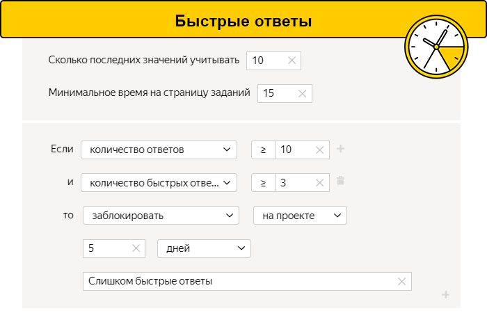
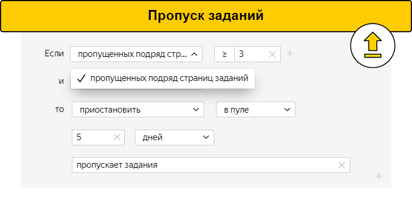
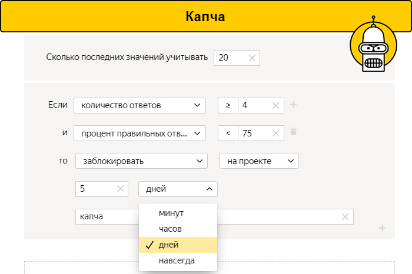
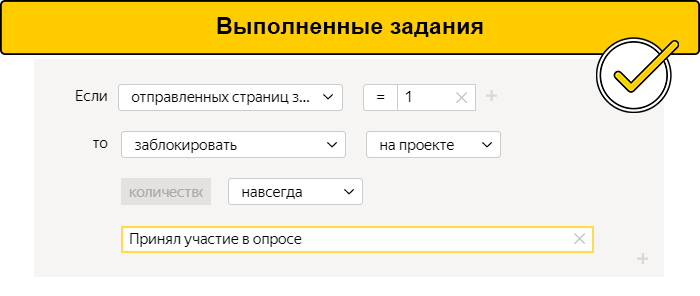
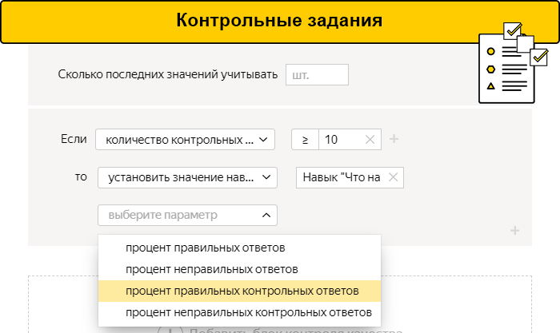
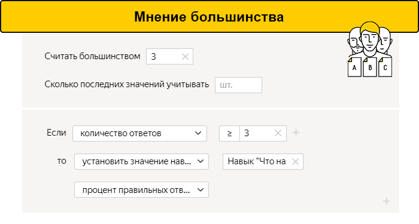
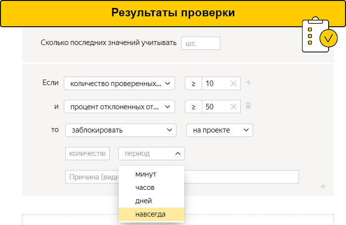
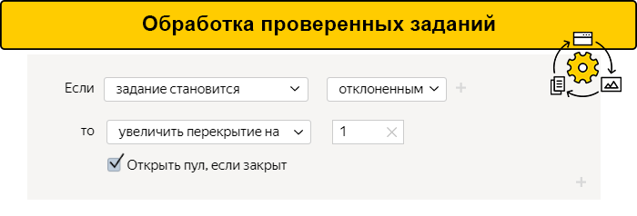
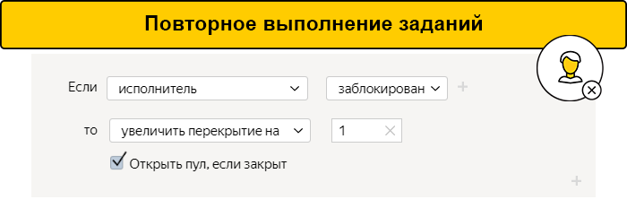

# Как проверять исполнителей: правила контроля качества

Правила контроля качества регулируют ход выполнения заданий и доступ исполнителей к ним. Правила настраиваются как для проекта в целом — на вкладке **Контроль качества**, так и для каждого пула по отдельности.

## Контроль действия исполнителей {#control-actions}

Если в вашем проекте присутствует много однотипных заданий, то вам понадобится защита от роботов и недобросовестных исполнителей.

#### Ограничение быстрых ответов

Настройте правило [Быстрые ответы](quick-answers.md), чтобы отсеять недобросовестных исполнителей, которые не думают над заданиями и выполняют их слишком быстро. Вы пробовали выполнять задания и знаете, что на одно задание требуется не менее 15 секунд. Стоит отстранить того, кто выполнит три задания из десяти быстрее контрольного времени.

#### Лимит на пропуск заданий

Другой способ «оптимизации», которым пользуются недобросовестные исполнители, — пропуск отдельных заданий. Пока они выбирают из потока то, что кажется им легким, другие честно выполняют все задания подряд. Оплата при этом остается одинаковой.

Настройте правило [Пропуск заданий](skipped-assignments.md), чтобы избежать такой ситуации. Оно ограничит доступ тем исполнителям, которые пропускают слишком много. Например, больше трех заданий подряд.

#### Капча

Способ защититься от роботов - правило Капча. В Толоке ее показывают через каждые 10 страниц с заданиями. Если задания выполняются быстро и капча мешает, ее можно показывать через каждые 20 страниц — укажите в настройках пула низкую частоту показа капчи.

#### Ограничение доступных заданий

Лимиты полезны также, когда требуется как можно больше исполнителей. Например, для сбора статистики — для соцопроса или выбора логотипа. Другой случай — описания внешности для [дейтинг-сервиса](https://rb.ru/opinion/chat-bot-dataset/). Если тексты будет писать один человек, то они, скорее всего, получатся однообразными и скучными.

Можно задействовать больше участников, если ограничить количество задач, которые получает исполнитель «в одни руки». Это реализуется настройкой лимита на число заданий, доступных одному исполнителю, или дневного заработка в отдельном проекте. За это отвечают правила [Выполненные задания](submitted-answers.md) и [Заработок](income.md).

## Контроль качества исполнения заданий {#check-resalts}

Результаты добросовестных исполнителей тоже стоит проверять. В Толоке это можно делать автоматически.

#### Контрольные задания

В части заданий перед исполнителями стоит выбор из двух или нескольких вариантов ответа. Качество в таких проектах проверяется с помощью правила [Контрольные задания](goldenset.md). Это вопросы, для которых вы указали правильный ответ.

Добавьте проверочные вопросы к основным заданиям. Желательно, чтобы их было не меньше 1%. По количеству ошибок вы оцените старательность исполнителей и присвоите им навык от 0 до 100.

Тех, кто набрал критическое число ошибок, платформа отстранит от разметки благодаря фильтрам. Исполнителей с высоким навыком — 90 и выше — поощрите повышенной оплатой. Так у них появится стимул внимательнее относиться к заданиям.

#### Мнение большинства

Иногда у заказчиков нет возможности регулярно добавлять контрольные задания и следить за тем, чтобы они не устаревали.

В таком случае поможет правило [Мнение большинства](mvote.md). Платформа выдаст одно и то же задание сразу нескольким исполнителям. Например, пятерым. Вариант ответа, который выберут трое или больше, она сочтет правильным.

Долю согласованных ответов используйте — для присвоения навыков, настройки доступа и поощрения исполнителей.

#### Результаты проверки

Задания, где каждый исполнитель дает уникальный ответ, - например, записать аудио, снять фото или сочинить текст, - проверяют сами заказчики или другие исполнители. Некачественные ответы отклоняются.

Используйте правило [Результаты проверки](reviewing-assignments.md), чтобы регулировать доступ исполнителей к заданию. Платформа сама подсчитает, какой процент ответов принят, а какой отклонен у каждого из исполнителей. Те, кто часто ошибался, перестанут получать задания.

## Доработка отклоненных заданий {#revision-results}

Правила контроля качества позволяют минимизировать последствия ошибок. В Толоке можно отправлять на повторное выполнение, как отдельные отклоненные задания, так и все ответы исполнителя, который часто ошибался.

#### Отклоненные задания

Например, с помощью Толоки вы улучшаете алгоритмы распознавания речи. Исполнители должны прослушать ряд 5-10-секундных записей и сделать транскрипцию каждой — перевести речь в текст.

Некоторые ролики транскрибируются неправильно. Не принимайте такие ответы и настройте правило [Обработка отклоненных и принятых заданий](reassessment-after-accepting.md). Платформа автоматически отправит неправильные записи на доработку другим исполнителям.

#### Ответы заблокированного исполнителя

Если исполнитель часто ошибается, платформа ограничит ему доступ к разметке. Но ответы, которые он успел дать, останутся в базе и могут попасть в итоговый набор данных. Отправьте эти задания на обработку заново.

Здесь поможет правило [Повторное выполнение заданий после блокировки исполнителя](restore-task-overlap.md). Оно увеличит стоимость разметки, но избавит датасет от возможных ошибок.

Как только исполнитель потеряет доступ к проекту, — например, из-за низкого навыка — Толока автоматически отправит задания, выполненные им, на переоценку другим исполнителям.

## Сочетание методов {#combination-methods}

Правила контроля качества желательно комбинировать. Например, если задания предполагают выбор ответа из нескольких вариантов, то стоит использовать:

- [Капчу](captcha.md);
- [Быстрые ответы](quick-answers.md).

Проектам с генерацией контента - написанием текстов, съемкой фото - подойдет другое сочетание:

- [Ограничение доступных заданий](#limit-task);
- [Результаты проверки](reviewing-assignments.md);
- [Доработка отклоненных заданий](#revision-results).

## Общие рекомендации {#general-advice}

Каждый проект требует индивидуального подхода. Методы, эффективные в одном случае, могут оказаться бесполезными в другом. Но существуют и общие рекомендации:

1. Проанализируйте задачу и выберите подходящие правила контроля качества.
1. Напишите четкие инструкции. Если создаете контрольные задания — следите, чтобы не было устаревших, неоднозначных и с неправильными ответами.
1. Протестируйте проект в тестовой среде — в [Песочнице](sandbox.md). Запуск и выполнение заданий в ней помогут разобраться в правилах и подсчитать, сколько времени потребуется на одно задание.
1. Проведите первый настоящий запуск с небольшим количеством заданий. Проанализируйте результаты и при необходимости скорректируйте настройки.
1. Следите за разметкой и прислушивайтесь к отзывам исполнителей.
1. Обращайтесь в Cлужбу поддержки, если что-то не получается.

