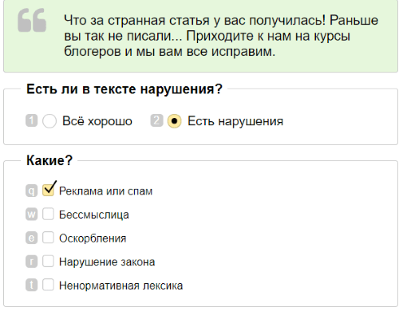

# Анализ тональности и модерация контента



Этот [пресет проекта](../../glossary.md#project-template) подходит для тех случаев, когда нужно проверить текстовый контент на соответствие правилам (англ. content moderation, CM).

Примеры задач, которые поможет решить этот пресет:

- Модерация комментариев и ников на форуме.
- Проверка объявлений на сайте, отзывов о товарах в магазине, сообщений в соцсетях.
- Наличие упоминания какого-то бренда или компании.



- Новости. У вас новостной сайт, где посетители оставляют комментарии к новостям. Проанализируйте комментарии и решите, показывать ли их на сайте.
- Социальные сети. Классифицируйте публикации в социальных сетях по нескольким атрибутам.
- Характер текста. Оценить эмоциональную окраску комментария.
- Токсичность комментариев. Оценить, является ли комментарий токсичным.
- Разметка токсичных комментариев. Для каждого комментария выбрать уровень токсичности, соответствующий его содержанию.
- Ценность (полезность) текста. Определить, содержит ли сообщение спам.
- Интернет-магазины: модерация контента. Определить, какое из предложенных значений атрибута лучше подходит для конкретного товара.
- Модерация комментариев, на которые пожаловались. Оценить, запрещать ли комментарии, которые являются недопустимыми по мнению других пользователей социального сервиса.
- Модерация сообщений. Проверить комментарии на оскорбления, нарушения закона, спам и рекламу.
- Модерация спортивных комментариев. Указать, соответствует ли комментарий правилам модерации в определенной сфере или сервисе.
- Конструктивность информации. Проверить комментарии из различных источников на конструктивность и разметить их.
- Разметка комментариев на Яндекс Маркете.



Например, у вас есть блог и вы хотите провести модерацию комментариев к новой публикации, которая собрала много негатива — проверьте текстовые комментарии на нарушения правил: оскорбления, нарушения закона, спам и рекламу.









## Перед началом {#before_start}

Если у вас сложный проект, зарегистрируйтесь в [песочнице](sandbox.md) и создайте проект там. В ней вы сможете:

1. Протестировать настройки проекта в роли исполнителя.

1. [Перенести](sandbox.md#export) их в **основную версию Толоки****production version**.

Так вы избежите ошибок и впустую потраченных средств, если окажется, что ваше задание не работает.

## Создание проекта {#create_project}

В проекте вы определяете, как будет выглядеть задание у исполнителя.

#### В интерфейсе:

1. Нажмите кнопку **Создать проект****Create a project** и выберите пресет **Анализ тональности и модерация контента****Sentiment analysis & Content moderation**.

1. Заполните общую информацию:

    1. Дайте проекту понятное название и краткое описание. Их увидят исполнители в списке доступных заданий.

    1. По желанию добавьте **Приватный комментарий**.

    1. Нажмите **Сохранить**.

1. Отредактируйте интерфейс задания:

    

    1. Определите, какие объекты будете передавать исполнителю, а какие получать от него в ответ. Для этого создайте поля входных и выходных данных в блоке **Спецификации**.

        

        **Входные данные** — типы объектов, которые получит исполнитель для выполнения задания. В этом шаблоне вам понадобится текст. В других задачах бывают картинки или географические координаты.

        **Выходные данные** — типы объектов, которые будут на выходе выполненного задания. Для этого шаблона — один из двух вариантов ответа. При выборе второго ответа откроется список флажков — из них исполнитель должен выбрать подходящие варианты. В других задачах на выходе получают введенный текст или загруженный файл, например.

        Подробнее о [полях входных и выходных данных](incoming.md).

        

        В данном случае:

        - Входные данные — поле `comment`, текст для проверки.

        - Выходные данные — строка `quality`, в которую будет записан выбранный вариант из поля «Есть ли в тексте нарушения?». Остальные поля — типы нарушений. Используйте этот список полей или настройте его под свои задачи.

        

        - Графический режим

          

        - JSON

          Входные данные

          ```json
          {
          "comment": {
          "type": "string",
          "hidden": false,
          "required": true
          }
          }
          ```

          Выходные данные

          ```json
          {
          "insult": {
          "type": "boolean",
          "hidden": false,
          "required": false
          },
          "quality": {
          "type": "string",
          "hidden": false,
          "required": true
          },
          "nonsense": {
          "type": "boolean",
          "hidden": false,
          "required": false
          },
          "profanity": {
          "type": "boolean",
          "hidden": false,
          "required": false
          },
          "advertising": {
          "type": "boolean",
          "hidden": false,
          "required": false
          },
          "law_violation": {
          "type": "boolean",
          "hidden": false,
          "required": false
          }
          }
          ```

        

        Создайте интерфейс задания в блоке **HTML**. Он описывает, как будут расположены элементы задания.

        В HTML-интерфейсе используются стандартные теги HTML и [специальные компоненты](spec.md) в двойных (или тройных, как для поля `comment`) фигурных скобках для полей входных и выходных данных.

        

        ```html

        {not_var{{comment}}}

        {{field type="radio"name="quality" value="OK" size="L" label="Всё хорошо" hotkey="1" class="yes"}}
        {{field type="radio" name="quality" value="BAD" size="L" label="Есть нарушения" hotkey="2" class="no"}}

        {{field type="checkbox" name="advertising" label="Реклама или спам" hotkey="q"}}
        {{field type="checkbox" name="nonsense" label="Бессмыслица" hotkey="w"}}
        {{field type="checkbox" name="insult" label="Оскорбления" hotkey="e"}}
        {{field type="checkbox" name="law_violation" label="Нарушение закона" hotkey="r"}}
        {{field type="checkbox" name="profanity" label="Ненормативная лексика" hotkey="t"}}

        ```

        

        ```html

        {not_var{{comment}}}

        {{field type="radio"name="quality" value="OK" size="L" label="Everything is fine" hotkey="1" class="yes"}}
        {{field type="radio" name="quality" value="BAD" size="L" label="Violations found" hotkey="2" class="no"}}

        {{field type="checkbox" name="advertising" label="Ads or spam" hotkey="q"}}
        {{field type="checkbox" name="nonsense" label="Nonsense" hotkey="w"}}
        {{field type="checkbox" name="insult" label="Insults" hotkey="e"}}
        {{field type="checkbox" name="law_violation" label="Illegal content" hotkey="r"}}
        {{field type="checkbox" name="profanity" label="Profanity" hotkey="t"}}

        ```

        

        Эта запись означает, что задание будет выглядеть так:

        - сверху текст проверяемого комментария;
        - две кнопки переключателя, выбранное значение будет записано в поле `quality`;
        - пять флажков, которые появляются, если выбрать второй переключатель. Отмеченные галочками также будут записываться в поля с соответствующим названием в результате.

    1. Нажмите кнопку  **Предпросмотр задания****Preview task**, чтобы увидеть получившееся задание.

        

        В предварительном просмотре проекта отображается одно задание со стандартными данными. Количество заданий на странице вы сможете настроить далее.

        

    1. 

1. Напишите инструкцию для исполнителей:

    1. Напишите краткую и ясную инструкцию (см. [советы](faq.md)). Опишите в ней, что надо сделать, и приведите примеры.

        Вы можете подготовить инструкцию в формате HTML и вставить её в редактор. Чтобы переключиться в режим HTML, нажмите **<>**.

    1. Нажмите кнопку **Завершить**.

## Добавление пула заданий {#add_pull}

Пул — это набор оплачиваемых заданий, которые одновременно выдаются исполнителям.

1. На странице вашего нового проекта нажмите **Добавить пул**.

1. Дайте пулу любое удобное название и описание. Они доступны только вам, исполнитель увидит только название и описание проекта.

1. В блоке **Аудитория** добавьте **Фильтры** для отбора исполнителей. Если инструкция, интерфейс задания и сами комментарии на русском языке, воспользуйтесь набором «Русскоязычные исполнители». Если планируете анализировать комментарии еще на английском или другом языке, добавьте к ним фильтр: `Языки = Английский`.

    

    

1. **Соотношение скорости и качества** можно не менять.

1. В блоке **Цена** установите цену за страницу заданий, например 0,02 $.

    

    На одной странице может отображаться одно или несколько заданий. Если задания простые, то можно добавлять 10–20 заданий на одну страницу. Не рекомендуем создавать длинные страницы, это снижает скорость загрузки данных у исполнителя.

    Исполнитель получит оплату, только если выполнил все задания на странице.

    Количество заданий на странице вы определите при [загрузке заданий](#load_tasks).

    

    

    Общее правило формирования цены — чем больше времени исполнитель тратит на выполнение, тем выше цена.

    Зарегистрируйтесь в Толоке как исполнитель и узнайте, сколько платят другие заказчики.

    

1. Настройте **Контроль качества**. [Правила контроля качества](control.md) позволяют отсеивать невнимательных исполнителей. Контроль также можно [настраивать и в проекте](project-qa.md). **Отложенная приемка** тут не понадобится.

    Типичные настройки для задач по модерации контента:

    

    Добавьте блок и укажите следующие значения:

    

    Если исполнитель выполнит хотя бы одну страницу заданий быстрее, чем за 20 секунд, он будет заблокирован и не сможет больше выполнять ваши задания 10 дней.

    

    **Как определить время для быстрых ответов?**

    Выполните свое задание и зафиксируйте время. Если блокируете по одному быстрому ответу, то ставьте минимальное время. Если по нескольким — немного увеличивайте.

    

    

    

    Укажите следующие значения:

    

    Если исполнитель даст больше 40% неправильных ответов на контрольные вопросы, то он будет заблокирован и не сможет больше выполнять задания этого проекта в течение 10 дней.

    

    Дополнительно настройте:

    

    Пример настройки правила.

    

    Если исполнитель ввел капчу не меньше 5 раз и доля правильных ответов меньше 60%, он будет заблокирован и не сможет выполнять ваши задания 10 дней.

    

    

    [Примеры](mvote.md#examples) настройки правила **Мнение большинства**. Выбирайте подходящие действия и параметры.

    

1. Настройте обычное или динамическое перекрытие:

    - **Перекрытие** — количество исполнителей, которые должны выполнить задание. Для заданий модерации контента подходит значение 3–5. В этом случае для проверки достоверности ответов подходит [Агрегация результатов](result-aggregation.md).

    - [Динамическое перекрытие](../../glossary.md#dynamic-overlap) (incremental relabeling, IRL). Оно поможет вам оптимизировать бюджет относительно получения максимально достоверных ответов. [Пример настроек](dynamic-overlap.md#example).

    Для работы этого параметра задания нужно загружать при помощи **Умного смешивания**.

1. В блоке **Дополнительные настройки** укажите **Время** на выполнение страницы заданий. Его должно быть достаточно, в том числе для чтения инструкции и загрузки задания. Например, 150 секунд.

1. Сохраните пул.

## Загрузка заданий {#load_tasks}



1. Нажмите кнопку **Загрузить**. В открывшемся окне вы можете скачать шаблон файла с заданиями.

1. Добавьте в файл входные данные. Заголовок столбца со входными данными содержит слово `INPUT`. Внесите в него комментарии, которые хотите проверить. Остальные столбцы оставьте пустыми.

    Так выглядит начало файла с заданиями по проверке комментариев:

    

1. Загрузите задания, выбрав **Умное смешивание**.

    

    Принцип распределения заданий, по которому на одной странице могут быть задания разных типов. Например, на три основных — одно контрольное. Если у вас много комментариев, делайте одно контрольное на 9–10 обычных на странице.

    

1. Разметьте контрольные задания.

    - Нажмите **Разметить** → **Создать контрольные**.

    

    Если вместо **умного смешивания** было выбрано другое, необходимо нажать кнопку **Разметить**. Если такой кнопки нет, удалите файл и загрузите заново.

    

    - Проставьте правильные ответы в контрольных заданиях. Их должно быть столько, сколько вы устанавливали в настройках выше.

        

    - Вернитесь на страницу пула или проекта по строке меню вверху. Загруженные и размеченные задания сохранятся.

## Добавление обучения {#education}

Обучение — это пул бесплатных заданий, на которых исполнитель учится правильно отвечать. Обучающие задания содержат правильный ответ и подсказку, которая будет показана, если исполнитель дал неверный ответ.



Пишите понятную инструкцию. Критерии хороших и плохих комментариев на разных ресурсах различаются, а исполнителям надо объяснить, что и как нужно проверять в заданиях.



1. Откройте страницу [проекта](../../glossary.md#project), перейдите на вкладку **Обучения****Training** и нажмите кнопку **Добавить обучение****Add training**.

1. Дайте название обучающему пулу и укажите время на выполнение страницы заданий.

1. Сохраните пул, нажав кнопку **Создать обучение**.

1. Скачайте **Пример загрузочного файла** или отредактируйте тот, в котором загружали задания для основного (оплачиваемого) пула.

    

    TSV-файлы для всех пулов одного проекта имеют одинаковую структуру.

    

1. Добавьте в TSV-файл комментарии, на которых будет проходить обучение.

1. Загрузите файл, указав количество заданий на странице. Например, 2. Это число не должно превышать количество заданий на странице в привязанном пуле.

1. Нажмите **Загрузить** и укажите количество обучающих заданий на странице.

1. Нажмите **Добавить**.

1. Нажмите **Разметить** → **Создать обучающие**. Далее добавьте правильный ответ и подсказку для всех загруженных заданий. [Зачем нужна разметка](task-markup-by-yourself.md).

    

1. После успешной загрузки откройте **Предпросмотр** и проверьте, что задания отображаются корректно.

1. Привяжите обучение.

    - Откройте основной пул.
    - Нажмите **Редактировать**.
    - Выберите название обучения, которое вы только что создавали.

    

1. Установите **Уровень прохождения** 70. Тогда пул будет доступен исполнителям, допустившим не более 30% ошибок при обучении.

1. Нажмите **Сохранить**.

Подробнее [о создании пула с обучением](train.md).

## Запуск пула и получение результатов {#pull_launch}

1. Сначала запустите обучающий пул, а потом — обычный. Со страницы пула это можно сделать, нажав кнопку . Со страницы проекта —  напротив названия пула.

1. Следите за выполнением в блоке **Статистика пула**. Если вы создавали проект в песочнице, то можете протестировать его [самостоятельно](sandbox.md#self).

1. Когда пул будет полностью выполнен, запустите агрегацию результатов. Рядом с кнопкой **Скачать результаты** нажмите .

    Так в TSV-файле с агрегированными ответами видна значимость ответа в процентах — поле `CONFIDENCE`. Это пригодится, чтобы понять, насколько верить в то, что комментарий оценен достоверно. Подробнее [об агрегации](result-aggregation.md).

1. Отслеживайте ход агрегации на странице **Операции** (рядом с кнопкой **Скачать результаты**: ). По завершении нажмите кнопку **Скачать**.

## Решение проблем {#troubleshooting}



Если вы передаёте тексты во входные данные, то достаточно загрузить в пул 2 разных задания: в одном из них в поле `INPUT: <имя входного поля>` вы передадите текст № 1, в другом — текст № 2.

Если текст в самом шаблоне задания, в блоке HTML, то нужно клонировать проект. Чтобы исполнитель мог сделать только одно задание в вашем проекте, используйте правило [Выполненные задания](submitted-answers.md). Можно назначить навык или заблокировать исполнителя, после того, как он отправит один ответ.







Если картинки, аудио или видео с Яндекс Диска не отображаются в [инструкции](../../glossary.md#instructions) или на [странице задания](../../glossary.md#task-suite), убедитесь, что вы правильно подключили Диск и загрузили файлы.

- [Как подключить Яндекс Диск](prepare-data.md#prepare-data__connect)
- [Как загрузить файлы для инструкции](prepare-data.md#prepare-data__instruction)
- [Как загрузить файлы для задания](prepare-data.md#prepare-data__interface)



Для создания задания возьмите за основу [шаблон для разметки видео]({{ templates-video-new }}).

Чтобы разместить ваши видеоролики на Яндекс Диске, его нужно подключить и настроить проект.



Подробная видеоинструкция об этом [в нашем блоге]({{ toloka-blog-yadisk }}).







Проблема в шаблоне задания. Проверьте, что:

- Для поля входных данных, куда вы передаете ссылку на файл, в проекте указан тип «строка».

- В компоненте в шаблоне задания используется выражение proxy.

- Формат относительных ссылок в файле с заданиями указан верно: <уникальное имя>/<путь и имя файла>.

Подробная инструкцию и видео на странице [Использование файлов с Яндекс Диска](prepare-data.md).







- В настройках проекта в поле **Входные данные** указан тип _ссылка_. Необходимо выбрать тип _строка_.

- В [файле с заданиями](../../glossary.md#tsv) указаны абсолютные ссылки на файлы для заданий. Необходимо вставить ссылку вида `<уникальное имя>/<путь и имя файла>`. Например: `yadisk/image1.jpg` или `yadisk/photos/image1.png`.

- Фото с Яндекс Диска используются в инструкции к заданию в мобильном приложении. Чтобы фото отобразилось в инструкции, используйте только прямые ссылки.

- Файлы удалены или находятся не в той папке на Диске, на которую ведет ссылка.

- OAuth-токен не активен. Обновите токен на странице [Интеграция]({{ integration }}).

Чтобы файлы, загруженные на Яндекс Диск (картинки, аудио, видео), отображались у исполнителя, нужно:

1. Подключить Яндекс Диск в профиле.

1. Установить тип строка для поля [входных данных](../../glossary.md#input-output-data).

1. Вставлять ссылку на файл при помощи компонента `proxy`.

[Подробная инструкция](prepare-data.md)













Попробуйте воспользоваться рекомендациями с [этой страницы]({{ yadisk-uploading }}) или написать в службу поддержки Яндекс Диска.





