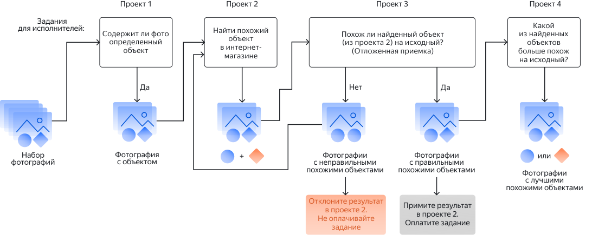

# Поиск характеристик товара (пример с декомпозицией)



Сначала запустите проект в [Песочнице]({{ sandbox }}). Так вы сможете избежать ошибок и потраченных средств, если окажется, что ваше задание не работает.




Это пример декомпозиции задания по сбору релевантных данных на несколько проектов. Декомпозиция может повысить качество результатов и снизить стоимость выполнения сложных заданий.

_Сбор релевантных данных_ — это задача по поиску данных, соответствующих заданным. Допустим у вас есть фотографии одежды и обуви, и вам нужно найти похожую обувь в интернет-магазине. Но вы не знаете, на всех ли фотографиях есть обувь и хотите сначала их отфильтровать. Далее вам необходимо найти похожую обувь в интернет-магазине. Также вы хотите потом проверить ответы исполнителей самостоятельно. Для получения конечного результата вам необходимо сравнить найденную обувь с исходным изображением и определить, какой из вариантов более похож.

Проекты, описанные ниже, вы можете использовать как вместе, чтобы наладить единый процесс, так и частично, например, только для определения объекта на фото.

- [Проект 1](contain_item.md) — используйте этот проект, если не все изображения содержат искомый объект, и вы хотите отфильтровать их.
- [Проект 2](find_an_item_in_store.md) — В этом проекте исполнители будут искать в интернет-магазине обувь, похожую на заданную. В качестве исходных изображений используйте результаты из первого проекта.
- [Проект 3](item_look_similar.md) — В этом проекте исполнители будут сравнивать обувь с исходного изображения (из первого проекта) с обувью, найденной во втором проекте.
- [Проект 4](item_more_similar.md) — В этом проекте исполнители будут сравнивать найденную обувь с исходным изображением и определять, какой из вариантов более похож.




Полный код для всех проектов смотрите в [приложении](appendix-expanded-code.md).




Каждый проект содержит следующие основные шаги:
1. **Создание проекта**. В проекте вы описываете [входные и выходные данные](../../glossary.md#input-output-data), [интерфейс задания](../../glossary.md#task-interface) и [инструкцию](../../glossary.md#task-instruction) по выполнению задания.

1. **Создание [пула заданий](../../glossary.md#pool) в проекте**. В пуле вы настраиваете [контроль качества](../../glossary.md#quality-control) и [фильтры](../../glossary.md#filtering) по исполнителям.

1. **Загрузка [файла](https://tlk.s3.yandex.net/wsdm2020/dataset_1.tsv) с заданиями в пул**.

1. **Запуск пула**.

1. **Получение и агрегирование результатов**.

О том, как пополнить счет, читайте в соответствующих разделах: [Для нерезидентов России](refill.md) и [Для резидентов России](refill-russia.md).

Узнать больше про [настройку ценообразования](dynamic-pricing.md#section_wb1_lhl_vlb).


## Что дальше {#what-next}

- Создайте [Проект 1](contain_item.md) для фильтрации изображений.
- Создайте [Проект 2](find_an_item_in_store.md) для поиска похожих изображений.
- Создайте [Проект 3](item_look_similar.md) для сравнения исходного изображение с результатами из второго проекта.
- Создайте [Проект 4](item_more_similar.md) для сравнения подходящих изображений.
- Прочитайте подробнее про [декомпозицию заданий](solution-architecture.md).


### Частые вопросы {#problem-solution}



Создайте дополнительное поле во входной спецификации, например, `my_val` и присвойте ему тип массив строк, чтобы передать в него нужный список значений.

Цикл в самом шаблоне будет выглядеть следующим образом:
```
{{#field type="select" name="result"}}
{{#each ../my_val}}
{{select_item value=this text=this}}
{{/each}}
{{/field}}
```



