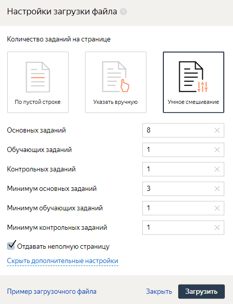

# Способы распределения заданий



Существует несколько способов разделения загруженных вами заданий на страницы. Вы можете выбрать тот способ, который вам больше подходит, а также указать значения дополнительных настроек.

#### Почему это важно

Исполнитель получает оплату именно за страницу заданий, поэтому от оптимального распределения заданий зависит стоимость и качество разметки.

## Указать вручную {#by-empty-row}

Введите количество заданий на странице. Порядок заданий зависит от настройки пула [**Сохранять порядок заданий**](pool-main.md).

## Умное смешивание {#smart-mixing}

Укажите, сколько заданий каждого типа должно быть на странице. Например, 8 основных, 1 обучающее и 1 контрольное. При необходимости в дополнительных настройках укажите минимальное количество для заданий каждого типа.

#### Когда использовать

Этот способ целесообразно использовать, если в создаваемом пуле:

- кроме [основных](../../glossary.md#general-task), будут [контрольные](../../glossary.md#control-task) или [обучающие](../../glossary.md#training-task) задания;

- включено [динамическое перекрытие](dynamic-overlap.md) (incremental relabeling, IRL).

#### Пример настройки

#### Особенности

- Задания будут разбиты на списки: обычные, контрольные, обучающие.

- Из каждого списка добавляется то количество заданий указанного типа, которые вы указали в настройках. По умолчанию задания выбираются случайным образом.

- Задания на страницах перемешиваются, перед тем, как страница будет выдана исполнителю.

- Если основных заданий недостаточно и задана опция **Отдавать неполную страницу**, то исполнителю будет выдана [неполная страница](../../glossary.md#incomplete-task-suite). Обратите внимание, что количество контрольных и обучающих заданий в таком случае должно быть полным.



Если вы будете загружать файл через **Умное смешивание**, то не сможете использовать другие способы распределения заданий по страницам в этом пуле.



После загрузки через **Умное смешивание** вам будут доступны [разметка заданий](task_markup.md) и выборочная проверка [мнением большинства](mvote.md).

#### Как распределяются задания по страницам {#smart-mixing}

Характеристика/тип загрузки | Указать вручную | Умное смешивание
----- | ----- | -----
Для формирования страниц задания берутся по порядку строк (сверху вниз) в загруженном файле | Да | Нет
Внутри страницы задания перемешиваются | Нет | Да
Исполнителям страницы раздаются в одном и том же порядке | Нет | Да
Внутри одинаковых по составу страниц контрольные задания одинаковые у всех исполнителей | Да | Нет

## Контрольные задания {#gs}

#### Сколько контрольных заданий нужно добавлять?

Рекомендуем добавлять не менее 1% контрольных заданий в пул. А для маленьких пулов — 5–10%.



Все контрольные задания показываются исполнителю только один раз. Если вы используете умное смешивание, то определяете, сколько контрольных заданий должно быть на каждой странице. Если на странице одно контрольное задание, то максимальное число страниц, которое может выполнить исполнитель, равно количеству контрольных заданий в пуле. Если вы увеличиваете количество контрольных заданий на странице, во столько же раз снижается число доступных исполнителю страниц.

Доступных страниц не должно быть слишком мало. Иначе:

- правильно оценить качество его ответов не получится;
- исполнитель не будет заинтересован выполнять такие задания, так как потратит много времени на изучение инструкций, а получит мало заработка.



#### Большой пул 1% контрольных заданий (хорошо)

В пуле 10 000 заданий, из них 100 контрольных (1%). На одной странице 10 заданий, из них 1 контрольное. Следовательно, один исполнитель может сделать до 100 страниц.

#### Маленький пул 1% контрольных заданий (плохо)

В пуле 100 заданий, из них 1 контрольное (1%). На одной странице 10 заданий, из них 1 контрольное. Следовательно, один исполнитель может сделать только 1 страницу.

#### Маленький пул 10% контрольных заданий (хорошо)

В пуле 100 заданий, из них 10 контрольных (10%). На одной странице 10 заданий, из них 1 контрольное. Следовательно, один исполнитель может сделать до 10 страниц.





Если в открытом пуле мало контрольных заданий, [добавьте новые контрольные задания](#add-gs).



Если пул большой, а контрольных заданий мало, может сложиться ситуация, что активным исполнителям, которые сделали много заданий в проекте, перестают показываться новые страницы с заданиями. Это происходит, когда исполнитель выполнил все контрольные задания в пуле.





Чтобы отсеивать исполнителей, используйте блок контроля качества [Контрольные задания](control.md). Чтобы ранжировать исполнителей по качеству ответов на контрольные задания, используйте [навык](nav.md).



#### Особенности установки перекрытия

При загрузке заданий через интерфейс Толоки автоматически установится бесконечное перекрытие для контрольных и обучающих заданий, чтобы их хватило на разметку всех основных заданий.

Конкретное значение перекрытия можно установить через [API Толоки](../../glossary.md#toloka-api) или воспользоваться способом распределения заданий **Указать вручную**.



Контрольным заданиям необходимо устанавливать бесконечное перекрытие.

Если было установлено иное значение перекрытия, то в процессе разметки контрольные задания могут закончиться и пул перестанет размечаться.



## Советы и рекомендации {#tips}

- Если вы использовали **Умное смешивание**, то узнать количество заданий на странице можно в настройках пула. Но некоторые страницы могут быть [неполными](../../glossary.md#incomplete-task-suite).

- Если вы загружали задания другим способом, то в интерфейсе Толоки для заказчика можно проверить, как задания разбиты на страницы. Для этого на странице пула нажмите кнопку **файлы** → **скачать все задания одним файлом**. Также распределение заданий по страницам можно проверить через [API Толоки](../../glossary.md#toloka-api).

## Решение проблем {#troubleshooting}



Настройки умного смешивания указываются для файла — не для пула.

При первой загрузке файла указанные настройки будут применяться для всех файлов, загруженных в дальнейшем в этот пул.





Зависит от задания. Технически можно много.

Но, во-первых, исполнители неохотно берутся за задания, которые требуют много времени на выполнение. То есть, они скорее сделают 10 заданий по одной минуте, чем одно задание на 10 минут.

Во-вторых, при большом количестве заданий на странице может быть проблема с загрузкой файлов для разметки. Например, картинок.

Третий момент — контроль качества и оценка выполнения всей страницы. Если вы используете дооценку заблокированных исполнителей, то лучше дробить задание на более мелкие части, чтобы в переразметку отправлялось меньше заданий. Это позволит уложиться в бюджет.





Одно и то же задание может попасть на разные страницы, если:

- Существует динамическое перекрытие (incremental relabeling, IRL). Например на странице было 5 заданий, по 4-м из них ответы согласовались так, что общий ответ зачелся как верный. Пятое задание будет замешано в другой набор, поскольку оно не попало в финальный ответ и его необходимо «дооценить».

- У разных заданий существует разное перекрытие. Те задания, у которых перекрытие указано больше, будут дополнительно показываться в наборах с другими оставшимися заданиями в пуле.

- Если [правило контроля качества](../../glossary.md#quality-control-rule) меняет перекрытие у задания, то оно окажется в другом наборе.





Для загрузки файла используйте кнопку **Загрузить результаты**. Формат можно посмотреть [здесь](accept.md).

Проверка ответов выполняется в файле с заданиями.



