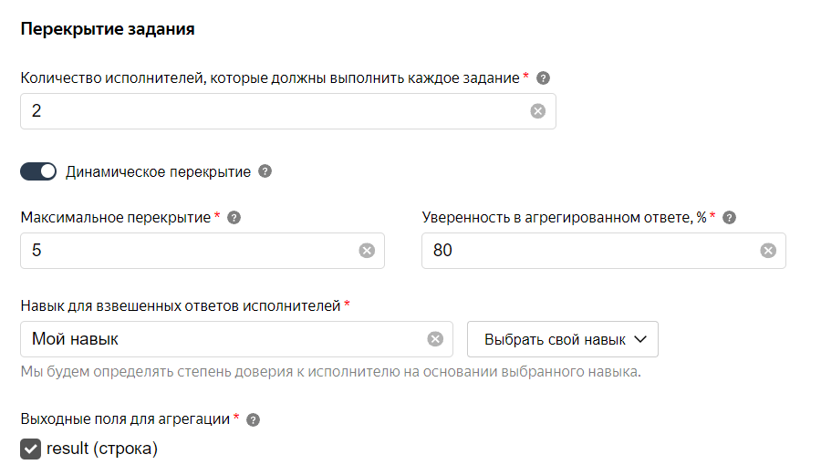

# Динамическое перекрытие

## Теория {#theory}

Динамическое перекрытие позволяет изменять перекрытие в зависимости от того:

- насколько хорошо исполнители справляются с заданием;
- насколько согласованы ответы исполнителей.

Сначала задание будет выдано с минимальным перекрытием. Когда исполнители размечают задание, их ответам присваивается уверенность. Если она окажется меньше, чем указано в поле **уверенность в агрегированном ответе**, механизм будет повышать перекрытие, пока уверенность не достигнет установленного значения, либо пока перекрытие не достигнет максимального.

В механизме динамического перекрытия используются 5 главных параметров:

1. **Перекрытие** — минимальное количество исполнителей, которые должны выполнить каждое задание пула.

1. **Максимальное перекрытие** — максимальное количество исполнителей, которые должны выполнить каждое задание пула.

1. **Уверенность в агрегированном ответе** — процент уверенности, после которого мы перестаем показывать задание исполнителям.

    Когда **уверенность** достигает необходимого уровня, механизм считает ответ на задание верным и перестает собирать ответы других исполнителей.

1. **Навык** — определяет уровень доверия к ответам исполнителя.

1. **Выходные поля для агрегации** — поля выходных данных, по которым рассчитывается уверенность в ответе.



Термины

- $q[i]$ — точность исполнителя;
- $K$ — константа для сглаживания;
- $z[j]$ — наиболее популярный ответ;
- $z[x]$ — вероятность того, что оценка правильная.
- $EPS$ — уверенность в агрегированном ответе.

Точность исполнителя $q[i]$ считаем как:

$q[i] = \frac{K+correct.golden.sets[i]}{2×K+total.golden.sets[i]}$

Где:

$K$ — константа для сглаживания (начиная от 0,5) при недостаточном количестве ответов на контрольные задания.

При наличии нескольких оценок для задания высчитывается наиболее популярный ответ — для каждого варианта ответа суммируем $q[i]$ исполнителей, выбравших его. Ответ с большей суммой считаем более правильным. Назовем эту оценку $z[j]$.

По [теореме Байеса]({{ baies }}) считаем апостериорную вероятность того, что оценка $z[j]$ — правильная.

В качестве априорного распределения оценок будет считать равномерное. Для оценки $z[x]$ априорная вероятность — $P(z[x]) = \frac{1}{Y}$

где:

$Y$ — количество вариантов ответов.

Далее считаем вероятность того, что, оценка $z[j]$ — правильная.

Если исполнитель ответил $z[j]$, то вероятность этого равна точности исполнителя $q[i]$ . Если ответил иначе, то вероятность этого равна:

$\frac{1-q[i]}{Y-1}$

Где:

$(1-q[i])$ — оставшаяся вероятность;

$(Y-1)$ — количество оставшихся ответов.

Таким образом рассчитывается то, что вероятности ошибок равномерно распределены по оставшимся оценкам.

Взяв все ответы исполнителей и, например, вариант $z[x]$ , мы считаем вероятность того, что исполнители ответят таким образом, при условии, что правильным ответом был $z[x]$ :

```javascript
func z_prob(x int) : float {
    d = 1,0
    for w[i]: workers
         if answers[w[i]] == z[x]
            d *= q[i]
         else
            d *= (1 - q[i]) / (Y - 1)
    return d
}
```

Затем по теореме Байеса считаем вероятность того, что ответ $z[j]$ — правильный:

```javascript
r = 0
for z[i]: answer_options
    r += z_prob(i) * (1 / Y)

eps = z_prob(j) * (1 / Y) / r
```

Далее смотрим на показатель $EPS$. Если ожидаемый результат меньше значения $EPS$, то мы поднимаем перекрытие до тех пор, пока результат не сравняется с уверенностью в агрегированном ответе или перекрытие не достигнет максимального.



## Практика {#practice}

Перед тем как настроить динамическое перекрытие вам нужно подготовить поля выходных данных.



- Строки и числа с допустимыми значениями.

    Допустимое значение должно совпадать с параметром `value` в нужном элементе интерфейса.

- Логический тип.

- Целые числа с минимальным и максимальным значениями. Разница между ними не должна превышать 32.

    Если в выходном поле слишком много возможных вариантов ответа, механизм динамического перекрытия не сможет агрегировать данные.





- Массив.
- Файл.
- Географические координаты.
- Объекты JSON.



#### Настройка перекрытия

1. [Создайте пул](pool-main.md) и заполните [параметры](pool_poolparams.md).

1. Установите минимальное перекрытие в поле **Перекрытие****Overlap**.

1. В расширенных настройках включите опцию **Использовать динамическое перекрытие****Use dynamic overlap**.

1. Установите **Максимальное перекрытие****Max overlap**.

1. Укажите **Уверенность в агрегированном ответе****Confidence of aggregated answer**. Чем выше значение, тем более согласованным будет агрегированный ответ. Не устанавливайте значение меньше 70.

1. Выберите **Навык для взвешивания ответов исполнителей****Skill for users' scoring**.

1. Отметьте **Выходные данные для агрегации****Output fields for answers aggregation**.

1. Сохраните пул.

1. Загрузите задания через [умное смешивание](distribute-tasks-by-pages.md#smart-mixing).

1. После завершения пула запустите [Агрегацию результатов по навыку](result-aggregation.md#aggr-by-skill).



**Приблизительный бюджет****Approximate budget** в [статистике пула](pool_statistic-pool.md) будет рассчитан на основе минимального перекрытия.





Настройка динамического перекрытия для [простой классификации](categorization.md).



Поле `result` имеет 3 допустимых значения — `OK`, `BAD` и `404`.

#### Задание 1

Исполнитель _А_ со значением навыка 70 ответил `OK`.

Исполнитель _Б_ со значением навыка 90 тоже ответил `OK`.

Уверенность в агрегированном ответе `OK` — 97,7. Задание считается завершенным.

#### Задание 2

Исполнитель _А_ со значением навыка 70 ответил `OK`.

Исполнитель _Б_ со значением навыка 90 ответил `BAD`.

Уверенность в агрегированном ответе `BAD` — 76,1. Перекрытие увеличивается на 1.

Исполнитель _В_ со значением навыка 80 ответил `BAD`.

Уверенность в агрегированном ответе `BAD` — 96,2. Задание считается завершенным.



## Советы и рекомендации {#help}

- Вместе с динамическим перекрытием не используйте правило контроля качества [Повторное выполнение заданий после блокировки исполнителя](restore-task-overlap.md). Это увеличит значение максимального перекрытия.

- Устанавливайте уверенность в агрегированном ответе на уровне от 70 до 95 процентов.

    - При значении `< 70%` средняя точность агрегированного ответа будет недостаточна, чтобы доверять ответам исполнителей.

    - При значении `> 90%` средняя точность агрегированного ответа не будет расти, а стоимость разметки увеличится.

    Оптимальная уверенность находится на уровне 80%. При такой настройке соотношение «цена-качество» будет наиболее приемлемым.

- Загружайте задания через **умное смешивание**, иначе задания пула будут выданы с минимальным перекрытием.

    Это нужно для того, чтобы механизм мог повышать перекрытие, так как [контрольные](../../glossary.md#control-task) и [обучающие](../../glossary.md#training-task) задания, загруженные через **умное смешивание** имеют бесконечное перекрытие.

- Используйте навык, рассчитываемый как [доля правильных ответов на контрольные задания](goldenset.md). В этом случае результаты будут наиболее точные.

- Если вы редактируете обязательные поля, изменения применятся только к новым пулам. Существующие пулы будут работать в соответствии со старой версией проекта.

## Что дальше {#what-next}

- [Добавления заданий в пул](pool.md).

- Узнайте больше про настройку перекрытия:

    - [Выборочная проверка мнением большинства](selective-mvote.md).

## Решение проблем {#troubleshooting}



Да. [Откройте режим редактирования пула](pool-edit.md) и установите новое значение перекрытия. Перезапускать пул не требуется. Обновление настроек обычно происходит быстро, но если заданий много, то может занять несколько минут.





Да, такое может произойти. Необходимо установить достаточный интервал закрытия пула.



