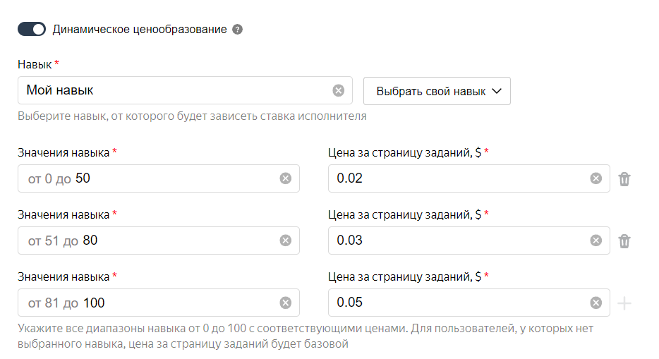

# Настройка ценообразования



Цена указывается за [страницу заданий](../../glossary.md#task-suite) в долларах США. Для центов используйте точку «.» в качестве разделителя.

Если в поле **Тип пула****Pool type**, которое находится в расширенных настройках, выбрано значение **Пул с обычными заданиями****General tasks**, то минимальная цена за страницу заданий составляет 0,005 \$. Для остальных типов пула вы можете указать цену, равную нулю. Комиссия — 30% от цены, но не меньше 0,005 \$.

В Толоке есть два способа настроить цену за задание:

- _Фиксированное ценообразование_ — позволяет установить единую цену за страницу заданий. Цена будет одинаковой для любого исполнителя, независимо от его [навыков](../../glossary.md#skill) и опыта.

- _Динамическое ценообразование_ — позволяет дополнительно установить другие цены, которые зависят от навыка исполнителя. Например, чтобы платить больше тем, у кого более высокий навык.

    Навык вы создаете сами, затем вы назначаете его исполнителям автоматически или вручную. Подробнее в разделе [Навыки исполнителей](nav.md). [Как настроить динамическое ценообразование.](dynamic-pricing.md#section_ucl_3hl_vlb)

## Как определить оптимальную цену {#section_wb1_lhl_vlb}

Каждый исполнитель хочет зарабатывать больше, поэтому точные цифры дать сложно. Чтобы понять, какую цену выставить, ответьте себе на несколько вопросов:

- Включите секундомер и замерьте, сколько времени понадобится, чтобы прочитать [инструкцию](../../glossary.md#instructions) и выполнить несколько своих заданий. Посчитайте сколько страниц заданий вы бы успели выполнить в час и подумайте, какая цена будет справедливой.

- Если у вас задача не срочная, то поставьте минимальную цену и посмотрите, сколько исполнителей откликнется. Так вы сможете определить оптимальную цену исходя из спроса на задания.

- [Зарегистрируйтесь]({{ register }}) в качестве исполнителя (вам понадобится дополнительный аккаунт на Яндексе) и посмотрите, какой средний заработок в час для разных заданий. Попробуйте найти задания похожие на ваше.



Высокая стоимость заданий не гарантирует хорошее качество результата. Повышение стоимости позволяет привлечь больше исполнителей, но качество результата зависит от качества самих исполнителей. Хорошим исполнителям можно платить больше с помощью динамического ценообразования.



## Настройка динамического ценообразования {#section_ucl_3hl_vlb}

Чтобы настроить динамическое ценообразование:

1. Для динамического ценообразования вам необходим навык. О том, как создавать и назначать навыки читайте в разделе [Навыки исполнителей](nav.md).

    Чтобы повысить мотивацию исполнителя, сделайте навык [публичным](nav.md#public). Тогда исполнитель сможет видеть весь перечень цен и свой уровень.

1. При создании или редактировании [пула](../../glossary.md#pool) укажите фиксированную цену в поле **Цена за страницу заданий, \$****Price per task suite, \$**. Эта цена будет использоваться, если навык не назначен исполнителю.

1. В расширенных настройках включите опцию **Использовать динамическое ценообразование****Use dynamic pricing**.

1. Выберите навык в открывшемся окне.

1. Значение навыка — это число от 0 до 100. Определите плату за каждый диапазон значений навыка.



Стоимость рассчитывается в момент выдачи страницы заданий исполнителю. Если навык поменялся или был назначен после отправки исполнителем ответа на страницу заданий, то только следующая страница заданий будет по новой цене.



#### Пример настройки динамического ценообразования

## Что дальше {#what_next}

- [Добавьте задания](pool.md) в пул.
- Узнайте больше про настройку пула:

    - [Динамическое перекрытие](dynamic-overlap.md).
    - [Выборочная проверка мнением большинства](selective-mvote.md).
    - [Фильтры](filters.md).
    - [Соотношение скорости и качества](adjust.md).
    - [Настройка контроля качества](qa-pool-settings.md).
    - [Отложенная приемка](offline-accept.md).
    - [Статья в блоге Толоки]({{ toloka-blog-pool }}).

## Решение проблем {#troubleshooting}



Установить цену за **страницу** заданий можно на странице редактирования пула. Минимальная цена для обычных пулов составляет 0,005 \$.





Общее правило формирования цены: чем больше времени нужно на выполнение, тем выше цена.

Если задание простое , например, на оценку релевантности товара исполнитель потратит несколько секунд, то при 10 заданиях (товарах) на странице устанавливайте стоимость 0,01 \$-0,02 \$.

Если вы зарегистрируетесь в Толоке как исполнитель, то сможете проанализировать предложения других заказчиков.

Определите цену страницы, умножьте на перекрытие (например, в задании по классификации это обычно 3–5) и учтите НДС 20%. Попробуйте положить на счет первые 10 \$, а затем пополняйте его с учетом выполнения.





Вы можете выдавать бонусы после выполнения и описать условие получения повышенного вознаграждения в инструкции к заданию. Возможности изменять цену за страницу заданий динамически по результатам выполнения не предусмотрено.





Отслеживайте списание денег на бонусы в **Профиле** → вкладка **Затраты****Profile** → **Spent**.





Нет, цена за страницу заданий общая для всех заданий в пуле. Вы можете создать несколько пулов с разными ценами или [изменять цену](dynamic-pricing.md) в зависимости от навыка исполнителя с помощью **Динамического ценообразования**. Добросовестным исполнителям можно [выплачивать бонусы.](bonus.md)



[Получить закрывающие документы и акты](../troubleshooting/support.md#feedback_g3b_vj3_qjb)

[Вернуть средства, перечисленные на счет в Толоку](../troubleshooting/support.md#feedback_khw_wc3_qjb)

