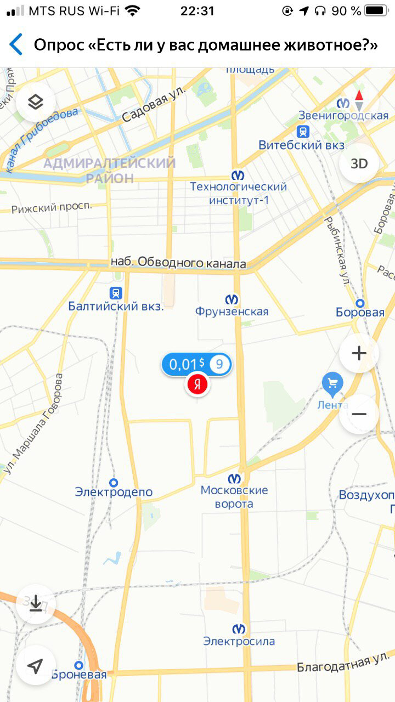
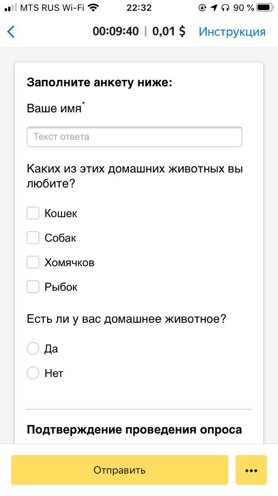
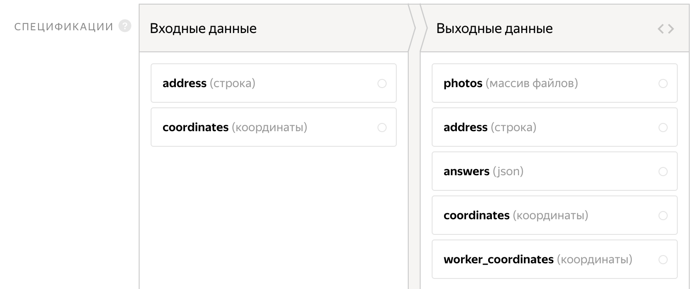
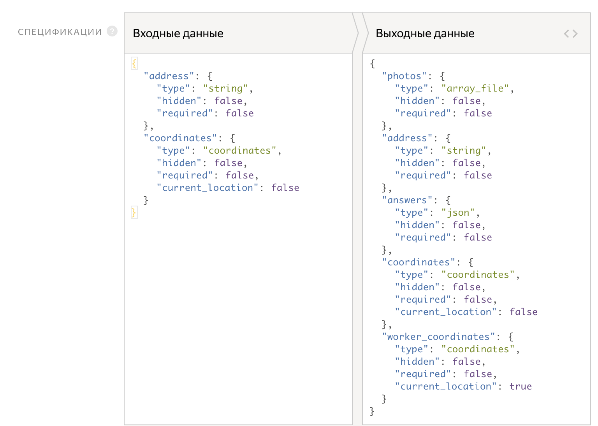

# Опрос





Возможно, для вашего проекта нужны дополнительные настройки, например, добавление новой кнопки со сценарием выполнения или добавление блока с прикреплением файлов. Подробнее об этом читайте в разделе [Примеры кастомизации](advanced-features.md).

Примеры задач, которые поможет решить этот шаблон:

- Выявление недостатков продуктов.
- Оценка лояльности.
- Получение обратной связи.
- Выявление ключевых признаков как в примере.

Для этого создадим такое задание: исполнителю нужно будет прийти на точку, найти респондентов по заданному описанию (из них тех, кто согласиться пройти опрос), задать вопросы, согласно анкете и подтвердить личность опрашиваемых с помощью номера телефона или фото.

#### Пример готового задания

#### Задание в списке доступных


#### Задание на карте



#### Интерфейс задания



#### Ответ исполнителя


Чтобы запустить задания и получить ответы, следуйте инструкции:

## Создайте проект {#project}



1. Нажмите кнопку **+ Создать проект** и выберите шаблон **Опрос** в блоке полевых заданий.

1. 

1. Напишите краткую инструкцию (см. [советы](faq.md)). Вы можете использовать HTML-разметку, чтобы вставлять ссылки, иллюстрации и т. д. Инструкция для пешеходных заданий должна хорошо читаться, в том числе, на экране мобильного телефона.

1. В шаблоне автоматически установлена опция **На карте** для пешеходных заданий. Это означает, что исполнитель увидит задания этого проекта на карте и сможет выбрать любое.

    **Адрес** и **Координаты** будут отображаться, когда исполнитель выберет точку на карте. Текст в этих полях содержит поле входных данных. Оно будет изменено [далее](#name-desc).

1. Чтобы в задании показывать исполнителю название точки и ее описание, отредактируйте поля:

    - **Адрес**: `{{inputParams["address"]}}`;

    - **Описание**: `Расположение: {{inputParams["coordinates"]}}` .

1. 

    

    Шаблон включает в себя поля:

    1. Поля входных данных:

        - `address` – адрес задания;
        - `coordinates` – координаты точки, куда должен прийти толокер.

    1. Поля выходных данных:

        - `photos` – массив файлов, фотографии, которые будет загружать исполнитель;
        - `answers` – json-файл с ответами толокера;
        - `address` – адрес задания;
        - `coordinates` – координаты задания;
        - `worker_coordinates` – координаты исполнителя в момент исполнения задания, с включенной опцией **Текущее положение**.

    #### Графический режим

    

    #### JSON

    

1. **Интерфейс** задания описывает, где будут расположены элементы, как они будут выглядеть и какой логике подчиняться.

    В блок **HTML** можно вставлять стандартные теги HTML и [специальные выражения](spec.md) для полей входных и выходных данных в двойных фигурных скобках. HTML описывает, как будут расположены элементы задания.

    **JS** используется для описании логики задания, кроме того, основной контент данного задания заложен в js, для простоты редактирования.

    В этом проекте, в переменной `translates` хранятся все тексты со страницы задания.

    Здесь вы можете добавить, удалить или изменить пункты опроса.

    **Translates:**

    

    ```javascript
    **var** translates = {
    'header': 'Заполните анкету ниже',
    'surveyConfirmation': 'Подтверждение проведения опроса',
    'firstName': 'Ваше имя',
    'photo': 'Фото',
    'responseTextPlaceholder': 'Текст ответа',
    'phone': 'Ваш мобильный телефон',
    'phoneExamplePlaceholder': '+79000000000',
    'petPreferences': 'Каких из этих домашних животных вы любите?',
    'petsList': [
    'Кошек',
    'Собак',
    'Хомячков',
    'Рыбок',
    ],
    'petHave': 'Есть ли у вас домашнее животное?',
    'petName': 'Как зовут вашего питомца?',
    'yes': 'Да',
    'no': 'Нет',
    'user': 'Исполнитель',
    'placeOfSurvey': 'Место опроса',
    //валидационные ошибки
    'firstNameEmpty': 'Введите имя респондента',
    'surveyConfirmationProofsMissing': 'Вы не подтвердили факт совершения опроса',
    'petNameEmpty': 'Введите имя домашнего питомца',
    'firstNameIncorrect': 'Имя респондента должно содержать только кириллицу',
    'phoneIncorrect': 'Вы ввели некорректный номер телефона',
    'tooFar': 'Вы находитесь слишком далеко от места опроса'
    }
    ```

    

    ```javascript
    **var** translates = {
    'header': 'Fill out the form below',
    'surveyConfirmation': 'Survey confirmation',
    'firstName': 'Your name',
    'photo': 'Photo',
    'responseTextPlaceholder': 'Response text',
    'phone': 'Your mobile phone number',
    'phoneExamplePlaceholder': '+79000000000',
    'petPreferences': 'Which of these pets do you like?',
    'petsList': [
    'Cats',
    'Dogs',
    'Hamsters',
    'Fish',
    ],
    'petHave': 'Do you have a pet?',
    'petName': 'What is your pet's name?',
    'yes': 'Yes',
    'no': 'No',
    'user': 'Performer',
    'placeOfSurvey': 'Survey location',
    //validation errors
    'firstNameEmpty': 'Enter the respondent's name',
    'surveyConfirmationProofsMissing': 'You haven't confirmed the survey',
    'petNameEmpty': 'Enter the pet's name',
    'firstNameIncorrect': 'The respondent's name must contain only Cyrillic letters',
    'phoneIncorrect': 'You entered an incorrect phone number',
    'tooFar': 'You're too far away from the survey location'
    }
    ```

    

    Шаблон уже содержит **CSS**-стили, их изменять не нужно.

    В переменной `MAX_DISTANCE` указана максимальная удаленность от назначенной точки, на которую может отойти толокер во время выполнения задания, в км.

    В логике шаблона заложена проверка на телефон или фото респондента. Таким образом толокер должен будет ввести номер телефона опрашиваемого или сделать его фото.

1. Нажмите кнопку **Предпросмотр**, чтобы увидеть получившееся задание.

1. Сохраните проект.

## Добавьте пул заданий {#pool}

Пул — это набор оплачиваемых заданий, которые одновременно выдаются исполнителям.

1. Откройте проект и нажмите **Добавить пул**.

1. Дайте пулу любое удобное название и описание. Они доступны только вам, исполнитель будет видеть только название и описание проекта.

1. В блоке **Аудитория** добавьте **Фильтры** для отбора исполнителей. Чтобы ваши задания были доступны в мобильных приложениях Толоки исполнителям, владеющих русским языком и находящихся в Москве, установите язык и регион.

1. В блоке **Цена** установите цену за задание, например 0,2 $. Для пешеходных заданий всегда добавляйте одно задание на страницу.

    #### Что такое страница заданий?

    На одной странице может отображаться одно или несколько заданий. Если задания простые, то можно добавлять 10–20 заданий на одну страницу. Не рекомендуем создавать длинные страницы, поскольку это снизит скорость загрузки данных у исполнителя.

    Исполнитель получит оплату, только если выполнил все задания на странице.

    Количество заданий на странице вы определите при [загрузке заданий](#smart-mixing).

    #### Как определить справедливую цену?

    Общее правило формирования цены — чем больше времени исполнитель тратит на выполнение, тем выше цена.

    Вы можете зарегистрироваться в Толоке как исполнитель и узнать, сколько платят другие заказчики за задания.

1. В блоке **Контроль качества** установите **Перекрытие** — количество исполнителей, которые должны выполнить задание. Для пешеходных заданий, как правило, 1.

1. В блоке **Контроль качества** включите опцию **Отложенная приемка** и укажите количество дней на проверку для параметра **Срок проверки**. Например, 7.

    #### Что такое отложенная приемка?

    [Отложенная приемка](offline-accept.md) позволяет вам просматривать [выполненные страницы заданий](../../glossary.md#completed-tasks) перед тем, как принять их и заплатить исполнителю. Задания, выполненные в несоответствии с инструкцией, можно отклонять. Максимальный срок проверки устанавливается в поле **Срок проверки**.

1. В блоке **Дополнительные настройки** укажите **Время** на выполнение страницы заданий. Его должно быть достаточно для того, чтобы добраться до места, найти указанную точку и загрузить фотографии. Для пешеходных заданий рекомендуем устанавливать сутки — 86 400 секунд.

1. Сохраните пул.

## Загрузите задания {#tasks_upload}

1. Нажмите кнопку **Загрузить****Upload**. В открывшемся окне вы можете скачать шаблон файла.

    #### Использовать пример данных

    Если вы хотите посмотреть, как ваш проект будет выглядеть после запуска, но у вас еще нет заданий для разметки, вы можете загрузить в пул готовый пример данных.

    Нажмите **Использовать пример данных****Use sample data** справа от надписи **Прикрепите подготовленный файл с данными****Attach the prepared file with data**. Это позволит избежать дополнительных действий с файлами.

    После того, как вы поработали с примером данных и вас все устроило, подготовьте свои данные и загрузите их в пул.

1. Добавьте в него входные данные. Заголовок столбца с входными данными содержит слово `INPUT`. Для пешеходных заданий также нужно указать широту `AI:latitude` и долготу `AI:longitude` каждой точки. Координаты можно уточнить, например, в [Яндекс Картах]({{ ya-maps-object-search }})

1. Загрузите задания, выбрав **Указать вручную** и установив 1 задание на странице.

## Запустите пул и получите результаты {#launch}

1. Запустите пул, нажав кнопку .

1. Следите за выполнением в блоке **Статистика пула**.

1. Как только получены первые результаты, вы можете начинать проверку.

    Чтобы проверить задания, откройте пул и нажмите **Скачать результаты**. Чтобы скачать вложения, нажмите кнопку рядом  и выберете **Скачать вложения**.

    

    По истечении установленного срока проверки все ответы будут автоматически приняты вне зависимости от качества ответа.

    

