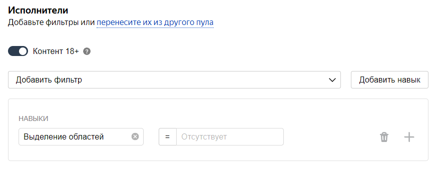
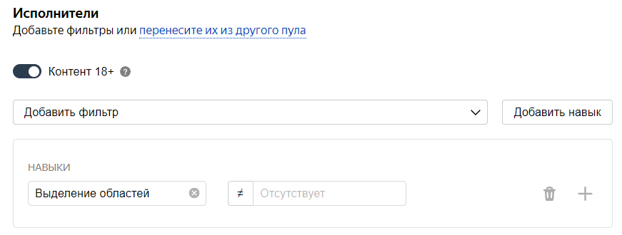
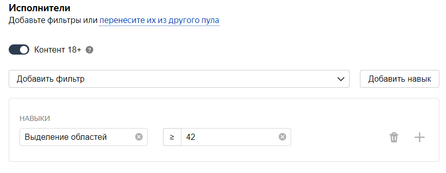
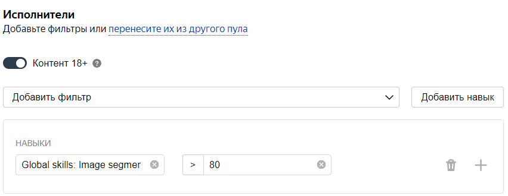

# Фильтры

С помощью фильтров можно выбирать исполнителей для своего проекта: задания увидят не все исполнители, а только те, кто подходит. Правильно настроенные фильтры помогут вам отправлять задания целевой группе исполнителей. В итоге вы получите результат быстрее и дешевле.

Чтобы отобрать исполнителей для [пула](../../glossary.md#pool-ru), нажмите **Добавить фильтр****Add filter** на странице редактирования пула.

Из выпадающего списка выберите фильтры по данным профиля и техническим характеристикам устройства.



Чтобы быстрее добавить фильтры, скопируйте их из другого пула (кнопка **Скопировать настройки из…****Copy settings from…**).



Все фильтры, добавленные в пул, действуют одновременно. Критерии внутри одного фильтра объединены логическим ИЛИ.







## Навык {#filter-skill}

Вы можете отбирать исполнителей с [навыком](../../glossary.md#skill-ru) или без него, а также по значению навыка.

В качестве фильтра вы можете использовать [глобальные навыки](nav-cross-project.md), чтобы набрать исполнителей, которые хорошо справляются с определенными типами заданий. Для этого выберите , после чего укажите ограничение по выбранному навыку в добавленном фильтре.

Примеры использования фильтра по навыку:

#### Мне нужны исполнители без навыка

Используйте оператор `=`, а значение оставьте пустым.

#### Мне нужны исполнители с навыком, уровень навыка не важен

Используйте оператор `≠`, а значение оставьте пустым. Например, чтобы выбрать исполнителей, которые уже знакомы с заданиями такого типа, как в вашем пуле.

#### Мне нужны исполнители с навыком определенного уровня

Добавьте фильтр, введите значение от 0 до 100 и используйте набор операторов. Например, вы можете выбрать только тех исполнителей, которые до этого качественно выполнили определенное количество заданий такого же типа, как в вашем пуле.

#### Мне нужны исполнители с глобальным навыком определенного уровня

Добавьте фильтр по глобальному навыку, введите значение от 0 до 100 и используйте набор операторов. Например, вы можете выбрать только тех, ответы которых были в среднем лучше, чем ответы 80% исполнителей в проектах этой компетенции.

## Профиль исполнителя {#filter-user-profile}

Используйте фильтры из этой группы, чтобы отбирать исполнителей по основным данным профиля.

#### Языки

Обязательно добавьте фильтр **Языки****Languages** и укажите язык, на котором написана [инструкция](../../glossary.md#task-instruction-ru) и текст в задании.

Если вы хотите быть уверенными, что исполнители умеют читать и понимают базовую лексику языка — выберите тех, кто сдал тест на знание языка.

#### Взрослый контент

Если в заданиях пула есть контент для взрослых, эти задания будут показаны только тем исполнителям, которые готовы их выполнять. Чтобы выбрать таких исполнителей, добавьте фильтр **Взрослый контент** и выберите опцию **Вкл.**

#### Город

Вы можете выбрать исполнителей, которые проживают в определенных городах. Этот фильтр удобно использовать для полевых заданий или поиска данных в сети.

#### Гражданство

Этот фильтр пригодится, если гражданство исполнителя может повлиять на качество ответов: например, если в вашем проекте есть опросы, задания по транскрибации аудио или поиску в сети. Также можно ограничить доступ исполнителей к заданиям по этому признаку.

#### Дата рождения

С помощью набора операторов вы можете выбрать среди исполнителей аудиторию нужного возраста.

#### Образование

Добавьте этот фильтр, если уровень образования исполнителя может повлиять на качество ответов. Используйте операторы `=` или `≠` и выберите из выпадающего списка **Среднее**, **Среднее специальное** или **Высшее**.

#### Пол

Вы можете выбрать исполнителей определенного пола, если это важно для проекта.

#### Страна

Добавьте этот фильтр, чтобы ограничить аудиторию по территориальному признаку.

#### Проверенный

Используйте этот фильтр, если вам необходимы дополнительные гарантии при отборе исполнителей. Задания будут доступны тем, кто подтвердил в Толоке личные данные документально.

## Вычислимые данные {#filter-calc-data}

Используйте фильтры из этой группы, чтобы выбрать исполнителей по типу устройства, браузера или версиям программного обеспечения.

#### Браузер

Используйте этот фильтр, если ваши задания предназначены для пользователей определенных браузеров.

#### Категория устройства

Если вам важен тип устройства, которое использует исполнитель, настройте требования с помощью операторов `=` и `≠`.

#### Клиент



Если в вашем проекте есть полевые задания, среди исполнителей нужно выбрать пользователей мобильной Толоки.

#### Операционная система

Добавьте этот фильтр, чтобы выбрать пользователей определенных операционных систем.



Чтобы выбрать самые популярные операционные системы для ПК — MacOS, Windows и Linux, добавьте фильтр **Операционная система****Operating system**. C помощью оператора `=` установите значение `Windows`. С помощью кнопки  добавьте второе значение `MacOS`. Затем еще раз нажмите  и установите третье значение фильтра `Linux`.



#### Регион по IP

Чтобы задание было доступно для пользователей, которые используют IP-адреса определенного региона, добавьте фильтр **Регион по IP****Region by IP** и введите название региона. Это удобно для полевых заданий.

#### Регион по номеру телефона

Для более надежного отбора исполнителей по территориальному признаку добавьте фильтр **Регион по номеру телефона****Region by phone**. Например, для русскоязычных исполнителей укажите регионы: Россия, Украина, Белоруссия и Казахстан.

#### Тип клиентского приложения

Выберите этот фильтр, если от типа браузера зависит, подойдут ли исполнителю задания вашего проекта.

 
## Популярные наборы аудиторий {#filter-instant}

Фильтры можно комбинировать. Используйте эти комбинации фильтров, чтобы создавать уникальные правила отбора исполнителей.

#### Русскоязычные исполнители

Сочетание фильтров **Регион по номеру телефона** и **Языки**: выбирает исполнителей из России, Украины, Казахстана и Беларуси, которые в своем профиле отметили знание русского языка.

#### Москва и Санкт-Петербург

Сочетание фильтров **Регион по номеру телефона** и **Регион по IP**: выбирает исполнителей из России, которые используют IP-адреса Москвы и Санкт-Петербурга.

#### Пользователи Firefox

Сочетание фильтров **Регион по номеру телефона** и **Браузер**: выбирает исполнителей из России, Украины, Казахстана и Беларуси, которые используют браузер Firefox.

#### Мобильные русскоязычные исполнители

Сочетание фильтров **Клиент**, **Регион по номеру телефона** и **Языки**: выбирает исполнителей из России, Украины, Казахстана и Беларуси, которые в своем профиле отметили знание русского языка и пользуются мобильной Толокой.

#### Мобильное приложение с Android

Сочетание фильтров **Клиент** и **Операционная система**: выбирает исполнителей, которые для работы в мобильной Толоке используют устройства с Android.

#### Мобильное приложение с iOS

Сочетание фильтров **Клиент** и **Операционная система**: выбирает исполнителей, которые для работы в мобильной Толоке используют устройства с iOS.

Количество исполнителей, отобранных с помощью фильтров, указано в блоке [Соотношение скорость/качество](adjust.md), в строке **Задание доступно для выполнения N активным пользователям**.


## Что дальше {#what_next}

- [Добавьте задания в пул](pool.md).
- Узнайте больше про настройку пула:
    - [Настройка ценообразования](dynamic-pricing.md).
    - [Динамическое перекрытие](dynamic-overlap.md).
    - [Выборочная проверка мнением большинства](selective-mvote.md).
    - [Соотношение скорости и качества](adjust.md).
    - [Настройка контроля качества](qa-pool-settings.md).
    - [Отложенная приемка](offline-accept.md).
    - 
    - [Статья в блоге Толоки]({{ toloka-blog-pool }}).
    - 

### Решение проблем {#troubleshooting}

#### Исполнители

#### Почему в информации о пользователе нет данных о поле исполнителей, хотя в настройках пула можно отфильтровать людей по этому признаку?

Заказчику не доступна полная информация о каждом конкретном исполнителе. Например, заказчик не видит дату рождения, пол, фамилию и имя. При этом фильтры по дате рождения и полу в настройках пула ему доступны, поскольку они позволяют отобрать группу исполнителей, не получая информации о каждом в отдельности. Это уменьшает риск деанонимизации пользователей.

#### Можно ли настроить показ задания исполнителям по демографическим и гео-параметрам? Например, <q>только Москва, 30-45 лет</q>.

Можно, чтобы отобрать исполнителей для пула используйте [фильтры](filters.md).

#### Можно ли добавить в исполнители произвольного пользователя?

Если пользователь не проходит по фильтру, увидеть задание у него не получится. Можно только убрать такой блокирующий фильтр из пула. Протестировать задание можно в [Песочнице](sandbox.md), добавив нужного пользователя в список доверенных.

#### Можно ли как-то ограничить количество исполнителей, которые одновременно берутся выполнять задание из пула?

Задания из открытого пула доступны всем исполнителям, которые подходят под [фильтры](filters.md) в пуле. Вы можете ограничивать доступ, например по навыку.

#### Есть ли возможность отбирать исполнителей по конкретному городу проживания, а не только использовать<q>Регион по IP</q>?

Да, можно. В [фильтрах](filters.md) выберите . Обратите внимание, что данные профиля вводит сам пользователь при регистрации в Толоке. Рекомендуем использовать фильтры **Регион по номеру телефона** и **Регион по IP**.

#### Можно ли использовать навык не только в пуле или в одном проекте, но и в разных проектах?

Да, конечно, один и тот же навык можно назначать и использовать на различных проектах. Но чаще всего один навык используется в рамках одного проекта. Если исполнитель хорошо выполняет одно задание, это не значит, что он так же успешно справится с другим. Кроме того, используя фильтры по давно настроенным навыкам, вы ограничиваете количество доступных исполнителей.

#### Навык

#### Я хочу, чтобы навык подсчитывался по нескольким проектам. Это возможно? Если да, то я могу использовать <q>Агрегацию результатов по навыку</q>?

Если речь идет о нескольких проектах, то так сделать не получится.

Вы можете перенести все в один проект и в блоках контроля качества использовать параметр **Помнить значения**. Примеры вы можете посмотреть в статье [Контрольные задания](goldenset.md).

Использовать **Агрегацию результатов по навыку** можно, но вам придется перечислить все возможные значения, что, вероятно, будет не очень удобно делать. Возможно, подойдет [другой способ агрегации](result-aggregation.md).

#### Есть ли какие-нибудь простые способы присвоить определенному исполнителю Толоки навык, как это делается в песочнице, даже если тот не делал ни одно задание?

Назначить навык в основной версии Толоки можно только для исполнителей, которые выполнили хотя бы одно ваше задание. Любому исполнителю назначить навык возможности нет. Чтобы ограничить поток исполнителей, которые увидят ваш проект, можно воспользоваться [фильтрами](filters.md). Например, указать город, дату рождения, пол или какие-то другие параметры, которые есть у нужных вам исполнителей.

#### Исполнители прошли обучение по первому пулу и получили навык. Спустя неделю мы склонировали пул, однако у всех исполнителей навык пропал. Какой параметр влияет на истечение срока навыка? Им всем придется перепройти обучение?

За количество дней, в течение которых сохраняется тренировочный навык, отвечает параметр **Повторное прохождение**. Навык будет удален через количество дней, указанное в поле **Повторное прохождение**, если исполнитель:
- получил значение навыка ниже значения в поле **Уровень прохождения**;
- не выполнил ни одного задания, к которому привязано обучение, в течение этого срока.

Вашим исполнителям будет нужно пройти обучение заново.

#### Можно ли выбрать для выполнения заданий конкретных исполнителей, которые понравились по предыдущим пулам?

Вы можете назначить им навык по результатам выполнения заданий в предыдущих пулах. Этот навык укажите в качестве [фильтра](filters.md) в новом пуле.

#### Как поставить фильтр так, чтобы пул был доступен исполнителям, у которых нет определенного навыка (например, <q>спамер</q>)?

Укажите этот навык в качестве [фильтра](filters.md) и в качестве значения установите пустое поле (это равносильно тому, что навык отсутствует).

#### Как я могу поднять исполнителю значение навыка, если навык у него уже есть?

Если у исполнителя уже есть навык, то добавить ему этот же навык из интерфейса проверки задания нельзя. Можно зайти в профиль исполнителя и отредактировать значение навыка.

#### Видят ли исполнители в Толоке, что им назначен навык?

Если навык публичный или обучающий, то видят — им приходит сообщение об этом.

#### Можно ли в интерфейсе задания показать навык?

Такой возможности нет. Если навык публичный, то исполнитель видит его в своем профиле.

#### Как можно автоматизировать присвоение навыков в зависимости от ответов исполнителей на вопросы анкеты?

Это можно сделать с помощью правила [Контрольные задания](goldenset.md).
1. Загрузите файл с заданиями при помощи **Умного смешивания**.
1. Укажите `student` в качестве правильного ответа на вопрос. Остальные вопросы не учитывайте (оставьте поля пустыми или не ставьте галочку).
1. Добавьте в пул правило [Контрольные задания](goldenset.md): `если процент правильных контрольных ответов = 100, то установить значение навыка Студент = 1`.

#### Смотреть скриншот

#### Как сделать так, чтобы задание было доступно не только с компьютера, но и с мобильных устройств?

Задания в пулах по умолчанию доступны для веб версии Толоки и мобильного приложения. Проверьте настройки пула, возможно у вас настроен [фильтр](filters.md): `Клиент = Мобильная Толока`

#### Почему мой проект не доступен в мобильной версии Толоки?

Задания в пулах по умолчанию доступны для веб версии Толоки и мобильного приложения. Проверьте настройки пула, возможно у вас настроен [фильтр](filters.md): `Клиент = Веб-версия Толоки`

