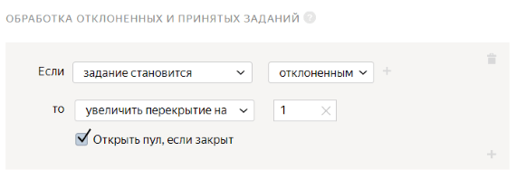
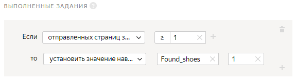

# Проект 2. Найти похожий объект в интернет-магазине



В этом [проекте](../../glossary.md#project) исполнители будут искать в интернет-магазине обувь, похожую на заданную. В качестве исходных изображений используйте результаты из [первого проекта](contain_item.md#get_results).

## Создайте проект {#create_project}

Чтобы создать проект, откройте [Толоку для заказчика]({{ yandex-toloka }}).

#### В интерфейсе:

1. Выберите пресет:

    1. 

    1. 

1. Заполните общую информацию:

    1. В поле **Название проекта** введите `Найти такую же или похожую обувь в интернет-магазине`.

    1. В поле **Описание** введите `Зайдите в интернет-магазин и предоставьте ссылку и изображение такой же или похожей пары обуви.`.

    1. 

    1. 

1. 

    

    - Конструктор шаблонов

      1. Воспользуйтесь [готовым кодом](https://ya.cc/t/sucNUJXK3tveWk)[ready-made code](https://ya.cc/t/G4tBYKz63ttEYj) для этого проекта, где уже настроена валидация и внешний вид задания.

          Исполнитель не сможет отправить задание, если:

          - не перейдет по кнопке в интернет-магазин;
          - не добавит ссылку на найденный товар;
          - не загрузит изображение товара.

      1. 

          - Поле входных данных: `image` — ссылка для загрузки картинки.

          - Поля выходных данных:

              - `found_link` — для ссылки на товар, найденный исполнителем в интернет-магазине;
              - `found_image` — для загрузки изображения этого товара.

    - Редактор HTML/CSS/JS

      1. В **Интерфейсе задания** удалите шаблонный код из блока **HTML** и вставьте следующий код:

          

          ```html
          {{img src=image width="50%" height="400px"}}
          <div class='answers'>
          <p>Найти похожую <b>обувь</b> в интернет-магазине ASOS</p>
          {{field type="button-clicked" name="button" label="ASOS" href="https://www.asos.com" action=true}}
          <p>Обувь должна быть похожа по цвету, материалу, длине и стилю.</p>
          <p>Вставьте ссылку</p>
          {{field width="100%" type="input" name="found_link"}}
          <p>Загрузите изображение</p>
          <div>
          {{field width="100%" type="file-img" name="found_image" preview=true}}
          </div>
          </div>
          ```

          

          ```html
          {{img src=image width="50%" height="400px"}}
          <div class='answers'>
          <p>Find similar shoes <b>shoes</b> in the ASOS online store</p>
          {{field type="button-clicked" name="button" label="ASOS" href="https://www.asos.com" action=true}}
          <p>Shoes must be similar in color, material, length, and style.</p>
          <p>Paste the link here</p>
          {{field width="100%" type="input" name="found_link"}}
          <p>Upload the image here</p>    <div>
          {{field width="100%" type="file-img" name="found_image" preview=true}}
          </div>
          </div>
          ```

          

      1. Чтобы проверить корректность ссылки и изображения, предоставленных исполнителем, в 5-ой сроке блока **JS** замените следующий код:

          `if (!solution.output_values.image && !solution.output_values.no_image) {`

          на

          `if (!solution.output_values.found_image) {`

          

          Будьте внимательны при изменении кода. Если у вас возникли проблемы с предварительным просмотром, обратитесь в **службу поддержки** или сравните ваш код с кодом в [приложении](appendix-expanded-code.md).

          

      1. Удалите шаблонный код из блока **CSS** и вставьте следующий код, отвечающий за установку пропорционального размера изображения.

          ```css
          .task {
          display: block;
          height: 500px;
          width: 800px;
          }
          .img {
          float: left;
          width: 50%;
          }
          .answers {
          float: left;
          width: 40%;
          margin: 5%;
           }
          ```

          1. Отредактируйте [входные и выходные данные](../../glossary.md#input-output-data) в блоке **Спецификация данных**.

          1. Нажмите кнопку , чтобы переключить графический режим на формат JSON.

          1. В поле **Входные данные** введите:

          ```json
          {
          "image": {
          "type": "url",
          "hidden": false,
          "required": true
          }
          }
          ```

      1. В поле **Выходные данные** введите:

          

          Если вы хотите выбрать другой интернет-магазин, измените строку с `"pattern": "https://www.asos.com/.*"` на `"pattern": "your_store.*"`.

          

          ```json
          {
          "button": {
          "type": "boolean",
          "hidden": false,
          "required": true,
          "allowed_values": [
          true
          ]
          },
          "found_link": {
          "type": "string",
          "hidden": false,
          "pattern": "https://www.asos.com/.*",
          "required": true
          },
          "found_image": {
          "type": "file",
          "hidden": false,
          "required": true
          }
          }
          ```

          Подробнее о параметрах **Спецификации** читайте в разделе [Входные и выходные данные](incoming.md).

      1. Нажмите кнопку  **Предпросмотр задания****Preview task**, чтобы увидеть получившееся задание.

          

          В предварительном просмотре проекта отображается одно задание со стандартными данными. Количество заданий на странице вы сможете настроить далее.

          

      1. 

    

1. 

1. В поле **Инструкция для исполнителей** введите [инструкцию](../../glossary.md#instructions).

    1. **Текст инструкции:**

    ```plaintext
    Посмотрите на одежду, в которую человек одет на фотографии.
    Перейдите в интернет-магазин ASOS и найдите такую же пару обуви.
    Она должна быть похожа по категории, стилю, цвету и длине.
    ```

    

    ```plaintext
    Look at what the person is wearing in the picture.
    Then go to the ASOS online store and search for the same pair of shoes.
    It should be similar in category, style, color, and length.
    ```

    

    1. 

1. 

Подробнее о работе с проектом читайте в разделе [Проект](project.md).

## Создайте пул {#create_pool}

Чтобы создать [пул](../../glossary.md#pool):

1. Откройте страницу проекта с именем **Найти такую же или похожую обувь в интернет-магазине**.

1. Нажмите кнопку **Добавить пул**.

1. Укажите **Название пула**.

1. (опционально) Добавьте **Приватный комментарий**. Эта информация доступна только вам.

1. В блоке **Аудитория** в разделе **Исполнители** отфильтруйте исполнителей по языку:

    1. Нажмите **Добавить фильтр**.

    1. Найдите в списке блок **Профиль исполнителя** и выберите навык **Языки**.

    1. В поле **?** укажите `=`.

    1. В поле **Значение** укажите **Русский**.

    

1. В разделе **Исполнители** добавьте новый навык:

    1. Нажмите кнопку **Добавить навык**.

    1. В открывшемся окне в поле **Название** введите `Found_shoes`.

    1. Нажмите кнопку **Добавить**.

1. 

1. В блоке **Цена** в поле **Цена за страницу заданий** укажите `0.01`.

1. В блоке **Контроль качества** задайте настройки [контроля качества](../../glossary.md#quality-control) для пула:

    1. Включите опцию **Отложенная приёмка**.

    1. В поле **Срок проверки** укажите `7`.

    1. Нажмите **Добавить правило контроля качества**.

    1. Найдите в списке блок **Правила** и выберите пункт **Обработка отклонённых и принятых заданий**.

    1. Задайте правило для отклоненного задания: если **задание становится отклоненным**, то **увеличить перекрытие** на **1**. А также включите опцию **Открыть пул, если закрыт**:

        

    1. Добавьте еще один блок контроля качества. Нажмите **Добавить правило контроля качества**.

    1. Найдите в списке блок **Правила** и выберите пункт **Выполненные задания**.

    1. Задайте правило для выполненного задания: если **отправленных страниц заданий****больше или равно 1**, то **установить значение навыка****Found_shoes** равным **1**.

        

    

    Если навык **Found_shoes** не отображается в списке, сохраните пул и откройте его заново для редактирования.

    

    [Контрольные задания](../../glossary.md#control-task) и [мнение большинства](../../glossary.md#majority-vote) не используются для такого типа проектов, так как ссылки, предоставляемые исполнителями, должны совпадать (что практически невозможно). Подробнее о контроле качества читайте в разделе [Контроль качества](control.md).

1. В разделе **Перекрытие задания** в поле **Количество исполнителей, которые должны выполнить каждое задание** укажите `3`.

1. Нажмите кнопку **Создать пул**.

## Загрузите задания {#upload_file}

1. Откройте в редакторе текста или электронных таблиц файл, полученный после агрегации результатов в [первом проекте](contain_item.md#get_results).

1. Выберите изображения, подходящие для текущего проекта (значение **OK** или ваше значение, если вы изменили его для поля **result**).

1. Скопируйте столбец с выделенными ссылками на новый лист или в новый документ.

1. Задайте имя столбца `INPUT:image`. Если вы хотите задать другое имя, переименуйте столбец и в исходном файле с результатами.

1. Сохраните файл.

1. Загрузите получившийся [файл](../../glossary.md#tsv).

    1. Нажмите кнопку **Загрузить**. В открывшемся окне настройте параметры загрузки файла.

    1. Выберите **Указать вручную**.

    1. В поле **Заданий на странице** укажите `1`.

    1. Нажмите кнопку **Загрузить**.

    1. В открывшемся окне выберите файл с заданиями для загрузки и нажмите кнопку **Открыть**.

    1. В открывшемся окне проверьте количество заданий и нажмите кнопку **Добавить**.

1. Нажмите кнопку , чтобы запустить пул.

    

    Поставленные задачи выполнят настоящие исполнители Толоки. Перепроверьте конфигурацию вашего проекта перед запуском пула.

    

## Что дальше {#what-next}

- Создайте [Проект 3](item_look_similar.md) для сравнения исходного изображение с результатами из второго проекта.

