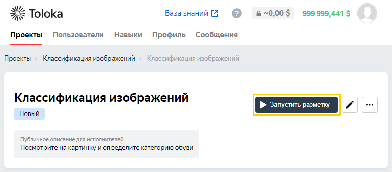

# Первый проект



Начните знакомство с Толокой со следующих шагов:

1. [Создайте проект](#create-project).
1. [Создайте пул](#configure-pool).
1. [Загрузите задания в пул](#upload-tasks).
1. [Запустите пул и получите результаты](#get-results).

## Перед началом {#before-start}

Вы должны быть [зарегистрированы](access.md) в качестве заказчика.

Используйте [Песочницу](sandbox.md), чтобы создать и бесплатно протестировать ваш проект. Так вы сможете избежать ошибок и потраченных средств, если окажется, что ваше задание не работает.

## Шаг 1. Создайте проект {#create-project}

В проекте вы определяете, как будет выглядеть задание у исполнителя.

1. На вкладке **Проекты****Projects** выберите пресет проекта, который подходит для вашей задачи. Он уже содержит первоначальные настройки, шаблон интерфейса заданий и пример инструкции для исполнителей. При необходимости адаптируйте его для ваших задач.

    Чтобы настроить проект с нуля, выберите вариант **Пустой шаблон**.

1. В разделе **Общая информация** укажите название проекта и краткое описание для исполнителей.

    

    - **Классификация изображений****Image classification**

        Используется, чтобы определить, к какой категории принадлежит изображение.

    - **Релевантность поиска товаров****Product search relevance**

        Подходит для оценки соответствия товаров конкретным поисковым запросам.

    - **Распознавание объектов и выделение областей****Object recognition & detection**

        Предназначен для выделения объектов на изображениях с целью обучения компьютерного зрения.

    - **Опрос потребителей****Customer survey**

        Позволяет собирать информацию для исследований.

    

    Выберите **Пустой****Blank** пресет, если вы не нашли подходящего варианта или хотите настроить проект с нуля. Инструкции см. в разделе [Начальные настройки проекта](project.md).

1. В разделе **Общая информация****General information** укажите название проекта и краткое описание для исполнителей.

1. В разделе **Интерфейс задания****Task interface**:

    1. Выберите опцию **Конструктор шаблонов****Template builder**.

    1. Отредактируйте интерфейс, чтобы настроить внешний вид заданий у исполнителей.

    1. Нажмите **Показать спецификации****Show specifications**, чтобы посмотреть сгенерированные поля входных и выходных данных.

    Подробнее см. в [Справке конструктора шаблонов](../../template-builder/index.md).

1. В разделе **Инструкция для исполнителей****Instructions for performers** отредактируйте инструкцию, если необходимо.

1. Нажмите кнопку **Создать проект****Create a project**.

Проект создан. Подробнее о работе с ним см. в разделе [Настройка проекта](project.md).

## Шаг 2. Создайте пул {#configure-pool}

Пул — это набор заданий, которые будут выданы исполнителям одновременно.

1. На странице проекта нажмите **Создать новый пул****Create new pool**.

1. Укажите настройки пула:

    - Установите цену за страницу заданий и задайте перекрытие. Минимальная цена — 0,001 $.

    - Используйте фильтры, чтобы отобрать исполнителей, которые получат доступ к вашим заданиям.

    - Добавьте и настройте правила контроля качества, чтобы получать более точные ответы. Вы можете использовать готовый набор защиты с настройками по умолчанию. В разделе **Контроль качества****Quality Control** нажмите **Добавить правило контроля качества****Add a quality control rule** и выберите подходящий набор.

        

1. Нажмите кнопку **Создать пул****Create pool**.

## Шаг 3. Загрузите файл с заданиями {#upload-tasks}

Задания — это данные, которые вы хотите отправить исполнителям для разметки. Каждое изображение или комментарий — это отдельное задание.

Чтобы загрузить [файл с заданиями](../../glossary.md#tsv):

1. Нажмите кнопку **Загрузить данные****Upload data**.

1. Скачайте шаблон, который подходит вашему типу задания:

    - Обычные — задания, ответы на которые вы не знаете и хотите получить их от исполнителей.

    - Контрольные — задания, на которые вы знаете правильные ответы. Используются, чтобы следить за качеством ответов исполнителей.

    - Обучающие — задания с правильными ответами и подсказками. Используются, чтобы научить исполнителей выполнять задания.

1. Добавьте задания в шаблон. Для пробного пула достаточно 10–100 заданий.

1. Прикрепите файл с заданиями.

    Нажмите кнопку **Продолжить****Continue**.

    Выберите способ распределения заданий по страницам: **Умное смешивание****Smart mixing**, **Указать вручную****Set manually**. Подробнее о них читайте на странице [Способы распределения заданий](distribute-tasks-by-pages.md).

    Нажмите кнопку **Разделить задания на страницы****Combine tasks into suites**.

1. Нажмите кнопку **Предпросмотр****Preview**, чтобы убедиться, что ваши задания отображаются правильно.

1. Используйте контрольные задания, чтобы повысить качество выполнения заданий исполнителями.

    

    Чтобы сэкономить время, вы можете воспользоваться опцией [разметки контрольных заданий](task_markup.md) с помощью экспертов Толоки.

    

## Шаг 4. Запустите пул и получите результаты {#get-results}

1. Нажмите кнопку **Запустить разметку****Start labeling**. Пул станет доступным для исполнителей.

    

1. [Выполните ваши задания](sandbox.md#self) в качестве исполнителя.

1. Отслеживайте статистику на страницах пула и проекта по мере выполнения заданий.

1. Когда задания будут выполнены, получите результаты:

    - Скачайте [TSV-файл](result-of-eval.md) с ответами исполнителей.

    - Если вы использовали перекрытие, запустите [агрегацию](result-aggregation.md), чтобы получить итоговые результаты.

    - Скачайте [файлы](result-of-eval.md), отправленные исполнителями при выполнении заданий.

## Что дальше {#next-steps}

- После тестирования проекта в Песочнице, [перенесите](sandbox.md#export) его в основную версию Толоки и запустите пул для разметки реальными исполнителями.

- Посмотрите наши [туториалы](usecases.md). Возможно, среди них уже есть тот, который подойдет для вашей задачи, и вам останется только подставить свои данные.

- Если вам не подходит конструктор шаблонов, попробуйте [редактор HTML/JS/CSS](spec.md).

- Ознакомьтесь с документацией [API Толоки](../../api/index.md), чтобы узнать, как управлять проектами с помощью API.

- Если у вас возникли вопросы или проблемы, см. раздел [Решение проблем и поддержка](../troubleshooting/troubleshooting.md).

## См. также {#learn-more}

- [База знаний](https://toloka.ai/ru/knowledgebase/)
- [API Толоки](../../api/index.md)