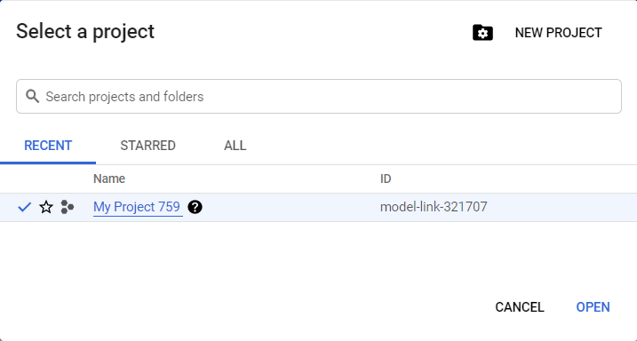
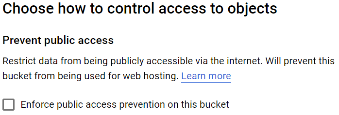

# Google Cloud Storage





Чтобы ознакомиться с [Google Cloud Storage]({{ google-cloud-storage }}), вы можете активировать [Пробный период]({{ google-cloud-free-trial }}).

#### Условия пробного периода

Длительность | Размер бесплатного хранилища | Сумма гранта
----- | ----- | -----
90 дней | 5 ГБ | 300 $

## Порядок действий {#workflow}

Чтобы получить ссылки на файлы:

1. Создайте аккаунт в [Google]({{ google-account }}).
1. Создайте аккаунт в [Google Cloud]({{ google-cloud-free-trial }}).
1. Перейдите в [консоль управления]({{ google-cloud-home }}).
1. Нажмите **Create project**.
1. Введите имя проекта. Выберите предприятие из выпадающего списка и нажмите **Create**.
1. [Создайте бакет](#create-account).
1. [Загрузите файлы](#upload).
1. [Скопируйте ссылки](#get-files).

## Создайте бакет {#create-account}

1. Выберите проект и нажмите **Create bucket**.

    

1. Введите имя бакета. Имя должно быть уникальным и содержать только латинские строчные буквы, цифры, дефисы и подчеркивания.

    Подробнее о [Правилах наименования бакетов]({{ google-cloud-about-bucket }}).

1. В разделе **Choose where to store your data** выберите **Location type** → **Region** и наиболее близкий к вашим исполнителям регион. Например, для исполнителей из Германии: **Location** → **europe-west3 (Frankfurt)**.

1. Раздел **Choose a default storage class for your data** оставьте без изменений.

1. В разделе **Choose how to control access to objects** отключите опцию **Enforce public access prevention on this bucket**.

    

1. Нажмите **Create**.

1. Чтобы сделать объекты доступными по ссылке, на вкладке **Permissions** нажмите **Add**.

    

1. В поле **New members** введите **allUsers**.

1. Выберите роль **Cloud Storage → Storage Object Viewer**.

1. Нажмите **Save** → **Allow public access**.



Вы можете настроить время жизни файлов в бакете, чтобы они автоматически удалялись через несколько дней. [Подробнее]({{ google-cloud-ttl }}).



## Загрузите файлы {#upload}



На вкладке **Object** нажмите **Upload files** и выберите файлы на компьютере.





На вкладке **Object** нажмите **Upload folder** и выберите папку на компьютере.





На вкладке **Object** нажмите **Create folder** и укажите имя папки.






Все пробелы и символы в имени файла, кроме латинских букв, будут заменены на коды символов.



## Скопируйте ссылки {#get-files}

1. Выберите загруженный файл и в столбце **Public access** нажмите **Copy URL**.

    

1. 

    

    

    ```plaintext
    https://storage.googleapis.com/<бакет>/<имя-файла>
    ```

    

    ```plaintext
    https://storage.googleapis.com/<bucket>/<file-name>
    ```

    

    

    

    ```plaintext
    https://storage.googleapis.com/<бакет>/<путь-к-файлу>/<имя-файла>
    ```

    

    ```plaintext
    https://storage.googleapis.com/<bucket>/<file-path>/<file-name>
    ```

    

    

1. 

    

    ```plaintext
    INPUT:image
    https://storage.googleapis.com/mytolokabucket/newfolder/image1.png
    https://storage.googleapis.com/mytolokabucket/newfolder/image2.png
    ```

