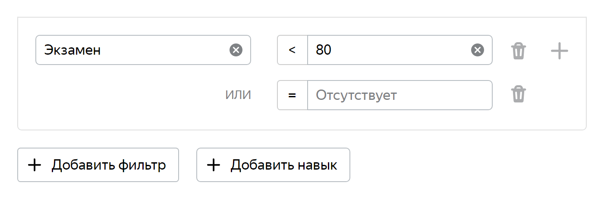

# Использование экзаменов

Экзамен — [пул](../../glossary.md#pool), в котором содержатся только [контрольные задания](../../glossary.md#control-task). Сочетание [тренировки](../../glossary.md#training), экзамена и основного пула обеспечивает требуемый уровень качества. В зависимости от результатов экзамена назначьте [навыки](../../glossary.md#skill) исполнителям.



Если в проекте есть экзаменационный пул, доступ к основным заданиям будет зависеть от его результатов, а не от успешности обучения.



## Когда использовать {#usage}
 Используйте экзамен, если задания сложные и вы хотите проверить, как исполнители справляются с ними после прохождения [обучения](../../glossary.md#training-pool).
## Особенности {#features}

- Количество заданий в экзамене должно обязательно быть кратным количеству заданий на странице, иначе исполнители не получат последнюю страницу и не смогут завершить экзамен.

    

    Если экзамен состоял из двух страниц по 10 заданий, и вы увеличили количество заданий на странице до 12, то заданий не хватит на две полные страницы. Исполнители не получат вторую страницу и не смогут завершить экзамен.

    

- Если исполнитель при прохождении экзамена нажмет кнопку **Пропустить****Skip**, вся страница не засчитается. Тогда системе не хватит выполненных заданий, чтобы назначить ему навык.

    

    - В режиме редактирования проекта нажмите **Показать общие элементы интерфейса****Show common interface elements** и отключите кнопку **Пропустить****Skip**.
    - Добавьте в пул больше заданий, чем нужно для расчета навыка, укажите необходимое количество ответов и настройте требование к исполнителям: `<экзаменационный навык> = отсутствует`.
    - Разместите все задания на одной странице.

    

## Рекомендации {#recomend}

- Используйте только задания с однозначным ответом, чтобы избежать разной трактовки.
- Составьте экзамен так, чтобы разные варианты ответов встречались примерно с одинаковой частотой.
- По итогам экзамена присвойте исполнителю навык, равный проценту правильных ответов.
- Используйте для обучающего и контрольного пула разные навыки. Первый система создаст автоматически. Второй нужно создать вам. Придумайте ему понятное название и сделайте публичным. Так вы не запутаетесь сами и не запутаете исполнителей.
- Устанавливайте одинаковую цену за страницу заданий в экзамене и основном пуле. Если цена не совпадает, то после экзамена исполнители не смогут сразу приступить к основному заданию.
- Не добавляйте слишком много контрольных заданий. Достаточно трех-пяти страниц в зависимости от сложности заданий.
- Не забывайте закрывать экзамен, когда набралось достаточно исполнителей для разметки основного пула или если разметка основных заданий закончилась. Иначе исполнитель впустую потратит время.

## Как настроить {#configure}

1. Откройте проект и нажмите **Добавить пул****Add a pool**.
1. Нажмите **Показать расширенные настройки****Show advanced settings** и в блоке **Дополнительные настройки****Additional settings** выберите тип пула — **Экзамен****Exam**.
1. Свяжите обучение с экзаменационным пулом. В блоке **Контроль качества****Quality control** укажите название обучения и уровень прохождения. Так вы допустите к экзамену только исполнителей, справившихся с обучающим пулом.

   

   

    К экзамену будут допущены исполнители, ответившие верно не менее чем на `80%` вопросов обучения.

    

    

    Если список **Обучение****Training** пуст, то, возможно, вы еще не создали обучение в этом проекте.

    

1. Чтобы назначить навык по проценту принятых ответов, в блоке **Контроль качества****Quality control** добавьте правило [Контрольные задания](goldenset.md).

    

    

    Например, для прохождения экзамена достаточно выполнить 10 заданий. Исполнителю будет присвоено значение экзаменационного навыка, равное проценту правильных ответов.

    

1. Заполните поле **Цена за страницу заданий, $****Price per task suite, $**. Цена для этого типа пула может быть равна нулю, но лучше сделать экзамен оплачиваемым.
1. Нажмите **Создать пул****Create pool**.
1. [Добавьте задания](pool.md) в пул.

## Примеры настроек {#examples}

#### Основной пул

Благодаря обучению и экзамену доступ к разметке получат исполнители, которые умеют качественно выполнять ваши задания. Но качество ответов в основном пуле тоже нужно контролировать.

Загрузите в основной пул контрольные задания, желательно не менее 1% от общего количества заданий. Настройте контроль качества так, чтобы исполнителю присваивался навык, равный проценту правильных ответов. Это будет основной навык проекта.

В блоке **Аудитория****Audience** основного пула укажите требования к исполнителям:
- `<экзаменационный навык> ≥ 80`;
- `<основной навык> ≥ 70 или отсутствует`.
 Тогда основные задания будут выполнять исполнители, которые делают это качественно или только приступают к разметке.

#### Прохождение экзамена за несколько попыток

Обычно экзамен проходят один раз. Но вы можете дать исполнителю несколько шансов. Например, для прохождения достаточно 10 заданий. Загрузите в экзаменационный пул 5 страниц по 10 заданий. В настройках пула добавьте правило **Контрольные задания****Control tasks**.

В блоке **Аудитория****Audience** укажите требование к исполнителям: `<экзаменационный навык> < 80 или отсутствует`.

Так у исполнителя будет 5 попыток пройти экзамен. Если за первые 10 заданий он не наберет требуемый процент правильных ответов, то сможет попробовать еще раз. Чтобы вторую попытку можно было предпринять не сразу (например, через день), в настройках пула добавьте правило **Выполненные задания****Submitted responses**.

## Реабилитация {#rehab}

Если исполнитель после прохождения экзамена не справляется с основными заданиями, он будет заблокирован. Однако вы можете дать ему возможность пройти [реабилитационный пул](../../glossary.md#reab-pool). Когда исполнитель станет хорошо справляться с заданиями реабилитации, вы можете вернуть ему доступ к основным.



Не добавляйте в реабилитационный пул слишком много заданий, иначе не все исполнители захотят пройти его до конца.



Реабилитация создается как основной пул и состоит из контрольных заданий. Зайдите в проект и добавьте пул с типом **Реабилитация****Retry**. Как и в случае с экзаменом, цена для этого типа пула может быть равна нулю.

Свяжите реабилитацию с основным пулом при помощи навыка. Укажите в фильтрах диапазон основного навыка, при котором исполнители будут перенаправляться в реабилитационный пул. Например, если основная разметка доступна исполнителям с навыком `70` и выше, то вы можете отправить в реабилитацию тех, чей навык между `69` и `40`.

По ответам исполнителя на задания реабилитационного пула пересчитайте его основной навык. В блоке **Контроль качества****Quality control** установите правило **Контрольные задания****Control tasks**. Поле **Сколько последних значений учитывать****Recent control and training task responses to use** оставьте пустым, чтобы для пересчета использовались только реабилитационные задания.

Исполнитель, который даст достаточно правильных ответов, вернется к основному пулу.

## Решение проблем {#troubleshooting}



<iframe width="100%" frameborder="0" src="https://forms.yandex.com/surveys/8745/?lang=ru&iframe=1&service=toloka-ai"></iframe>





Экзаменационным мы называем пул, в котором содержатся только контрольные задания. Обычно он делается небольшим и служит для проверки того, как исполнители научились выполнять задание после чтения инструкции и прохождения обучения.

В отличие от пула для основной разметки, ответы на все задания вам уже известны. Стоимость можно установить нулевой. По результатам ответов на контрольные задания вы можете назначить исполнителям навык и далее указать его в основном пуле в качестве фильтра. Например, `≥ 80` или `≠ Отсутствует`. Составление экзамена не обязательно, в простых заданиях достаточно тренировки. Но многие заказчики используют также и экзамен.





При загрузке заданий используйте умное смешивание, тогда экзамен будет с бесконечным перекрытием.

Однако это чревато тем, что вы будете тратить на экзамен много денег. Возможно, его стоит открывать тогда, когда открывается боевой пул, и закрывать, когда разметка боевого пула завершается.





<iframe width="100%" frameborder="0" src="https://forms.yandex.com/surveys/10013858/?lang=ru&iframe=1&service=toloka-ai"></iframe>



