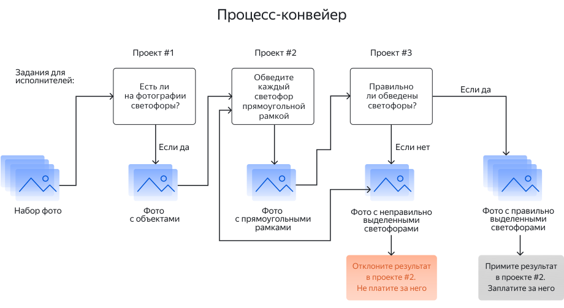

# Распознавание объектов и выделение областей (пример с декомпозицией)

Это пример декомпозиции задания [Распознавание объектов и выделение областей](selection.md). Декомпозиция может повысить качество результатов и снизить стоимость выполнения сложных заданий.

Допустим, у вас есть фотографии улиц и вам нужно выделить на них дорожные знаки. Но вы не знаете, на всех ли фотографиях есть знаки, и хотите сначала их отфильтровать. Также вы не хотите потом проверять ответы исполнителей самостоятельно.

В этом примере решение состоит из следующих этапов:

- [Проект 1](image-segmentation-project1.md) — используйте этот проект, если не все изображения содержат искомый объект и вы хотите отфильтровать их.
- [Проект 2](image-segmentation-project2.md) — в этом проекте исполнители выделят на изображениях области с искомым объектом. Для выделения области на картинках в Толоке есть специальный редактор. С его помощью исполнитель сможет выделить область в виде многоугольника или прямоугольника.
- [Проект 3](image-segmentation-project3.md) — этот проект позволит вам не выполнять проверку заданий самостоятельно, а попросить исполнителей в Толоке сделать это.

Каждый проект содержит следующие основные шаги:
1. **Создание проекта.** В проекте вы описываете [входные и выходные данные](../../glossary.md#input-output-data-ru), [интерфейс задания](../../glossary.md#task-interface-ru) и [инструкцию](../../glossary.md#task-instruction-ru) по выполнению задания.

1. **Создание [пула заданий](../../glossary.md#pool-ru) в проекте.** В пуле вы настраиваете [контроль качества](../../glossary.md#quality-control-ru) и [фильтры](../../glossary.md#filtering-ru) по исполнителям.

1. **Загрузка [TSV-файла](https://tlk.s3.yandex.net/wsdm2020/dataset_1.tsv) с заданиями в пул.**

1. **Запуск пула.**

1. **Получение и агрегирование результатов.**

О том, как пополнить счет, читайте в соответствующих разделах: [Для нерезидентов России](refill.md) и [Для резидентов России](refill-russia.md).

Если вам нужна помощь в оценке заданий, почитайте про [настройку ценообразования](dynamic-pricing.md#section_wb1_lhl_vlb).

## Что дальше {#what-next}

- Создайте [Проект 1](image-segmentation-project1.md) для фильтрации изображений.
- Создайте [Проект 2](image-segmentation-project2.md) для выделения объектов.
- Создайте [Проект 3](image-segmentation-project3.md) для проверки результатов.
- Почитайте подробнее [про декомпозицию заданий](solution-architecture.md).

