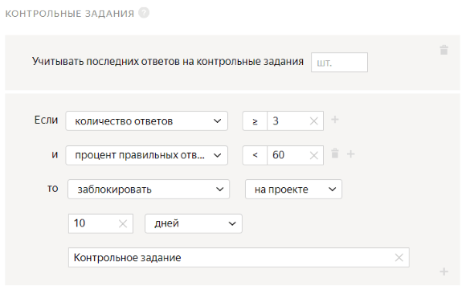

# Проект 1. Содержит ли изображение определенный объект

В этом [проекте](../../glossary.md#project) вы опросите исполнителей на наличие дорожных знаков на фотографии.

## Создайте проект {#create-project}

#### В интерфейсе:

1. Выберите пресет:

    1. Откройте [Толоку для заказчика]({{ yandex-toloka }}).

    1. Нажмите кнопку **+ Создать проект****+ Create project**.

    1. В открывшемся окне найдите пресет **Классификация изображений****Image classification** и нажмите кнопку **Выбрать****Select**.

1. Заполните общую информацию:

    1. В поле **Название для исполнителей****Name to show performers** введите `Есть ли на фотографии дорожные знаки?`.

    1. В поле **Описание для исполнителей****Description for performers** введите `Посмотрите на картинку и скажите, есть ли на ней дорожные знаки.`

    1. 

1. 

    

    - Конструктор шаблонов

      1. 

          В  шаблоне уже настроена проверка. Исполнитель не сможет отправить задание, если не выберет вариант ответа.

          Подробнее в Справке конструктора:

          - [настройка условий](../../template-builder/best-practices/conditions.md);
          - шаблон [Классификация изображений](../../template-builder/templates/image-classification.md).

      1. На панели **Конфигурация** замените строки кода с 19 по 28:

          

          ```json
          "label": "Какое у кота настроение?",
          "options": [
          {
          "label": "Хорошее",
          "value": "ok"
          },
          {
          "label": "Плохое",
          "value": "bad"
          },
          ```

          

          ```json
          "label": "What is the cat's mood?",
          "options": [
          {
          "label": "Good",
          "value": "ok"
          },
          {
          "label": "Bad",
          "value": "bad"
          },
          ```

          

          на:

          

          ```json
          "label": "Есть ли на картинке дорожные знаки?",
          "options": [
          {
          "label": "Да",
          "value": "ok"
          },
          {
          "label": "Нет",
          "value": "bad"
          },
          ```

          

          ```json
          "label": "Are there traffic signs in the picture?",
          "options": [
          {
          "label": "Yes",
          "value": "ok"
          },
          {
          "label": "No",
          "value": "bad"
          },
          ```

          

      1. Чтобы увидеть поля входных и выходных данных, нажмите **Показать спецификации**.

          Поля входных данных создаются из кода на вкладке **Пример входных данных**.

          Поля выходных данных создаются на основе того, в каких компонентах используются `data.output`, а также какие значения в нем разрешены.

          Подробнее о [полях входных и выходных данных](../../template-builder/operations/create-specs.md) в Справке конструктора шаблона.

          - Поле входных данных: `image` — ссылка для загрузки картинки.

          Измените тип данных на строку, чтобы использовать ссылки на свои файлы или [загружать картинки](prepare-data.md#interface), хранящиеся на Яндекс Диске.

          - Поле выходных данных: `result` — строка, в которую будет записан ответ исполнителя.

              

              

              

              

              

    - Редактор HTML/CSS/JS

      1. В блоке **Интерфейс задания****Task interface** отредактируйте блок **HTML**:

      1. После строки с изображением введите вопрос:

      1. Измените надписи на вариантах ответа: **Хорошее** → **Да**, **Плохое** → **Нет**:

          

          ```html
          {{img src=image width="100%" height="400px"}}
          <div>Есть ли на картинке <b>дорожные знаки</b>?<div>

          {{field type="radio" name="result" value="OK" label="Да" hotkey="1"}}
          {{field type="radio" name="result" value="BAD" label="Нет" hotkey="2"}}
          {{field type="radio" name="result" value="404" label="Ошибка загрузки" hotkey="3"}}
          ```

          

          ```html
          {{img src=image width="100%" height="400px"}}
          <div>Are there <b>traffic signs</b> in the picture?<div>

          {{field type="radio" name="result" value="OK" label="Yes" hotkey="1"}}
          {{field type="radio" name="result" value="BAD" label="No" hotkey="2"}}
          {{field type="radio" name="result" value="404" label="Loading error" hotkey="3"}}
          ```

          

      1. Блоки **JS**, **CSS** и **Спецификация данных****Data specification** оставьте без изменений.

          Подробнее о параметрах **Спецификации****Specifications** читайте в разделе [Входные и выходные данные](incoming.md).

      1. Нажмите кнопку  **Предпросмотр задания****Preview task**, чтобы увидеть получившееся задание.

          

          В предварительном просмотре проекта отображается одно задание со стандартными данными. Количество заданий на странице вы сможете настроить далее.

          

      1. В открывшемся окне проверьте работу опций задания. И в правом нижнем углу нажмите кнопку **Отправить****Submit**.

      1. Выйдите из режима предпросмотра. В нижнем левом углу нажмите кнопку **Выйти****Exit**** → Выйти****Exit** . Если при тестировании задания были ошибки — проверьте блоки кода, которые вы вводили.

    

1. 

1. В блоке **Инструкция для исполнителей****Instructions for performers** введите [инструкцию](../../glossary.md#instructions) и добавьте изображение.

    1. **Текст инструкции:**

        ```plaintext
        Посмотрите на изображение и определите, есть ли на нем **дорожные знаки**?
        Если да, нажмите **Да**.
        Если нет, нажмите **Нет**.
        Например, на изображении есть дорожные знаки, поэтому правильный ответ **Да**.
        ```

        

        ```plaintext
        Look at the image and answer whether there are any **traffic signs** in it.
        If there are, click **Yes**.
        If there aren't, click **No**.
        For example, there are traffic signs in the image, so the correct answer is **Yes**.
        ```

        

    1. Чтобы добавить изображение, нажмите кнопку  и укажите ссылку на изображение, которое вы хотите использовать в качестве примера.

    1. 

1. В правом верхнем углу нажмите кнопку **Завершить****Finish**

    Подробнее о работе с проектом читайте в разделе [Проект](project.md).

## Создайте пул {#create-pool}

1. Откройте страницу проекта с именем **Есть ли на фотографии дорожные знаки?**.

1. Нажмите кнопку **Добавить пул****Add a pool**.

1. Укажите **Название пула****Pool name**.

1. (опционально) Добавьте **Приватный комментарий****Private comment**. Эта информация доступна только вам.

1. В блоке **Аудитория****Audience** в разделе **Исполнители****Performers** отфильтруйте исполнителей по языку:

    1. Нажмите **Добавить фильтр****Add filter**.

    1. Добавьте фильтры **Регион по номеру телефона****Region by phone number** и **Языки****Languages**: выберите исполнителей из России, Украины, Казахстана и Беларуси, которые в своем профиле отметили знание русского языка.

    

1. 

1. В блоке **Цена****Price** в поле **Цена за страницу заданий****Price per task suite, ** укажите цену. Например, `0.01`.

1. В блоке **Контроль качества****Quality control** задайте [настройки контроля качества](control.md) для пула:

    1. Нажмите **Добавить правило контроля качества****Add a quality control rule**.

    1. Найдите в списке блок **Правила****Rules** и выберите пункт **Контрольные задания****Control tasks**.

    1. Задайте правило для [контрольного задания](../../glossary.md#control-task): если **количество ответов****number of responses** на контрольные вопросы **≥ 3** и **процент правильных ответов****correct responses (%)** на контрольные вопросы **< 60**, то **заблокировать****ban** исполнителя **на проекте на 10 дней****on project****10 days**. В качестве причины укажите **Контрольное задание**.

    

    Подробнее о контроле качества читайте в разделе [Контроль качества](control.md).

1. В разделе **Перекрытие задания****Task overlap** в поле **Количество исполнителей, которые должны выполнить каждое задание ****The number of performers to complete every task** укажите `3`.

1. В блоке **Дополнительные настройки****Additional settings** в поле **Время на страницу заданий****Time per task suite** укажите `600`.

1. Нажмите кнопку **Создать пул****Create a pool**.

## Загрузите задания {#upload-file}



1. Нажмите кнопку **Загрузить****Upload**. В открывшемся окне вы можете скачать шаблон файла.

    #### Использовать пример данных

    Если вы хотите посмотреть, как ваш проект будет выглядеть после запуска, но у вас еще нет заданий для разметки, вы можете загрузить в пул готовый пример данных.

    Нажмите **Использовать пример данных****Use sample data** справа от надписи **Прикрепите подготовленный файл с данными****Attach the prepared file with data**. Это позволит избежать дополнительных действий с файлами.

    После того, как вы поработали с примером данных и вас все устроило, подготовьте свои данные и загрузите их в пул.

    

    Если вы хотите посмотреть, как ваш проект будет выглядеть после запуска, но у вас еще нет заданий для разметки, вы можете загрузить в пул готовый пример данных.

    Нажмите **Использовать пример данных** справа от надписи **Прикрепите подготовленный файл с данными**. Это позволит избежать дополнительных действий с файлами.

    

После того, как вы поработали с примером данных и вас все устроило, подготовьте свои данные и загрузите их в пул.

1. В открывшемся окне настройте параметры загрузки файла:

    1. Выберите **Умное смешивание****Smart mixing**.

    1. В поле **Основных заданий****Main tasks** укажите `9`.

    1. В поле **Обучающих заданий****Training tasks** укажите `0`.

    1. В поле **Контрольных заданий****Control tasks** укажите `1`.

    1. Нажмите кнопку **Загрузить****Upload**.

    1. В открывшемся окне выберите [файл](../../glossary.md#tsv) с заданиями для загрузки и нажмите кнопку **Открыть****Open**.

    1. В открывшемся окне проверьте количество заданий и нажмите кнопку **Добавить****Add**.

1. Создайте [контрольное задание](goldenset.md):

    1. Нажмите кнопку **Разметить****Edit**.

    

    Если вместо **умного смешивания** было выбрано другое, необходимо нажать кнопку **Разметить**. Если этой кнопки нет, удалите файл и загрузите заново.

    

    1. В открывшемся окне нажмите кнопку **Создать контрольные****Create control tasks**.

    1. В открывшемся окне в разделе **Создать контрольное задание****Create control task** слева включите опцию **result**.

    1. Выберите правильный ответ на вопрос.

    1. Нажмите кнопку **Сохранить и перейти к следующему****Save and go to next**.

    1. Нажмите **Есть ли на фотографии дорожные знаки?**, чтобы выйти из режима [разметки заданий](../../glossary.md#task-markup).

    

    В небольших пулах контрольные задания должны составлять 10–20% от всех заданий. Включайте разные варианты правильных ответов в равных количествах. Посмотрите распределение ответов на странице **Разметить задания****Edit tasks** на вкладке **Контрольные****Control tasks**.

    

1. Нажмите кнопку , чтобы запустить пул.

    

    Поставленные задачи выполнят настоящие исполнители Толоки. Перепроверьте конфигурацию вашего проекта перед запуском пула.

    

## Получите результаты {#get-results}

1. Рядом с кнопкой **Скачать результаты****Download results** нажмите кнопку .

1. Выберите пункт списка **Агрегация результатов по методу Дэвида — Скина****Dawid-Skene aggregation model**. Подробнее об [Агрегации результатов по методу Дэвида — Скина](result-aggregation.md#dawid-skene).

1. В открывшемся окне нажмите **Да****Yes**.

1. Наверху страницы нажмите **Перейти к списку операций****View the list of operations**.

    

    Отслеживайте прогресс операции, периодически обновляя страницу. Агрегация занимает от 5 до 20 минут, в это время вы можете приступить к оформлению другого проекта.

    

1. Когда операция завершится, скачайте файл с результатами. Для этого в столбце **Файлы****Files** нажмите **Скачать****Download**.

1. Используйте файл с результатами во [втором проекте](image-segmentation-project2.md).

## Что дальше {#what-next}

- Создайте [Проект 2](image-segmentation-project2.md) для выделения объектов.

