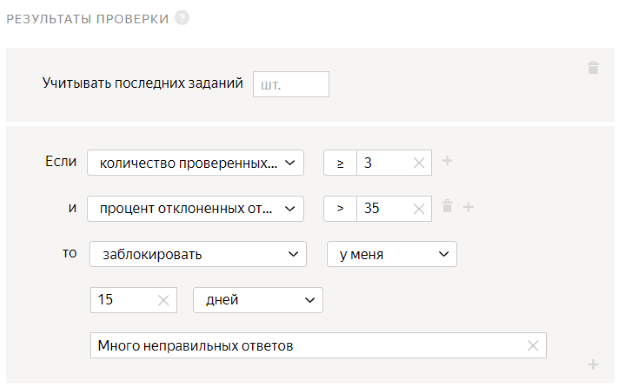

# Проект 2. Выделить объект на изображении

В этом [проекте](../../glossary.md#project-ru) исполнители будут выделять области изображений, содержащие дорожный знак. В качестве исходных изображений используйте результаты из [первого проекта](image-segmentation-project1.md).

## Создайте проект {#create-project}

#### В интерфейсе:

1. Выберите шаблон:

    1. Нажмите кнопку **Создать проект**.
    1. Выберите шаблон **Распознавание объектов и выделение областей**.
    1. Нажмите **Использовать решение**.

1. Заполните общую информацию:

    1. В поле **Название для исполнителей** проекта введите `Обведите дорожные знаки на изображении`.
    1. В поле **Описание для исполнителей** введите `Обведите прямоугольником все дорожные знаки на изображении`.
    1. По желанию добавьте **Приватный комментарий**.

1. 

    #### Конструктор шаблонов

    1. Вы можете воспользоваться [готовым кодом](https://clck.ru/TwQpa) для этого проекта, где уже настроена валидация и внешний вид задания.

    Исполнитель не сможет отправить задание, если не выделит области изображений.

    Подробнее в Справке конструктора о шаблоне [Выделение объектов на картинке]({{ tb-select-areas }}) и о его настройках.

    1. Чтобы увидеть поля входных и выходных данных, в разделе **Спецификация данных****Data specification** нажмите **Показать спецификации****Show specifications**.

    - Поле входных данных: `image` — строка для загрузки картинки.

    - Поле выходных данных: `result` — поле, в которое будет занесена информация о разметке загруженного изображения.

    #### Редактор HTML/CSS/JS

    1. В блоке **Интерфейс задания****Task interface** оставьте без изменений блок **HTML**.

    1. Отредактируйте блок **CSS**:

    1. Настройте инструменты выделения области. В этом шаблоне используется [Редактор для выделения области](t-components/image-annotation.md). Для него доступны инструменты прямоугольник и многоугольник (по умолчанию).

    Чтобы настроить выделение прямоугольником, замените код в блоке **CSS** на указанный:
    ```
    .image-annotation-editor__shape-polygon {
    display: none;
    }
    ```

    1. Введите код для настройки высоты интерфейса по размеру изображения:

    ```
    .image-annotation-editor__annotation-layer {
    height: max-content;
    }
    ```

    1. **(опционально)** Вы можете попросить исполнителей ввести аннотацию к выделенной области или выбрать ее из списка. Для этого в блоке **JS** добавьте элемент интерфейса. Например, текстовое поле или выпадающий список.

    Подробнее об [аннотации](t-components/image-annotation.md#annotation).

    1. Нажмите кнопку  **Предпросмотр задания****Preview task**, чтобы увидеть получившееся задание.

    

    В предварительном просмотре проекта отображается одно задание со стандартными данными. Количество заданий на странице вы сможете настроить далее.

    

    1. В открывшемся окне проверьте работу опций задания. И в правом нижнем углу нажмите кнопку **Отправить****Submit**.

    1. Выйдите из режима предпросмотра. В нижнем левом углу нажмите кнопку **Выйти****Exit**** → Выйти****Exit** . Если при тестировании задания были ошибки — проверьте блоки кода, которые вы вводили.

1. 

1. Напишите инструкцию для исполнителей:

    #### Текст инструкции
    Нажмите кнопку  и обведите прямоугольником все дорожные знаки на изображении.

    

    Если вы хотите добавить в инструкцию примеры выполнения задания, выполните его самостоятельно в режиме предпросмотра. Сделайте скриншоты, загрузите их на фотохостинг, ваш Яндекс Диск или в облачное хранилище и вставьте ссылки на изображения в инструкцию, нажав кнопку  на панели инструментов.

    

    Нажмите кнопку **Завершить**.

## Создайте пул {#create-pool}

Пул — это набор оплачиваемых заданий, которые одновременно выдаются исполнителям.

1. Откройте страницу проекта **Обведите все дорожные знаки на картинке**.

1. Нажмите кнопку **Добавить пул****Add a pool**.

1. Укажите **Название пула****Pool name**.

1. 
    (опционально) Укажите **Приватный комментарий****Private comment**. Эта информация доступна только вам.
    
1. В блоке **Аудитория****Audience** в разделе **Исполнители****Performers** отфильтруйте исполнителей:

    1. Нажмите **Добавить фильтр****Add filter**.

    1. Добавьте фильтры **Регион по номеру телефона****Region by phone number** и **Языки****Languages**: выберите исполнителей из России, Украины, Казахстана и Беларуси, которые в своем профиле отметили знание русского языка.

    1. Добавьте новый навык. Нажмите кнопку **Добавить навык****Add skill**.

    1. В открывшемся окне в поле **Название****Title** введите `Выделение областей`.

    1. Нажмите кнопку **Добавить****Add**.

    

1. 

1. В блоке **Цена****Price** в поле **Цена за страницу заданий****Price per task suite** укажите цену. Например, `0.01`.

    #### Что такое страница заданий?

    На одной странице может отображаться одно или несколько заданий. Если задания простые, то можно добавлять 10–20 заданий на одну страницу. Не рекомендуем создавать длинные страницы, поскольку это снизит скорость загрузки данных у исполнителя.

    Исполнитель получит оплату, только если выполнил все задания на странице.

    Количество заданий на странице вы определите при [загрузке заданий](#smart-mixing).

    #### Как определить справедливую цену?

    Общее правило формирования цены — чем больше времени исполнитель тратит на выполнение, тем выше цена.

    Вы можете зарегистрироваться в Толоке как исполнитель и узнать, сколько платят другие заказчики за задания.

1. [Правила контроля качества](control.md) позволяют отсеивать невнимательных исполнителей. В блоке **Контроль качества****Quality control** задайте правила для пула:

    1. Включите опцию **Отложенная приёмка****Non-automatic acceptance**.

    #### Что такое отложенная приемка?

    [Отложенная приемка](offline-accept.md) позволяет вам просматривать [выполненные страницы заданий](../../glossary.md#submitted-answers-ru) перед тем, как принять их и заплатить исполнителю. Задания, выполненные в несоответствии с инструкцией, можно отклонять. Максимальный срок проверки устанавливается в поле **Срок проверки**.

    В поле **Срок проверки в днях****Review period in days** укажите количество дней на проверку задания.

    1. Добавьте следующие правила контроля качества:
    - **Обработка отклоненных и принятых заданий****Recompletion of rejected assignments** — отправляет отклоненные вами задания другим исполнителям по заданным правилам.

    1. Нажмите **Добавить правило контроля качества****Add a quality control rule**.

    1. Найдите в списке блок **Правила****Rules** и выберите пункт **Обработка отклоненных и принятых заданий****Processing rejected and accepted assignments**.

    1. Задайте правило для отклоненного задания: если **задание становится отклоненным****assignment becomes rejected**, то **увеличить перекрытие****extend overlap by** на **1**. А также включите опцию **Открыть пул, если закрыт****Open pool if closed**.
    
    Это означает, что отклоненное задание будет возвращено в пул и показано еще одному исполнителю.

    - **Выполненные задания****Submitted responses** — позволяет ограничить количество заданий, которое доступно исполнителю в пуле за сутки.

    1. Нажмите **Добавить правило контроля качества****Add a quality control rule**.

    1. Найдите в списке блок **Правила****Rules** и выберите пункт **Выполненные задания****Submitted responses**.

    1. Задайте правило для выполненного задания: если **отправленных страниц заданий****submitted assignments** **≥ 1**, то **установить значение навыка****assign skill value** **Выделение областей** равным **1**.
    
    Такие параметры позволят отметить исполнителя, выполнившего хотя бы одно задание в пуле.

    

    Если навык **Выделение областей** не отображается в списке, сохраните пул и откройте его заново для редактирования.

    

    - **Быстрые ответы****Fast responses** — отсеивает исполнителей, которые отвечают слишком быстро.

    1. Нажмите **Добавить правило контроля качества****Add a quality control rule**.

    1. Найдите в списке блок **Правила****Rules** и выберите пункт **Быстрые ответы****Fast responses**.

    1. В поле **Учитывать последних страниц заданий****Recent tasks suites to use** введите количество последних страниц заданий, выполненных исполнителем. Например, `5`.
    1. В поле **Минимальное время на страницу заданий****Minimum time per task suite** укажите время в секундах. Например, `20`.
    1. Задайте правило для быстрого ответа: если **количество быстрых ответов****number of fast responses****≥ 1**, то **заблокировать****ban****у меня****on requester** на **10 дней****10 days**. В поле **Причина****Reason** введите **Быстрые ответы**.
    
    Это означает, что если исполнитель выполнит хотя бы одну [страницу заданий](../../glossary.md#task-page-ru) быстрее чем за 20 секунд, он будет заблокирован и не сможет больше выполнять ваши задания 10 дней.

    - **Результаты проверки****Results of assignment review** — ограничивает доступ к пулу исполнителей, которые часто ошибаются.

    1. Нажмите **Добавить правило контроля качества****Add a quality control rule**.

    1. Найдите в списке блок **Правила****Rules** и выберите пункт **Результаты проверки****Results of assignment review**.

    1. Задайте правило для отклоненного задания: если **количество проверенных ответов****total reviewed responses** **≥ 3** и **процент отклоненных ответов****rejected responses (%)** **> 35** то **заблокировать****ban****у меня****on requester** на **15 дней****15 days**.
    
    Это означает, что если 35% и более ответов исполнителя будут отклонены, он будет заблокирован и не сможет больше выполнять ваши задания 15 дней. Правило начинает действовать после проверки 3 ответов исполнителя.

    [Контрольные задания](../../glossary.md#control-task-ru) и [мнение большинства](../../glossary.md#majority-vote-ru) не используются для такого типа проектов, так как разметка областей, предоставленная исполнителями, должна совпадать (что практически невозможно). Подробнее о контроле качества читайте в разделе [Контроль качества](control.md).

    

    Вы можете скопировать настройки контроля качества из другого пула. Для этого в блоке **Аудитория****Audience** в разделе **Исполнители****Performers** нажмите кнопку **перенесите их из другого пула****copy them from another pool**.

    

1. В разделе **Перекрытие задания****Task overlap** в поле **Количество исполнителей, которые должны выполнить каждое задание ****The number of performers to complete every task** установите перекрытие — количество исполнителей, которые должны выполнить задание. Для заданий выделения области на картинках, как правило, `1`.

1. В блоке **Дополнительные настройки****Additional settings** укажите значение поля **Время на страницу заданий****Time per task suite**. Времени должно быть достаточно, в том числе для чтения инструкции и загрузки задания. Например, `1200` секунд.
1. Нажмите кнопку **Создать пул****Create a pool**.


## Подготовьте и загрузите задания {#upload-file}

1. Подготовьте [файл с заданиями](../../glossary.md#tsv-file-definition-ru).

    1. Откройте в редакторе текста или электронных таблиц файл, полученный после агрегации результатов в [первом проекте](image-segmentation-project1.md).

    1. Выберите изображения, подходящие для текущего проекта (значение **OK**).

    

    Для отбора изображений на устройствах с Linux и MacOS вы можете воспользоваться командами awk:
    ```
    awk 'BEGIN {OFS = FS = "\t";} $2=/OK/ {print $1}' <aggregated_res>.tsv > <filtered_res>.tsv
    ```

    

    1. Скопируйте столбец с выделенными ссылками на новый лист или в новый документ.

    1. Задайте имя столбца `INPUT:image`. Если вы хотите задать другое имя, переименуйте столбец и в исходном файле с результатами.

    1. Сохраните файл в формате `tsv`.

1. Загрузите получившийся файл с заданиями:

    1. Нажмите кнопку **Загрузить****Upload**. В открывшемся окне настройте параметры загрузки файла.

    1. Выберите **Указать вручную****Set manually**.

    1. В поле **Заданий на странице****Tasks per page** укажите `1`.

    1. Нажмите кнопку **Загрузить****Upload**.

    1. В открывшемся окне выберите файл с заданиями для загрузки и нажмите кнопку **Открыть****Open**.

    1. В открывшемся окне проверьте количество заданий и нажмите кнопку **Добавить****Add**.

1. Нажмите кнопку , чтобы запустить пул.

    

    Поставленные задачи выполнят настоящие исполнители Толоки. Перепроверьте конфигурацию вашего проекта перед запуском пула.

    


## Получите результаты {#get-results}

1. На странице пула нажмите кнопку **Скачать результаты****Download results**. В открывшемся окне:

    1. В блоке **Статус****Status** оставьте включенной только опцию **Непроверенные****Submitted**.

    1. В блоке **Поля****Columns** оставьте включенной только опцию **id ответа****assignment ID**.

    1. Отключите опцию **Разделять ответы пустой строкой****Separate assignments with empty row**.

    1. Нажмите кнопку **Скачать результаты****Download results**.

1. Используйте файл с результатами в [третьем проекте](image-segmentation-project3.md).


## Что дальше {#what-next}

- Создайте [Проект 3](image-segmentation-project3.md) для проверки ответов.

