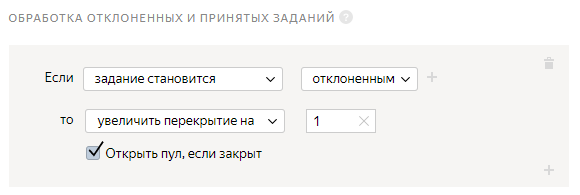
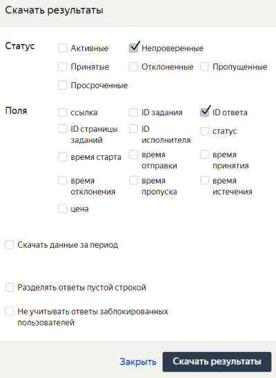

# Проект 2. Выделить объект на изображении



В этом [проекте](../../glossary.md#project) исполнители будут выделять области изображений, содержащие дорожный знак. В качестве исходных изображений используйте результаты из [первого проекта](image-segmentation-project1.md).

## Создайте проект {#create-project}

#### В интерфейсе:

1. Выберите пресет:

    1. Нажмите кнопку **Создать проект**.
    1. Выберите пресет **Распознавание объектов и выделение областей**.
    1. Нажмите **Использовать решение**.

1. Заполните общую информацию:

    1. В поле **Название для исполнителей** проекта введите `Обведите дорожные знаки на изображении`.
    1. В поле **Описание для исполнителей** введите `Обведите прямоугольником все дорожные знаки на изображении`.
    1. По желанию добавьте **Приватный комментарий**.

1. 

    

    - Конструктор шаблонов

      1. Вы можете воспользоваться [готовым кодом](https://ya.cc/t/FrtLmfwK3tvf2N) для этого проекта, где уже настроена валидация и внешний вид задания.

          Исполнитель не сможет отправить задание, если не выделит области изображений.

          Подробнее в Справке конструктора о шаблоне [Выделение объектов на картинке](../../template-builder/operations/select-areas.md) и о его настройках.

      1. Чтобы увидеть поля входных и выходных данных, в разделе **Спецификация данных** нажмите **Показать спецификации**.

          - Поле входных данных: `image` — строка для загрузки картинки.

          - Поле выходных данных: `result` — поле, в которое будет занесена информация о разметке загруженного изображения.

    - Редактор HTML/CSS/JS

      1. В блоке **Интерфейс задания** оставьте без изменений блок **HTML**.

      1. Отредактируйте блок **CSS**:

      1. Настройте инструменты выделения области. В этом шаблоне используется [Редактор для выделения области](t-components/image-annotation.md). Для него доступны инструменты прямоугольник и многоугольник (по умолчанию).

          Чтобы настроить выделение прямоугольником, замените код в блоке **CSS** на указанный:

          ```css
          .image-annotation-editor__shape-polygon {
          display: none;
          }
          ```

      1. Введите код для настройки высоты интерфейса по размеру изображения:

          ```css
          .image-annotation-editor__annotation-layer {
          height: max-content;
          }
          ```

      1. **(опционально)** Вы можете попросить исполнителей ввести аннотацию к выделенной области или выбрать ее из списка. Для этого в блоке **JS** добавьте элемент интерфейса. Например, текстовое поле или выпадающий список.

          Подробнее об [аннотации](t-components/image-annotation.md#annotation).

      1. Нажмите кнопку  **Предпросмотр задания**, чтобы увидеть получившееся задание.

          

          В предварительном просмотре проекта отображается одно задание со стандартными данными. Количество заданий на странице вы сможете настроить далее.

          

      1. В открывшемся окне проверьте работу опций задания. И в правом нижнем углу нажмите кнопку **Отправить**.

      1. Выйдите из режима предпросмотра. В нижнем левом углу нажмите кнопку **Выйти**. Если при тестировании задания были ошибки — проверьте блоки кода, которые вы вводили.

    

1. 

1. Напишите инструкцию для исполнителей:

    #### Текст инструкции

    Нажмите кнопку  и обведите прямоугольником все дорожные знаки на изображении.

    

    Если вы хотите добавить в инструкцию примеры выполнения задания, выполните его самостоятельно в режиме предпросмотра. Сделайте скриншоты, загрузите их на фотохостинг, ваш Яндекс Диск или в облачное хранилище и вставьте ссылки на изображения в инструкцию, нажав кнопку  на панели инструментов.

    

    Нажмите кнопку **Завершить**.

## Создайте пул {#create-pool}

Пул — это набор оплачиваемых заданий, которые одновременно выдаются исполнителям.

1. Откройте страницу проекта **Обведите все дорожные знаки на картинке**.

1. Нажмите кнопку **Добавить пул**.

1. Укажите **Название пула**.

1. (опционально) Укажите **Приватный комментарий**. Эта информация доступна только вам.

1. В блоке **Аудитория** в разделе **Исполнители** отфильтруйте исполнителей:

    1. Нажмите **Добавить фильтр**.

    1. Добавьте фильтры **Регион по номеру телефона** и **Языки**: выберите исполнителей из России, Украины, Казахстана и Беларуси, которые в своем профиле отметили знание русского языка.

    1. Добавьте новый навык. Нажмите кнопку **Добавить навык**.

    1. В открывшемся окне в поле **Название** введите `Выделение областей`.

    1. Нажмите кнопку **Добавить**.

    

1. 

1. В блоке **Цена** в поле **Цена за страницу заданий** укажите цену. Например, `0.01`.

    

    На одной странице может отображаться одно или несколько заданий. Если задания простые, то можно добавлять 10–20 заданий на одну страницу. Не рекомендуем создавать длинные страницы, поскольку это снизит скорость загрузки данных у исполнителя.

    Исполнитель получит оплату, только если выполнил все задания на странице.

    Количество заданий на странице вы определите при [загрузке заданий](#smart-mixing).

    

    

    Общее правило формирования цены — чем больше времени исполнитель тратит на выполнение, тем выше цена.

    Вы можете зарегистрироваться в Толоке как исполнитель и узнать, сколько платят другие заказчики за задания.

    

1. [Правила контроля качества](control.md) позволяют отсеивать невнимательных исполнителей. В блоке **Контроль качества** задайте правила для пула:

    1. Включите опцию **Отложенная приёмка**.

        

        [Отложенная приемка](offline-accept.md) позволяет вам просматривать [выполненные страницы заданий](../../glossary.md#completed-tasks) перед тем, как принять их и заплатить исполнителю. Задания, выполненные в несоответствии с инструкцией, можно отклонять. Максимальный срок проверки устанавливается в поле **Срок проверки**.

        

        В поле **Срок проверки в днях** укажите количество дней на проверку задания.

    1. Добавьте следующие правила контроля качества:

        - **Обработка отклоненных и принятых заданий** — отправляет отклоненные вами задания другим исполнителям по заданным правилам.

            1. Нажмите **Добавить правило контроля качества**.

            1. Найдите в списке блок **Правила** и выберите пункт **Обработка отклоненных и принятых заданий**.

            1. Задайте правило для отклоненного задания: если **задание становится отклоненным**, то **увеличить перекрытие** на **1**. А также включите опцию **Открыть пул, если закрыт**.

            

        Это означает, что отклоненное задание будет возвращено в пул и показано еще одному исполнителю.

        - **Выполненные задания** — позволяет ограничить количество заданий, которое доступно исполнителю в пуле за сутки.

            1. Нажмите **Добавить правило контроля качества**.

            1. Найдите в списке блок **Правила** и выберите пункт **Выполненные задания**.

            1. Задайте правило для выполненного задания: если **отправленных страниц заданий** **≥ 1**, то **установить значение навыка** **Выделение областей** равным **1**.

            

            Такие параметры позволят отметить исполнителя, выполнившего хотя бы одно задание в пуле.

            

            Если навык **Выделение областей** не отображается в списке, сохраните пул и откройте его заново для редактирования.

            

        - **Быстрые ответы** — отсеивает исполнителей, которые отвечают слишком быстро.

            1. Нажмите **Добавить правило контроля качества**.

            1. Найдите в списке блок **Правила** и выберите пункт **Быстрые ответы**.

            1. В поле **Учитывать последних страниц заданий** введите количество последних страниц заданий, выполненных исполнителем. Например, `5`.

            1. В поле **Минимальное время на страницу заданий** укажите время в секундах. Например, `20`.

            1. Задайте правило для быстрого ответа: если **количество быстрых ответов****≥ 1**, то **заблокировать****у меня** на **10 дней**. В поле **Причина** введите **Быстрые ответы**.

            

            Это означает, что если исполнитель выполнит хотя бы одну [страницу заданий](../../glossary.md#task-suite) быстрее чем за 20 секунд, он будет заблокирован и не сможет больше выполнять ваши задания 10 дней.

        - **Результаты проверки** — ограничивает доступ к пулу исполнителей, которые часто ошибаются.

            1. Нажмите **Добавить правило контроля качества**.

            1. Найдите в списке блок **Правила** и выберите пункт **Результаты проверки**.

            1. Задайте правило для отклоненного задания: если **количество проверенных ответов** **≥ 3** и **процент отклоненных ответов** **> 35** то **заблокировать****у меня** на **15 дней**.

            

            Это означает, что если 35% и более ответов исполнителя будут отклонены, он будет заблокирован и не сможет больше выполнять ваши задания 15 дней. Правило начинает действовать после проверки 3 ответов исполнителя.

    [Контрольные задания](../../glossary.md#control-task) и [мнение большинства](../../glossary.md#majority-vote) не используются для такого типа проектов, так как разметка областей, предоставленная исполнителями, должна совпадать (что практически невозможно). Подробнее о контроле качества читайте в разделе [Контроль качества](control.md).

    

    Вы можете скопировать настройки контроля качества из другого пула. Для этого в блоке **Аудитория** в разделе **Исполнители** нажмите кнопку **перенесите их из другого пула**.

    

1. В разделе **Перекрытие задания** в поле **Количество исполнителей, которые должны выполнить каждое задание ** установите перекрытие — количество исполнителей, которые должны выполнить задание. Для заданий выделения области на картинках, как правило, `1`.

1. В блоке **Дополнительные настройки** укажите значение поля **Время на страницу заданий**. Времени должно быть достаточно, в том числе для чтения инструкции и загрузки задания. Например, `1200` секунд.
1. Нажмите кнопку **Создать пул**.

## Подготовьте и загрузите задания {#upload-file}

1. Подготовьте [файл с заданиями](../../glossary.md#tsv).

    1. Откройте в редакторе текста или электронных таблиц файл, полученный после агрегации результатов в [первом проекте](image-segmentation-project1.md).

    1. Выберите изображения, подходящие для текущего проекта (значение **OK**).

    

    Для отбора изображений на устройствах с Linux и MacOS вы можете воспользоваться командами awk:

    ```shell
    awk 'BEGIN {OFS = FS = "\t";} $2=/OK/ {print $1}' <aggregated_res>.tsv > <filtered_res>.tsv
    ```

    

    1. Скопируйте столбец с выделенными ссылками на новый лист или в новый документ.

    1. Задайте имя столбца `INPUT:image`. Если вы хотите задать другое имя, переименуйте столбец и в исходном файле с результатами.

    1. Сохраните файл в формате `tsv`.

1. Загрузите получившийся файл с заданиями:

    1. Нажмите кнопку **Загрузить**. В открывшемся окне настройте параметры загрузки файла.

    1. Выберите **Указать вручную**.

    1. В поле **Заданий на странице** укажите `1`.

    1. Нажмите кнопку **Загрузить**.

    1. В открывшемся окне выберите файл с заданиями для загрузки и нажмите кнопку **Открыть**.

    1. В открывшемся окне проверьте количество заданий и нажмите кнопку **Добавить**.

1. Нажмите кнопку , чтобы запустить пул.

    

    Поставленные задачи выполнят настоящие исполнители Толоки. Перепроверьте конфигурацию вашего проекта перед запуском пула.

    

## Получите результаты {#get-results}

1. На странице пула нажмите кнопку **Скачать результаты**. В открывшемся окне:

    1. В блоке **Статус** оставьте включенной только опцию **Непроверенные**.

    1. В блоке **Поля** оставьте включенной только опцию **id ответа**.

    1. Отключите опцию **Разделять ответы пустой строкой**.

    

    1. Нажмите кнопку **Скачать результаты**.

1. Используйте файл с результатами в [третьем проекте](image-segmentation-project3.md).

## Что дальше {#what-next}

- Создайте [Проект 3](image-segmentation-project3.md) для проверки ответов.



