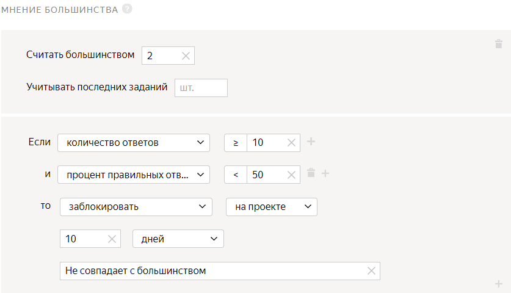

# Проект 3. Верно ли выделены объекты на изображении



В этом [проекте](../../glossary.md#project) исполнители будут определять, верно ли на изображениях из [первого проекта](image-segmentation-project1.md) были выделены дорожные знаки во [втором проекте](image-segmentation-project2.md).

## Создайте проект {#create-project}

#### В интерфейсе:

1. Выберите шаблон:

    1. Нажмите кнопку **Создать проект**.
    1. Выберите шаблон **Распознавание объектов и выделение областей**.
    1. Нажмите **Использовать решение**.

1. Заполните общую информацию:

    1. В поле **Название для исполнителей** проекта введите `Верно ли выделены дорожные знаки`.
    1. В поле **Описание для исполнителей** введите `Посмотрите на изображение и решите, верно ли выделены дорожные знаки`.
    1. По желанию добавьте **Приватный комментарий**.

1. Отредактируйте интерфейс задания. От редактора интерфейса зависит формат выходных данных, поэтому выберите тот же редактор, что и в [Проекте 2](image-segmentation-project2.md#interface-tb-html).

    

    - Конструктор шаблонов

      1. Создайте шаблон на основе примера [Проверка выделенной области](https://clck.ru/sFyNY), в котором используется Компонент для разметки изображений.

      1. Чтобы увидеть поля входных и выходных данных, в разделе **Спецификация данных****Data specification** нажмите **Показать спецификации****Show specifications**.

          Поля входных данных, которые используются в проекте:

          - `image` — адрес картинки;
          - `result` — массив с координатами выделенной области;
          - `assignment_id` — идентификатор задания.

          В поле выходных данных `verdict` будет записан ответ исполнителя.

      1. Включите опцию **Настроить спецификацию вручную**.

      1. Нажмите кнопку , чтобы переключить графический режим на формат JSON.

      1. 

          ```json
          {
          "image": {
          "type": "url",
          "hidden": false,
          "required": true
          },
          "result": {
          "type": "array_json",
          "hidden": false,
          "required": false
          },
          "assignment_id": {
          "type": "string",
          "hidden": true,
          "required": true
          }
          }
          ```

      1. 

          ```json
          {
          "verdict": {
          "type": "string",
          "hidden": false,
          "required": true,
          "allowed_values": [
          "OK",
          "BAD"
          ]
          }
          }
          ```

    - Редактор HTML/CSS/JS

      1. Подготовьте **Интерфейс задания****Task interface**:

      1. 

      1. В блоке **HTML** замените текущий код на следующий:

          

          ```html
          <!-- редактор для выделения областей с возможностью заранее добавить область -->
          {{field type="image-annotation" name="object" src=image annotations=selection}}

          <!-- кнопки для ответов -->
          {{field type="radio" name="result" value="OK" label="Верно" hotkey="1"}}
          {{field type="radio" name="result" value="BAD" label="Неверно" hotkey="2"}}
          ```

          

          ```html
          <!-- editor for selecting objects that lets you add an area in advance -->
          {{field type="image-annotation" name="object" src=image annotations=selection}}

          <!-- buttons for responses -->
          {{field type="radio" name="result" value="OK" label="Correct" hotkey="1"}}
          {{field type="radio" name="result" value="BAD" label="Incorrect" hotkey="2"}}
          ```

        

      1. В блоке **CSS** замените текущий код на следующий:

          

          ```css
          /* скрыть кнопку для выделения полигоном */
          .image-annotation-editor__shape-polygon {
          display: none;
          }

          /* настроить высоту интерфейса */
          .image-annotation-editor__annotation-layer {
          height: max-content;
          }
          ```

          

          ```css
          /* hide the button for polygon selection */
          .image-annotation-editor__shape-polygon {
          display: none;
          }

          /* adjust the interface height */
          .image-annotation-editor__annotation-layer {
          height: max-content;
          }
          ```

        

      1. Настройте раздел **Спецификация данных**:

      1. Нажмите кнопку , чтобы переключить графический режим на формат JSON.

      1. Удалите шаблонный код из поля **Входные данные****Input data** и введите следующий код:

          ```json
          {
          "image": {
          "type": "url",
          "hidden": false,
          "required": true
          },
          "selection": {
          "type": "array_json",
          "hidden": false,
          "required": false
          },
          "assignment_id": {
          "type": "string",
          "hidden": true,
          "required": true
          }
          }
          ```

      1. Удалите шаблонный код из поля **Выходные данные****Output data** и введите следующий код:

          ```json
          {
          "result": {
          "type": "string",
          "hidden": false,
          "required": true,
          "allowed_values": [
          "OK",
          "BAD"
          ]
          }
          }
          ```

          Подробнее о параметрах **Спецификации****Specifications** читайте в разделе [Входные и выходные данные](incoming.md).

      1. Нажмите кнопку  **Предпросмотр задания****Preview task**, чтобы увидеть получившееся задание.

          

          В предварительном просмотре проекта отображается одно задание со стандартными данными. Количество заданий на странице вы сможете настроить далее.

          

      1. Нажмите **Изменить входные данные**.

      1. В поле **selection** добавьте пример входных данных:

          ```json
          [{"data":{"p1":{"x":0.472,"y":0.413},"p2":{"x":0.932,"y":0.877}},"type":"rectangle"},
          {"data":[{"x":0.143,"y":0.807},{"x":0.317,"y":0.87},{"x":0.511,"y":0.145},{"x":0.328,"y":0.096},{"x":0.096,"y":0.554}], "type":"polygon"}]
          ```

      1. Если все в порядке, закройте вкладку с предпросмотром. Если нет — проверьте данные, которые вы вставляли в блоки кода.

    

1. Напишите инструкцию для исполнителей:

    **Текст инструкции:**

    

    ```plaintext
    Посмотрите на изображение и ответьте на вопрос: **Все ли дорожные знаки выделены верно?**
    Если да, нажмите **Да**.
    Если нет, нажмите **Нет**.
    Например, дорожные знаки выделены верно, поэтому правильный ответ **Да**.
    ```

    

    ```plaintext
    Look at the image and answer the question: **Are all traffic signs outlined correctly?**
    If there are, click **Yes**.
    If there isn't, click **No**.
    For example, road signs are outlined correctly, so the correct answer is **Yes**.
    ```

    

    

    Если вы хотите добавить в инструкцию примеры выполнения задания, выполните его самостоятельно в режиме предпросмотра. Сделайте скриншоты, загрузите их на фотохостинг, ваш Яндекс Диск или в облачное хранилище и вставьте ссылки на изображения в инструкцию, нажав кнопку  на панели инструментов.

    

1. Нажмите кнопку **Создать проект**.

## Создайте пул {#create_pool}

1. Откройте страницу проекта с именем **Верно ли выделены дорожные знаки?**.

1. Нажмите кнопку **Добавить пул****Add a pool**.

1. Укажите **Название пула****Pool name**.

1. (опционально) Укажите **Приватный комментарий****Private comment**. Эта информация доступна только вам.

1. В блоке **Аудитория****Audience** в разделе **Исполнители****Performers** отфильтруйте исполнителей:

    1. Нажмите **Добавить фильтр****Add filter**.

    1. Добавьте фильтры **Регион по номеру телефона****Region by phone number** и **Языки****Languages**: выберите исполнителей из России, Украины, Казахстана и Беларуси, которые в своем профиле отметили знание русского языка.

    1. Добавьте еще один фильтр. Нажмите **Добавить фильтр****Add filter**.

    1. Найдите в списке блок **Навыки****Skills** и выберите навык **Выбрать свой навык****My skills**.

    1. В поле **Навыки****Skills** выберите **Выделение областей**.

    1. В поле **?** укажите `=`.

    1. Поле **Отсутствует****Missing** оставьте пустым.

    

1. 

1. В блоке **Цена****Price** в поле **Цена за страницу заданий****Price per task suite** укажите цену. Например, `0.01`.

1. В блоке **Контроль качества****Quality control** задайте [настройки контроля качества](control.md) для пула:

    1. Нажмите **Добавить правило контроля качества****Add a quality control rule**.

    1. Найдите в списке блок **Правила****Rules** и выберите пункт **Мнение большинства****Majority vote**.

    1. В поле **Считать большинством****Accept as majority** укажите `2`.

    1. Задайте правило: если **количество ответов****number of responses** **≥ 10** и **процент правильных ответов****correct responses (%)** **< 50**, то **заблокировать****ban** исполнителя **на проекте на 10 дней****on project****10 days**. В качестве причины укажите **Не совпадает с большинством**.

    

    

    Правило начинает действовать, когда количество ответов на задание равно [перекрытию](../../glossary.md#overlap).

    

    Подробнее о контроле качества читайте в разделе [Контроль качества](control.md).

1. В разделе **Перекрытие задания****Task overlap** в поле **Количество исполнителей, которые должны выполнить каждое задание ****The number of performers to complete every task** укажите `3`.

1. В блоке **Дополнительные настройки****Additional settings**:

    1. В поле **Время на страницу заданий****Time per task suite** укажите `600`.

    1. Включите опцию **Сохранять порядок заданий****Keep task order**.

1. Нажмите кнопку **Создать пул****Create a pool**.

## Подготовьте и загрузите файл с результатами {#upload_file}

1. Подготовьте [файл](../../glossary.md#tsv) с заданиями:

    1. Откройте в редакторе текста или электронных таблиц файл, полученный после агрегации результатов во [втором проекте](image-segmentation-project2.md).

    1. Столбец `INPUT:image` оставьте без изменений.

    1. Измените имя столбца `OUTPUT:result` на `INPUT:selection`.

    1. Измените имя столбца `ASSIGNMENT:assignment_id` на `INPUT:assignment_id`.

    1. Удалите столбцы `ACCEPT:verdict` и `ACCEPT:comment`.

    1. Добавьте входные данные, например:

        ```json
        [{""type"":""rectangle"",""data"":{""p1"":{""x"":0.2421,""y"":0.98871},""p2"":{""x"":0.93663,""y"":0.8776}}}]
        ```

    и сохраните файл в формате `tsv`.

    

    Вы можете подготовить файл в программе **Блокнот****Notepad**. Чтобы перенести данные в **Microsoft Excel**, используйте **Мастер импорта текста****Text Import Wizard**, отключив опцию **Ограничитель текста****Text qualifier**.

    

1. Загрузите получившийся файл в пул **Верно ли выделены дорожные знаки?** :

    1. Откройте пул **Верно ли выделены дорожные знаки?**

    1. Нажмите кнопку **Загрузить****Upload**. В открывшемся окне настройте параметры загрузки файла.

    1. Выберите **Указать вручную****Set manually**.

    1. В поле **Заданий на странице****Tasks per page** укажите `10`.

    1. Нажмите кнопку **Загрузить****Upload**.

    1. В открывшемся окне выберите файл с заданиями для загрузки и нажмите кнопку **Открыть****Open**.

    1. В открывшемся окне проверьте количество заданий и нажмите кнопку **Добавить****Add**.

    1. На странице пула нажмите кнопку **Предпросмотр****Preview**. Убедитесь, что в задании отображаются изображения с выделенными объектами.

    

    Если выделенных объектов нет, проверьте, правильно ли выставлены кавычки в файле в столбце **INPUT:selection**. Убедитесь, что [параметры интерфейса](#task-interface) заданы верно.

    

1. Нажмите кнопку , чтобы запустить пул.

    

    Поставленные задачи выполнят настоящие исполнители Толоки. Перепроверьте конфигурацию вашего проекта перед запуском пула.

    

## Скачайте проверенные результаты  {#get_results}

1. Рядом с кнопкой **Скачать результаты****Download results** нажмите кнопку .

1. Выберите из списка пункт **Агрегация результатов по методу Дэвида — Скина****Dawid-Skene aggregation model**. Подробнее об [Агрегации результатов по методу Дэвида — Скина](result-aggregation.md#dawid-skene).

1. В открывшемся окне нажмите **Да****Yes**.

1. Наверху страницы нажмите **Перейти к списку операций****View the list of operations**.

    

    Отслеживайте прогресс операции, периодически обновляя страницу. Агрегация занимает от 5 до 20 минут, в это время вы можете приступить к оформлению другого проекта.

    

1. Когда операция завершится, скачайте файл с результатами. Для этого в столбце **Файлы****Files** нажмите **Скачать****Download**.

1. Используйте файл с результатами во [втором проекте](image-segmentation-project2.md).

## Проверьте выполненные задания {#check_results}

Так как в настройках пула во [втором проекте](image-segmentation-project2.md) включена опция **Отложенная приёмка****Non-automatic acceptance**, вы должны проверить ответы исполнителей в течение срока, установленного в поле **Срок проверки****Review period**.

Вы можете проверить результаты двумя способами:

- В файле с результатами.
- В интерфейсе пула.



- Проверить задания в файле с результатами

  1. Откройте в редакторе текста или электронных таблиц файл, полученный после агрегации результатов.

      

      Вы можете воспользоваться онлайн-редактором электронных таблиц. Перейдите на [Яндекс Диск]({{ yadisk-client }}), подключенный к вашему аккаунту заказчика. Нажмите **Создать → Таблицу****Create → Spreadsheet**. Скопируйте в таблицу агрегированные данные из файла.

      

  1. Подготовьте файл:

      1. Добавьте столбец `ACCEPT:verdict` — результат проверки.

      1. Добавьте столбец `ACCEPT:comment` — комментарий для исполнителя, если ответ был отклонен. Например, какая часть инструкций не была выполнена.

      1. Измените имя столбца `INPUT:assignment_id` на `ASSIGNMENT:assignment_id`.

  1. Заполните столбцы `ACCEPT:verdict:` и `ACCEPT:comment:`:

      - Если агрегированный результат задания правильный, поставьте `+`, и задание будет принято.
      - Если агрегированный результат задания неправильный или не открывается, поставьте `-`, и задание будет отклонено. Введите причину отклонения задания в поле `ACCEPT:comment:`, например, `Объект не выделен или выделен неверно.`

      

      Для отбора изображений на устройствах с Linux и MacOS вы можете воспользоваться командами awk:

      

      ```shell
      awk 'BEGIN {FS=OFS="\t";} NR>1 {if($4~"OK"){ print $1, "+", ""; }else{ print $1, "-", "Объект не выделен или выделен неверно.";}}' <post_accept_res>.tsv > <review_res>.tsv
      ```

      

      ```shell
      awk 'BEGIN {FS=OFS="\t";} NR>1 {if($4~"OK"){ print $1, "+", ""; }else{ print $1, "-", "The object isn't selected or is selected incorrectly.";}}' <post_accept_res>.tsv > <review_res>.tsv
      ```

      

      

  1. Удалите все остальные столбцы.

  1. Сохраните файл в формате `tsv`.

  1. Откройте страницу пула во [втором проекте](image-segmentation-project2.md).

  1. Нажмите кнопку **Проверить задания****Review assignments**.

  1. Нажмите кнопку **Загрузить результаты****Upload results**.

  1. В открывшемся окне выберите файл с результатами для загрузки и нажмите кнопку **Открыть****Open**.

  1. В открывшемся окне сравните количество заданий в поле **Успешно обработано****Processed successfully** с полем **Всего выполненных заданий****Total submitted** на странице пула.

  1. Нажмите кнопку **Добавить****Add**.

  1. В открывшемся окне нажмите кнопку **Закрыть****Close**.

  1. При настройке пула во [втором проекте](image-segmentation-project2.md) вы включили опцию **Повторное выполнение отклонённых заданий****Recompletion of the rejected tasks**.

    При повторном выполнении задания пул автоматически открывается снова, и задания передаются другим исполнителям. Когда задания будут выполнены, отправьте результаты на проверку. Затем скачайте результаты, проверьте их и загрузите проверенные результаты. Вы можете отклонять задания столько раз, сколько захотите, чтобы получить более точные результаты.

- Проверить задания в интерфейсе пула

  1. Откройте страницу пула во [втором проекте](image-segmentation-project2.md).

  1. Нажмите кнопку **Просмотреть задания****View assignments**.

  1. Наведите курсор на строку с заданием, которое хотите проверить.

  1. В столбце **Статус****Status** появятся кнопки, чтобы принять (кнопка ) или отклонить (кнопка ) выполненное задание. Если вы отклоняете задание, в открывшемся окне введите комментарий и нажмите кнопку **Готово****Done**.



## Что дальше {#what-next}

- Почитайте подробнее [про декомпозицию заданий](solution-architecture.md).

