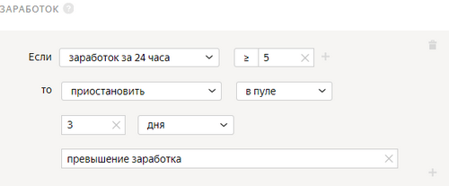

# Заработок

Если в проекте вы хотите задействовать большое количество исполнителей, установите лимит на дневной заработок в [проекте](../../glossary.md#project).

Заработок всегда учитывается в рамках [пула](../../glossary.md#pool). Если вы настроили правило блокировки для всего проекта, заработок будет считаться отдельно для каждого пула.



На проекте настроено правило, при котором исполнитель будет заблокирован, если его заработок за последние 24 часа превысит 5 долларов. Если исполнитель в одном из пулов заработает больше 5 долларов, то ему будет ограничен доступ к этому пулу. Если в трех пулах проекта он заработает по 2 доллара — блокировка не сработает.



## Когда использовать {#when-use}

Ограничьте заработок исполнителя в пуле в течение суток, чтобы:

- Получить ответы как можно большего числа исполнителей. В этом случае установите максимальную сумму заработка, например, равную стоимости одной [страницы заданий](../../glossary.md#task-suite).

- Обеспечить защиту от роботов. В этом случае сумма заработка должна быть выше, например, 10% от стоимости всего пула.



Устанавливайте сумму, которую исполнители успеют заработать, иначе правило будет бессмысленным.



## Как настроить {#rule}



Все поля этого правила — обязательные. Если вы не заполните хотя бы одно из них, правило сохранить не получится.



#|
||**Поле**|**Описание**||
||**Если****If** | Условие, при котором выполняется действие в поле **то****then**:

- **заработок за 24 часа****earned in last 24 hours** — сумма заработка исполнителя за [выполненные задания](../../glossary.md#submitted-answers) в пуле за последние 24 часа.||
||**то****then** | Действие, выполняемое при условии:

- **заблокировать****ban** — закрыть доступ к проекту или всем проектам заказчика на указанное количество дней. Причина блокировки отображается только заказчику.

    Если доступ к заданиям блокируется на ограниченный срок (например, на 7 дней), после снятия блокировки история ответов исполнителя не сохраняется. Навык рассчитывается на основании новых ответов.

- **установить значение навыка****assign skill value** — присвоить исполнителю фиксированное значение [навыка](nav.md).

- **принять все ответы исполнителя в пуле****accept all assignments from this Toloker in the pool** — требует настройки [отложенной приемки](offline-accept.md).

    Пригодится, если исполнитель выполняет большинство заданий качественно. Пример: исполнитель выполнил больше 80% заданий правильно и вас устраивает такой результат. Правило сработает автоматически — все ответы в пуле будут приняты.

- **приостановить****suspend** — приостановить доступ исполнителя к пулу на указанное количество дней. Причина отображается только заказчику.
||
|#



## Пример правила {#examples}

**Задача**: вы проводите социологический опрос. Чтобы собрать ответы от максимального числа исполнителей, настройте правило **заработка**.

#### Правильная настройка

Если заработок исполнителя за последние 24 часа превысит 5 долларов, ему будет ограничен доступ к пулу, и он больше не сможет выполнять ваши задания.

## Решение проблем {#troubleshooting}



Лучше использовать один [навык](../../glossary.md#skill) в проекте. Можно выбрать способ подсчета навыка:

- Подсчет навыка для каждого пула отдельно. Текущее значение навыка — это значение навыка в пуле, который выполнялся последним. Такой вариант удобен, если:

    - Пулы предназначены для разных групп исполнителей (например, настроены фильтры по городам, странам).

    - Пулы запускаются последовательно, и вы не хотите учитывать качество ответов в предыдущих пулах при подсчете навыка в выполняемом пуле.

    Этот способ подсчета действует по умолчанию при добавлении блока контроля качества в пул. Для блока по контрольным заданиям оставьте пустым поле **Учитывать последних ответов на контрольные и обучающие задания**.

- Подсчет навыка по всем выполненным заданиям в проекте. Такой вариант удобен, если пулы небольшие и вам не нужно рассчитывать навык для каждого пула.

    Этот способ подсчета доступен только для навыков по контрольным заданиям. Чтобы использовать его, заполните поле **Учитывать последних ответов на контрольные и обучающие задания** в блоках контроля качества в пулах.





Да, конечно, один и тот же навык можно назначать и использовать на различных проектах. Но чаще всего один навык используется в рамках одного проекта. Если исполнитель хорошо выполняет одно задание, это не значит, что он так же успешно справится с другим. Кроме того, используя фильтры по давно настроенным навыкам, вы ограничиваете количество доступных исполнителей.



