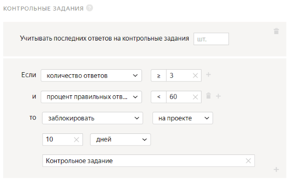
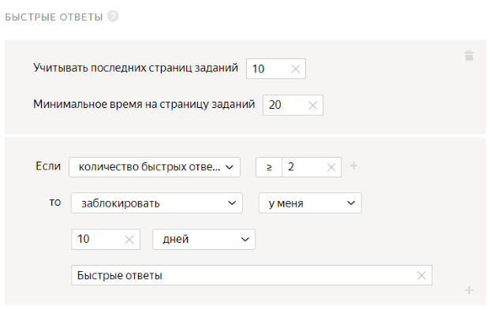

# Поиск характеристик товара





Сначала запустите проект в [Песочнице]({{ sandbox }}). Так вы сможете избежать ошибок и потраченных средств, если окажется, что ваше задание не работает.



В проектах этого типа исполнители ищут в сети объект или информацию о нем. Вы можете использовать их для:

- поиска объекта по описанию, например товара или услуги;
- поиска информации на определенном сайте, например городов доставки на сайте магазина;
- поиска информации об объекте в интернете, например контактных данных организации.

В этой инструкции вы создадите задание, в котором исполнители будут искать данные об организациях. Допустим, у вас есть список организаций и нужно найти их телефоны и адреса электронных почт. В этом задании исполнители увидят названия и ссылки на сайты организаций и найдут необходимую информацию о них.

## Создайте проект {#create-project}

#### В интерфейсе:

1. Выберите пресет:

    1. 

    1. 

1. Заполните общую информацию:

    1. Дайте проекту понятное название и краткое описание. Их увидят исполнители в списке доступных заданий.

    1. По желанию добавьте **Приватный комментарий**.

    1. Нажмите **Сохранить**.

1. 

    

    - Конструктор шаблонов

      1. 

          Воспользуйтесь [готовым кодом](https://ya.cc/t/EAjweAl53tvfa9) для этого проекта, где уже настроена валидация и внешний вид задания.

          [Подробнее о настройке условий](../../template-builder/best-practices/conditions.md) в конструкторе шаблонов.

      1. 

          - Поля входных данных:

            - `title` — строка c названием организации;
            - `url` — адрес сайт организации, тип `url`.

          - Поля выходных данных:

            - `phone` — строка, в которую будет записан номер телефона организации;
            - `email` — строка, в которую будет записан адрес электронной почты организации;
            - `not_found` — флажок, обозначающий отсутствие контактов организации.

      1. 

    - Редактор HTML/CSS/JS

      В разделе **Спецификация данных** можно настроить поля входных и выходных данных.

      

      

      

      [Подробнее](incoming.md) о полях входных и выходных данных.

      

      

      Вы можете настроить валидацию выходных данных с помощью [регулярных выражений](incoming.md#section_y2v_qqq_tlb). Это позволит формализовать ответы исполнителей. В примере ниже использованы регулярные выражения, позволяющие задать необходимый формат электронных почт и телефонных номеров.

      Если вы используете регулярные выражения, то проект можно запустить с перекрытием больше единицы — чтобы каждое задание выполнило несколько человек. Тогда можно будет не использовать отложенную приемку и не проверять каждое задание, а довериться усредненным данным.

      

      1. Нажмите кнопку , чтобы переключить графический режим на формат JSON.

      1. В поле **Входные данные** введите следующий код:

          ```json
          {
          "url": {
          "type": "url",
          "hidden": false,
          "required": true
          },
          "title": {
          "type": "string",
          "hidden": false,
          "required": false
          }
          }
          ```

      1. В поле **Выходные данные** введите следующий код:

          ```json
          {
          "email": {
          "type": "string",
          "hidden": false,
          "pattern": "^[a-zA-Zа-яА-ЯёЁ0-9\\._-]+@[a-zA-Zа-яА-ЯёЁ0-9\\._-]+\\.[a-zA-Zа-яА-ЯёЁ]{2,}$",
          "required": false
          },
          "phone": {
          "type": "string",
          "hidden": false,
          "pattern": "^\\+?[0-9()\\s-]{4,}$",
          "required": false
          },
          "not_found": {
          "type": "boolean",
          "hidden": false,
          "required": false
          }
          }
          ```

      1. В разделе **Интерфейс задания** вы можете настроить внешний вид заданий для исполнителей.

          [Подробнее](spec.md) об интерфейсе заданий.

          Заполните блоки **HTML**, **JS** и **CSS**.

          

          ```html
          <!-- Кнопки для перехода на сайт организации и поиска по ее названию в Яндексе-->
          <div class="left">
          <div class="title">not_var{{title}}
          </div>
          <div class="site-buttons">
          {{button label="Перейти на сайт" action=false href=url}}
          <a href="https://yandex.ru/search/?text=not_var{{title}}" target="_blank" class="btn_ya">Найти в Яндексе</a>
          </div>
          <!-- Поля для ввода телефона и электронной почты. Формат данных проверяется с помощью регулярных выражений. Выражение записано в параметр "Паттерн" выходных полей "phone" и "email". -->
          <div class="output-fields">
          <label><span>Телефон</span>{{field type="input" name="phone" placeholder="8 800 800 88 88"}}</label>
          <!-- Можно ввести только цифры, дефисы, знак +, пробелы и скобки. Символ "+" допустим только в первой позиции. Общий формат: +7(459)123-45-67, 8 800 123 45 67 -->
          <label><span>Почта</span>{{field type="input" name="email" placeholder="example@example.com"}}</label>
          <!-- Можно ввести только латинские буквы, точки, символы минус, плюс и нижнее подчеркивание. Общий формат: test.example@example.com -->
          </div>
          <!-- Чекбокс -->
          {{field class="site-buttons"type="checkbox" name="not_found" label="Нет контактов"}}
          </div>
          ```

          

          

          ```javascript
          exports.Task = extend(TolokaHandlebarsTask, function (options) {
          TolokaHandlebarsTask.call(this, options);
          }, {
          // Показываем сообщение об ошибке, если данные введены неверно или поля не заполнены.
          _addError: function (message, field, errors) {
          errors || (errors = {
          task_id: this.getOptions().task.id,
          errors: {}
          });

          errors.errors[field] = {
          message: message
          };

          return errors;
          },

          // Дописываем `https://` в начало ссылки, если его нет.
          _prepareURL: function (url) {
          if (!/^\s*https?:\/\//i.test(url)) {
          url = 'http://' + url.trim();
          }

          return url;
          },

          // Устанавливаем состояния полей.
          _renderField: function(values) {
          if (this.getWorkspaceOptions().isReadOnly) return;

          for (const field of ['email', 'phone']) {
          if (this.getField(field)) {
          const impl = this.getField(field).getImplementation();
          if (impl.options.disabled !== values.not_found) {
          impl.options.disabled = values.not_found;
          impl.render();
          }

          $('[name="' + field + '"]', this.getDOMElement())
          .parents('.field')
          .toggleClass('field_readonly', values.not_found);
          }
          }
          $('.popup_type_error', this.getDOMElement()).removeClass('popup_visible');
          },

          setSolutionOutputValues: function (values) {
          this._renderField(values);

          TolokaHandlebarsTask.prototype.setSolutionOutputValues.call(this, values);
          },

          onRender: function() {
          this._renderField(this.getSolution().output_values);
          },

          // Эти данные будут переданы в Handlebars-часть шаблона.
          getTemplateData: function () {
          const data = TolokaHandlebarsTask.prototype.getTemplateData.call(this);

          // Дописываем `http://` в начало ссылки, если нужно.
          data.url = this._prepareURL(data.url);

          return data;
          },

          // Проверяем ответы при отправке задания.
          validate: function (solution) {
          let errors;
          const output = solution.output_values;

          if (output.not_found) {
          delete output.email;
          delete output.phone;

          } else {
          const fields = ['email', 'phone'];

          // Показываем ошибку, если ни одно из полей не заполнено.
          if (!Object.entries(solution.output_values).find(e => fields.includes(e[0]) && e[1])) {
          for (const field of fields) {
          errors = this._addError(this.getWorkspaceOptions().translations['field:error:REQUIRED'], field, errors);
          }
          }

          delete output.not_found;
          }

          solution.output_values = output;
          return errors || TolokaHandlebarsTask.prototype.validate.call(this, solution);
          }
          });

          function extend(ParentClass, constructorFunction, prototypeHash) {
          constructorFunction = constructorFunction || function () { };
          prototypeHash = prototypeHash || {};

          if (ParentClass) {
          constructorFunction.prototype = Object.create(ParentClass.prototype);
          }

          for (var i in prototypeHash) {
          constructorFunction.prototype[i] = prototypeHash[i];
          }

          return constructorFunction;
          }
          ```

          

          

          ```css
          /* Задание на странице */
          .task {
          width: 450px;
          }

          /* Кнопка "Найти в Яндексе" */
          .btn_ya {
          font-size: 13px;
          margin-left: 10px;
          color: #0065D9;
          }

          /* Заголовок с названием организации */
          .title {
          padding: 10px;
          border-radius: 5px;
          font-size: 18px;
          line-height: 24px;
          }

          /* Поля для ввода телефона и электронной почты */
          .output-fields {
          display: table;
          font-size: 13px;
          border-spacing: 0 5px;
          }

          .output-fields > label {
          display: table-row;
          margin-bottom: 5px;
          }

          .output-fields > label > span {
          display: table-cell;
          text-align: left;
          padding-right: 10px;
          padding-left: 10px;
          }

          .output-fields > label > .field {
          margin: 0;
          display: table-cell;
          width: 100%;
          }

          /* Кнопка для перехода на сайт организации */
          .site-buttons {
          margin: 10px;
          margin-left: 5;
          }

          /* Отображение задания на мобильных устройствах. */

          @media (pointer: coarse) {
          .field__hotkey {
          display:none;
          }
          }

          @media (max-width: 980px) {
          .task {
          width: initial;
          }
          .popup__text {
          width: auto;
          }
          }
          ```

          

      1. Нажмите кнопку  **Предпросмотр задания**, чтобы увидеть получившееся задание.

          

          В предварительном просмотре проекта отображается одно задание со стандартными данными. Количество заданий на странице вы сможете настроить далее.

          

      1. В открывшемся окне проверьте работу опций задания:

          1. Ответьте на вопрос.

          1. В правом нижнем углу нажмите кнопку **Отправить**.

          1. Выйдите из режима предпросмотра.

      1. 

    

1. 1. Напишите краткую и ясную инструкцию. Опишите в ней, что надо сделать, и приведите примеры.

    Вы можете подготовить инструкцию в формате HTML и вставить ее в редактор. Чтобы переключиться в режим HTML, нажмите **<>**.

   1. Нажмите **Завершить**.

Подробнее о работе с проектом читайте в разделе [Проект](project.md).

## Создайте пул {#create-pool}

Пул — это набор оплачиваемых заданий, которые одновременно выдаются исполнителям.

1. Откройте страницу проекта по поиску информации в интернете.

1. Нажмите кнопку **Добавить пул**.

1. Укажите **Название пула**.

1. В блоке **Аудитория** в разделе **Исполнители** отфильтруйте исполнителей.

    Чтобы задание было доступно только исполнителям, владеющим русским языком:

    1. Нажмите **Добавить фильтр**.

    1. Найдите в списке блок **Готовые наборы аудиторий** и выберите набор фильтров **Русскоязычные исполнители**.

    1. Присвойте [навык](../../glossary.md#skill) исполнителям, которые участвуют в проекте по поиску информации в интернете. В дальнейшем это позволит поручить проверку выполненных заданий только исполнителям без навыка — то есть тем, кто не выполнял задания этого проекта.

    Нажмите кнопку **+Добавить навык** и укажите название навыка, например `Поиск информации`.

    

1. 

1. В блоке **Цена** в поле **Цена за страницу заданий** укажите цену. Например, `0.01`.

    

    На одной странице может отображаться одно или несколько заданий. Если задания простые, то можно добавлять 10–20 заданий на одну страницу. Не рекомендуем создавать длинные страницы, поскольку это снизит скорость загрузки данных у исполнителя.

    Исполнитель получит оплату, только если выполнил все задания на странице.

    Количество заданий на странице вы определите при [загрузке заданий](#smart-mixing).

    

    Подробнее о том, как установить [справедливую цену](dynamic-pricing.md#section_wb1_lhl_vlb).

1. [Правила контроля качества](../../glossary.md#quality-control) позволяют отсеивать невнимательных исполнителей.

    

    - Для проекта с перекрытием больше единицы

      Добавьте следующие правила контроля качества:

      1. **Контрольные задания** — отсеивает исполнителей, которые часто ошибаются в контрольных заданиях.

          1. Нажмите **Добавить правило контроля качества**.

          1. Найдите в списке блок **Правила** и выберите пункт **Контрольные задания**.

          1. Задайте правило для контрольного задания: если **количество ответов** на контрольные вопросы **≥ 3** и **процент правильных ответов** на контрольные вопросы **< 60**, то **заблокировать** исполнителя **на проекте на 10 дней**. В качестве причины укажите **Контрольное задание**.

            

            Это означает, что если исполнитель выполнил более трех контрольных заданий и дал неправильные ответы более чем в 60% из них, он будет заблокирован и не сможет выполнять задания на этом проекте в течение 10 дней.

      1. **Быстрые ответы** — отсеивает исполнителей, которые отвечают слишком быстро.

          1. В поле **Учитывать последних страниц заданий** введите количество последних страниц заданий, выполненных исполнителем. Например, `10`.

          1. В поле **Минимальное время на страницу заданий** укажите время в секундах. Например, `20`.

          1. Задайте правило для быстрого ответа: если **количество быстрых ответов**** ≥ 1**, то **заблокировать****у меня** на **10 дней**. В поле **Причина** введите **Быстрые ответы**.

            

            Это означает, что если исполнитель выполнит хотя бы одну страницу заданий быстрее, чем за 20 секунд, он не сможет выполнять ваши задания 10 дней.

      1. **Пропуск заданий** — отсеивает исполнителей, которые пропускают несколько страниц заданий подряд.

          Задайте правило для [пропущенных заданий](pool_statistic-pool.md#skipped-tasks): если **пропущенных подряд страниц заданий**** ≥ 4**, то **приостановить****в пуле** на **10 дней**. В поле **Причина** введите **Пропуск заданий**.

          

          Это означает, что если исполнитель пропустит 4 и более страниц заданий, он потеряет доступ к пулу на 10 дней.

      1. Установите перекрытие — количество исполнителей, которые должны выполнить задание. В блоке **Контроль качества** в разделе **Перекрытие задания** укажите значение поля **Количество исполнителей, которые должны выполнить каждое задание**. Для заданий этого типа, как правило, `3-5`.

    - Для проекта с отложенной приемкой

      В блоке **Контроль качества** включите опцию **Отложенная приёмка заданий**.

      

      [Отложенная приемка](offline-accept.md) позволяет вам просматривать [выполненные страницы заданий](../../glossary.md#completed-tasks) перед тем, как принять их и заплатить исполнителю. Задания, выполненные в несоответствии с инструкцией, можно отклонять. Максимальный срок проверки устанавливается в поле **Срок проверки**.

      

      В поле **Срок проверки в днях** укажите количество дней на проверку задания.

      Добавьте следующие блоки контроля качества:

      - **Обработка отклоненных и принятых заданий** — отправляет отклоненные вами задания другим исполнителям по заданным правилам.

        1. Нажмите **Добавить правило контроля качества**.

        1. Найдите в списке блок **Правила** и выберите пункт **Обработка отклоненных и принятых заданий**.

        1. Задайте правило для отклоненного задания: если **задание становится отклоненным**, то **увеличить перекрытие на** **1**. А также включите опцию **Открыть пул, если закрыт**.

            

            Это означает, что отклоненное задание будет возвращено в пул и показано еще одному исполнителю.

      - **Результаты проверки** — ограничивает доступ к пулу исполнителей, которые часто ошибаются.

          Задайте правило для отклоненного задания: если **количество проверенных ответов** **≥ 3** и **процент отклоненных ответов** **> 35** то **заблокировать****у меня** на **15 дней**.

          

          Это означает, что если 35% и более ответов исполнителя будут отклонены, он будет заблокирован и не сможет больше выполнять ваши задания 15 дней. Правило начинает действовать после проверки 3 ответов исполнителя.

          

          Вы можете скопировать настройки контроля качества из другого пула. Для этого в блоке **Аудитория** в разделе **Исполнители** нажмите **перенесите их из другого пула**.

          

    

1. Настройте **Параметры** пула.

    В блоке **Дополнительные настройки** укажите значение поля **Время на страницу заданий**. Времени должно быть достаточно для чтения инструкции, загрузки задания, поиска информации и ответа. Например, `1200` секунд.

1. Нажмите кнопку **Создать пул**.

## Загрузите задания {#upload-file}



1. На странице пула нажмите кнопку **Загрузить**. В открывшемся окне вы можете скачать шаблон файла.

1. В открывшемся окне настройте параметры загрузки файла.

    

    - Для проекта с перекрытием больше единицы

        1.  1. Выберите **Умное смешивание**.

            1. В поле **Основных заданий** укажите `9`.

            1. В поле **Обучающих заданий** укажите `0`.

            1. В поле **Контрольных заданий** укажите `1`.

            1. Нажмите кнопку **Загрузить**.

            1. В открывшемся окне выберите файл с заданиями для загрузки и нажмите кнопку **Открыть**.

            1. В открывшемся окне проверьте количество заданий и нажмите кнопку **Добавить**.

        1. Создайте [контрольное задание](../../glossary.md#control-task):

            1. Нажмите кнопку **Разметить**.

                

                Если вместо **умного смешивания** было выбрано другое, необходимо нажать кнопку **Разметить**. Если такой кнопки нет, удалите файл и загрузите заново.

                

            1. В открывшемся окне нажмите кнопку **Создать контрольные**.

            1. В открывшемся окне в разделе **Создать контрольное задание** слева отметьте пункт **result**.

            1. Выберите правильный ответ на вопрос.

            1. Нажмите кнопку **Сохранить и перейти к следующему**.

            1. Выйдите из режима разметки заданий.

                

                В небольших пулах контрольные задания должны составлять около 10% от всех заданий. Включайте разные варианты правильных ответов в равных количествах. Посмотрите распределение ответов на странице **Разметить задания** на вкладке **Контрольные**.

                

    - Для проекта с отложенной приемкой

      1. Выберите **Указать вручную**.

      1. В поле **Заданий на странице** укажите `1`.

      1. Нажмите кнопку **Загрузить**.

      1. В открывшемся окне выберите файл с заданиями для загрузки и нажмите кнопку **Открыть**.

      1. В открывшемся окне проверьте количество заданий и нажмите кнопку **Добавить**.

    Нажмите кнопку , чтобы запустить пул.

  

## Получите результаты {#get-results}

Когда исполнители выполнили ваши задания, получите результаты.



- Для проекта с перекрытием больше единицы

  На странице пула нажмите кнопку **Скачать результаты**. В открывшемся окне нажмите кнопку **Скачать результаты**.

- Для проекта с отложенной приемкой

  1. На странице пула нажмите кнопку **Скачать результаты**. В открывшемся окне:

      1. В блоке **Статус** оставьте включенной только опцию **Не проверенные**.

      1. В блоке **Поля** оставьте включенной только опцию **id ответа**.

      1. Отключите опцию **Разделять ответы пустой строкой**.

          

      1. Нажмите кнопку **Скачать результаты**.



## Поручите проверку исполнителям {#check-up-project}

Если в проекте по поиску информации в интернете вы использовали **Отложенную приемку**, отдайте результаты на проверку исполнителям в качестве задания. [Подробнее](offline-accept.md) об отложенной приемке.

1. Создайте еще один проект с помощью [Пустого]({{ blank }}) шаблона. О том, какие настройки нужно задать для этого проекта, написано ниже.

1. Создайте интерфейс задания, чтобы исполнитель увидел:

    - название организации;
    - электронную почту и номер телефона организации;
    - переключатель с вариантами ответов:

        `Электронная почта и номер телефона указаны верно.`

        `Электронная почта указана неверно.`

        `Номер телефона указан неверно.`

        `Электронная почта и номер телефона указаны неверно.`

1. Добавьте пул и укажите в нем **Перекрытие** — 3.
1. Чтобы это задание было доступно исполнителям, которые не искали информацию в сети на вашем проекте, установите **фильтр**.

    1. В разделе **Исполнители** нажмите **Добавить фильтр**.

    1. Найдите в списке блок **Навыки** и выберите навык **Выбрать навык**.

    1. В поле **Выберите навык** выберите **Поиск информации**.

    1. В поле **?** укажите `=`. Поле **Отсутствует** оставьте пустым.

1. Загрузите в пул задания и запустите его.

1. Когда пул будет полностью выполнен, запустите [агрегацию результатов](result-aggregation.md).

1. Примите задания по поиску информации, в которых нет ошибок. Остальные отклоните, указав причину. Как только вы отклоните задания, они будут отправлены на повторное выполнение.

## Решение проблем {#troubleshooting}



Используйте [конкатенацию](t-components/helpers.md#concat), например:

```html
{{field type="checkbox" name=(concat "result." @index ) label=(concat "checkbox –
          " @index) size="L"}}
```





1. Посмотрите как это реализовано в шаблоне «[Поиск данных в сети](#internet-search__create-project)».

1. Для решения второй задачи вы можете добавить ещё одну валидацию по аналогии с этой:

    ```javascript
    if (solution.output_values.url && solution.output_values.check) {return {task_id:
    this.getTask().id,errors: {'url': {code: 'Вставьте ссылку или отметьте галочкой,что сайта нет'}}}}
    ```





В режиме предпросмотра проверить загрузку файлов нельзя, но это можно сделать в песочнице, выполнив своё задание. Для этого нужно зарегистрироваться в сендбоксе в качестве исполнителя и добавить логин в доверенные на странице **Пользователи**. Подробнее можете прочитать в этой [статье](sandbox.md) .





Если никто из исполнителей не смог отправить задание, скорее всего проблема в валидации в JS. Проверьте её ещё раз.

Перенесите проект в сендбокс и попробуйте выполнить задание самостоятельно в песочнице.





Снять выбор нельзя. Только изменить на другую радиокнопку с ответом.





Если после сохранения инструкции пропадают теги или атрибуты (например, `checked="true"`), значит они не поддерживаются. Полный список допустимых в инструкции тегов можно найти в [руководстве](instruction.md#html-yes).





