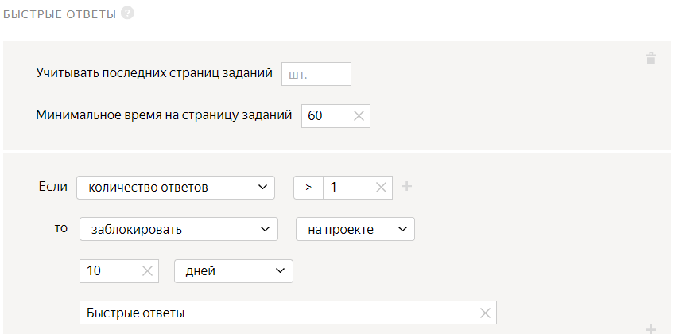

# Проект 3. Похож ли найденный объект на исходный?



В этом [проекте](../../glossary.md#project) исполнители будут сравнивать обувь с исходного изображения (из первого проекта) с обувью, найденной во втором проекте.



Так как в настройках [пула](../../glossary.md#pool) во втором проекте включена опция **Отложенная приёмка** вы должны выполнить все шаги и проверить ответы исполнителей в течение срока, установленного в поле **Срок проверки**.



## Создайте проект {#create_project}

Чтобы создать проект, откройте [Толоку для заказчика]({{ yandex-toloka }}).

#### В интерфейсе:

1. Выберите пресет:

    1. 

    1. 

1. Заполните общую информацию:

    1. В поле **Название для исполнителей** введите `Похожа ли обувь?`.

    1. В поле **Описание для исполнителей** введите `Посмотрите на две пары обуви и решите, похожи они или нет.`.

    1. 

    1. 

1. 

   

    - Конструктор шаблонов

      1. Воспользуйтесь [готовым кодом](https://ya.cc/t/EMVKGWZ73tvgCZ)[ready-made code](https://ya.cc/t/-ratdOH63ttEa4) для этого проекта, где уже настроена валидация и внешний вид задания.

          Исполнитель не сможет отправить задание, если:

          - не перейдет по кнопке в интернет-магазин;
          - не выберет один из вариантов ответа.

      1. 

          - Поля входных данных:

          - `image` — ссылка для загрузки изображения исходного товара;
          - `found_link` — ссылка на товар в интернет-магазине;
          - `assignment_id` — для связи с предыдущими проектами.

          - Поле выходных данных: `result` — строка, в которую будет записан ответ исполнителя.

          - Редактор HTML/CSS/JS

      1. В **Интерфейсе задания** удалите шаблонный код из блока **HTML** и вставьте следующий код:
          

          ```html
          {{img src=image height="400px"}}
          {{iframe src= found_link height="600px"}}

          <p>Убедитесь, что загруженное изображение соответствует товару из магазина.</p>
          {{button label="Проверьте товар"  href=found_link action=true}}

          <p>Эта <b>обувь</b> похожа?</p>
          <p>Обувь должна быть похожа по цвету, материалу, длине и стилю.</p>
          {{field type="radio" name="result" value="Yes" label="Да"}}
          {{field type="radio" name="result" value="No" label="Нет"}}
          ```

          

          ```html
          {{img src=image height="400px"}}
          {{iframe src= found_link height="600px"}}

          <p>Check that the uploaded image matches the product in the store.</p>
          {{button label="Check the product"  href=found_link action=true}}

          <p>Are <b>these shoes</b> similar to each other?</p>
          <p>The shoes must be similar in color, material, length, and style.</p>
          {{field type="radio" name="result" value="Yes" label="Yes"}}
          {{field type="radio" name="result" value="No" label="No"}}
          ```

          

      1. Блок **JS** оставьте без изменений.

      1. В блок **CSS** вставьте следующий код, отвечающий за установку пропорционального размера изображения.

          ```css
          .task {
          display: block;
          }
          .img {
          float: left;
          width: 50%;
          }
          .iframe {
          float: left;
          width: 50%;
          }
          ```

      1. Отредактируйте [входные и выходные данные](../../glossary.md#input-output-data) в блоке **Спецификация данных**. ,

      1. Нажмите кнопку , чтобы переключить графический режим на формат JSON.

      1. В поле **Входные данные** введите:

          ```json
          {
          "image": {
          "type": "url",
          "hidden": false,
          "required": true
          },
          "found_link": {
          "type": "url",
          "hidden": false,
          "required": true
          },

          "assignment_id": {
          "type": "string",
          "hidden": true,
          "required": true
          }
          }
          ```

      1. В поле **Выходные данные** введите:

          ```json
          {
          "result": {
          "type": "string",
          "hidden": false,
          "required": true
          }
          }
          ```

          Подробнее о параметрах **Спецификации** читайте в разделе [Входные и выходные данные](incoming.md).

      1. Нажмите кнопку  **Предпросмотр задания****Preview task**, чтобы увидеть получившееся задание.

          

          В предварительном просмотре проекта отображается одно задание со стандартными данными. Количество заданий на странице вы сможете настроить далее.

          

      1. 

    

1. 

1. В поле **Инструкция для исполнителей** введите [инструкцию](../../glossary.md#instructions).

    1. **Текст инструкции:**

    ```plaintext
    Посмотрите на картинки, на которых изображены две пары обуви, и решите, похожи они или нет.

    Обувь считается похожей, если она имеет похожий цвет, материал, длину и стиль.
    Если вы не видите пару обуви ни на одной из фотографий, нажмите **Да**.
    ```

    

    ```plaintext
    Take a look at the pictures that show two pairs of shoes. Decide whether they look similar or not.

    Shoes are considered similar if they have a similar color, fabric, length, and style.
    If you don't see a pair of shoes in any of the pictures, click **Yes**.
    ```

    

    1. 

1. 

Подробнее о работе с проектом читайте в разделе [Проект](project.md).

## Создайте пул {#create_pool}

Чтобы создать пул:

1. Откройте страницу проекта с именем **Похожа ли обувь**.

1. Нажмите кнопку **Добавить пул**.

1. Укажите **Название пула**.

1. (опционально) Добавьте **Приватный комментарий**. Эта информация доступна только вам.

1. В блоке **Аудитория** в разделе **Исполнители** отфильтруйте исполнителей.

    1. Нажмите **Добавить фильтр**.

    1. Найдите в списке блок **Профиль исполнителя** и выберите навык **Языки**.

    1. В поле **?** укажите `=`.

    1. Добавьте еще один фильтр. Нажмите **Добавить фильтр**.

    1. Найдите в списке блок **Навыки** и нажмите **Выбрать свой навык**.

    1. В поле **Навык **выберите **Found_shoes**.

    1. В поле **?** укажите `=`.

    1. Поле **Отсутствует** оставьте пустым.

    

1. 

1. В блоке **Цена** в поле **Цена за страницу заданий** укажите `0.01`.

1. В блоке **Контроль качества** задайте настройки контроля качества для пула:

    1. Нажмите **Добавить правило контроля качества**.

    1. Найдите в списке блок **Правила** и выберите пункт **Контрольные задания**.

    1. Задайте правило для [контрольного задания](../../glossary.md#control-task): если **количество ответов** на контрольные вопросы **больше или равно 3** и **процент правильных ответов** на контрольные вопросы **меньше 60**, то **заблокировать** исполнителя **на проекте на 10 дней**. В качестве причины указать **Контрольное задание**.

        

    1. (опционально) Добавьте еще один блок контроля качества. Нажмите **Добавить правило контроля качества**.

    1. Найдите в списке блок **Правила** и выберите пункт **Быстрые ответы**.

    1. В поле **Минимальное время на страницу заданий** укажите `60`.

    1. Задайте правило для быстрых ответов: если **количество быстрых ответов****больше 1**, то **заблокировать** исполнителя **на проекте на 10 дней**. В качестве причины указать **Быстрые ответы**.

    Подробнее о контроле качества читайте в разделе [Контроль качества](control.md).

1. В разделе **Перекрытие задания** в поле **Количество исполнителей, которые должны выполнить каждое задание ** укажите `3`.

1. В блоке **Дополнительные настройки**:

    1. В поле **Время на страницу заданий** укажите `300`.

    1. Включите опцию **Сохранять порядок заданий**.

1. Нажмите кнопку **Создать пул**.

## Загрузите результаты {#upload_file}

1. Подождите завершения пула из второго проекта.

1. Откройте страницу пула из [второго проекта](find_an_item_in_store.md).

1. Нажмите кнопку **Скачать результаты**.

    1. В блоке **Статус** оставьте включенной только опцию **Не проверенные**.

    1. В блоке **Поля** оставьте включенной только опцию **id ответа**.

    1. Отключите опцию **Разделять ответы пустой строкой**.

        

    1. Нажмите кнопку **Скачать результаты**.

1. Подготовьте [файл](../../glossary.md#tsv) с заданиями.

    1. Столбец `INPUT:image` оставьте без изменений.

    1. Измените имя столбца `OUTPUT:found_link` на `INPUT:found_link`.

    1. Измените имя столбца `ASSIGNMENT:assignment_id` на `INPUT:assignment_id`.

    1. Удалите все остальные столбцы.

    1. Сохраните файл.

1. Загрузите получившийся файл в пул **Похожа ли обувь?**.

    1. Откройте пул **Похожа ли обувь?**.

    1. Нажмите кнопку **Загрузить**. В открывшемся окне настройте параметры загрузки файла.

    1. Выберите **Умное смешивание**.

    1. В поле **Основных заданий** укажите `9`.

    1. В поле **Обучающих заданий** укажите `0`.

    1. В поле **Контрольных заданий** укажите `1`.

    1. Нажмите кнопку **Загрузить**.

    1. В открывшемся окне выберите файл с заданиями для загрузки и нажмите кнопку **Открыть**.

    1. В открывшемся окне проверьте количество заданий и нажмите кнопку **Добавить**.

1. Создайте [контрольное задание](goldenset.md).

    1. Нажмите кнопку **Разметить**.

        

        Если вместо **умного смешивания** было выбрано другое, необходимо нажать кнопку **Разметить**. Если этой кнопки нет, удалите файл и загрузите заново.

        

    1. В открывшемся окне нажмите кнопку **Создать контрольные**.

    1. В открывшемся окне в колонке слева включите опцию **result**.

    1. Выберите правильный ответ на вопрос.

    1. Нажмите кнопку **Сохранить и перейти к следующему**.

    1. Нажмите **Похожа ли обувь?**, чтобы выйти из режима [разметки заданий](../../glossary.md#task-markup).

    

    В небольших пулах контрольные задания должны составлять [5–10% от всех заданий](../troubleshooting/pool-setup.md#how-many-control-tasks). Включайте разные варианты правильных ответов в равных количествах. Посмотрите распределение ответов на странице **Разметить задания** на вкладке **Контрольные**.

    

## Скачайте проверенные результаты  {#get_results}

Чтобы получить результаты:

1. Рядом с кнопкой **Скачать результаты** нажмите кнопку .

1. Выберите пункт списка **Агрегация результатов по методу Дэвида — Скина**. Подробнее об [Агрегации результатов по методу Дэвида — Скина](result-aggregation.md#dawid-skene).

1. В открывшемся окне нажмите **Да**.

1. Наверху страницы нажмите **Перейти к списку операций**.

    

    Отслеживайте прогресс операции, периодически обновляя страницу. Агрегация занимает от 5 до 20 минут, в это время вы можете приступить к оформлению другого проекта.

    

1. Когда операция завершится, скачайте файл с результатами. Для этого в столбце **Файлы** нажмите **Скачать**.

1. Используйте файл с результатами из [второго проекта](find_an_item_in_store.md#upload_file).

## Проверьте выполненные задания {#check_results}

Вы можете проверить результаты двумя способами:

- В файле с результатами.
- В интерфейсе пула.

#### Проверить задания в файле с результатами

Чтобы проверить [выполненные задания](../../glossary.md#completed-tasks):

1. Откройте в редакторе текста или электронных таблиц файл, полученный после агрегации результатов.

1. Подготовьте файл:

    1. Добавьте столбец `ACCEPT:verdict` — результат проверки.

    1. Добавьте столбец `ACCEPT:comment` — комментарий для исполнителя, если ответ был отклонен. Например, какая часть инструкций не была выполнена.

    1. Измените имя столбца `INPUT:assignment_id` на `ASSIGNMENT:assignment_id`.

1. Заполните столбцы `ACCEPT:verdict:` и `ACCEPT:comment:`:

    - Если агрегированный результат задания правильный, поставьте `+`, и задание будет принято.

    - Если агрегированный результат задания неправильный или не открывается, поставьте `-`, и задание будет отклонено. Введите причину отклонения задания в поле `ACCEPT:comment:`, например, `Предоставленный объект неправильный или не открывается.`.

1. Удалите все остальные столбцы.

1. Сохраните файл.

1. Откройте страницу пула во втором проекте.

1. Нажмите кнопку **Проверить задания**.

1. Нажмите кнопку **Загрузить результаты**.

1. В открывшемся окне выберите файл с результатами для загрузки и нажмите кнопку **Открыть**.

1. В открывшемся окне сравните количество заданий в поле **успешно обработано** с полем **Всего выполненных заданий** на странице пула.

1. Нажмите кнопку **Добавить**.

1. В открывшемся окне нажмите кнопку **Закрыть**.

1. При настройке пула во втором проекте вы включили опцию **Повторное выполнение отклонённых заданий**.

    При повторном выполнении задания: пул автоматически открывается снова, и задания передаются другим исполнителям. Когда задания будут выполнены, отправьте результаты на проверку. Затем скачайте результаты, проверьте их и загрузите проверенные результаты. Вы можете отклонять задания столько раз, сколько захотите, чтобы получить более точные результаты.

#### Проверить задания в интерфейсе пула

Чтобы проверить выполненные задания:

1. Откройте страницу пула во втором проекте.

1. Нажмите кнопку **Просмотреть задания**.

1. Наведите курсор на строку с заданием, которое хотите проверить.

1. В столбце **Статус** появятся кнопки, чтобы принять (кнопка ) или отклонить (кнопка ) выполненное задание. Если вы отклоняете задание, в открывшемся окне введите комментарий и нажмите кнопку **Готово**.

## Что дальше {#what-next}

- Создайте [Проект 4](item_more_similar.md) для сравнения подходящих изображений.

